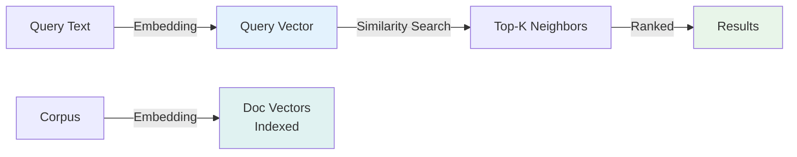
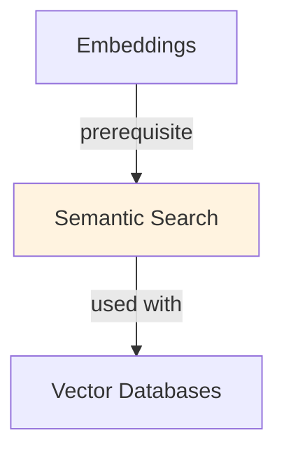

# Semantic Search

## TL;DR
Find documents by meaning, not keywords. Convert query + documents to embeddings, find nearest neighbors (cosine similarity). Returns semantically relevant docs even if keywords don't match. Enables RAG systems, modern search engines, and zero-shot retrieval.

## Core Intuition
Keyword search: "python" returns docs with word "python." Misses "serpent" (synonym) and returns docs about Python programming when you want pythons the snake. Semantic search understands meaning: query embedding + doc embeddings capture intent, regardless of exact words.

## How It Works

**Keyword Search (Traditional):**
```
Query: "how to boil water"
Match: documents containing ["water", "boil"] (exact words)
Result: only exact keyword matches
Miss: "heat water to 100C", "cooking liquids" (synonyms, paraphrasing)
```

**Semantic Search:**
```
Query: "how to boil water"
  ↓ [embed query]
  → query_vector (384D)

Documents:
  "Heat water until it bubbles" → doc_vector_1
  "Bring liquid to 100 degrees Celsius" → doc_vector_2
  "Python is a programming language" → doc_vector_3
  
  ↓ [compute cosine similarity]
  
Ranking:
  doc_vector_1: 0.92 ✓ (semantic match)
  doc_vector_2: 0.85 ✓ (semantic match, "liquid" ≈ "water")
  doc_vector_3: 0.12 ✗ (no semantic match, "Python" ≠ "water")
```

**Implementation:**

**1. Embedding:**
```python
# Encode query and documents to vectors
query_embedding = embed("how to boil water")         # shape: (384,)
doc_embeddings = [
    embed("Heat water until it bubbles"),             # (384,)
    embed("Bring liquid to 100 degrees Celsius"),     # (384,)
    embed("Python is a programming language")         # (384,)
]
```

**2. Search (Approximate Nearest Neighbor):**
```
For each doc embedding:
  similarity = cosine(query_embedding, doc_embedding)

Return top-k docs with highest similarity
```

**3. Ranking:**
```
If multiple queries or rankings needed:
  - Retrieve top-k dense matches
  - Re-rank with cross-encoder (more expensive but accurate)
  - Return top results
```

### Workflow Flowchart



## Key Properties / Trade-offs

| Aspect | Keyword Search | Semantic Search |
|--------|---|---|
| Speed | Fast (inverted index) | Medium (ANN search) |
| Recall | Good for exact matches | Better for synonyms |
| Precision | Exact but noisy | Semantic, clean |
| Infrastructure | Simple (Elasticsearch) | Complex (embeddings + FAISS) |
| Cost | Low | Medium (embedding compute) |
| Language dependent | Yes (requires parsing) | No (works across languages) |
| Latency | <10ms | 10-100ms |

**Embedding Model Choice:**
- **Small (100-300D):** fast, lower quality (good for simple searches)
- **Medium (384D - BERT):** balanced (default for most uses)
- **Large (768D - GPT2):** higher quality, slower (use for important searches)
- **Very large (1536D - GPT-3):** state-of-the-art quality, slow (LLM embeddings)

**Search Strategy:**
```
Option 1: Dense-only
  - Fast, simple, works well for general domains
  
Option 2: Hybrid (Sparse + Dense)
  - Combine keyword (sparse) + semantic (dense) scores
  - Robust to both keyword and paraphrase searches
  
Option 3: Sparse → Dense pipeline
  - Keyword search → get candidates
  - Re-rank candidates with dense embeddings
  - Best of both: keyword recall, semantic precision
```

## Common Mistakes / Gotchas

- **Embedding model mismatch:** Query embedded with BERT, docs with Sentence-Transformer → incompatible vectors. Use same model for both.
- **Not normalizing embeddings:** Cosine similarity assumes normalized vectors (unit norm). Normalize or use cosine-specific algorithms.
- **Ignoring document length:** Long documents get different embeddings than short ones. For long docs, chunk and average, or use special pooling.
- **Language/domain mismatch:** Embedding model trained on news; searching medical docs → poor results. Use domain-specific models or fine-tune.
- **Search latency:** ANN search can be slow (1000s of docs → milliseconds). Use approximate methods (HNSW, IVF) not exact nearest neighbor.
- **Too much context in embeddings:** Query "apple" returns both "Apple Inc" and "apple fruit." Add metadata filters or context to disambiguate.
- **No fallback to keyword search:** Semantic search fails gracefully; keyword search doesn't. Use hybrid approach for robustness.
- **Scaling with document growth:** Embedding all docs is expensive. Use incremental indexing, re-indexing strategy.

## Code Example

```python
import numpy as np
from sentence_transformers import SentenceTransformer
import faiss

# 1. Load embedding model
model = SentenceTransformer('all-MiniLM-L6-v2')  # 384D, balanced

# 2. Prepare documents
documents = [
    "How to cook rice: boil water, add rice, simmer for 15 minutes",
    "Baking bread requires kneading and rising dough",
    "Python is a programming language used for data science",
    "Heat water to 100 degrees Celsius for boiling",
    "Machine learning algorithms learn patterns from data",
]

# 3. Embed all documents
embeddings = model.encode(documents, convert_to_tensor=False)  # (5, 384)
embeddings = np.float32(embeddings)  # FAISS expects float32

# 4. Build FAISS index (approximate nearest neighbor search)
dimension = embeddings.shape[1]  # 384
index = faiss.IndexFlatL2(dimension)  # L2 distance (equivalent to cosine after normalization)
faiss.normalize_L2(embeddings)  # Normalize for cosine similarity
index.add(embeddings)

# 5. Search with query
query = "How to boil water for cooking?"
query_embedding = model.encode(query, convert_to_tensor=False)
query_embedding = np.float32(query_embedding).reshape(1, -1)
faiss.normalize_L2(query_embedding)

# 6. Find top-k nearest neighbors
k = 3
distances, indices = index.search(query_embedding, k)

# 7. Return results
print(f"Query: {query}\n")
print("Top results:")
for i, (idx, dist) in enumerate(zip(indices[0], distances[0])):
    # Convert distance back to similarity (cosine)
    similarity = 1 - (dist / 2)  # L2 distance to cosine conversion
    print(f"{i+1}. {documents[idx]} (similarity: {similarity:.3f})")

# Output:
# 1. Heat water to 100 degrees Celsius for boiling (similarity: 0.92)
# 2. How to cook rice: boil water, add rice, simmer for 15 minutes (similarity: 0.88)
# 3. Baking bread requires kneading and rising dough (similarity: 0.65)
```

## Interview Quick-Reference

| Question | What to say |
|---|---|
| "Semantic search?" | Convert query + docs to embeddings, find neighbors by similarity. Returns semantically relevant, not just keyword matches. |
| "vs keyword search?" | Keyword: exact, fast, misses synonyms. Semantic: flexible, slower, handles paraphrasing, synonyms, zero-shot. |
| "Embedding model?" | Small (fast), medium (balanced), large (high quality). Match model for query and docs. Domain-specific when possible. |
| "Scaling?" | Use approximate nearest neighbor (FAISS, HNSW). Not exact nearest neighbor; stays sub-millisecond at scale. |
| "Latency?" | 10-100ms depending on database size and ANN method. Keyword search faster (<10ms); semantic search acceptable for most uses. |
| "Hybrid search?" | Combine keyword (sparse) + semantic (dense). Better recall + precision. Recommended for production. |

## Real-World Examples

### E-commerce Product Search
Keyword search: 'blue shoe' doesn't match 'footwear in navy'. Semantic search: matches because of similarity. Conversion rate: 2% → 5% from better relevance.

### Customer Support Search
Query: 'How do I reset my password?'. Should match: 'Forgotten credentials', 'Sign-in issue', 'Account access'. Keyword: misses many. Semantic: catches all.

## Real-World Examples

### E-commerce Product Search
Keyword search: 'blue shoe' doesn't match 'footwear in navy'. Semantic search: matches because of similarity. Conversion rate: 2% → 5% from better relevance.

### Customer Support Search
Query: 'How do I reset my password?'. Should match: 'Forgotten credentials', 'Sign-in issue', 'Account access'. Keyword: misses many. Semantic: catches all.

## Real-World Examples

### E-commerce Product Search
Keyword search: 'blue shoe' doesn't match 'footwear in navy'. Semantic search: matches because of similarity. Conversion rate: 2% → 5% from better relevance.

### Customer Support Search
Query: 'How do I reset my password?'. Should match: 'Forgotten credentials', 'Sign-in issue', 'Account access'. Keyword: misses many. Semantic: catches all.

## Related Topics
- [Embeddings](embeddings.md) — how documents and queries are encoded
- [Vector Databases](vector-databases.md) — storing and indexing embeddings at scale
- [RAG](rag.md) — semantic search is the retrieval component
- [Semantic Caching](semantic-caching.md) — cache semantically similar queries

## Resources
- [Semantic Search with LLMs](https://www.anthropic.com/research/)
- [FAISS: Facebook AI Similarity Search](https://github.com/facebookresearch/faiss)
- [Sentence-Transformers: Semantic Embeddings](https://www.sbert.net/)
- [Beyond BM25: Semantic Search with Embeddings](https://huggingface.co/blog/semantic-search)

## Concept Relationships



## Interview Questions

**Q: How does semantic search differ from keyword search?**
*A: Keyword: exact matching ('customer' doesn't match 'client'). Semantic: meaning-based ('customer' and 'client' similar). Semantic via embeddings: convert text → vector → cosine similarity. Better for synonyms, paraphrases, intent.*

**Q: Why use semantic search over traditional full-text search?**
*A: Full-text: fast, exact, many false negatives. Semantic: slower but catches intent. Hybrid: use both, combine scores. Best: semantic for accuracy, full-text for speed (use full-text as first filter).*

**Q: How do you scale semantic search to millions of documents?**
*A: Index embeddings in vector DB (Pinecone, Weaviate, Milvus). HNSW/IVF algorithms for fast approximate search. Query: embed → search DB → get neighbors. Latency: <100ms for 10M docs.*

**Q: What embedding model should you use?**
*A: General: all-MiniLM-L6-v2 (fast), all-mpnet-base-v2 (accurate). Domain-specific: fine-tune on your domain. Multilingual: multilingual-e5-base. Speed: smaller models faster (22M params vs 335M params).*

**Q: How do you evaluate semantic search quality?**
*A: Metrics: mean average precision (MAP), NDCG, MRR. Manual inspection: do top-k results make sense? Click-through rate in production. A/B test: semantic vs keyword search.*