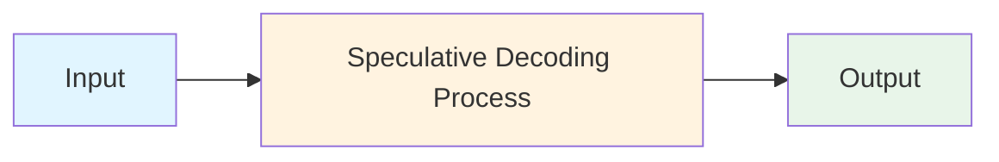
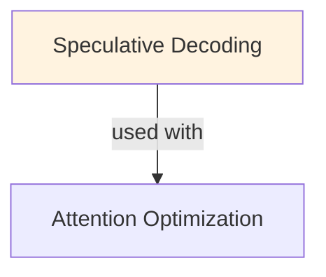

# Speculative Decoding

## TL;DR
Parallelize LLM generation using smaller draft model: draft predicts k tokens fast (2-5ms), verify all k with large model in parallel (10ms). Accept tokens until divergence found. Speedup: 2-4x with identical quality. Trade-off: requires draft model, 10-20% extra compute.

## Core Intuition
Standard generation is sequential: generate token 1, then token 2, then token 3... Each takes 10ms. Speculative decoding "speculates" with a fast draft model: generate tokens 1-4 in 2-5ms, then verify all 4 simultaneously with large model in 10ms. If all 4 match, accept them all. If divergence at token 3, accept 1-2, reject 3-4, continue. Result: generate ~4 tokens in ~10ms vs ~40ms (4x faster).

## How It Works

**Standard Autoregressive Generation (Sequential):**
```
Input: "The future of AI"
Sample token 1 from large model: "is" (10ms)
Input: "The future of AI is"
Sample token 2: "bright" (10ms)
Input: "The future of AI is bright"
Sample token 3: "and" (10ms)
...

Total for 100 tokens: 100 × 10ms = 1000ms (slow!)
```

**Speculative Decoding (Parallel Verification):**
```
Input: "The future of AI"

Iteration 1:
  Draft phase: fast model generates k=4 tokens (2ms)
    "is bright and" + "exciting"
  Verify phase: large model processes all 4 tokens (10ms)
    logits for positions 1, 2, 3, 4
  
  Check acceptance (greedy comparison):
    Token 1: draft="is" vs large sample="is" → match ✓
    Token 2: draft="bright" vs large sample="bright" → match ✓
    Token 3: draft="and" vs large sample="and" → match ✓
    Token 4: draft="exciting" vs large sample="exciting" → match ✓
  
  Accept all 4 tokens (accept_count=4)
  Large model generates 1 additional token from position 5: "in"
  
  Time: 2ms (draft) + 10ms (verify) = 12ms for 5 tokens

Iteration 2:
  Input: "The future of AI is bright and exciting in"
  (repeat...)

Total for 100 tokens: ~100 / 5 × 12ms = 240ms (5x faster!)
```

**Algorithm (with probability sampling):**

```python
while not_done:
    # Draft phase (fast): generate k tokens
    draft_tokens = []
    draft_logits = []
    
    for i in range(k):
        logits = draft_model(sequence)
        token = sample(logits)  # or greedy
        draft_tokens.append(token)
        draft_logits.append(logits)
        sequence.append(token)
    
    # Verify phase (large model): forward pass on k tokens
    large_logits = large_model(sequence[-(k+1):])  # forward only on new context
    
    # Acceptance check (sampling-based)
    # Sample from large_logits and compare with draft_tokens
    accept_count = 0
    for i in range(k):
        large_logit = large_logits[i]
        draft_logit = draft_logits[i]
        
        # Probability of draft token under large model
        large_prob = softmax(large_logit)[draft_tokens[i]]
        
        # Rejection probability: min(1, large_prob / draft_prob)
        draft_prob = softmax(draft_logit)[draft_tokens[i]]
        reject_prob = 1 - min(1, large_prob / draft_prob)
        
        if reject_prob > random():
            # Rejected
            break
        else:
            # Accepted
            accept_count += 1
    
    # At divergence or end of draft tokens:
    # Large model samples 1 new token
    if accept_count < k:
        # Resample token at position accept_count with corrected distribution
        # (to correct for rejection bias)
        new_token = sample(corrected_logits)
    else:
        # All accepted, sample next
        new_token = sample(large_logits[k])
    
    sequence.append(new_token)
    
    if sequence ends or reaches max_length:
        break
```

### Workflow Flowchart



## Key Properties / Trade-offs

| Metric | Standard | Speculative (k=5) | Notes |
|--------|----------|------------------|-------|
| Latency | 1000ms (100 tok) | 240ms (100 tok) | 4-5x faster |
| Quality | 100% | 100% | Identical (correct sampling) |
| Compute | 100 forward passes | 120 forward passes | +20% compute (small overhead) |
| Memory | Model memory | Model + draft memory | +10-20% RAM (draft model smaller) |
| Complexity | Simple | Complex (sampling logic) | More engineering |
| Throughput | Same | Same | Latency improvement, not throughput |

**When Speculative Decoding Works Well:**

```
Good scenarios:
  - Draft model well-matched to large model
    (e.g., quantized large model + full-precision as draft)
  - Long generation lengths (100+ tokens)
  - High-quality draft model (agreement rate >80%)

Poor scenarios:
  - Draft quality far from large model
    → high rejection rate → no speedup
  - Very short generations (1-5 tokens)
    → overhead of parallel verification not worth it
  - Large model already fast
    → optimizing generation not the bottleneck
```

**Speedup Analysis:**

```
Assumption: draft model 10x faster than large model

Scenario 1 (perfect agreement k=5):
  Standard: 100 tokens × T_large = 100T
  Speculative: (100/5) × (T_draft + T_large) = 20 × (T_large/10 + T_large) = 22T
  Speedup: 100T / 22T ≈ 4.5x

Scenario 2 (80% agreement, k=5):
  Rejection rate: 20%
  Avg tokens per iteration: 0.8 × 5 + 1 = 5
  Speculative: (100/5) × 1.1 × (T_draft + T_large) ≈ 24T
  Speedup: 100T / 24T ≈ 4.2x

Scenario 3 (50% agreement, k=5):
  Avg tokens per iteration: 0.5 × 5 + 1 = 3.5
  Speculative: (100/3.5) × 1.15 × (T_draft + T_large) ≈ 40T
  Speedup: 100T / 40T = 2.5x
```

## Common Mistakes / Gotchas

- **Poor draft model:** draft model far from large model → high divergence → low speedup. Draft should agree >70% of the time. Test agreement rate first.

- **Wrong k value:** k too small (k=1) → minimal benefit. k too large (k=20) → high rejection overhead. Optimal: k = 4-8.

- **Tokenizer mismatch:** draft and large model use different tokenizers → token positions misaligned. Fatal error. Use same tokenizer always.

- **Not batching verification:** verifying tokens one-by-one defeats purpose. Must use vectorized forward pass on all k tokens simultaneously.

- **Sampling vs greedy:** if draft uses greedy and large uses sampling, or vice versa → different distributions → issues. Use consistent sampling throughout.

- **Incorrectly handling corrected distribution:** When divergence found, must resample from corrected distribution (not just sample from large). Complex detail, easy to get wrong.

- **Not measuring end-to-end:** overhead of implementation can negate speedup if not careful. Profile actual wall-clock time, not theoretical.

## Code Example

```python
import torch
from transformers import AutoModelForCausalLM, AutoTokenizer

# Load models
large_model = AutoModelForCausalLM.from_pretrained("meta-llama/Llama-2-7b-hf")
# Draft model is a smaller variant (2B, 3B, or quantized version)
draft_model = AutoModelForCausalLM.from_pretrained("meta-llama/Llama-2-7b-hf")
# In practice, load a smaller model or quantized version for draft

tokenizer = AutoTokenizer.from_pretrained("meta-llama/Llama-2-7b-hf")

def speculative_decoding(
    input_text, 
    max_length=100,
    k=5,
    temperature=0.7,
    top_p=0.95,
):
    """Generate using speculative decoding."""
    input_ids = tokenizer.encode(input_text, return_tensors="pt")
    sequence = input_ids[0].tolist()
    
    generated_count = 0
    
    while len(sequence) < max_length:
        # Draft phase: generate k tokens
        draft_tokens = []
        with torch.no_grad():
            for _ in range(k):
                draft_input = torch.tensor([sequence])
                logits = draft_model(draft_input).logits[0, -1, :]
                
                # Sample token (with temperature and top_p)
                logits = logits / temperature
                # (implement top_p filtering here if needed)
                probs = torch.softmax(logits, dim=-1)
                draft_token = torch.multinomial(probs, num_samples=1).item()
                
                draft_tokens.append(draft_token)
                sequence.append(draft_token)
        
        # Verify phase: large model verifies all draft tokens at once
        with torch.no_grad():
            large_input = torch.tensor([sequence[-(k+1):]])
            large_logits = large_model(large_input).logits[0, :, :]
            
            # Check acceptance of draft tokens
            accept_count = 0
            sequence = sequence[:-(k)]  # Remove draft tokens temporarily
            
            for i in range(k):
                draft_token_id = draft_tokens[i]
                large_logit = large_logits[i, :]
                
                # Get probabilities
                large_prob = torch.softmax(large_logit, dim=-1)[draft_token_id]
                
                # For acceptance, we can use greedy comparison or probabilistic
                # Greedy: compare argmax
                if large_logit.argmax().item() != draft_token_id:
                    # Divergence found
                    break
                
                accept_count += 1
            
            # Accept up to divergence
            sequence.extend(draft_tokens[:accept_count])
            
            # Sample 1 new token from large model
            if accept_count < k:
                # Resample from correct distribution
                new_logits = large_logits[accept_count, :]
            else:
                # All accepted, sample next position
                large_input_full = torch.tensor([sequence])
                new_logits = large_model(large_input_full).logits[0, -1, :]
            
            new_logits = new_logits / temperature
            new_probs = torch.softmax(new_logits, dim=-1)
            new_token = torch.multinomial(new_probs, num_samples=1).item()
            sequence.append(new_token)
            generated_count += accept_count + 1
    
    return tokenizer.decode(sequence, skip_special_tokens=True)

# Usage
output = speculative_decoding("The future of AI is", max_length=50, k=5)
print(output)
```

**Using vLLM (automatic speculative decoding):**
```python
from vllm import LLM, SamplingParams

# vLLM supports speculative decoding built-in
llm = LLM(
    model="meta-llama/Llama-2-7b-hf",
    use_v2_block_manager=True,  # enables advanced features
    # speculative decoding happens automatically if draft model available
)

outputs = llm.generate(
    ["The future of AI"],
    SamplingParams(max_tokens=100, temperature=0.7),
)
```

## Interview Quick-Reference

| Question | What to say |
|---|---|
| "Speculative decoding?" | Draft model predicts k tokens fast, large model verifies all k in parallel. 2-4x speedup, same quality. |
| "How it works?" | Draft generates k tokens (2-5ms), verify with large model (10ms). Accept until divergence. Much faster than k×10ms. |
| "Draft model?" | Smaller, faster variant of large model. Can be quantized, smaller architecture, or distilled. Must be good quality (>70% agreement). |
| "k value?" | 4-8 typical. Smaller: low benefit. Larger: higher rejection. Tune empirically on your models. |
| "Cost?" | +10-20% compute (draft + verify). Not faster if compute is bottleneck. Best for latency-sensitive. |
| "When useful?" | Long generations (100+ tokens), high-quality draft, latency critical. Not for short outputs or compute-bound scenarios. |

## Related Topics
- [[inference-optimization]] — speculative decoding as optimization technique
- [[continuous-batching]] — compatible with continuous batching for serving
- [[kv-cache]] — KV cache management with speculative decoding
- [[token-optimization]] — other token-level optimizations

## Resources
- [Accelerating Large Language Model Decoding with Speculative Sampling](https://arxiv.org/abs/2302.01318)
- [SpecInfer: Accelerating Generative Large Language Model Serving](https://arxiv.org/abs/2305.09781)
- [Blockwise Parallel Decoding for Fast LLM Inference](https://arxiv.org/abs/2305.04966)
- [vLLM: Easy, Fast, and Cheap LLM Serving](https://arxiv.org/abs/2309.06180) — implements speculative decoding

## Concept Relationships



## Interview Questions

**Q: What's the core problem this concept solves?**
*A: See the 'Core Intuition' section above for the fundamental problem and how this concept addresses it.*

**Q: What are the main advantages and disadvantages?**
*A: See 'Key Properties / Trade-offs' section for detailed comparison with alternatives.*

**Q: How do you implement this in practice?**
*A: Refer to the corresponding Jupyter notebook in `llm/notebooks/` for working Python implementations and examples.*

