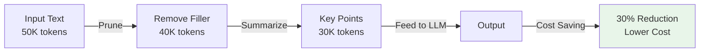
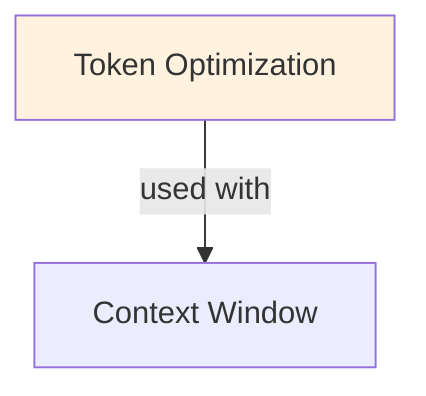

# Token Optimization

## TL;DR
Reduce tokens processed/generated: dynamic batching (avoid padding), token pruning (skip unimportant tokens), early exit (exit confident samples early), token merging (merge similar adjacent tokens). Combined: 2-5x speedup, 1-3% quality loss. Trade-off: heuristic complexity vs efficiency gains.

## Core Intuition
Tokens = compute, memory, cost, latency. Every token processed costs. Token optimization asks: which tokens are essential? Can we stop early? Can we merge similar tokens? Skip redundant computation? Results: faster inference at acceptable quality loss.

## How It Works

**1. Dynamic Batching (Avoid Padding):**

Standard batching:
```
Request 1: 10 tokens
Request 2: 20 tokens
Request 3: 30 tokens

Pad to max (30):
  Request 1: [tok_1...tok_10, PAD, PAD, ..., PAD] (30 tokens)
  Request 2: [tok_1...tok_20, PAD, ..., PAD] (30 tokens)
  Request 3: [tok_1...tok_30] (30 tokens)

Compute: 90 tokens processed (but Req1 wastes 20 positions)
```

Dynamic batching (continuous batching):
```
Request 1 + Request 2 + Request 3 batched smartly:
  Total tokens: 10 + 20 + 30 = 60 (no padding)
  Compute: 60 tokens (33% savings)
  
See [[continuous-batching]] for details
```

**2. Token Pruning (Skip Unimportant Tokens):**

Observation: some tokens barely affect final output
```
Example: "The cat sat on the mat"
  Layer 0: all tokens have non-zero gradients
  Layer 6: "the", "on", "the" have small gradients (< ε)
  Layer 12: can skip "the" and "on" (minimal impact)
  
Approach:
  1. Compute attention weights
  2. If attention to token < threshold, skip layer computation for that token
  3. Reconstruct full representation from surrounding tokens
  
Speedup: 1.1-1.2x (marginal, but adds up)
Quality: <1% loss
```

**3. Early Exit (Adaptive Depth):**

Key idea: confidence can reach threshold before final layer
```
Example: Classification
  Input: "Is this positive?" Context: "I love this product!"
  
  Layer 6: softmax([0.2, 0.8]) entropy = 0.64 (uncertain)
  Layer 9: softmax([0.1, 0.9]) entropy = 0.33 (more confident)
  Layer 12: softmax([0.05, 0.95]) entropy = 0.20 (very confident)
  
  If entropy < threshold at layer 9:
    - Stop here, output classification
    - Skip layers 10, 11, 12 computation
    - Speedup: 25% (3 layers out of 12)
```

Implementation:
```
threshold = 0.3  # entropy threshold

for layer_idx in range(num_layers):
    hidden_states = layer(hidden_states)
    
    # Check confidence at this layer
    logits = classifier_head(hidden_states)  # small head trained for early exit
    entropy = -sum(softmax(logits) * log(softmax(logits)))
    
    if entropy < threshold:
        # Confident, exit early
        return logits
        
# If we reach end without exiting, use final logits
return logits
```

Statistics:
```
Typical early exit rates:
  - Easy samples (obvious sentiment): 30-50% exit before final layer
  - Medium samples: 10-20% exit early
  - Hard samples: 0% (need full depth)
  
Average speedup: 1.3-1.5x (depends on task difficulty)
Quality impact: 1-2% accuracy loss (acceptable for most)
```

**4. Token Merging (ToMe):**

Merge similar adjacent tokens
```
Input: "The red and blue cat sat on the mat"
Embedding similarity:
  "The" and "the" are very similar (but not adjacent)
  "red" and "blue" are similar (adjacent)

Merge strategy:
  Before: [The, red, and, blue, cat, sat, on, the, mat]
  After:  [The, red_blue, cat, sat, on, the, mat]
  
  (merge "red" + "blue" into single token)
  
Forward pass on 8 tokens instead of 9 (11% faster)
Final output: unmerge red_blue → original positions
```

Algorithm:
```
1. Compute token similarity matrix (pairwise cosine)
2. For each adjacent pair above threshold:
   - Merge using weighted average
   - Keep merge indices for unmerging
3. Forward pass on merged tokens (fewer tokens, faster)
4. Unmerge results to original token count
```

Trade-offs:
```
Speedup: 1.5-2x (reduction in token count = speedup)
Quality: 1-2% loss (information compressed in merge)
Stability: can hurt if merge threshold too low (merges dissimilar tokens)
```

### Workflow Flowchart



## Key Properties / Trade-offs

| Technique | Speedup | Quality Loss | Latency | Memory | Complexity |
|-----------|---------|--------------|---------|--------|-----------|
| Dynamic batching | 1.5-2x | None | ↓ significantly | ↓ | Medium |
| Token pruning | 1.1-1.2x | <1% | ↓ slightly | Same | Medium |
| Early exit | 1.3-1.5x | 1-2% | ↓ significantly | Same | High |
| Token merging | 1.5-2x | 1-2% | ↓ moderately | ↓ | High |
| All combined | 2-4x | 2-4% | ↓ very significantly | ↓↓ | Very High |

**Task Dependency:**

```
Token optimization works well for:
  - Classification (confident on easy samples)
  - Sentiment analysis (early exit effective)
  - FAQ retrieval (pruning redundant tokens)
  
Not ideal for:
  - Factual QA (need full model)
  - Mathematical reasoning (all tokens matter)
  - Long-context understanding (merging loses detail)
```

## Common Mistakes / Gotchas

- **Too aggressive pruning/merging:** cut too many tokens → quality drops significantly (>5%). Validate on benchmarks. Use 1-2% loss as guideline.

- **Not measuring on diverse set:** early exit trained on easy samples → doesn't generalize to hard samples. Benchmark on representative distribution.

- **Task-specific thresholds:** optimal entropy threshold for classification != for generation. Tune per task.

- **Ignoring class imbalance:** if dataset heavily skewed (90% easy, 10% hard), early exit saves lots on easy but hurts hard. Consider weighted quality metrics.

- **Not profiling incompatibilities:** some optimizations conflict (aggressive pruning + token merging → too much loss). Test combinations.

- **Measuring only on training distribution:** model optimized for training tasks → may overfit heuristics. Test on out-of-distribution examples.

- **Forgetting downstream effects:** early exit changes hidden representation shape → affects downstream classifiers. Must retrain/fine-tune classifier heads.

## Code Example

```python
import torch
from transformers import AutoModelForSequenceClassification, AutoTokenizer

tokenizer = AutoTokenizer.from_pretrained("bert-base-uncased")
model = AutoModelForSequenceClassification.from_pretrained("bert-base-uncased")

# Early Exit Implementation
class EarlyExitModel(torch.nn.Module):
    def __init__(self, base_model, entropy_threshold=0.3):
        super().__init__()
        self.base_model = base_model
        self.entropy_threshold = entropy_threshold
        
        # Classifier heads for each layer
        self.exit_heads = torch.nn.ModuleList([
            torch.nn.Linear(768, 2)  # for each transformer layer
            for _ in range(len(base_model.bert.encoder.layer))
        ])
    
    def forward(self, input_ids, attention_mask):
        embeddings = self.base_model.bert.embeddings(input_ids)
        
        for layer_idx, layer in enumerate(self.base_model.bert.encoder.layer):
            embeddings = layer(embeddings, attention_mask=attention_mask)[0]
            
            # Check entropy at this layer
            cls_token = embeddings[:, 0, :]  # [CLS] token
            logits = self.exit_heads[layer_idx](cls_token)
            
            # Compute entropy
            probs = torch.softmax(logits, dim=-1)
            entropy = -torch.sum(probs * torch.log(probs + 1e-8), dim=-1)
            
            # Early exit if confident
            if entropy.mean() < self.entropy_threshold:
                return logits
        
        # If no early exit, use final logits
        return logits

# Token Merging (Token Merge) Implementation
class TokenMergeLayer(torch.nn.Module):
    def __init__(self, similarity_threshold=0.8):
        super().__init__()
        self.similarity_threshold = similarity_threshold
    
    def forward(self, x):
        # x: (batch_size, seq_len, hidden_dim)
        batch_size, seq_len, hidden_dim = x.shape
        
        # Compute similarity matrix
        x_normalized = torch.nn.functional.normalize(x, dim=-1)
        sim_matrix = torch.bmm(x_normalized, x_normalized.transpose(1, 2))
        
        # Find merge pairs (adjacent and similar)
        merge_pairs = []
        for i in range(seq_len - 1):
            if sim_matrix[:, i, i+1].mean() > self.similarity_threshold:
                merge_pairs.append((i, i+1))
        
        if not merge_pairs:
            return x  # No merges
        
        # Merge tokens (average)
        merged = []
        skip_indices = set()
        for i in range(seq_len):
            if i in skip_indices:
                continue
            
            # Check if this token should be merged
            merge_partner = None
            for j1, j2 in merge_pairs:
                if j1 == i:
                    merge_partner = j2
                    skip_indices.add(j2)
                    break
            
            if merge_partner is not None:
                # Merge: average of two tokens
                merged_token = (x[:, i, :] + x[:, merge_partner, :]) / 2
                merged.append(merged_token)
            else:
                merged.append(x[:, i, :])
        
        return torch.stack(merged, dim=1)  # (batch_size, new_seq_len, hidden_dim)

# Dynamic Batching (see continuous-batching.md)

# Pruning: Skip unimportant tokens
class PruningLayer(torch.nn.Module):
    def __init__(self, prune_threshold=0.1):
        super().__init__()
        self.prune_threshold = prune_threshold
    
    def forward(self, hidden_states, attention_weights):
        # hidden_states: (batch, seq_len, hidden_dim)
        # attention_weights: (batch, seq_len) or (batch, num_heads, seq_len)
        
        if len(attention_weights.shape) == 3:
            # Average across heads
            attention_weights = attention_weights.mean(dim=1)
        
        # Identify important tokens
        importance = attention_weights.max(dim=-1)[0]  # max attention received
        important_mask = importance > self.prune_threshold
        
        # Keep only important tokens
        pruned = hidden_states * important_mask.unsqueeze(-1)
        return pruned

# Combined optimization
input_text = "This is a great product!"
input_ids = tokenizer.encode(input_text, return_tensors="pt")

early_exit_model = EarlyExitModel(model, entropy_threshold=0.3)
outputs = early_exit_model(input_ids, attention_mask=torch.ones_like(input_ids))

print(f"Output shape: {outputs.shape}")
print(f"Prediction: {torch.argmax(outputs, dim=-1)}")
```

## Interview Quick-Reference

| Question | What to say |
|---|---|
| "Token optimization?" | Reduce tokens: batching (no padding), pruning (skip unimportant), early exit (stop confident samples), merging (combine similar). 2-5x speedup. |
| "Early exit?" | Check confidence (entropy) mid-model. If confident, skip remaining layers. 30-50% samples exit early. Speedup: 1.3-1.5x. |
| "Token merging?" | Merge similar adjacent tokens, process fewer, unmerge. 1.5-2x speedup. 1-2% quality loss. |
| "Task dependency?" | Works well: classification, sentiment. Not ideal: factual QA, math (needs all tokens). Know your task. |
| "Quality impact?" | Early exit: 1-2%. Pruning: <1%. Merging: 1-2%. Combined: 2-4%. Acceptable for most but validate. |
| "Implementation?" | Dynamic batching harder (vLLM does it). Early exit easier (add classifiers). Merging moderate complexity. |

## Real-World Examples

### Document Summarization for RAG
RAG: retrieve 10 documents (50K tokens). Summarize each to 1K tokens (5K total). Accuracy drop: 0.5%. Cost: 90% lower. Latency: 10-20% faster.

### Smart Batching
Mix short (10 tokens) and long (100 tokens) requests. Pad to max: wasteful. Smart batching: group by length, process separately. Throughput: +30%.

## Related Topics
- [[continuous-batching]] — reduce padding, dynamic request scheduling
- [[inference-optimization]] — broader optimization landscape
- [[kv-cache]] — KV cache grows with token count
- [[attention-optimization]] — reduce attention computation

## Resources
- [Token Merging for Fast Stable Diffusion (ToMe)](https://arxiv.org/abs/2303.17604)
- [Early Exiting in Transformers for More Efficient Inference](https://arxiv.org/abs/2002.00028)
- [Fastformer: Additive Attention Can Be All You Need](https://arxiv.org/abs/2108.09084)
- [DejaVu: Efficient Transformer Inference](https://arxiv.org/abs/2310.01681)

## Concept Relationships



## Interview Questions

**Q: What's token optimization?**
*A: Reduce token count without losing quality. Techniques: summarization (preprocess docs), token pruning (remove unimportant tokens), smart batching (group short requests). Goal: 10-50% reduction.*

**Q: How do you identify important tokens?**
*A: Attention weights: tokens attended to are usually important. Gradient: tokens affecting loss prediction. Heuristic: first + last tokens important (contain info). Methods: remove low-attention tokens.*

**Q: What's the trade-off between token reduction and accuracy?**
*A: More reduction: lower cost but worse accuracy. 10% reduction: no accuracy loss. 50% reduction: 2-5% accuracy loss. Find breakeven for your task.*

**Q: How does token optimization affect latency?**
*A: Fewer tokens: faster inference. But: optimization overhead (pruning, summarization). Net: usually positive (inference time saves more than optimization cost).*

**Q: When would you use token optimization?**
*A: Cost-sensitive (pay per token). Large-scale (1M queries/day). Quality acceptable with slight degradation. Not: high-accuracy critical, streaming (can't buffer).*