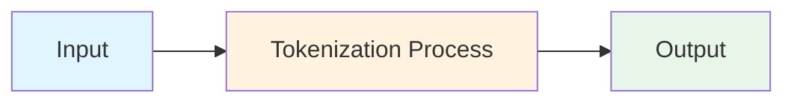
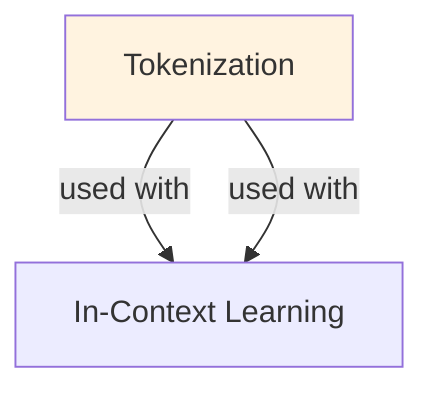

# Tokenization

## TL;DR
Text → integer sequences for LLM processing. Tokenization strategy (BPE, WordPiece, SentencePiece) impacts model efficiency, multilingual support, and context length. BPE most common: iteratively merge frequent subword pairs. Trade-off: vocabulary size vs sequence length. Understanding tokenization critical for prompt engineering, cost estimation, and production systems.

## Core Intuition
LLMs work with integers, not text. Tokenization bridges text → numbers. Key tension: word-level (huge vocabulary, can't handle rare words) vs character-level (small vocabulary, sequences too long). Subword tokenization (BPE) splits words into frequent pieces: "tokenization" → ["token", "ization"] or ["to", "ken", "ization"]. This balances vocabulary size and sequence length.

## How It Works

**Byte-Pair Encoding (BPE):**

Algorithm:
```
1. Initialize: every character is a token
   Text: "tokenization"
   Vocab: {t, o, k, e, n, i, z, a, u, s, p, ...}
   
2. Count adjacent pairs
   "tokenization" → pairs: ("t","o"), ("o","k"), ("k","e"), ("e","n"), ...
   Most frequent pair: ("e", "n") appears 3 times
   
3. Merge most frequent pair
   Vocab: {t, o, k, "en", i, z, a, ...}
   Text: "tok"en"ization"
   
4. Repeat until vocab size = target (e.g., 50k)
   After many iterations:
   "tokenization" → ["token", "ization"]
```

Properties:
- Iterative: each merge builds on previous
- Deterministic: same merges produce same tokenization
- Lossless: can reconstruct original text from tokens
- Language-agnostic: works on any text

Example (GPT-2 tokenizer):
```
"Hello, world!" →
  "Hello" = 1 token (in vocab)
  "," = 1 token
  "Ġworld" = 1 token (Ġ = space in BPE)
  "!" = 1 token
  Total: 4 tokens

"tokenization" →
  "token" = 1 token
  "ization" = 1 token
  Total: 2 tokens

vs full words:
  would need every unique word in vocab
  vs characters:
  would be 12 tokens
```

**WordPiece (BERT tokenizer):**

Similar to BPE but merges based on likelihood gain:
```
Merge criterion: log(freq(AB) / (freq(A) × freq(B)))

Example:
  freq(e, n) = 100
  freq(e) = 1000
  freq(n) = 500
  
  Merge score: log(100 / (1000 × 500)) = log(0.0002) = -8.5
  
Higher likelihood gain → more likely to be meaningful unit
```

Used in: BERT, RoBERTa, DistilBERT

**SentencePiece:**

Language-agnostic, operates on raw bytes:
```
No assumption of spaces (good for CJK languages)
Example (Japanese): "こんにちは" (konnichiwa)
  WordPiece assumes space boundaries → doesn't work
  SentencePiece operates on bytes → works across languages
  
Vocab: frequent byte sequences globally
```

Used in: T5, mT5, XLM, Llama

**Vocabulary Statistics:**

```
Tokenizer  | Vocab Size | Language Coverage | Efficiency
-----------|----------|-------------------|----------
GPT-2 BPE  | 50,257   | English-focused   | ~4 chars/token
GPT-4 BPE  | ~100k    | Better coverage   | ~3.8 chars/token  (improved)
BERT WP    | 30,522   | English + others  | ~4-5 chars/token
mT5 SP     | 250,100  | 100+ languages    | Varies (0.5-10 chars/token)
Llama SP   | 32,000   | Multilingual      | ~3.5-4 chars/token
```

Language effects:
```
English: ~4 characters per token (high compression)
  "tokenization" (12 chars) = 2 tokens = 6 chars per token
  
French: ~4 characters per token (similar to English)

Chinese/Japanese: ~1.3 characters per token (low compression)
  "你好世界" (4 chars) = ~6-8 tokens
  Cost/token similar, but needs more tokens for same text
  
Arabic: ~3-4 characters per token (moderate)
```

### Workflow Flowchart



## Key Properties / Trade-offs

| Property | Character | BPE | WordPiece | SentencePiece |
|----------|-----------|-----|-----------|---------------|
| Vocab size | Small (100) | Medium (50k) | Medium (30k) | Large (250k) |
| Sequence length | Long (slow) | Medium | Medium | Medium |
| Lossless | Yes | Yes | Yes | Yes |
| Language support | All | English-focused | English-focused | Multilingual |
| Merging criterion | N/A | Frequency | Likelihood gain | Byte frequency |
| Reversibility | Perfect | Perfect (with spaces) | Perfect (with spaces) | Perfect |

**Context Window Trade-off:**

```
Model context: 4K tokens
English text:  ~16K characters (4 pages)
Chinese text:  ~5K characters (1 page)

Same context window, different text lengths!
Critical for multilingual systems.
```

## Common Mistakes / Gotchas

- **Assuming tokens = words:** "The", "tokenization", "cat" might be 1, 2, 3 tokens respectively. Subwords != words. Count tokens, not words.

- **Not counting cost:** API costs per token, not character. Long sequences = higher cost even if same characters. Example:
  ```
  English prompt: "Explain machine learning" = 4 tokens = $0.00012
  Chinese prompt: "解释机器学习" = 12 tokens = $0.00036 (3x cost for same info!)
  ```

- **Tokenizing on wrong side of split:** if test set contains examples of word tokenization during training, that's data leakage. Always tokenize after train/test split.

- **Not accounting for special tokens:** BPE/WordPiece add special tokens:
  ```
  "<|endoftext|>" in GPT
  "[CLS]" "[SEP]" in BERT
  "<s>" "</s>" in Llama
  
  These count toward context limit
  5 examples × 2 examples = 10 special tokens per prompt
  Actual tokens available ≤ context_window - special_tokens
  ```

- **Ignoring tokenizer updates:** new tokenizer = different tokenization = can't use old checkpoints. Keep tokenizer version with model.

- **Assuming fixed tokenization:** some systems retokenize at inference (e.g., re-encode context). Can change token boundaries → hashing/indexing breaks. Use consistent tokenizer.

- **Not handling unknown tokens:** rare words → `[UNK]` token. In fine-tuning, this token has no gradient info. Solution: use SentencePiece or larger vocab, or pre-add custom tokens.

## Code Example

```python
from transformers import AutoTokenizer, GPT2Tokenizer, BertTokenizer
from tokenizers import Tokenizer, models, pre_tokenizers, decoders, trainers

# Using pretrained tokenizers
gpt2_tokenizer = AutoTokenizer.from_pretrained("gpt2")
bert_tokenizer = AutoTokenizer.from_pretrained("bert-base-uncased")

# Encode text
text = "Hello, world!"
gpt2_tokens = gpt2_tokenizer.encode(text)
bert_tokens = bert_tokenizer.encode(text)

print(f"GPT-2: {gpt2_tokens}")  # [15496, 11, 995, 0]
print(f"BERT: {bert_tokens}")   # [101, 7592, 1010, 2088, 999, 102]

# Decode back
decoded_gpt2 = gpt2_tokenizer.decode(gpt2_tokens)
decoded_bert = bert_tokenizer.decode(bert_tokens)

print(f"GPT-2 decoded: {decoded_gpt2}")  # "Hello, world!"
print(f"BERT decoded: {decoded_bert}")   # "[CLS] hello , world ! [SEP]"

# Token statistics
print(f"Text length: {len(text)} characters")
print(f"GPT-2 tokens: {len(gpt2_tokens)}")
print(f"Chars per token (GPT-2): {len(text) / len(gpt2_tokens):.2f}")

# Multilingual comparison
texts_by_lang = {
    "English": "The future of AI is bright",
    "Chinese": "人工智能的未来很光明",
    "Arabic": "مستقبل الذكاء الاصطناعي مشرق",
}

tokenizer = AutoTokenizer.from_pretrained("bert-base-multilingual-cased")

for lang, text in texts_by_lang.items():
    tokens = tokenizer.encode(text)
    ratio = len(text) / len(tokens)
    print(f"{lang}: {len(tokens)} tokens, {ratio:.2f} chars/token")

# Custom tokenizer training (from scratch)
from tokenizers import Tokenizer, models, pre_tokenizers, trainers

# Initialize BPE tokenizer
tokenizer = Tokenizer(models.BPE())

# Set up preprocessing
tokenizer.pre_tokenizer = pre_tokenizers.ByteLevel(add_prefix_space=True)

# Train on text files
trainer = trainers.BpeTrainer(
    vocab_size=5000,
    min_frequency=2,
    special_tokens=["<|endoftext|>"],
)

files = ["data.txt"]  # Path to training data
tokenizer.train(files, trainer)

# Encode
tokens = tokenizer.encode("Hello, world!")
print(f"Tokens: {tokens.ids}")
print(f"Decoded: {tokenizer.decode(tokens.ids)}")

# Cost estimation
def estimate_api_cost(text, model="gpt-4", price_per_1k_tokens=0.03):
    """Estimate API cost for a prompt."""
    tokenizer = AutoTokenizer.from_pretrained("gpt2")
    num_tokens = len(tokenizer.encode(text))
    cost = (num_tokens / 1000) * price_per_1k_tokens
    return num_tokens, cost

text = "Explain machine learning in detail"
tokens, cost = estimate_api_cost(text)
print(f"Text: {text}")
print(f"Tokens: {tokens}")
print(f"Estimated cost: ${cost:.6f}")

# Language-specific token counting
def count_tokens_by_language(text, tokenizer_name="gpt2"):
    """Count tokens for a given language."""
    tokenizer = AutoTokenizer.from_pretrained(tokenizer_name)
    tokens = tokenizer.encode(text)
    return len(tokens)

print(f"English tokens: {count_tokens_by_language('The future of AI')}")
print(f"Chinese tokens: {count_tokens_by_language('人工智能的未来')}")
# Chinese has higher token count, so higher API cost!
```

## Interview Quick-Reference

| Question | What to say |
|---|---|
| "Tokenization?" | Text → token IDs. BPE/WordPiece split words into subwords. Trade: vocab size vs sequence length. |
| "BPE?" | Byte-Pair Encoding: iteratively merge most frequent adjacent pairs. Most common method (GPT, Llama). |
| "Why subwords?" | Word-level vocab too large (100k+ unique words). Subwords compress better. Handles rare words. |
| "Cost impact?" | Billed per token. Chinese/Japanese = fewer chars per token = higher cost per character. Know your tokenizer. |
| "Multilingual?" | ASCII languages efficient (~4 chars/token). CJK scripts less efficient (~1-2 chars/token). Use SentencePiece for multilingual. |
| "Context length?" | More tokens per text = shorter effective context. 4K tokens ≠ 4K characters. Count tokens, not chars. |

## Related Topics
- [[pretraining]] — tokenization is first step
- [[prompt-optimization]] — token count affects prompt engineering
- [[inference-optimization]] — tokens affect latency/cost
- [[embeddings]] — downstream from tokenization

## Resources
- [Neural Text Generation With Transformers (OpenAI BPE)](https://openai.com/research/tokenizers)
- [Byte Pair Encoding Tokenizer](https://arxiv.org/abs/1508.07909)
- [WordPiece Tokenization (BERT)](https://arxiv.org/abs/1810.04805)
- [SentencePiece: A Simple and Language Independent Subword Tokenizer and Detokenizer for Neural Machine Translation](https://arxiv.org/abs/1808.06226)
- [Tokenizers by Hugging Face](https://github.com/huggingface/tokenizers)

## Concept Relationships



## Interview Questions

**Q: What's the core problem this concept solves?**
*A: See the 'Core Intuition' section above for the fundamental problem and how this concept addresses it.*

**Q: What are the main advantages and disadvantages?**
*A: See 'Key Properties / Trade-offs' section for detailed comparison with alternatives.*

**Q: How do you implement this in practice?**
*A: Refer to the corresponding Jupyter notebook in `llm/notebooks/` for working Python implementations and examples.*

