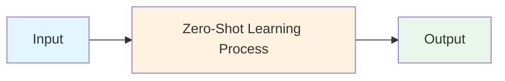
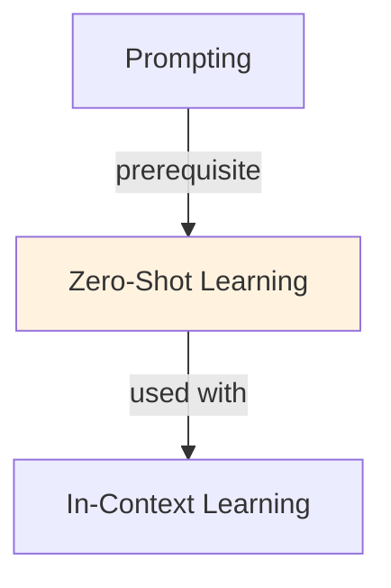

# Zero-Shot Learning

## TL;DR
No examples. Just instruction: "Classify sentiment: [text]" and model responds. LLM infers task from language alone. Works for simple tasks; weaker than few-shot. Trade: simplicity vs accuracy.

## Core Intuition
"Classify sentiment" tells LLM what to do without examples. Model knows "sentiment" is positive/negative/neutral from training. Works for intuitive tasks; fails on domain-specific or complex ones.

## How It Works

**Zero-Shot Prompt:**
```
Task: Classify sentiment
Text: "This product is amazing!"
Sentiment:
```

**How it Works:**
1. Model reads instruction ("classify sentiment")
2. Understands sentiment task from pre-training knowledge
3. Applies learned patterns to text
4. Outputs: "Positive"

**When it Works:**
- Tasks model has seen during training
- Simple, intuitive tasks (sentiment, language detection, classification)
- Well-known categories

**When it Fails:**
- Domain-specific tasks (medical coding, legal classification)
- Rare categories
- Complex reasoning

### Workflow Flowchart



## Key Properties / Trade-offs

| Aspect | Zero-Shot | Few-Shot |
|--------|-----------|----------|
| Speed | Fastest | Slower (longer prompts) |
| Accuracy | Lower | Higher |
| Data needed | None | 3-10 examples |
| Flexibility | Good (new tasks fast) | Better (task-specific) |

## Common Mistakes / Gotchas

- **Assuming coverage:** Model may not know task from description alone. Test first.
- **Vague instructions:** "Analyze this" is too vague. Be specific: "Classify as A, B, or C."
- **Rare categories:** If category is niche (e.g., "Klingon sentiment"), zero-shot fails. Use few-shot.
- **Complex tasks:** Multi-step reasoning needs few-shot or fine-tuning.

## Code Example

```python
from anthropic import Anthropic

client = Anthropic()

# Zero-shot: no examples, just instruction
prompt = """Classify the language of this text: "Bonjour, comment allez-vous?"
Language:"""

response = client.messages.create(
    model="claude-3-5-sonnet-20241022",
    max_tokens=50,
    messages=[{"role": "user", "content": prompt}]
)
print("Zero-shot:", response.content[0].text)  # Output: "French"

# Compare with few-shot (for reference)
prompt_few_shot = """Classify language:
"Hello, how are you?" → English
"Hola, ¿cómo estás?" → Spanish
"Bonjour, comment allez-vous?" → French

"Guten Tag" → 
Language:"""

response = client.messages.create(
    model="claude-3-5-sonnet-20241022",
    max_tokens=50,
    messages=[{"role": "user", "content": prompt_few_shot}]
)
print("Few-shot:", response.content[0].text)  # Also "German" but more confident
```

## Interview Quick-Reference

| Question | What to say |
|---|---|
| "Zero-shot?" | Task from instruction only, no examples. Fast but lower accuracy. Works for simple, well-known tasks. |
| "vs few-shot?" | Zero-shot: simpler prompt, faster. Few-shot: +10-30% accuracy, longer prompt. Use few-shot if accuracy critical. |
| "When use zero-shot?" | Simple tasks, fast iteration, or when examples hard to get. Otherwise use few-shot. |
| "Failure modes?" | Domain-specific tasks, rare categories, complex reasoning. Add examples if failing. |

## Related Topics
- [In-Context Learning](in-context-learning.md) — ICL includes both zero and few-shot
- [Few-Shot Learning](few-shot-learning.md) — adding examples to zero-shot
- [Prompting](prompting.md) — instruction quality matters for zero-shot

## Resources
- [Prompt Engineering Guide](https://www.promptingguide.ai/)

## Concept Relationships



## Interview Questions

**Q: What's the core problem this concept solves?**
*A: See the 'Core Intuition' section above for the fundamental problem and how this concept addresses it.*

**Q: What are the main advantages and disadvantages?**
*A: See 'Key Properties / Trade-offs' section for detailed comparison with alternatives.*

**Q: How do you implement this in practice?**
*A: Refer to the corresponding Jupyter notebook in `llm/notebooks/` for working Python implementations and examples.*

