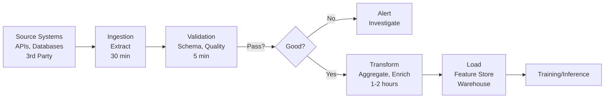
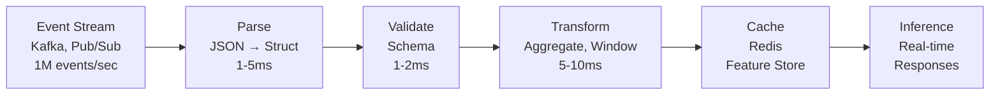
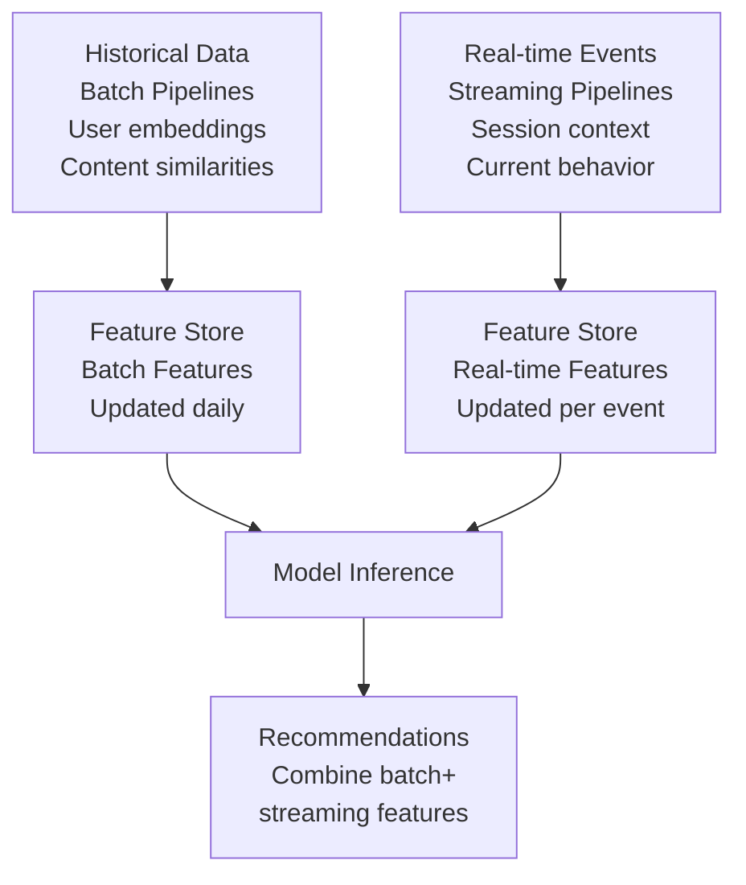
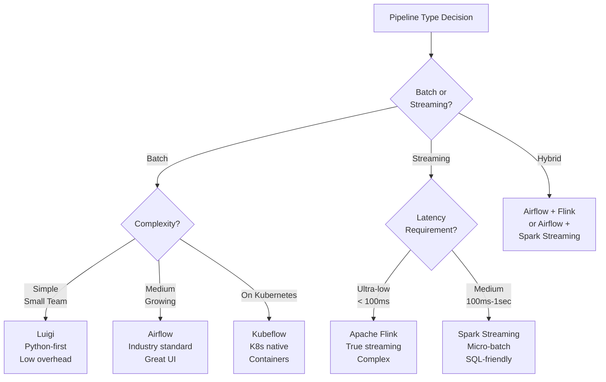
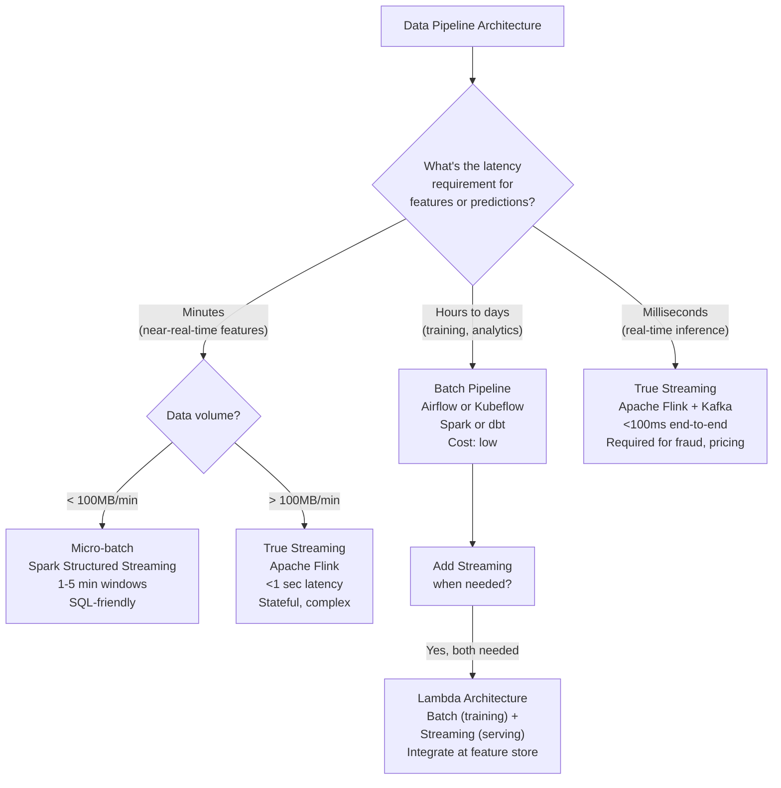

# Data Pipelines: Building Reliable ETL for ML

## Comprehensive Overview

Data pipelines form the backbone of ML systems, responsible for ingesting, transforming, and delivering data to models at scale. A production data pipeline must handle millions of events per second, recover from failures gracefully, and maintain data quality while transforming raw inputs into feature-ready datasets. The core challenge: ETL is not just engineering—it's critical infrastructure that determines both model training velocity and inference reliability. Unlike traditional software systems, data pipelines cannot simply drop events; they must preserve completeness while ensuring timeliness and correctness.

Data pipeline design reflects fundamental constraints: batch pipelines excel at historical analytics and model training (high throughput, days of latency acceptable) while streaming pipelines serve real-time features and online serving (millisecond latency, stateful computation). Most production systems need both. The decision between Airflow (DAG orchestration, task dependencies, scheduling), Kubeflow (Kubernetes-native ML workflows, distributed execution), and Luigi (simpler Python workflows) hinges on team expertise, existing infrastructure, and tolerance for complexity. Choosing wrong costs months in context-switching and operational overhead.

Production pipelines face four persistent challenges: data quality (garbage in, garbage out), latency (when should data be available?), cost (compute and storage at scale), and debuggability (why did a run fail at 3am?). Monitoring pipelines is harder than monitoring services—success looks like "data arrived on time," failure looks like "data arrived late" or "data arrived wrong," both requiring different responses. Modern teams implement data contracts (schema validation, completeness checks, freshness guarantees) alongside orchestration, treating data quality as equivalent to code quality.

The business impact is outsized. Netflix features trained on stale data degrade recommendation quality. Uber's surge pricing trained on hours-old traffic patterns misses real-time demand. Stripe's fraud detection trained on day-old transactions misses emerging fraud patterns. Data freshness, quality, and completeness are not engineering details—they directly determine model performance and business outcomes.

## How It Works

### Batch Pipelines

```
Source Systems (APIs, DBs)
    ↓
Ingestion (extract data)
    ↓
Transformation (clean, aggregate, enrich)
    ↓
Feature Store or Data Warehouse
    ↓
Model Training or Inference
```



**Schedule-based execution:** Run at fixed times (daily, hourly) via cron or orchestrator.  
**Latency:** Minutes to hours (acceptable for training, risky for serving).  
**Throughput:** High (can process millions of rows efficiently).  
**State management:** Stateless (idempotent operations).

### Streaming Pipelines

```
Event Stream (Kafka, Pub/Sub)
    ↓
Stateful Transformation (windowing, aggregation)
    ↓
Real-Time Feature Store
    ↓
Online Model Inference
```



**Event-driven execution:** Process data as it arrives.  
**Latency:** Milliseconds (necessary for real-time applications).  
**Throughput:** Medium (constrained by processing latency per event).  
**State management:** Stateful (maintains windows, aggregations).

### Hybrid Architecture (Batch + Streaming)

Most production systems use both:
- **Batch:** Model training (needs historical data), daily feature updates
- **Streaming:** Feature serving (needs real-time features), online inference

The integration point is typically the feature store, which maintains both batch-computed and streaming-computed features.



## Tool Comparisons

| Tool | Type | Strengths | Weaknesses | Best For |
|------|------|-----------|-----------|----------|
| **Apache Airflow** | Batch orchestration | DAG clarity, large community, great UI, many integrations, easy to debug | Stateless (bad for streaming), scheduling overhead, can be slow for large DAGs | Medium-complexity batch pipelines, Python teams, established infra |
| **Kubeflow Pipelines** | Kubernetes-native | Native Kubernetes, container-first, good for ML workflows, reproducibility | Steeper learning curve, smaller community, requires K8s | ML teams on Kubernetes, complex workflows |
| **Luigi** | Python-first orchestration | Simple, lightweight, dependency tracking, low overhead | Less powerful than Airflow, smaller ecosystem, limited integrations | Small teams, simple workflows, quick prototyping |
| **Apache Flink** | Stream processing | Low-latency processing, stateful computation, complex windowing, fault tolerance | Operational complexity, JVM overhead, steeper learning curve | Real-time feature computation, complex streaming logic |
| **Spark Streaming** | Batch-like streaming | SQL integration, Hadoop ecosystem, structured APIs, familiar to data engineers | Micro-batch model (not true streaming), higher latency than Flink | Medium-latency streaming, SQL-heavy transformations |
| **dbt** | Transformation focus | SQL-first, lineage tracking, testing, documentation, simple to learn | Limited to SQL, not for orchestration, newer tool | Analytical workflows, data warehouse transformations |

**Decision Framework:**



- **Batch pipelines:** Airflow (industry standard, safe bet) or Luigi (simplicity)
- **Streaming:** Flink (low-latency) or Spark (SQL-heavy)
- **Hybrid:** Airflow (batch) + Flink/Spark (streaming)
- **Starting out:** Luigi (simplicity), then migrate to Airflow as complexity grows
- **K8s shops:** Kubeflow Pipelines

## Interview Q&A

**Q: Design a data pipeline for a recommendation system processing 1M events/second. Walk me through your approach.**

A: I'd separate into batch and streaming. Batch (daily): ingest historical user behavior, compute user embeddings and content similarities, update training dataset. Streaming (real-time): ingest live user events, compute session features (current browsing context), cache in Redis. At inference time: combine batch features (user embeddings) with streaming features (session context) to score recommendations. Latency matters—fresh features for better recommendations.

**Q: Your batch pipeline failed at 2am, missing the 3am model training deadline. How do you debug and prevent future occurrences?**

A: Debugging: (1) Check orchestrator logs—did the job start? (2) If started, check task-level logs: data ingestion (source available?), transformation (errors?), validation (data quality?). (3) Check resources—did it timeout due to memory/CPU? (4) Check data—did it arrive but fail validation? Prevention: (1) Implement data freshness monitoring—alert if data hasn't arrived by 2:30am. (2) Automated retries for transient failures (network timeouts). (3) Fallback to cached data if fresh data unavailable. (4) Reduce batch window—if 24h window too slow, use 12h instead.

**Q: Your pipeline ingests data from 3 sources with different schemas. How do you handle schema evolution without breaking downstream systems?**

A: Schemas evolve: new fields appear, types change, fields disappear. Strategy: (1) Validation tier—validate incoming data against expected schema using tools like Great Expectations. Log schema violations, don't silently drop. (2) Transformation tier—use schema-aware libraries (Pydantic, Spark StructType) that enforce types and catch mismatches. (3) Versioning—version schemas in data contracts so consumers know what to expect. (4) Breaking changes—deprecate fields before removing (give consumers 2 weeks notice), add new fields as optional. (5) Monitoring—alert on schema violations, track schema change frequency.

**Q: Batch pipeline costs $10K/month. How do you optimize?**

A: Identify cost drivers: compute (60%), storage (30%), networking (10%). Optimize each: (1) Compute—filter unnecessary data early (reduce volume processed), better algorithms (reduce execution time), parallelize better (reduce wall-clock time), schedule during off-peak (use cheaper compute). (2) Storage—compress data (Parquet > CSV, 10x reduction), delete old snapshots, archive rarely-accessed data to cheaper storage. (3) Networking—colocate compute near data, reduce data movement. Measurement: track cost/GB processed, aim for 20% reduction without sacrificing quality.

**Q: How do you ensure pipeline reliability and recovery from failures?**

A: Reliability requires: (1) Idempotency—re-run same job 10x, get same result (no duplicates, no data loss). (2) Checkpointing—restart from failure point, not beginning. (3) Retries—transient failures (network timeouts) auto-retry 3x with backoff; permanent failures (bad code) fail fast. (4) Monitoring—alert on lateness, data quality issues, resource failures. (5) Fallback—if today's data unavailable, use yesterday's cached data. (6) Testing—unit test transformations, integration test end-to-end with sample data, chaos test failure scenarios.

**Q: Compare batch and streaming pipelines. When would you choose each?**

A: Batch: high throughput, acceptable latency (hours), stateless, cost-efficient. Use for model training (needs historical data), daily reports. Streaming: low latency (milliseconds), event-driven, stateful, higher cost. Use for real-time serving (recommendations, fraud detection), real-time alerts. Most systems need both—batch for training, streaming for serving. Integration point: feature store holds both batch and streaming features.

**Q: Your data pipeline is running slower. Debug the bottleneck.**

A: Profile each stage: which step is slow? (1) I/O bottleneck—data ingestion slow? Parallelize connections, batch fetches, increase concurrency. (2) Compute bottleneck—transformation slow? Optimize algorithm, increase compute resources, parallelize processing. (3) Storage bottleneck—writing output slow? Optimize serialization format (Parquet > CSV), increase parallelism, use better storage (SSD > HDD). (4) Memory bottleneck—out of memory? Stream data instead of loading all, increase memory, optimize data structures. Use observability: log each stage's duration, find the slowest stage, optimize that first (80/20 rule).

## Best Practices

1. **Idempotency First:** Design pipelines so re-running same job produces same result. This enables retry-on-failure and manual re-runs without data corruption.

2. **Data Quality as Code:** Use schema validation, row-level checks, and statistical validation (Great Expectations). Treat data quality like code quality—test it, alert on failures.

3. **Monitor Freshness:** Alert if data hasn't arrived by expected time. Freshness is often more critical than perfection (late good data worse than missing data).

4. **Separate Orchestration from Transformation:** Airflow orchestrates; Spark/Pandas do transformation. Don't embed complex logic in DAG definitions.

5. **Version Schemas & Transformations:** Enable rolling back to previous data or transformation logic. Document breaking changes.

6. **Cost Monitoring:** Track cost per pipeline, per stage. Optimize the most expensive pipelines first.

7. **Implement Data Contracts:** Formalize expectations (schema, freshness, completeness). Producers commit to delivering data meeting contract; consumers depend on contract.

8. **Observability & Alerts:** Log each stage's start time, duration, row count, errors. Alert on lateness, data quality failures, resource issues.

## Common Pitfalls

1. **Ignoring Skew:** Data isn't uniform. Power-law distribution means million-user dataset has hot keys. Optimize for hot keys, not average case.

2. **Tight Coupling Between Stages:** Tight coupling causes cascading failures. Build buffers, use intermediate caching, enable independent stage failure.

3. **Over-Engineering:** Don't build for 1000x scale day one. Build for current scale, optimize when measurement shows bottlenecks.

4. **Silent Failures:** Data arrives but is corrupted. Validate early, fail loud, alert on quality issues.

5. **Manual Operations:** Don't require manual intervention (restarting jobs, fixing data). Automate retries, alerts, and rollbacks.

6. **Ignoring Latency:** Batch pipelines creep from daily to weekly. Latency compounds—model quality suffers. Monitor and optimize freshness.

7. **No Observability:** Don't realize pipelines failed until models degrade. Implement comprehensive monitoring from day one.

## Real-World Examples

### Netflix: Feature Pipeline at 1B Events/Day

Netflix ingests 1B+ events/day across movies, shows, user interactions. Their batch pipeline:
1. Daily job ingests yesterday's events (100GB+ data)
2. Aggregates into viewing history (user × content × watch time)
3. Computes content-based features (genre, similar titles)
4. Streams features to Kafka
5. Recommendation models consume in real-time

**Cost optimization:** Pre-aggregate common queries, cache hot features, archive old data. Result: 50% cost reduction without quality loss.

### Uber: Real-Time Surge Pricing

Surge pricing requires real-time features: current demand, supply, travel times. Uber's pipeline:
1. Real-time events from driver/rider apps → Kafka
2. Stream processor computes features in <100ms (surge_ratio = demand / supply)
3. Real-time features served to pricing model
4. Decision returned in <100ms

**Latency is critical here:** 5-minute-old data produces wrong prices, harming both drivers and riders. Streaming is non-negotiable.

### Stripe: ML System for Fraud Detection

Stripe processes 1M+ transactions/day. Fraud pipeline:
1. Batch (daily): confirmed-fraud labels from past 5 days → feature engineering → model retraining
2. Streaming: real-time transactions → real-time features (transaction velocity, merchant risk)
3. Inference: combine batch and streaming features → fraud score in <100ms

**Key insight:** Batch for training (needs historical labels), streaming for serving (needs low latency).

## Sample Interview Questions

1. "Design a data pipeline for an e-commerce company with 100M daily transactions. The model needs fresh features hourly, but historical training data spans 5 years. Walk me through your approach."

2. "Your batch pipeline runs at 6am but sometimes finishes at 8am, breaking the 7am report deadline. How do you debug and fix this?"

3. "Design a real-time data pipeline for fraud detection that needs to flag suspicious transactions in <100ms. Cost is a constraint—you have $100K/month infrastructure budget."

## Interview Case Study

**Scenario:** You're hired at Stripe to improve their data pipeline for fraud detection.

**Current State:**
- Fraud model trained weekly on historical transactions
- Label delay: fraudulent transactions confirmed 5 days after fact
- Manual data ingestion (error-prone, slow)
- No monitoring (don't know if data pipeline broke until model quality drops)

**Problem:** Weekly training is stale (fraudsters evolve daily); manual processes are unreliable.

**Constraints:**
- Process 1M transactions/day
- Label delay: fraudulent transactions confirmed 5 days after fact
- Real-time features needed for <100ms fraud scoring
- Cost-sensitive (infrastructure budget $50K/month)

**Expected Solution:**
1. **Batch pipeline:** Daily (instead of weekly) ingestion of confirmed frauds → automated feature engineering → model retraining. Cost: optimize by sampling negative examples, caching intermediate features.
2. **Streaming pipeline:** Real-time transaction ingestion → compute velocity-based features (fast, cheap) → cache in Redis for serving.
3. **Integration:** Combine batch-trained model with real-time features for <100ms fraud scoring.
4. **Monitoring:** Alert if pipeline lateness increases, data quality degrades, or fraud detection accuracy drops.

**What Interviewers Listen For:**
- Understanding latency and freshness trade-offs
- Separating batch (training) from streaming (serving)
- Cost optimization without sacrificing quality
- Monitoring and iteration (feedback loops)
- Operational thinking (failures happen, how to recover?)

## Common Answer Patterns

**Strong Answer:**
"I'd build three components: (1) Batch pipeline—daily job on past 5 days of confirmed fraud labels. More responsive than weekly, but labels still delayed. Cost: optimize by sampling (most transactions are legitimate), early filtering. (2) Streaming—real-time transactions compute velocity-based features (fast), cached in Redis. (3) Monitoring—alert on lateness (if data not arrived by expected time), data quality (if validation fails), accuracy drop (if fraud detection rate falls below 95%). If accuracy drops, trigger retraining."

**Weak Answer:**
"I'd use Airflow for the batch pipeline. I'd use Kafka for streaming. I'd add monitoring." (No explanation of why these tools, no discussion of latency/cost trade-offs, no mention of failure recovery.)

---

## Related Concepts

- **Concept 02:** Feature Stores — Where pipeline outputs are stored and served
- **Concept 03:** Data Validation — Quality checks in pipeline
- **Concept 04:** Data Versioning — Versioning pipeline outputs
- **Concept 22:** Workflow Orchestration — Tools to run pipelines

## Resources

- Apache Airflow: https://airflow.apache.org/
- dbt: https://www.getdbt.com/
- Apache Flink: https://flink.apache.org/
- Great Expectations: https://greatexpectations.io/

---

## Quick Reference Card

### 2-Minute Elevator Pitch
Data pipelines are the foundation of every production ML system — they determine data freshness, quality, and reliability. The core design decision is batch vs. streaming: batch pipelines process data in windows (hourly, daily) with high throughput and acceptable latency; streaming pipelines process events in real time with millisecond latency and stateful computation. Most production ML systems require both — batch for training (historical aggregations) and streaming for serving (real-time features). The key operational challenge is building pipelines that fail loud (not silent), recover automatically, and maintain data quality contracts with downstream consumers.

### Numbers to Know
- Airflow DAG: typical production pipeline runs 100-1000 tasks, handles 1TB/day; Airflow itself consumes ~2GB RAM
- Kafka throughput: 1M+ events/second per cluster with sub-10ms latency; Flink can process 10M events/second
- Batch pipeline SLA: typical production batch runs take 30min-4 hours; anything >6 hours requires optimization
- Netflix: ingests 1B+ events/day; batch pipeline produces daily features in ~3 hours
- Uber surge pricing: requires real-time feature updates every 30 seconds; streaming pipeline latency <10ms
- Stripe fraud pipeline: batch retraining daily on 24 hours of confirmed fraud labels; real-time scoring in <50ms
- Cost benchmark: batch Spark job processing 1TB costs ~$200 on AWS (EMR + S3); Flink cluster processing 100M events/hour costs ~$500/month
- Idempotency: required for all production pipelines — re-running a failed job must not create duplicates or corrupt data

### Decision Framework: Batch vs. Streaming vs. Hybrid



---

## Strong vs Weak Answers

### Q: Design a data pipeline for a real-time fraud detection system at a payments company processing 1M transactions per day. The fraud model must score each transaction in <100ms.

**Weak Answer:** "I would use Kafka to ingest transactions in real time and Spark to process them. The model would score transactions as they come in."

**Strong Answer:** "I'd design a dual-path pipeline. The real-time path uses Kafka → Flink → Redis. Transactions arrive in Kafka (<5ms). Flink computes real-time features in <20ms: transaction velocity (count of transactions in the last hour for this user), merchant risk score lookup, and amount deviation from user's 30-day baseline. These are written to Redis with TTL. At scoring time, the fraud model fetches Redis features (<5ms) and runs inference (<30ms). Total end-to-end: <60ms, well within the 100ms budget. The batch path retrains the model daily: confirmed fraud labels from the past 5 days (labels arrive with delay) are joined with historical features in S3, a Spark job computes training-time features, and the model retrains. Idempotency is critical — if the Flink job crashes at 2pm, it must resume from its last Kafka offset without double-counting events. I'd use Kafka's exactly-once semantics and Flink's checkpointing for this. Monitoring: alert if Kafka consumer lag exceeds 10 seconds (indicates processing falling behind), alert if null rate in any feature exceeds 1%, alert if end-to-end latency p99 exceeds 80ms (5ms headroom before SLA breach)."

---

### Q: Your batch pipeline that trains the recommendation model runs daily at 2am and takes 4 hours. It failed last night and the 7am model refresh deadline was missed. How do you debug and prevent future occurrences?

**Weak Answer:** "I would check the Airflow logs to find the error, fix the bug, and re-run the pipeline. I would also add alerting to be notified when it fails."

**Strong Answer:** "Debugging: I'd check Airflow's task-level view to identify which specific task failed — not just the overall DAG failure. Was it the data ingestion task (source unavailable?), a transformation task (out of memory on a large partition?), or a data quality check (data arrived malformed)? Once I identify the task, I'd check: (a) the task's stdout/stderr logs for the actual exception, (b) resource metrics (CPU, memory, disk) during execution — OOM is the most common Spark failure mode, (c) data stats for that specific batch (did a hot partition cause skew?). Prevention requires three things: first, proactive data freshness monitoring — alert at 1:30am if source data hasn't arrived by then (2am pipeline start), giving time to investigate before the deadline. Second, staged checkpointing — break the 4-hour monolith into 4 one-hour stages with intermediate data written to S3; a failure in stage 3 resumes from stage 3, not from scratch. Third, parallel SLA analysis — if the daily 4-hour pipeline is too brittle for a 7am deadline, switch to incremental processing (4 hourly 30-minute runs rather than 1 daily 4-hour run). This is how Netflix handles their recommendation pipeline: hourly incremental updates rather than daily full reprocessing."

---

### Q: Your data pipeline costs $50K/month. The CFO wants a 40% cost reduction. How do you approach this?

**Weak Answer:** "I would reduce the cluster size and process less data to lower compute costs."

**Strong Answer:** "Cost reduction requires measurement before optimization — never guess at where costs come from. First, I'd profile spending by pipeline: which Airflow DAGs, Spark jobs, or Kafka clusters account for the most spend? Typically, 20% of pipelines account for 80% of costs. Second, within expensive pipelines, I'd identify the cost driver: is it compute (Spark cluster hours), storage (S3 costs for intermediate data), or networking (cross-AZ data transfer)? For compute: filter data early in the pipeline (push filters before expensive joins), use spot instances for batch jobs (60-80% cost reduction vs on-demand with 1-5% interruption rate), and right-size clusters (most Spark jobs use the same cluster size as 2 years ago, when data was 3x smaller). For storage: delete intermediate data after pipeline completion (often forgotten), compress outputs as Parquet instead of CSV (10x size reduction), and archive inputs older than 30 days to Glacier. For a $50K/month pipeline, a realistic target is 40-50% reduction without quality loss — I'd document each optimization with its cost impact before and after, to demonstrate the reduction credibly to the CFO."

---

## System Design: End-to-End Data Pipeline for a Recommendation System

**Question:** "You're building the data infrastructure for a streaming service (think Netflix). Design the complete data pipeline from user events to model training to real-time feature serving. The system must handle 1B events/day, retrain daily, and serve recommendation features in <50ms for 250M users."

**Walkthrough:**

1. **Event ingestion layer.** Users generate events (clicks, watches, searches, pauses) from web/mobile apps. Events are published to Kafka with 3 brokers, partitioned by `user_id` (ensures events for the same user are ordered). Kafka retention: 7 days. Event throughput: 1B/day = ~11,600 events/second average, 50,000 events/second peak. Kafka cluster sizing: 20 partitions, 3 replicas, ~6TB retention storage.

2. **Stream processing for real-time features.** A Flink job consumes from Kafka in real time. Flink computes: current session features (what has the user watched in this session?), content freshness signals (new episodes released today), and trending content (what's being watched right now?). Flink writes to Redis with TTL (session features: 30-minute TTL; trending: 5-minute TTL). Latency target: event arrives in Kafka → Redis update in <5 seconds.

3. **Batch processing for training data.** Nightly Spark job (Airflow DAG, starts at midnight): reads yesterday's 1B events from S3 (Kafka → S3 sink runs continuously), joins with content metadata, computes user-level features (watch history, genre preferences, viewing patterns by time of day). Output: ~100GB Parquet file partitioned by user_id. Writes to S3 with a version hash (data versioning).

4. **Feature engineering for training.** A second Spark job reads the batch user features and computes model training features: user embeddings (derived from watch history), content similarity features, time-of-day interaction features. These are written to the offline feature store (Delta Lake on S3). Critical: use point-in-time join API to ensure no temporal leakage.

5. **Model training.** An Airflow DAG triggers after batch feature engineering completes. Training job reads from the offline feature store, trains the recommendation model (typically a two-tower neural network), and registers the trained model in MLflow. Training takes ~3 hours on 8 GPU machines. Quality gate: model must achieve NDCG@10 > baseline before registration.

6. **Batch feature serving (offline → online materialization).** After training, a feature materialization job reads user embeddings from the offline store and writes them to Redis (online store), keyed by user_id. This is the largest job: 250M users × 1024-dim float32 vectors = ~1TB of Redis data. Materialization takes ~2 hours. Uses Redis pipeline batching (1000 writes per batch) for throughput.

7. **Real-time serving.** At recommendation request time: (a) fetch user embeddings from Redis (<2ms), (b) fetch session features from Redis (<2ms), (c) run ANN (approximate nearest neighbor) search to find top-1000 candidate content items (<20ms), (d) run ranking model to re-rank candidates (<15ms). Total: <50ms target achieved.

8. **Data quality monitoring.** Great Expectations runs validation after each batch job: schema check (required columns present), completeness check (null rate <1% for user_id, content_id), freshness check (timestamp within 24 hours of processing). Failed validation halts the training pipeline and sends PagerDuty alert.

9. **Pipeline orchestration and SLAs.** Airflow DAG dependencies: event ingestion must complete by 11pm, batch Spark by 3am, feature engineering by 5am, training by 8am, materialization by 10am. Model is live with fresh features before peak traffic at 8pm. SLA violations trigger automatic alerts and fallback (serve yesterday's model if today's training fails).

10. **Cost monitoring and optimization.** Monthly cost dashboard: Kafka cluster ($3K/month), Spark batch jobs ($8K/month), Redis cluster for online serving ($12K/month), S3 storage ($5K/month). Largest cost driver: Redis. Optimization: only materialize embeddings for users active in the last 30 days (covers 95% of traffic, reduces Redis by 40%). Total: $28K/month with optimizations.

**Key decisions:**
- Lambda architecture (batch + streaming): batch provides rich historical features for training accuracy; streaming provides fresh session context for serving relevance
- Feature materialization as a separate step: decouples training from serving; model can be updated without re-materializing all features
- Delta Lake for offline store: enables point-in-time joins (prevents leakage) and time-travel queries (enables versioning and debugging)
