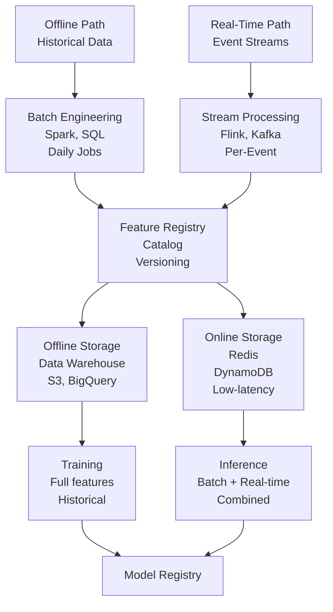
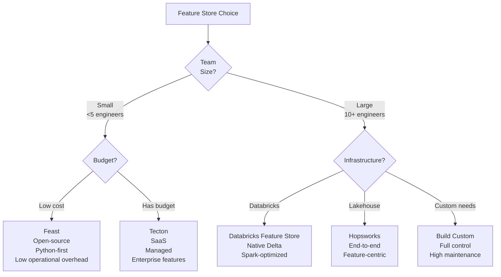
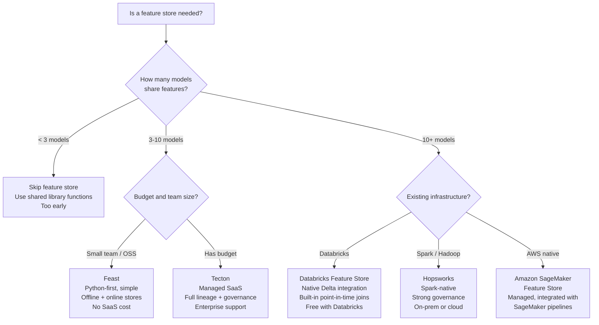

# Feature Stores: Serving Features at Production Scale

## Comprehensive Overview

Feature stores solve a fundamental problem in production ML: features are computed multiple times (for training, batch inference, real-time serving) in different places with different code, leading to training-serving skew, duplicated engineering effort, and operational complexity. A feature store is a centralized system that manages the full lifecycle of features—computation, versioning, storage, and serving—ensuring the same features are used consistently everywhere. This eliminates training-serving skew, reduces engineering overhead, and enables ML teams to move faster by reusing pre-computed features.

The business impact is dramatic. Netflix uses a feature store to serve 100s of features in real-time to recommendation models with <50ms latency. Uber computes drivers, riders, and ride features in a feature store, enabling dozens of ML models to share the same engineering work. The alternative—each team computing their own features—creates duplicated engineering, inconsistent definitions, and bugs when definitions diverge between training and serving.

Feature stores introduce new architectural decisions: batch vs real-time features, online vs offline storage, feature reuse across teams, and governance. Feast (open-source, Kubernetes-friendly), Tecton (enterprise-focused, end-to-end), and Hopsworks (data-centric, cloud-native) each offer different trade-offs. Feast is approachable for small teams; Tecton provides enterprise features; Hopsworks integrates with broader ML infrastructure. The wrong choice creates operational burden or limits scaling.

Modern feature stores operate across batch and real-time: batch features (user embeddings, historical aggregations) computed daily and stored in data warehouses; real-time features (session velocity, current context) computed on demand and cached in low-latency stores. Integration is the hard part—ensuring consistency, managing versioning, handling failures gracefully. Teams that get this right ship models faster and with fewer bugs. Teams that get it wrong rebuild features repeatedly in each service.

## How It Works

### Feature Store Architecture

```
Offline Data (Parquet, Warehouse)          Real-Time Data (Kafka, APIs)
    ↓                                            ↓
Feature Engineering (Spark, SQL)         Feature Computation (Flink, Python)
    ↓                                            ↓
Feature Registry (catalog, versioning)    Feature Registry (catalog, versioning)
    ↓                                            ↓
Offline Storage (Data Warehouse)          Online Storage (Redis, DynamoDB)
    ↓                                            ↓
Training Jobs ←────────────────────→ Serving APIs (low-latency fetch)
```



**Offline path:** Batch features for training and batch inference. High latency acceptable (hours), high throughput required.  
**Online path:** Real-time features for online inference. Low latency required (<10ms), moderate throughput.

### Feature Definition & Versioning

Features have owners, definitions, and versions:
```
Feature: user_7d_transaction_count
Owner: fraud_team
Definition: Count of user transactions in past 7 days
Source: transactions table
Freshness: daily (updated at 2am)
Version: v2 (v1 used different time window)
```

Multiple feature versions enable A/B testing (model trained on v1 vs v2) and gradual rollouts.

### Data Leakage Prevention

Feature stores enforce temporal correctness—training uses only data available before the label date, preventing data leakage.

```
Label Date: 2026-05-16 (fraud confirmed)
Training Features: data before 2026-05-16 (correct)
Test Features: data before 2026-05-16 (correct)
Common Mistake: using data after label date (leakage!)
```

## Tool Comparisons

| Tool | Approach | Strengths | Weaknesses | Best For |
|------|----------|-----------|-----------|----------|
| **Feast** | Open-source, Python-first | Simple to start, Kubernetes-friendly, good docs, active community | Limited enterprise features, scaling can be complex | Small teams, rapid prototyping, Kubernetes shops |
| **Tecton** | Enterprise SaaS | End-to-end solution, strong data lineage, feature discovery, governance | Vendor lock-in, expensive, requires SaaS adoption | Enterprise teams, regulated industries, compliance needs |
| **Hopsworks** | Data lakehouse approach | Strong governance, integrated ML pipeline, good for Spark teams | Can be overcomplex for simple use cases, pricey | Data-heavy teams, feature-rich ML systems |
| **Databricks Feature Store** | Built-in Delta Lake | Integrates with Delta Lake, strong SQL support, Spark native | Limited to Databricks ecosystem, newer product | Databricks shops, SQL-heavy workflows |
| **Custom Solution** | Build your own | Full control, no vendor lock-in, optimized for specific needs | High operational burden, ongoing maintenance required, inconsistency risk | Well-resourced teams, very specific requirements |

**Decision Framework:**



- **Small team, quick start:** Feast (open-source, simple)
- **Enterprise, compliance-heavy:** Tecton (governance, audit trails)
- **Data-centric team:** Hopsworks (strong governance, lineage)
- **Databricks shop:** Databricks Feature Store (native integration)
- **Custom needs:** Build custom (but consider maintenance cost)

## Interview Q&A

**Q: Design a feature store for Netflix that serves 100M users, with 10s of recommendation models, each needing 1000s of features. How would you architect it?**

A: Separate batch and real-time. Batch: daily job computes user embeddings (expensive, 1000-dim vectors), genre preferences, viewing history. Store in data warehouse (S3, BigQuery). Real-time: user session context (what they're currently watching), trending titles. Compute on-demand or cache in Redis. Serving: models fetch batch features from warehouse (10-50ms), real-time from Redis (<5ms). Registry: centralized catalog of all features, versioning, ownership. Governance: data lineage, access control, monitoring.

**Q: Your feature store is getting slower. Inference went from 50ms to 500ms. Debug the bottleneck.**

A: Profile the flow: (1) Batch feature fetch slow? Optimize queries, add caching layer. (2) Real-time feature compute slow? Optimize computation, increase compute resources. (3) Online storage slow? Switch to faster storage (Redis vs DynamoDB), increase throughput. (4) Integration slow? Remove unnecessary feature joins, batch fetch multiple features. (5) Data format slow? Use columnar format (Arrow vs JSON). Once identified, optimize that layer.

**Q: How do you prevent training-serving skew (model trains on v1 features, serves on v2 features)?**

A: Enforce versioning: (1) Feature registry tracks versions (v1, v2, v3). (2) Training job explicitly requests feature version (train on v1). (3) Serving explicitly requests same version (serve on v1). (4) Deprecation: when moving to v2, run both versions in parallel for A/B testing. (5) Monitoring: track feature version in serving, alert if mismatch.

**Q: Your feature store has 10K features. How do you manage governance and discover features?**

A: Feature discovery: (1) Centralized registry with search (by owner, tag, freshness). (2) Data lineage (feature depends on what upstream tables?). (3) Feature families (group related features). (4) Documentation (what does this feature mean?). Governance: (1) Ownership (who owns this feature?). (2) Access control (who can use this?). (3) SLA (when is data updated?). (4) Monitoring (is feature fresh? Valid?). (5) Deprecation process (how to retire old features?).

**Q: Compare batch vs real-time features. When would you use each?**

A: Batch: historical aggregations (user's 7-day spend), expensive computations (embeddings), high-latency acceptable (training, batch inference). Real-time: current context (session velocity), fresh signals (trending), low-latency required (online inference). Use both—batch for stability, real-time for freshness. Hybrid approach: combine batch (user embeddings, static features) with real-time (session context, dynamic features) at serving time.

**Q: How do you handle feature freshness in a feature store?**

A: Define SLAs (Service Level Agreements) per feature: user_7d_spend should be updated daily, trending_title within 1 hour. Implement monitoring: alert if feature stale (outdated). For batch features: scheduled jobs with alerts on failure. For real-time: stream processing with monitoring. Fallback: if fresh feature unavailable, use cached version (trade staleness for availability).

**Q: A model's accuracy dropped from 95% to 90%. Feature store is suspected. How do you debug?**

A: Investigate: (1) Did feature definitions change? (v1 vs v2). (2) Are features stale? (old values served). (3) Did data distribution shift? (feature values different than training). (4) Did upstream data break? (missing values). Use feature store's versioning and lineage tools: check what features were used in training vs serving. Rerun model with old features to isolate cause.

## Best Practices

1. **Start Simple:** Don't build feature store day one. Start with shared functions, graduate to feature store when duplication becomes painful (after 3-4 models).

2. **Version Everything:** Feature definitions change. Version them so you can rollback, A/B test, and track what each model used.

3. **Temporal Correctness:** Enforce that training uses only data available before label date. Automated checks prevent leakage.

4. **Monitoring & Alerts:** Monitor feature freshness, completeness, distribution. Alert on anomalies.

5. **Governance & Discovery:** Centralize feature registry with ownership, documentation, lineage. Enable teams to discover and reuse features.

6. **Separate Batch and Real-Time:** Different latency requirements, different storage. Don't force real-time features through batch pipeline.

7. **Cost Awareness:** Feature store can become expensive (storage, computation). Monitor cost per feature, retire unused features.

## Common Pitfalls

1. **Feature Leakage:** Using future data in training (data not available at label time). Automated temporal checks prevent this.

2. **Slow Real-Time Serving:** Real-time features taking too long breaks online inference SLAs. Profile and optimize.

3. **Training-Serving Skew:** Model trains on v1, serves on v2 features. Enforce versioning and testing.

4. **Feature Explosion:** 10K+ unused features accumulate, creating maintenance burden. Retire unused features regularly.

5. **No Governance:** Different teams define "user_active_days" differently. Centralized definitions and ownership prevent confusion.

6. **Over-Engineered:** Building enterprise feature store for small team is premature. Start simple, scale as needed.

## Real-World Examples

### Netflix: Feature Store for Recommendation

Netflix's feature store serves 100s of features to recommendation models:
- Batch: user embeddings (computed daily), genre preferences, viewing history
- Real-time: what user is currently watching, trending titles, session context
- Latency: batch features 50ms, real-time <10ms
- Scale: 10s of models, 1000s of features, 100M+ users

Result: reduced feature engineering time by 60%, enabled faster model iteration.

### Uber: Unified Features for Marketplace

Uber's feature store serves driver, rider, and ride features:
- Drivers: current location, acceptance rate, rating
- Riders: request frequency, rating, preferred pickup locations
- Rides: surge multiplier, estimated time, current traffic

Multiple models (matching, pricing, ETA) use same features, reducing engineering and ensuring consistency.

### Stripe: Fraud Detection Features

Stripe's feature store computes transaction and merchant features:
- Transaction: amount, merchant category, user history
- Merchant: typical transaction volume, fraud history
- User: account age, previous fraud flags

Real-time serving: fraud model scores transactions in <50ms using cached features.

## Sample Interview Questions

1. "Design a feature store for an e-commerce company with 1B users and 100 recommendation models. Walk me through architecture, governance, and scaling challenges."

2. "Your feature store has 10K features and serving latency is 1 second (should be <100ms). Debug and optimize."

3. "How would you detect and prevent training-serving skew in a feature store with 100 concurrent experiments?"

## Interview Case Study

**Scenario:** You're building a feature store for DoorDash.

**Context:** DoorDash has 100+ models (matching, pricing, delivery time, fraud detection). Each model computes overlapping features independently, leading to duplicated engineering and inconsistent definitions.

**Problem:** Feature engineering takes 40% of ML engineering time; models train on v1 features but serve on v2.

**Constraints:**
- 10M+ daily active users
- 1000s of restaurants
- Real-time inference (<100ms)
- Cost-sensitive (compute is expensive at scale)

**Expected Solution:**
1. Batch features (user/restaurant historical data) computed daily, stored in warehouse
2. Real-time features (current order context, traffic) computed on-demand, cached
3. Feature registry with versioning, ownership, governance
4. Separate online (Redis) and offline (warehouse) storage

**Strong vs Weak Answers:**

Strong: "I'd build batch and real-time paths. Batch—daily compute user/restaurant embeddings, historical aggregations; store in warehouse. Real-time—on-demand compute order context, traffic; cache in Redis. Registry with versioning prevents training-serving skew. Separate storage for different latency requirements. Governance ensures feature consistency across teams."

Weak: "I'd use Feast and Redis." (Which features? How to compute them? What about training-serving skew?)

## Common Answer Patterns

**Strong:** Separates batch (training) from real-time (serving), discusses versioning, mentions governance, addresses latency/cost trade-offs.

**Weak:** Names tools without explaining architecture, ignores training-serving skew, no mention of governance.

---

## Related Concepts

- **Concept 01:** Data Pipelines — Computing features at scale
- **Concept 03:** Data Validation — Ensuring feature quality
- **Concept 05:** Experiment Tracking — A/B testing features

## Resources

- Feast: https://feast.dev/
- Tecton: https://www.tecton.ai/
- Hopsworks: https://www.hopsworks.ai/
- Feature Store Summit: https://www.featurestore.org/

---

## Quick Reference Card

### 2-Minute Elevator Pitch
A feature store solves the "build it three times" problem in production ML: the same user feature gets computed independently by the fraud team, the recommendation team, and the search team — with slightly different logic each time, causing inconsistencies and wasted engineering effort. A feature store centralizes feature computation, versioning, and serving, ensuring the exact same feature values used in training are served at inference time. This eliminates training-serving skew, the most common source of unexplained model degradation.

### Numbers to Know
- Netflix: serves 100s of features to recommendation models at <50ms latency for 250M users
- Uber: reduced duplicate feature engineering by 60% after launching their Michelangelo feature store
- Training-serving skew is responsible for 15-30% of unexplained model degradation incidents (Google research)
- Batch features: acceptable staleness 1-24 hours; computed in warehouses, served from column stores
- Real-time features: freshness <1 second; computed by stream processors (Flink/Kafka), served from Redis
- Redis lookup latency: <2ms for cached feature vectors; DynamoDB: 5-10ms
- Feature store adoption threshold: typically justified when 3+ models share overlapping features or when training-serving skew incidents occur more than once per quarter

### Decision Framework: When and How to Build a Feature Store



---

## Strong vs Weak Answers

### Q: Design a feature store for Netflix serving 250M users with 100+ recommendation models, each requiring 1000+ features at <50ms latency.

**Weak Answer:** "I would use Feast with Redis for online serving and store batch features in S3. Features would be precomputed daily and loaded into Redis."

**Strong Answer:** "I'd design a dual-path architecture. The offline path runs nightly Spark jobs to compute expensive batch features: user embeddings (1024-dim, computed from 30 days of viewing history), content similarity vectors, and genre preference profiles. These are materialized into BigQuery (offline store) for training and into Redis (online store, hash keyed by user_id) for serving. The online path uses a Flink pipeline consuming a Kafka stream of real-time user events to compute session features: current browsing context, last 10 titles watched, time-of-day signal. These are written to Redis with 5-minute TTL. At inference time, the recommendation service fetches batch features from Redis (<2ms for preloaded vectors) and real-time features from Redis (<2ms). Combined latency: ~5ms for feature retrieval + ~20ms GPU inference = <30ms total, well within 50ms budget. The feature registry tracks all 1000+ features with owner, SLA, version, and data lineage. For 250M users × 1024-dim vectors × 4 bytes = ~1TB in Redis — we'd shard across 20 Redis clusters. Governance: each feature has a declared owner, freshness SLA, and deprecation timeline. Training-serving consistency is enforced by the registry's point-in-time join API, which uses the feature values that existed at label time."

---

### Q: Your feature store inference latency degraded from 50ms to 500ms over the past week. Debug the bottleneck.

**Weak Answer:** "I would look at the logs to see which step is slow and optimize that step."

**Strong Answer:** "I'd approach this systematically with three diagnostic layers. First, trace a single request end-to-end: add timing instrumentation at each stage (feature key lookup, Redis get, serialization, network). This immediately isolates whether it's Redis latency, serialization overhead, or network. Second, check infrastructure metrics: Redis hit rate (should be >95%; a drop indicates eviction or cache miss surge), Redis memory pressure (if over 80% capacity, eviction spikes latency 10x), and network throughput (if the Redis cluster is saturated, add read replicas). Third, check for behavioral changes: did the feature schema change (larger vectors = slower serialization)? Did a new feature with a slow computation path get added to the critical path? A common culprit is a new 'real-time' feature that's actually computed synchronously at serving time rather than pre-materialized — one such feature added 50ms per inference at Uber before they moved it to the batch path. Fix: separate expensive feature computation from the serving path; pre-materialize everything possible; only compute truly real-time signals (session context) online."

---

### Q: How do you enforce temporal correctness to prevent data leakage in a feature store?

**Weak Answer:** "I would make sure training data is from before the label date and not use future data."

**Strong Answer:** "Temporal correctness is the hardest problem in feature stores and the most common source of inflated evaluation metrics. The issue: when you create a training dataset, you need the feature values that existed at label time — not the current values. A feature store solves this with point-in-time joins. For each (entity, label_timestamp) pair in the training set, the feature store returns the feature value that was valid at label_timestamp — not the latest value. This requires storing features with effective timestamps, not just values. Feast implements this natively; custom systems often miss it. The test: train with point-in-time join, then retrain without it. If accuracy improves dramatically without it, you have leakage. At Stripe, a fraud model initially achieved 98% AUC — suspiciously high. Investigation revealed the feature store was serving today's merchant risk score (which incorporated the fraud outcome) rather than the merchant risk score that existed at transaction time. After fixing the point-in-time join, AUC dropped to 91% — the real number, and still industry-leading."

---

## System Design: Feature Store for a Ride-Sharing Platform

**Question:** "Design a feature store for Uber. The platform has 50+ ML models (matching, surge pricing, ETA, fraud, driver incentives) that share overlapping features about drivers, riders, and trips. The matching model needs features in <30ms; fraud scoring needs features in <50ms; ETA needs features in <100ms. 5M daily active drivers, 20M daily active riders."

**Walkthrough:**

1. **Categorize features by freshness requirement.** Three tiers: (a) static features (driver vehicle type, rider city) — updated weekly, served from DynamoDB; (b) batch features (driver 7-day acceptance rate, rider 30-day cancellation rate) — updated hourly, served from Redis; (c) real-time features (driver current location, rider session state, surge multiplier) — updated per-event, served from Redis with <30-second TTL.

2. **Offline store for training.** Use Delta Lake on S3 with partitioning by entity type and date. The offline store retains 2 years of feature history for training and backtesting. Point-in-time join API: `feature_store.get_historical_features(entity_df, feature_refs, join_type='point_in_time')`.

3. **Online store architecture.** Redis Cluster (20 shards) for hot features. Key structure: `{entity_type}:{entity_id}:{feature_name}` e.g., `driver:12345:acceptance_rate_7d`. Hash fields store all features for an entity in one Redis hash, enabling O(1) multi-feature lookups. Target: <5ms for full feature vector retrieval.

4. **Stream processing pipeline.** Flink consumes Kafka topics (driver_events, rider_events, trip_events) and computes sliding window aggregations. Example: `COUNT(trips) OVER WINDOW 7 DAYS GROUP BY driver_id` — materialized every 5 minutes. Flink writes to both Redis (online) and Delta Lake (offline) with the same transformation code, guaranteeing training-serving consistency.

5. **Feature registry.** Central catalog with: feature name, entity type, owner team, computation logic (SQL or Flink code), SLA (how fresh?), version, downstream models using it. Search by owner, entity, or tag. Prevents duplicate feature creation.

6. **Versioning and training-serving consistency.** Each feature definition has a version. When the matching team changes `driver_acceptance_rate_7d` to use a different window, they create v2. Existing models pin to v1 until they explicitly migrate. The registry enforces: a model in production must declare its feature versions explicitly; any change requires a new version and migration plan.

7. **Feature serving API.** gRPC endpoint: `GetFeatures(entity_ids: List[str], feature_names: List[str]) → FeatureVector`. The API fans out to Redis for online features and falls back to DynamoDB if Redis misses. Response time: <10ms p99 for batch feature lookups.

8. **Monitoring and alerting.** Per-feature metrics: freshness (when was this last updated?), null rate (are values populated?), distribution drift (has value distribution shifted vs. baseline?). Alert: pagerduty if any model-critical feature is stale >2x its SLA.

9. **Cost optimization.** Features not used by any model for 90 days are archived from Redis (evicted) but retained in Delta Lake. This reclaims ~30% of Redis memory at large scale. A monthly "feature cleanup" process notifies owners of unused features.

10. **Multi-tenancy and access control.** Each team owns their feature namespace. The fraud team's features are readable by fraud models only; matching features are shared. Access controlled at the feature registry level — unauthorized models cannot materialize restricted features.

**Key decisions:**
- Redis over DynamoDB for hot features: 2ms vs 10ms latency matters at 50M requests/day
- Flink over Spark for real-time features: Spark Structured Streaming has 30-60s micro-batch latency; Flink achieves <5s event-time latency
- Point-in-time joins non-negotiable: without them, training accuracy is inflated and production performance surprises are inevitable
