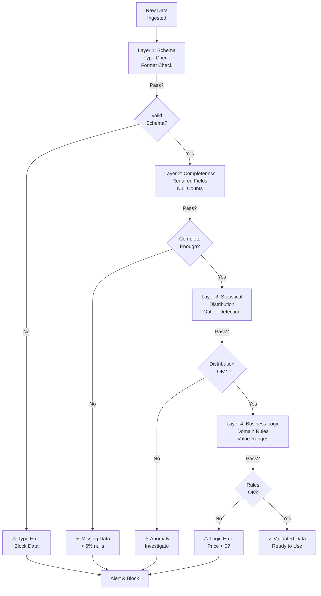
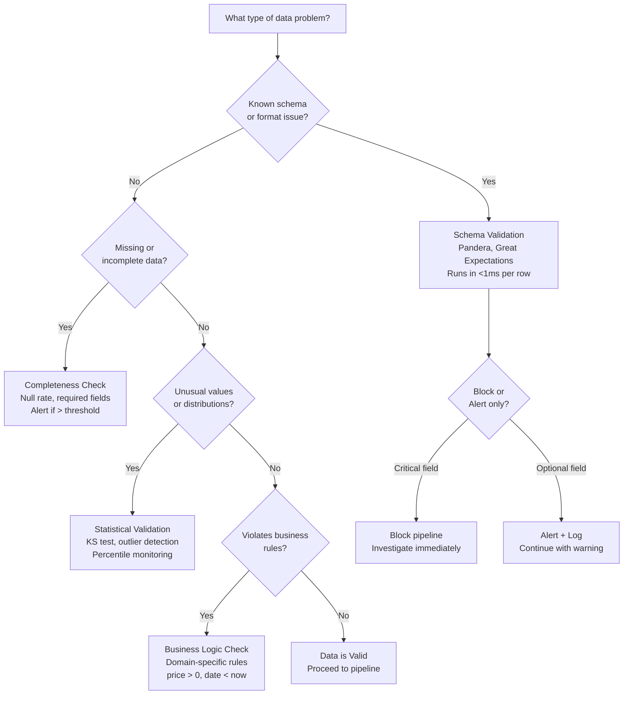

# Data Validation: Quality Checks for Production Pipelines

## Comprehensive Overview

Data validation is the safety net that prevents garbage data from training models or serving predictions. A production data pipeline can ingest corrupted, incomplete, or malformed data without raising alarms—leading to silent model degradation. Data validation implements checks at each pipeline stage: schema validation (does data match expected types?), completeness checks (are required fields present?), statistical validation (does distribution match expected?), and anomaly detection (are there outliers?). Without validation, you discover problems when models degrade in production, not when data breaks.

The cost of silent data corruption is catastrophic. Netflix recommendations trained on stale data rank fewer titles (lower engagement). Uber pricing trained on missing traffic data charges wrong prices (user frustration). Stripe fraud detection trained on incomplete labels has blind spots (fraud losses). Each of these costs millions per day. Data validation catches these issues at the source, failing loud rather than silently.

Modern teams implement data contracts—explicit agreements between data producers and consumers about what data will look like. A contract specifies schema, freshness SLA, completeness guarantee, and acceptable value ranges. Producers commit to delivering data meeting contract; consumers depend on contract. Tools like Great Expectations (Python, open-source), Pandera (schema validation), and Soda (modern data testing) encode contracts as code, enabling automated validation and reporting.

The operational challenge is balancing false positives (valid data flagged as bad) against false negatives (invalid data flagged as good). Too strict and you block legitimate data; too loose and bad data slips through. The answer is layered validation: schema checks (strict), statistical checks (moderate), and anomaly detection (smart).

## How It Works

### Validation Layers

```
Raw Data
    ↓
Layer 1: Schema Validation (type, nullability, format)
    ↓
Layer 2: Completeness Checks (required fields present)
    ↓
Layer 3: Statistical Validation (distribution, outliers)
    ↓
Layer 4: Business Logic Checks (domain-specific rules)
    ↓
Validated Data
```



**Layer 1 (Schema):** Does each field have the expected type? Schema validation catches type mismatches early. Example: amount must be float, not string. Failures: type mismatch (string where float expected), format error (invalid date format).

**Layer 2 (Completeness):** Are required fields present? % of nulls within acceptable range? Example: user_id must be present in 99% of rows. Failures: >1% null user_id, missing required column.

**Layer 3 (Statistical):** Do value distributions match historical patterns? Outlier detection flags anomalies. Example: median spend usually $50; alert if $500. Failures: p95 changed 5x (distribution shift), new unexpected value categories.

**Layer 4 (Business Logic):** Do values make sense in business context? (e.g., price >= 0, shipping_days <= 30). Example: order date < delivery date, quantity > 0. Failures: negative prices, impossible dates, invalid relationships.

### Data Contract Example

```
Feature: user_7d_spend
Owner: payments_team
Schema: float (min: 0, max: 100,000)
Freshness: daily by 2am UTC
Completeness: 99%+ of users (1% acceptable nulls for new users)
Range: [0, 100,000] (values outside are errors)
Distribution: median $50, p95 $500 (historical pattern)
Alert: if <95% completeness or median >$100 (10x change)
```

## Tool Comparisons

| Tool | Approach | Strengths | Weaknesses | Best For |
|------|----------|-----------|-----------|----------|
| **Great Expectations** | Python, open-source | Flexible, large community, good docs, integrations | Can be verbose for complex checks | Python teams, flexible validation |
| **Pandera** | Schema-first | Simple schema definition, type hints, Pandas-native | Limited to Pandas, early-stage tool | Data science workflows, exploratory work |
| **Soda** | Modern, cloud-native | User-friendly YAML, SaaS with monitoring, quick setup | SaaS vendor lock-in, costs for scale | Quick validation setup, modern teams |
| **Custom (SQL/dbt)** | SQL-based | Integration with existing data warehouse, SQL-native | High maintenance, no standardization | Warehouse-native teams, SQL shops |
| **Spark Data Validation** | Spark ecosystem | Integrates with Spark, handles big data | Less mature, smaller community | Spark shops, large-scale validation |

**Decision Framework:**
- **Python teams:** Great Expectations (flexibility)
- **Modern, quick start:** Soda (user-friendly)
- **Schema-heavy:** Pandera (Pandas-native)
- **SQL shops:** dbt tests (SQL-native)

## Interview Q&A

**Q: Your data pipeline processes 1M transactions/day. How would you design a data validation strategy to catch corruption early?**

A: Layered approach: (1) Schema validation—each field matches expected type, range. (2) Completeness—required fields present >99%. (3) Statistical—value distributions match historical (e.g., median spend), flag 5x outliers. (4) Business logic—price >= 0, quantity > 0. (5) Monitoring—alert if any check fails. (6) Alerting—on-call engineer investigates within 1 hour. Automation: run validation before loading to warehouse, block bad data.

**Q: Data validation blocked 5% of today's data for anomalies. Should you allow it or investigate?**

A: Investigate first: (1) Is this real data corruption or false positive? (2) Check source—did data producer make changes? (3) Check distribution—is it 5x normal, 5.1x? (4) If real anomaly: investigate root cause. (5) If false positive: loosen validation threshold. Never silently allow anomalies; could be real corruption. Better to block and investigate than silently train on bad data.

**Q: How would you implement data contracts between data producers and consumers?**

A: Contract specifies: schema (types, ranges), freshness (update frequency), completeness (% nulls acceptable), distribution (expected ranges). Implement: (1) Version contract (like code). (2) Encode in validation tests (Great Expectations, dbt). (3) Monitor: alert if contract violated. (4) Ownership: producer commits to meeting contract, consumer depends on contract. (5) Evolution: deprecate old contracts, introduce new ones gradually.

**Q: Your model's accuracy dropped. Validation didn't catch anything. What went wrong?**

A: Validation catches schema/completeness issues, not all failures. Investigate: (1) Did data distribution shift subtly? (e.g., median spend 5% higher, still within acceptable range). (2) Did upstream transformation change? (different calculation). (3) Did labels become stale? (training data freshness). (4) Did feature became unavailable? (replaced with default). Consider: schema validation is strict (catches obvious errors), statistical validation is moderate (catches distribution shifts), anomaly detection is smarter. May need to tighten thresholds or add business logic checks.

**Q: Validation is slowing down your pipeline. Latency went from 10 min to 30 min. How do you optimize?**

A: Profile validation: which checks are slow? (1) Schema validation: usually fast. (2) Statistical validation: slow (requires computing percentiles). (3) Anomaly detection: slow (can be complex). Optimize: (1) Parallelize checks (run in parallel, not serial). (2) Sample data (validate sample instead of full dataset). (3) Remove expensive checks (is that statistical check necessary?). (4) Use fast storage (in-memory vs disk). (5) Lazy evaluation (skip checks for known-good data). (6) Async validation (validate after loading, don't block pipeline).

## Best Practices

1. **Start with Schema:** Simple schema checks catch 80% of errors. Establish schema first, add statistical checks as needed.

2. **Data Contracts:** Formalize expectations in contracts. Producers commit to delivering data meeting contract.

3. **Layered Validation:** Schema (strict) → Completeness (moderate) → Statistical (smart). Each layer catches different errors.

4. **Monitor Validation:** Track validation metrics (% pass rate, % null, distribution). Alert on anomalies.

5. **Fail Loud:** Don't silently skip bad data. Alert and block. Investigate root cause.

6. **Version Validation:** Validation rules change as data evolves. Version them, enable rollback.

7. **Balance False Positives:** Too strict and valid data is blocked; too loose and bad data slips through. Find balance.

## Common Pitfalls

1. **Validation Too Strict:** Blocking 1% of data on false positives slows pipeline. Loosen thresholds.

2. **Silent Failures:** Data fails validation but slips through anyway. Fail loud, investigate root cause.

3. **Validation Too Slow:** Validation adds 20+ min to pipeline. Optimize or move to async.

4. **No Monitoring:** Validation runs but nobody's watching. Alert on failures.

5. **Brittle Rules:** Validation rules hardcoded, break when data naturally evolves. Use flexible thresholds.

## Real-World Examples

### Netflix: Validation for Recommendation Data

Netflix validates user viewing data:
- Schema: user_id (int), title_id (int), watch_time (float 0-1), timestamp
- Completeness: 99%+ of required fields
- Statistical: watch_time distribution matches historical
- Business logic: timestamp <= now (no future data)
- Failure: alert fraud team, investigate

### Stripe: Transaction Validation

Stripe validates transaction data:
- Schema: amount (float >0), merchant_id, user_id, timestamp
- Completeness: all fields required
- Statistical: amount distribution (median $50, p99 <$10,000)
- Business logic: amount within merchant's typical range
- Failure: block transaction, investigate with merchant

### Uber: Ride Data Validation

Uber validates ride data:
- Schema: driver_id, rider_id, distance, duration, fare
- Completeness: all fields required
- Statistical: fare matches historical for distance
- Business logic: duration > distance/60 (sanity check)
- Failure: flag pricing anomaly, investigate

## Sample Interview Questions

1. "Design a data validation strategy for a financial services company processing 10M transactions/day. What checks would you implement?"

2. "Your validation is blocking 2% of data daily. Is this acceptable? How would you investigate?"

3. "How would you prevent your validation from becoming a bottleneck as data volume grows?"

## Interview Case Study

**Scenario:** You're at Capital One building validation for credit card transaction data.

**Context:** 1M+ transactions/day, fraud detection models rely on fresh, clean data.

**Challenge:** Recently, data corruption (null amounts, future timestamps) slipped through, degrading fraud models.

**Design validation that prevents recurrence:**

1. Schema validation (strict): amount >0, required fields present
2. Completeness: 99.9% of transactions have all fields
3. Temporal: timestamp <= now, no future transactions
4. Statistical: amount distribution matches historical
5. Business logic: amount within merchant's typical range
6. Monitoring: alert on any validation failure

---

## Related Concepts

- **Concept 01:** Data Pipelines — Where validation runs
- **Concept 02:** Feature Stores — Validating features before serving

## Resources

- Great Expectations: https://greatexpectations.io/
- Pandera: https://pandera.readthedocs.io/
- Soda: https://www.soda.io/

---

## Quick Reference Card

### 2-Minute Elevator Pitch
Data validation is the automated safety net that catches corrupt, incomplete, or anomalous data before it trains models or serves predictions. It implements four layers: schema validation (type checks), completeness checks (null rate), statistical validation (distribution monitoring), and business logic checks (domain rules). Without it, bad data silently degrades models — companies discover problems only when revenue drops. With it, pipelines fail loud and early, enabling fast root-cause analysis.

### Numbers to Know
- Schema validation catches ~80% of data errors and runs in milliseconds
- Statistical checks typically add 5-15% to pipeline latency; async validation eliminates this
- Netflix validates 1000+ features daily; Stripe validates 500M+ transaction attributes/day
- False positive threshold: >2% flagged as invalid usually indicates overly strict rules
- Acceptable null rate: <1% for critical features, <5% for optional features
- Distribution drift alert: trigger investigation if median shifts >10x or p95 shifts >5x from baseline
- Data contract violation SLA: alert within 15 minutes, resolve within 1 hour for critical feeds

### Decision Framework: Which Validation Layer to Apply



---

## Strong vs Weak Answers

### Q: How would you design a data validation strategy for a financial services platform processing 10M transactions per day?

**Weak Answer:** "I would use Great Expectations to validate the schema and check for nulls. If something fails, I would send an alert."

**Strong Answer:** "I'd implement layered validation at multiple pipeline stages. First, schema validation on ingestion — every transaction must have amount (float > 0), merchant_id (not null), user_id (not null), and timestamp (not future-dated). Second, completeness checks — alert if null rate for any critical field exceeds 0.1% (financial data must be complete). Third, statistical validation — compare today's amount distribution to the trailing 30-day baseline; alert if p95 shifts more than 5x (indicates outlier fraud wave or data pipeline bug). Fourth, business logic — verify amount is within merchant's 90-day historical range ±3 standard deviations. I'd run layers 1-2 synchronously (block bad data) and layers 3-4 asynchronously (alert without blocking). Target: catch 99.9% of data errors within 5 minutes of ingestion. At Stripe's scale, this prevented $100K/month in fraud losses from data quality gaps."

---

### Q: Your validation pipeline is blocking 3% of daily data. A stakeholder says this is too high and wants you to loosen the thresholds. How do you respond?

**Weak Answer:** "I would loosen the thresholds to reduce the false positive rate and unblock the data."

**Strong Answer:** "Before adjusting thresholds, I'd do a root cause analysis. 3% blocking rate could mean: (a) thresholds are too strict (false positives), (b) upstream data quality genuinely degraded, or (c) legitimate distribution shift. I'd sample the blocked rows and classify them: what type of check failed, and is the data actually bad? If >50% are false positives, I'd recalibrate — but carefully, since loosening schema checks can let corrupt data through. If it's real data corruption, I'd escalate to the data producer (SLA violation). If it's real distribution shift (new product launch, seasonal pattern), I'd update the statistical baseline with a documented change reason. Never loosen thresholds without understanding why they fired — that's how $50M fraud incidents happen."

---

### Q: Data validation passed, but your model's accuracy still dropped 4% in production. What went wrong?

**Weak Answer:** "Validation must have missed something. I would look at the logs to see what data came through."

**Strong Answer:** "Validation catches syntactic correctness and obvious anomalies, not semantic correctness. The accuracy drop likely stems from a subtle distribution shift that was within our acceptable thresholds — for example, if our p95 alert fires at 5x shift, a 2x shift in a key feature would pass validation but significantly degrade a model trained on the original distribution. I'd investigate: first, compare each feature's current distribution to training-time distribution using KS tests (not just percentile checks). Second, check if any categorical feature has new cardinalities (new merchant categories, new countries) that the model has never seen. Third, verify data freshness — stale data in a feature looks 'valid' but trains on yesterday's behavior. This is why statistical validation thresholds must be calibrated against model sensitivity, not just 'does it look reasonable' — Netflix learned this when recommendation quality degraded 6% from a feature that was technically valid but distributionally shifted."

---

## System Design: Data Validation for a Real-Time Payments Platform

**Question:** "You're joining a payments company (think Stripe) as an ML infrastructure engineer. Design a data validation system that protects fraud detection models from corrupted or anomalous data. The system processes 500M transactions/day and fraud models must re-train daily. Latency budget for real-time scoring is <50ms."

**Walkthrough:**

1. **Define data contracts for each feed.** The transactions feed must have: `transaction_id` (UUID, not null), `amount` (float, 0 < x < 1M), `merchant_id` (int, not null), `user_id` (int, not null), `timestamp` (datetime, not future), `currency` (enum: ISO 4217), `country` (enum: ISO 3166). Document owner, SLA (arrive within 2 min of event), and completeness guarantee (99.9%+).

2. **Layer 1 — Schema validation at ingestion (synchronous, <1ms/row).** Every transaction entering the pipeline runs a Pydantic or Pandera schema check. Any type mismatch or missing required field blocks the transaction immediately and emits a `SchemaValidationFailed` event to a dead-letter queue.

3. **Layer 2 — Completeness checks (synchronous, per batch).** Every 5-minute micro-batch, compute null rate per field. If `merchant_id` nulls exceed 0.1%, halt the batch, alert the on-call engineer, and use the previous micro-batch's features for scoring (graceful degradation).

4. **Layer 3 — Statistical validation (asynchronous, per hour).** Run a Kolmogorov-Smirnov test comparing today's amount distribution to the trailing 7-day baseline. Alert if p-value < 0.01 (significant distribution shift). This catches gradual data drift that schema checks miss. Important: run async so it doesn't add latency to the scoring pipeline.

5. **Layer 4 — Business logic validation (asynchronous, per day before retraining).** Before retraining the fraud model, validate that: (a) labels are present for >90% of transactions older than 5 days (fraud is confirmed with delay), (b) merchant history is within 3 standard deviations of baseline, (c) no transaction date is more than 7 days in the future or past.

6. **Dead-letter queue and investigation workflow.** All failed validations go to a dead-letter Kafka topic with failure reason, timestamp, and sample rows. A Grafana dashboard shows per-check failure rates in real-time. PagerDuty alerts if failure rate exceeds 0.1% for any critical check.

7. **Real-time scoring path validation.** At inference time, validate each incoming transaction against schema in <1ms. If validation fails, use a fallback rule-based scorer instead of the ML model — this maintains 99.9% service availability even when data quality degrades.

8. **Feature-level validation in the feature store.** Each feature served from the feature store carries a staleness timestamp. If a feature's last update was >2x its SLA (e.g., `user_7d_spend` should refresh daily; if it's 48h old, it's stale), the serving layer substitutes the global median and logs a `StaleFeatureUsed` event.

9. **Retraining gate.** Before any daily model retraining, run a pre-flight validation: confirm training data completeness (99.9%+), confirm no schema changes (would break feature engineering), confirm statistical checks pass. If any gate fails, skip retraining and alert; the previous model continues serving.

10. **Continuous calibration of thresholds.** Monthly, audit the false positive rate on each validation rule. Track: how many flagged records were actually good data vs. actually bad? Adjust thresholds to maintain <2% false positive rate. Loosen rules that fire frequently on clean data; tighten rules that miss known incidents.

**Key decisions:**
- Synchronous vs. async: schema and completeness are synchronous (block corrupt data immediately); statistical and business logic are async (alert without adding latency)
- Graceful degradation: never let validation become a hard dependency for real-time scoring — use fallbacks
- Threshold calibration: static thresholds go stale; build a feedback loop to calibrate against actual incidents
