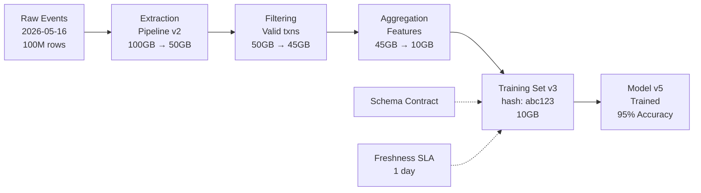
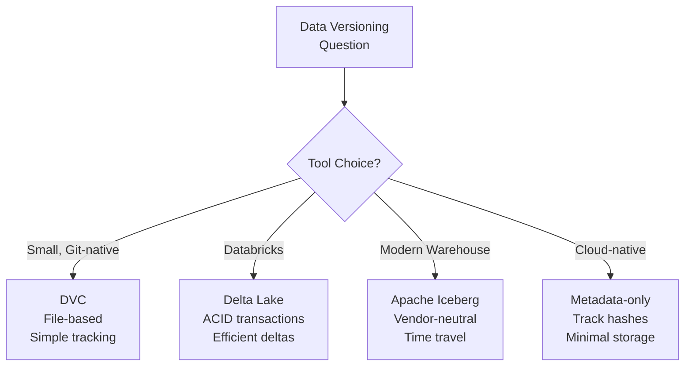
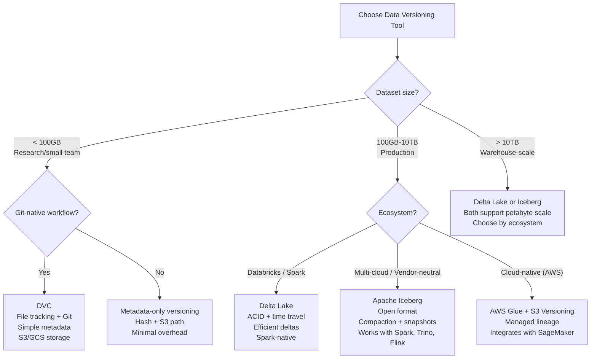

# Data Versioning: Reproducibility and Lineage for ML

## Comprehensive Overview

Data versioning enables reproducibility in ML—the ability to reconstruct training data and results from months ago. Without versioning, you cannot answer: "What data trained this model? Can I retrain it with the same data? Which data version caused model degradation?" Data versioning tracks datasets, their lineage (what upstream tables created this dataset), and metadata (size, hash, creation time). Tools like DVC (Data Version Control), Delta Lake, and Apache Iceberg provide version control for data.

The cost of missing data versioning is real. A model trained 3 months ago on v3 of a dataset achieves 95% accuracy. Today, with v5 of the same dataset, accuracy dropped to 90%. Without versioning, you cannot diagnose: Did data change? Was training code updated? Was validation logic changed? You're left guessing. With versioning, you can roll back to v3, confirm accuracy returns to 95%, then systematically identify what changed between v3-v5.

Data versioning differs from software version control. Code versioning tracks character-level changes; data versioning tracks content-level changes (hashes, schemas, row counts). A CSV file changes when one cell updates—tracking that at file level is impractical. Data versioning tracks logical versions of datasets (v1, v2, v3) not file changes.

The operational challenge is managing storage—versioning all data variants can consume 10x storage. Solutions: compress data, store only deltas (changes), use immutable data structures (Delta Lake, Iceberg), and automate cleanup of old versions. Cost-conscious teams version training datasets but not intermediate computations.

## How It Works

### Data Versioning Approaches

**Approach 1: File-Based Versioning (DVC)**
```
data/
├── training_set_v1.csv (100MB)
├── training_set_v2.csv (105MB)  # 5MB change
└── training_set_v3.csv (110MB)  # 5MB more changes
```
Simple but storage-inefficient (store whole files, not deltas).

**Approach 2: Delta Lake / Iceberg**
```
training_set/
├── _v1/  # Version 1 (hashed for dedup)
├── _v2/  # Version 2 (stores only deltas from v1)
└── _v3/  # Version 3 (stores only deltas from v2)
```
More efficient (stores deltas, enables rollback).

**Approach 3: Metadata-Only Versioning**
```
training_set_v1: hash=abc123, rows=1M, size=100MB, created=2026-01-01
training_set_v2: hash=def456, rows=1.05M, size=105MB, created=2026-02-01
training_set_v3: hash=ghi789, rows=1.1M, size=110MB, created=2026-03-01
```
Just track metadata; actual data immutable in object storage (S3).

### Data Lineage Tracking

Versioning includes lineage—understanding what created each dataset:

```
raw_events (2026-05-16) → data_pipeline_v2 → training_set_v3 → model_v5
                           ↓
                           (depends on)
                           source_db (extraction)
```



Lineage enables:
- **Upstream tracking:** If source_db broke, which downstream datasets affected?
- **Reproducibility:** Given dataset v3, which pipeline/code created it?
- **Debugging:** Model accuracy dropped; which upstream datasets changed?
- **Recomputation:** If pipeline bug found, recompute dependent datasets



## Tool Comparisons

| Tool | Approach | Strengths | Weaknesses | Best For |
|------|----------|-----------|-----------|----------|
| **DVC** | File-based versioning | Simple to start, integrates with Git, open-source | Storage-inefficient (stores full files), not for huge data | Small datasets, research teams, Git-native workflows |
| **Delta Lake** | Immutable ACID | ACID transactions, efficient storage (stores deltas), time-travel queries | Requires Delta format, ecosystem specific | Databricks shops, large data, production systems |
| **Apache Iceberg** | Open table format | Vendor-neutral, efficient, strong tooling support | Newer tool, smaller ecosystem than Delta | Modern data warehouses, multi-cloud setups |
| **Metadata-Only (Custom)** | Track hashes/metadata | Minimal storage overhead, simple to implement | Requires discipline, manual tracking | Cost-conscious teams, cloud-native (S3) |

**Decision Framework:**
- **Small team, Git-native:** DVC (simplicity)
- **Databricks ecosystem:** Delta Lake (native support)
- **Modern warehouse:** Iceberg (vendor-neutral)
- **Cost-sensitive, custom:** Metadata-only (requires discipline)

## Interview Q&A

**Q: Design a data versioning strategy for a company that trains models monthly on 1TB of training data. How would you manage versions and costs?**

A: Store metadata (hash, row count, creation time) in a registry, actual data immutable in S3. For each month's training: compute hash of training data, store in registry with S3 path, model metadata. This enables reproducibility without duplicating 1TB. To retrain old model: look up hash in registry, fetch same data from S3. Storage: only store current + 2 previous versions (costs $3K/month for 3TB). Lineage: track which raw datasets, pipelines, and transformations created training set.

**Q: A model trained 3 months ago achieved 95% accuracy. Today, using same training code, it's 90%. Data or code changed?**

A: First, separate concerns: (1) Retrain on original data with original code. If accuracy is 95%, data is the issue. (2) If accuracy is 90%, code or config changed. With data versioning: (1) Lookup training dataset v3 (from 3 months ago). (2) Fetch that exact data (via hash). (3) Retrain with same code. (4) If accuracy 95%, data changed between v3 and v6. (5) Compare schemas, row counts, distributions to find change.

**Q: How do you prevent your data versioning system from consuming too much storage?**

A: Policies: (1) Retention: keep current + 2 previous versions, delete older. (2) Compression: compress versions (Parquet > CSV, 10x reduction). (3) Deduplication: if two datasets have identical rows, store once with pointers. (4) Immutability: use immutable formats (Delta, Iceberg) that store deltas not full copies. (5) Selective versioning: version final training datasets, not intermediate computations. (6) Automated cleanup: cron job deletes versions older than X days.

**Q: A model's predictions changed even though code and data didn't. What could have changed?**

A: Data versioning only tracks data, not: (1) Model weights (reinitialization, seed changes). (2) Library versions (PyTorch 1.10 vs 1.11 can change outputs). (3) Hyperparameters (learning rate, batch size). (4) Hardware (GPU rounding differences). To prevent: (1) Version everything: data, code, model weights, config, dependencies. (2) Reproduce: given version X, can you get identical results? (3) Document: what versions were used for this model?

**Q: How would you implement data lineage tracking for 100 interdependent datasets?**

A: Build a lineage graph: nodes = datasets, edges = transformations. Metadata per dataset: (1) Creator: which pipeline/job created this? (2) Inputs: what datasets fed this? (3) Timestamp: when created? (4) Hash: content hash. Tools: (1) Capture lineage in pipeline code (record inputs → outputs). (2) Store in metadata store (graph database or custom). (3) Query: given dataset X, what are dependencies? (4) Recompute: if upstream changed, which datasets need recomputation?

## Best Practices

1. **Version Final Artifacts:** Version training datasets, models, evaluation sets. Don't version all intermediate computations (too much storage).

2. **Immutable Storage:** Use immutable data structures (Delta, Iceberg) or immutable cloud storage (S3 with versioning disabled, append-only).

3. **Track Metadata:** For each version: hash (content), row count, schema, creation time, creator. Use for debugging and diagnostics.

4. **Lineage Tracking:** Know what data created this dataset. Enable debugging and cascading recomputation.

5. **Retention Policies:** Delete old versions (except critical ones). Prevents storage costs from exploding.

6. **Version Everything:** Data alone isn't enough. Version code, config, library versions, model weights.

7. **Reproducibility Checks:** Periodically verify: given version X, can you recreate identical results? If not, something's versioning-unfriendly.

## Common Pitfalls

1. **Storage Explosion:** Versioning all datasets 10x storage costs. Implement retention policies, compression, deduplication.

2. **Incomplete Versioning:** Versioning data but not code or config. Can't reproduce results. Version everything.

3. **No Lineage:** Versioned datasets but no lineage tracking. When upstream changes, you don't know which datasets are affected.

4. **Lost Metadata:** Versioning files but not metadata (hash, schema, row count). Can't diagnose what changed.

5. **Complex Rollback:** If versioning doesn't support easy rollback, it's not useful. Design for quick rollback to any version.

## Real-World Examples

### Netflix: Versioning Recommendation Data

Netflix versions monthly training datasets:
- Version: dataset_v1 (2026-01-01), dataset_v2 (2026-02-01), etc.
- Metadata: 50M rows, 500GB, hash=abc123
- Lineage: sources = [user_events, content_metadata]
- Lineage: consumers = [recommendation_model_v5, ranking_model_v2]

When model accuracy drops: retrain on dataset_v1, if accuracy returns to baseline, investigate what changed in v2.

### Uber: Versioning ETA Training Data

Uber versions weekly ETA training data:
- Schema: origin, destination, time_of_day, distance, eta_minutes
- Row count: 1M+ per week
- Versioning: keep current week + 4 previous (1 month history)
- Lineage: sources = [ride_events, traffic_data]

When ETA accuracy drops: revert to previous week's data, retrain, check if accuracy recovers.

### Stripe: Versioning Fraud Detection Data

Stripe versions daily fraud labels and features:
- Daily training data: confirmed fraud labels, transaction features
- Versioning: keep daily for 30 days, then monthly snapshots
- Lineage: sources = [raw_transactions, fraud_labels]
- Tracking: which version trained which model

When fraud detection accuracy drops: identify which version caused regression, rollback model to previous.

## Sample Interview Questions

1. "Design a data versioning system for a company with 1TB+ of training data, trained weekly. How would you manage storage and reproducibility?"

2. "Your model trained 3 months ago achieved 95% accuracy. Today, retraining on 'same data' achieves 90%. How do you debug?"

3. "How would you implement data lineage tracking across 100 interdependent datasets?"

## Interview Case Study

**Scenario:** You're at Booking.com building data versioning for hotel search ranking models.

**Challenge:** Training datasets change daily (new hotels, updated ratings). Old models need retraining. Can't debug model performance changes without knowing exact training data.

**Design versioning system:**

1. **Versioning:** Daily training datasets hashed and stored with metadata (row count, schema)
2. **Retention:** Keep current + 30 days history (60GB/day × 30 = 1.8TB)
3. **Lineage:** Track: raw hotel data → feature engineering → training set → model
4. **Reproduction:** Given training set v10, retrain and get identical results
5. **Debugging:** Model accuracy dropped → identify version change → retrain on old version → confirm accuracy

---

## Related Concepts

- **Concept 01:** Data Pipelines — Creating versioned datasets
- **Concept 05:** Experiment Tracking — Linking experiments to data versions
- **Concept 06:** Model Versioning — Linking models to data versions

## Resources

- DVC: https://dvc.org/
- Delta Lake: https://delta.io/
- Apache Iceberg: https://iceberg.apache.org/
- MLflow Data: https://www.mlflow.org/

---

## Quick Reference Card

### 2-Minute Elevator Pitch
Data versioning enables reproducibility in ML by tracking which exact dataset trained each model. Without it, a model degradation is a black box — you can't tell if data changed, code changed, or the world changed. With it, you reconstruct any historical training set in minutes, run controlled experiments (retrain v3 vs v5), and diagnose degradation by binary search across versions. The key insight: datasets are not files, they are logical entities with lineage, schema, and content-addressable identity (hash).

### Numbers to Know
- DVC overhead: metadata file is ~1KB per versioned dataset regardless of dataset size
- Delta Lake: stores only deltas (changes), typically 5-10x more storage-efficient than full copies
- Retention cost: 1TB training data at 3 copies = ~$70/month on S3; versioning adds 20-30% storage overhead with delta storage
- Netflix: versions 50M-row recommendation datasets daily; lineage graph has 200+ nodes
- Acceptable reproduction tolerance: <0.1% accuracy difference between original and reproduced result
- Time-travel queries on Delta Lake/Iceberg: retrieve any snapshot from the last 30 days in <10 seconds
- Storage recommendation: keep current + 2 previous major versions (90 days); archive older to S3 Glacier

### Decision Framework: Which Data Versioning Tool to Use



---

## Strong vs Weak Answers

### Q: A model trained 3 months ago achieved 95% accuracy. The same code run today achieves 90%. How do you debug this with data versioning?

**Weak Answer:** "I would compare the training data from 3 months ago to today's data and see what changed."

**Strong Answer:** "With proper data versioning, this is a systematic binary search. First, I'd identify the training dataset version used 3 months ago from the model registry — it should have a `dataset_hash` and `dataset_version` linked to the model artifact. Second, I'd retrain on that exact snapshot using DVC or Delta Lake's time-travel query. If accuracy returns to 95%, data is the culprit. If it stays at 90%, it's code or environment. Third, if data is the issue, I'd identify the version where accuracy first dropped by binary search — retrain on v3, v4, v5 (2-3 GPU hours each) to isolate the breaking change. Fourth, compare schema, row counts, and statistical distributions between the last 'good' version and the first 'bad' version. Common culprits: a new data source added that introduced label noise, a feature definition change that silently altered semantics, or a temporal leak introduced by a pipeline change. Netflix debugged a 4% recommendation accuracy drop this way — traced to a feature store update that changed how viewing history was computed."

---

### Q: How do you prevent data versioning from consuming 10x storage as data grows?

**Weak Answer:** "I would use Delta Lake which stores deltas instead of full copies, so it uses less storage."

**Strong Answer:** "Storage efficiency requires three practices working together. First, use delta storage (Delta Lake or Iceberg) which stores row-level changes rather than full dataset copies — a dataset that changes 5% daily needs 5% incremental storage, not 100%. Second, implement retention policies: for production models, keep current + 2 previous versions hot (fast access), archive everything older than 90 days to S3 Glacier (80% cost reduction). Only keep critical milestone versions permanently — the dataset that trained the best model ever, or a regulatory compliance baseline. Third, compress aggressively: Parquet with Snappy compression reduces CSV storage 10-20x with no information loss. Uber's ETA training pipeline went from 500GB/week to 45GB/week by switching to Parquet + delta versioning + 30-day retention. The principle: version the artifact hash and metadata always; store the full data only when needed."

---

### Q: How do you implement data lineage tracking for 100 interdependent datasets?

**Weak Answer:** "I would document each dataset's dependencies in a wiki or README file."

**Strong Answer:** "Manual documentation is a maintenance trap — it's always stale. I'd build lineage tracking directly into the pipeline code as a first-class concern. Each pipeline job records: input dataset hashes and versions, transformation code commit (git hash), output dataset hash and version, creation timestamp, and creator job ID. This gets stored in a lineage metadata store — a simple graph database (or even a JSON file per dataset) where nodes are datasets and edges are transformations. The key value: when source data changes or a pipeline bug is found, you can immediately query 'which downstream datasets are affected?' and trigger targeted recomputation. At Google, lineage tracking enabled engineers to invalidate and recompute only the 12 datasets downstream of a buggy pipeline stage, rather than recomputing all 100+. For 100 datasets, I'd use Apache Atlas or build a lightweight custom graph using Neo4j — the graph structure makes ancestor/descendant queries trivial."

---

## System Design: Data Versioning for a Monthly Retraining Pipeline

**Question:** "You're building the data infrastructure at a hedge fund that retrains trading signal models monthly on 5 years of financial data (~2TB). Models must be exactly reproducible for regulatory audit (SEC requires being able to reproduce any prediction from the last 7 years). Design the data versioning system."

**Walkthrough:**

1. **Choose the versioning approach.** For 2TB with regulatory requirements, use Apache Iceberg on AWS S3. Iceberg provides: (a) immutable snapshots with content-addressable hashes, (b) time-travel queries to any historical snapshot, (c) vendor-neutral format readable by any query engine, (d) built-in retention policies. Alternative (Delta Lake) would work too but creates Databricks dependency.

2. **Content-addressable dataset identity.** Each dataset version is identified by a SHA-256 hash of its content (file hashes) and schema. This hash is the immutable identifier stored in the model registry alongside the model weights. Given a hash, you can retrieve the exact training snapshot.

3. **Lineage graph.** Every transformation records its inputs and outputs in a lineage metadata store. Structure: `{output_hash: "abc123", inputs: [{hash: "def456", name: "raw_prices_v3"}, {hash: "ghi789", name: "earnings_v2"}], transform_code: "git:abc123def456", created: "2026-01-15T09:00:00Z"}`. Store this in DynamoDB or PostgreSQL as a directed acyclic graph.

4. **Model-dataset linkage.** The model registry entry for every deployed model includes: `dataset_version: "2026-01-15_hash=abc123"`, `dataset_lineage_root: "raw_prices_2021-2026"`. During SEC audit, present this entry and execute time-travel query to retrieve the exact snapshot.

5. **Retention policy: tiered storage.** Hot (current + 12 months): S3 Standard, instant access. Warm (1-3 years): S3 Infrequent Access, <1 min retrieval. Cold (3-7 years): S3 Glacier, 3-5 hour retrieval. Only the regulatory minimum (7 years) is kept; older data is deleted. Cost estimate: 2TB hot + 18TB warm + 36TB cold ≈ $1,200/month.

6. **Immutable storage guarantee.** Enable S3 Object Lock with Compliance mode (prevents deletion even by admins) on all versioned training datasets. This satisfies SEC's "data cannot be altered after the fact" requirement and is enforced at the storage layer without relying on application-level controls.

7. **Reproduction workflow.** When auditor requests: "Reproduce the June 2024 model predictions." Step 1: Look up model `june_2024_v2` in model registry → get `dataset_hash=abc123`. Step 2: Time-travel query: `SELECT * FROM training_data VERSION AS OF 'abc123'`. Step 3: Check out code: `git checkout def456`. Step 4: Spin up Docker container with pinned dependencies. Step 5: Run training, verify predictions match within floating-point tolerance (0.01%).

8. **Schema evolution tracking.** Financial data schemas change (new exchanges added, field renames). Every schema version is stored with its activation date in the lineage graph. The reproduction workflow automatically selects the correct schema version for the target date.

9. **Automated validation before versioning.** Before creating a new dataset version, run automated checks: row count within 5% of previous version, schema matches contract, no future dates in timestamps. Failed validation prevents version creation — prevents accidentally versioning corrupt data.

10. **Data contract for each feed.** Each upstream data provider (Bloomberg, Quandl) has a formal contract: schema, freshness SLA, completeness guarantee. Versioning is triggered only after contract validation passes. Contract violations page the data engineering on-call immediately.

**Key decisions:**
- Iceberg over DVC: DVC is git-native but not designed for 2TB datasets or regulatory audit requirements; Iceberg's time-travel and immutable snapshots match the compliance use case exactly
- Immutable storage (S3 Object Lock): application-level immutability can be bypassed by admins; storage-level locks cannot
- Content-addressable hashing: allows deduplication (if two monthly datasets are identical, they share one storage copy) while maintaining separate logical versions
