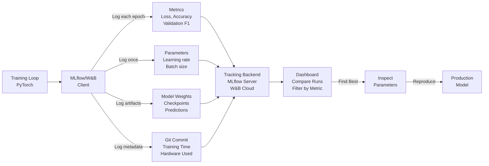

# Experiment Tracking: Organizing ML Experiments at Scale

## Comprehensive Overview

Experiment tracking is the operational backbone of ML development—the system that logs every model training run, its parameters, metrics, and results. Without tracking, teams run hundreds of experiments but can't answer: "What parameters gave us 95% accuracy? Can we reproduce that? Which features helped most?" Experiment tracking tools like MLflow, Weights & Biases, and Neptune capture every run automatically, enabling teams to compare experiments, identify best performers, and share results.

The cost of poor experiment tracking is severe. A team trains 100 models over 2 months. The best one achieves 94% accuracy. Without tracking, they can't find it again—they've lost months of work. With tracking, they search by metric (94%+ accuracy), find the run, inspect parameters and code, and reproduce it. Experiment tracking is the difference between reproducible science and random exploration.

Modern experiment tracking captures: parameters (learning rate, batch size, architecture choices), metrics (accuracy, precision, recall, latency), artifacts (model weights, example predictions), and metadata (git commit, training duration, compute resources). Teams use this to build intuition: "Which hyperparameters matter? How much does batch size affect training time? Does data augmentation help?" Answering these questions without tracking requires re-running experiments; with tracking, it's a query.

The operational challenge is scale: 100s of runs per day, 1000s of experiments per month, terabytes of artifacts. Solutions: lazy load artifacts (don't download everything), compression, archival of old experiments, and integration with CI/CD pipelines.

## How It Works

### Experiment Tracking Workflow

```
Training Script (PyTorch, TensorFlow)
    ↓ (initialize tracking)
Experiment Tracking Client (MLflow, W&B)
    ↓ (log during training)
┌─────────────────────────────────┐
│ Metrics Logged:                  │
│ - epoch, loss, accuracy, f1      │
│ - validation metrics             │
│ - training time                  │
├─────────────────────────────────┤
│ Parameters Logged:               │
│ - learning_rate, batch_size      │
│ - architecture, dropout          │
│ - data split, seed               │
├─────────────────────────────────┤
│ Artifacts Logged:                │
│ - model weights (checkpoint)     │
│ - example predictions            │
│ - feature importance             │
├─────────────────────────────────┤
│ Metadata:                        │
│ - git commit, branch             │
│ - training machine (GPU/CPU)     │
│ - duration, cost                 │
└─────────────────────────────────┘
    ↓ (querying results)
Dashboard / Comparison View
    ↓ (finding best run)
Reproduce Best Model
    ↓ (deploy)
Production Model
```



### Hyperparameter Search Example

```
Search Space:
  learning_rate: [0.001, 0.01, 0.1]
  batch_size: [32, 64, 128]
  dropout: [0.0, 0.3, 0.5]

Grid Search: 3 × 3 × 3 = 27 experiments

Tracking captures:
  Run 1: lr=0.001, bs=32, dropout=0.0 → acc=0.92
  Run 2: lr=0.001, bs=32, dropout=0.3 → acc=0.93
  ...
  Run 27: lr=0.1, bs=128, dropout=0.5 → acc=0.91

Compare: which run had best accuracy? → Run 12 (acc=0.95)
Inspect: what were parameters? → lr=0.01, bs=64, dropout=0.3
Reproduce: use exact parameters → guaranteed same result
```

## Tool Comparisons

| Tool | Approach | Strengths | Weaknesses | Best For |
|------|----------|-----------|-----------|----------|
| **MLflow** | Open-source, Python-first | Simple, free, integrates with many tools, good for startups | Limited collaboration features, less polished UI | Small teams, startups, on-prem deployments |
| **Weights & Biases (W&B)** | Cloud SaaS, collaborative | Beautiful UI, strong collaboration, automatic artifact storage | SaaS costs, vendor lock-in, less control over data | Research teams, fast iteration, collaborative development |
| **Neptune** | Cloud SaaS, flexible | Good filtering, metadata tracking, reasonable pricing | Smaller community, learning curve, newer tool | Teams wanting balance of features and cost |
| **Aim** | Open-source, lightweight | Fast, simple, good for quick experiments | Smaller ecosystem, less integration | Quick prototyping, resource-constrained environments |
| **Comet ML** | Cloud SaaS, enterprise-focused | Strong governance, audit trails, permissions | Expensive, enterprise-only feel | Regulated industries, large teams |

**Decision Framework:**
- **Startup/small team:** MLflow (free, simple)
- **Research/iteration speed:** W&B (beautiful UI, collaboration)
- **On-premise required:** MLflow, Aim (open-source)
- **Enterprise/regulated:** Comet ML (governance, audit)

## Interview Q&A

**Q: You're running 100 experiments/day during hyperparameter search. How do you organize and compare them?**

A: Use experiment tracking tool (MLflow/W&B). Log every run: parameters (learning rate, batch size, etc.), metrics (accuracy, loss), artifacts (model weights). Dashboard enables comparison: filter by metric range (accuracy >0.90), sort by learning time, identify outliers. Find best run by accuracy, inspect parameters, reproduce with exact config.

**Q: An experiment achieved 95% accuracy 2 months ago. You lost track of it. How do you find it?**

A: Search tracking system: filter by metric (accuracy >= 0.94), date range (2 months ago ± 1 week). Narrow by dataset, model architecture if possible. Once found: inspect parameters, code commit (git hash), data version used. Reproduce by checking out commit, using exact parameters, same data version. Should get same accuracy (±0.1% due to randomness).

**Q: Experiment tracking storage is 10TB. How do you manage costs?**

A: Retention policy: (1) Keep current + recent experiments (1 month) in hot storage. (2) Archive old experiments to cold storage (S3 Glacier). (3) Lazy load artifacts (don't download model weights unless needed). (4) Compress artifacts (zip models, use int8 instead of float32). (5) Delete unsuccessful experiments after 1 month (only keep top 10% by metric). Cost: 1TB hot + 9TB cold = $200/month vs $3000/month for all hot.

**Q: How do you prevent experiments from diverging from production?**

A: Integrate tracking with deployment pipeline. (1) Tag experiment as "production-ready" when metrics exceed threshold. (2) Capture: parameters, data version, model weights, training code (git commit). (3) On deployment: log same tracking ID in production monitoring. (4) Compare: production metrics vs experiment metrics (should match ±2%). (5) Alert: if production accuracy drops below experiment baseline.

**Q: Multiple teams are running experiments on shared infrastructure. How do you organize it?**

A: Central experiment tracking with hierarchical organization: (1) Projects: one per team (recommendations, fraud, ranking). (2) Tags: model type, dataset, status (active, archived). (3) Owner: who ran this? (4) Search: "recommendations team, XGBoost, accuracy >0.90". (5) Permissions: team can only see their experiments by default. (6) Shared dashboard: leaders see aggregate metrics across teams.

**Q: How do you make experiment tracking part of team culture?**

A: (1) Make it frictionless: one-line logging (one decorator on training function). (2) Documentation: show best practices, examples. (3) Dashboard as source of truth: where to find results, not emails/Slack. (4) Automation: auto-log standard metrics (GPU usage, duration). (5) Review: during model reviews, inspect experiment run (parameters, metrics, artifacts). (6) Reward: share findings ("found optimal learning rate: 0.01").

## Best Practices

1. **Log Everything:** Parameters, metrics, artifacts, metadata. Future-you will want information you don't think matters today.

2. **Consistent Naming:** Use standardized parameter names (learning_rate, not lr). Makes comparison easier.

3. **Snapshot Code:** Log git commit hash with each run. Enables reproducibility and debugging.

4. **Version Data:** Log dataset version used. Experiments trained on v1 vs v2 may differ.

5. **Organize with Tags:** Use tags (model_type, dataset, status) to categorize experiments.

6. **Archive Old Runs:** Retention policy: keep 1 month hot, archive older. Saves costs.

7. **Share Results:** Use tracking dashboard as source of truth. Avoid "my best model is on my laptop."

8. **Automate Logging:** Decorators or wrappers to auto-log standard metrics. Reduces boilerplate.

## Common Pitfalls

1. **Ad-hoc Logging:** Different scripts log different metrics. Can't compare apples-to-apples.

2. **Lost Experiments:** No central tracking. Best models lost, can't reproduce.

3. **Incomplete Metadata:** Logged accuracy but not data version. Can't reproduce if data changed.

4. **Storage Explosion:** Logged every model checkpoint (10TB). Archive old runs.

5. **No Code Versioning:** Can't tell if accuracy difference is from hyperparameters or code change.

6. **Siloed Tools:** Each team uses different tool (team A: MLflow, team B: W&B). Can't compare across teams.

## Real-World Examples

### Netflix: Experiment Tracking for Recommendations

Netflix tracks 1000+ recommendation experiments/month:
- Metrics: ranking precision, diversity, user engagement
- Parameters: model type, training data window, feature set
- Artifacts: model weights, ranking examples
- Retention: 1 year of experiments (compliance), all metrics queryable
- Integration: auto-deploy top 5% of experiments to canary

### Uber: Experiment Organization at Scale

Uber tracks 500+ experiments/day across pricing, matching, ETA:
- Projects: pricing_experiments, matching_experiments, eta_experiments
- Hierarchical: team_name/model_type/hyperparameter_search_id
- Tagging: model type, dataset, status (active/archived)
- Retention: 3 months hot, 2 years archive (regulatory)
- Dashboard: aggregate metrics across teams for leadership visibility

### Stripe: Experiment Tracking for Fraud

Stripe tracks fraud model experiments:
- Metrics: precision (minimize false declines), recall (catch fraud)
- Parameters: model architecture, training data window, feature set
- Artifacts: feature importance, example predictions (for audit)
- Retention: all experiments (regulatory requirement)
- Integration: best model auto-deploys to staging for A/B test

## Sample Interview Questions

1. "You ran 50 experiments. How do you find the best one and reproduce it?"

2. "Experiment tracking uses 50TB and costs $10K/month. How would you reduce costs?"

3. "How would you set up experiment tracking for a team of 10 ML engineers?"

## Interview Case Study

**Scenario:** You're at a recommendation company. ML team runs 100+ experiments/day during hyperparameter search. How would you organize and compare them?

**Solution Walkthrough:**

1. **Tool Selection:** MLflow for on-premise, or W&B for cloud-based collaboration.

2. **Structure:**
   - Project: "recommendation_ranking"
   - Tags: model_type (xgboost, neural_net), dataset (v1, v2, v3), status (active, archived)
   - Owner: engineer name
   
3. **Logging:**
   ```
   mlflow.set_experiment("ranking_hyperparams_v2")
   mlflow.log_param("learning_rate", 0.01)
   mlflow.log_param("batch_size", 64)
   mlflow.log_metric("val_accuracy", 0.95)
   mlflow.log_artifact(model_weights)
   mlflow.log_artifact(feature_importance)
   ```

4. **Comparison:**
   - Dashboard: filter by metric (accuracy >= 0.92)
   - Sort: by accuracy descending
   - Top result: learning_rate=0.01, batch_size=64, accuracy=0.96
   - Inspect: git commit, training time, compute resources

5. **Reproduction:**
   - Fetch exact parameters
   - Use same data version
   - Run with same code (git commit hash)
   - Verify: accuracy should match ±0.1%

6. **Integration:**
   - Experiment ID linked to production model
   - Monitor: if prod accuracy < experiment baseline, alert

**Strong vs Weak Answers:**

Strong: "I'd use MLflow for open-source or W&B for collaboration. Log parameters, metrics, artifacts, git commit with every run. Organize with tags (model_type, dataset, status). Dashboard enables filtering and comparison. Archive old runs to cold storage. Integration with deployment ensures production uses exact parameters from best experiment."

Weak: "Keep experiments in spreadsheet with accuracy and hyperparameters." (No reproducibility, no artifacts, manual, not scalable)

---

## Related Concepts

- **Concept 06:** Model Versioning & Registry — Store and version trained models
- **Concept 08:** Hyperparameter Optimization — Automated search across parameters
- **Concept 05:** Experiment Tracking — This concept

## Resources

- MLflow: https://mlflow.org/
- Weights & Biases: https://wandb.ai/
- Neptune: https://neptune.ai/
- Aim: https://aimstack.io/
