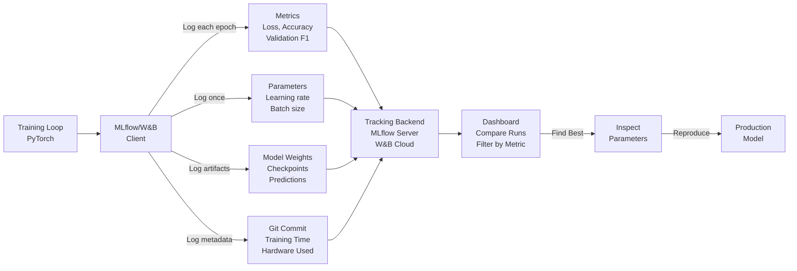
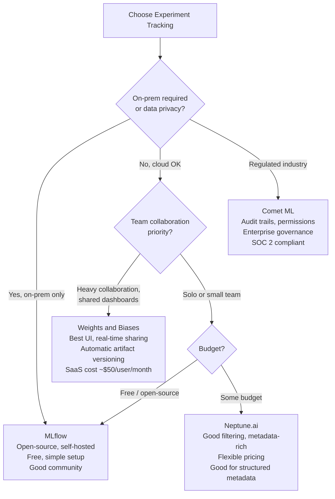

# Experiment Tracking: Organizing ML Experiments at Scale

## Comprehensive Overview

Experiment tracking is the operational backbone of ML development—the system that logs every model training run, its parameters, metrics, and results. Without tracking, teams run hundreds of experiments but can't answer: "What parameters gave us 95% accuracy? Can we reproduce that? Which features helped most?" Experiment tracking tools like MLflow, Weights & Biases, and Neptune capture every run automatically, enabling teams to compare experiments, identify best performers, and share results.

The cost of poor experiment tracking is severe. A team trains 100 models over 2 months. The best one achieves 94% accuracy. Without tracking, they can't find it again—they've lost months of work. With tracking, they search by metric (94%+ accuracy), find the run, inspect parameters and code, and reproduce it. Experiment tracking is the difference between reproducible science and random exploration.

Modern experiment tracking captures: parameters (learning rate, batch size, architecture choices), metrics (accuracy, precision, recall, latency), artifacts (model weights, example predictions), and metadata (git commit, training duration, compute resources). Teams use this to build intuition: "Which hyperparameters matter? How much does batch size affect training time? Does data augmentation help?" Answering these questions without tracking requires re-running experiments; with tracking, it's a query.

The operational challenge is scale: 100s of runs per day, 1000s of experiments per month, terabytes of artifacts. Solutions: lazy load artifacts (don't download everything), compression, archival of old experiments, and integration with CI/CD pipelines.

## How It Works

### Experiment Tracking Workflow

```
Training Script (PyTorch, TensorFlow)
    ↓ (initialize tracking)
Experiment Tracking Client (MLflow, W&B)
    ↓ (log during training)
┌─────────────────────────────────┐
│ Metrics Logged:                  │
│ - epoch, loss, accuracy, f1      │
│ - validation metrics             │
│ - training time                  │
├─────────────────────────────────┤
│ Parameters Logged:               │
│ - learning_rate, batch_size      │
│ - architecture, dropout          │
│ - data split, seed               │
├─────────────────────────────────┤
│ Artifacts Logged:                │
│ - model weights (checkpoint)     │
│ - example predictions            │
│ - feature importance             │
├─────────────────────────────────┤
│ Metadata:                        │
│ - git commit, branch             │
│ - training machine (GPU/CPU)     │
│ - duration, cost                 │
└─────────────────────────────────┘
    ↓ (querying results)
Dashboard / Comparison View
    ↓ (finding best run)
Reproduce Best Model
    ↓ (deploy)
Production Model
```



### Hyperparameter Search Example

```
Search Space:
  learning_rate: [0.001, 0.01, 0.1]
  batch_size: [32, 64, 128]
  dropout: [0.0, 0.3, 0.5]

Grid Search: 3 × 3 × 3 = 27 experiments

Tracking captures:
  Run 1: lr=0.001, bs=32, dropout=0.0 → acc=0.92
  Run 2: lr=0.001, bs=32, dropout=0.3 → acc=0.93
  ...
  Run 27: lr=0.1, bs=128, dropout=0.5 → acc=0.91

Compare: which run had best accuracy? → Run 12 (acc=0.95)
Inspect: what were parameters? → lr=0.01, bs=64, dropout=0.3
Reproduce: use exact parameters → guaranteed same result
```

## Tool Comparisons

| Tool | Approach | Strengths | Weaknesses | Best For |
|------|----------|-----------|-----------|----------|
| **MLflow** | Open-source, Python-first | Simple, free, integrates with many tools, good for startups | Limited collaboration features, less polished UI | Small teams, startups, on-prem deployments |
| **Weights & Biases (W&B)** | Cloud SaaS, collaborative | Beautiful UI, strong collaboration, automatic artifact storage | SaaS costs, vendor lock-in, less control over data | Research teams, fast iteration, collaborative development |
| **Neptune** | Cloud SaaS, flexible | Good filtering, metadata tracking, reasonable pricing | Smaller community, learning curve, newer tool | Teams wanting balance of features and cost |
| **Aim** | Open-source, lightweight | Fast, simple, good for quick experiments | Smaller ecosystem, less integration | Quick prototyping, resource-constrained environments |
| **Comet ML** | Cloud SaaS, enterprise-focused | Strong governance, audit trails, permissions | Expensive, enterprise-only feel | Regulated industries, large teams |

**Decision Framework:**
- **Startup/small team:** MLflow (free, simple)
- **Research/iteration speed:** W&B (beautiful UI, collaboration)
- **On-premise required:** MLflow, Aim (open-source)
- **Enterprise/regulated:** Comet ML (governance, audit)

## Interview Q&A

**Q: You're running 100 experiments/day during hyperparameter search. How do you organize and compare them?**

A: Use experiment tracking tool (MLflow/W&B). Log every run: parameters (learning rate, batch size, etc.), metrics (accuracy, loss), artifacts (model weights). Dashboard enables comparison: filter by metric range (accuracy >0.90), sort by learning time, identify outliers. Find best run by accuracy, inspect parameters, reproduce with exact config.

**Q: An experiment achieved 95% accuracy 2 months ago. You lost track of it. How do you find it?**

A: Search tracking system: filter by metric (accuracy >= 0.94), date range (2 months ago ± 1 week). Narrow by dataset, model architecture if possible. Once found: inspect parameters, code commit (git hash), data version used. Reproduce by checking out commit, using exact parameters, same data version. Should get same accuracy (±0.1% due to randomness).

**Q: Experiment tracking storage is 10TB. How do you manage costs?**

A: Retention policy: (1) Keep current + recent experiments (1 month) in hot storage. (2) Archive old experiments to cold storage (S3 Glacier). (3) Lazy load artifacts (don't download model weights unless needed). (4) Compress artifacts (zip models, use int8 instead of float32). (5) Delete unsuccessful experiments after 1 month (only keep top 10% by metric). Cost: 1TB hot + 9TB cold = $200/month vs $3000/month for all hot.

**Q: How do you prevent experiments from diverging from production?**

A: Integrate tracking with deployment pipeline. (1) Tag experiment as "production-ready" when metrics exceed threshold. (2) Capture: parameters, data version, model weights, training code (git commit). (3) On deployment: log same tracking ID in production monitoring. (4) Compare: production metrics vs experiment metrics (should match ±2%). (5) Alert: if production accuracy drops below experiment baseline.

**Q: Multiple teams are running experiments on shared infrastructure. How do you organize it?**

A: Central experiment tracking with hierarchical organization: (1) Projects: one per team (recommendations, fraud, ranking). (2) Tags: model type, dataset, status (active, archived). (3) Owner: who ran this? (4) Search: "recommendations team, XGBoost, accuracy >0.90". (5) Permissions: team can only see their experiments by default. (6) Shared dashboard: leaders see aggregate metrics across teams.

**Q: How do you make experiment tracking part of team culture?**

A: (1) Make it frictionless: one-line logging (one decorator on training function). (2) Documentation: show best practices, examples. (3) Dashboard as source of truth: where to find results, not emails/Slack. (4) Automation: auto-log standard metrics (GPU usage, duration). (5) Review: during model reviews, inspect experiment run (parameters, metrics, artifacts). (6) Reward: share findings ("found optimal learning rate: 0.01").

## Best Practices

1. **Log Everything:** Parameters, metrics, artifacts, metadata. Future-you will want information you don't think matters today.

2. **Consistent Naming:** Use standardized parameter names (learning_rate, not lr). Makes comparison easier.

3. **Snapshot Code:** Log git commit hash with each run. Enables reproducibility and debugging.

4. **Version Data:** Log dataset version used. Experiments trained on v1 vs v2 may differ.

5. **Organize with Tags:** Use tags (model_type, dataset, status) to categorize experiments.

6. **Archive Old Runs:** Retention policy: keep 1 month hot, archive older. Saves costs.

7. **Share Results:** Use tracking dashboard as source of truth. Avoid "my best model is on my laptop."

8. **Automate Logging:** Decorators or wrappers to auto-log standard metrics. Reduces boilerplate.

## Common Pitfalls

1. **Ad-hoc Logging:** Different scripts log different metrics. Can't compare apples-to-apples.

2. **Lost Experiments:** No central tracking. Best models lost, can't reproduce.

3. **Incomplete Metadata:** Logged accuracy but not data version. Can't reproduce if data changed.

4. **Storage Explosion:** Logged every model checkpoint (10TB). Archive old runs.

5. **No Code Versioning:** Can't tell if accuracy difference is from hyperparameters or code change.

6. **Siloed Tools:** Each team uses different tool (team A: MLflow, team B: W&B). Can't compare across teams.

## Real-World Examples

### Netflix: Experiment Tracking for Recommendations

Netflix tracks 1000+ recommendation experiments/month:
- Metrics: ranking precision, diversity, user engagement
- Parameters: model type, training data window, feature set
- Artifacts: model weights, ranking examples
- Retention: 1 year of experiments (compliance), all metrics queryable
- Integration: auto-deploy top 5% of experiments to canary

### Uber: Experiment Organization at Scale

Uber tracks 500+ experiments/day across pricing, matching, ETA:
- Projects: pricing_experiments, matching_experiments, eta_experiments
- Hierarchical: team_name/model_type/hyperparameter_search_id
- Tagging: model type, dataset, status (active/archived)
- Retention: 3 months hot, 2 years archive (regulatory)
- Dashboard: aggregate metrics across teams for leadership visibility

### Stripe: Experiment Tracking for Fraud

Stripe tracks fraud model experiments:
- Metrics: precision (minimize false declines), recall (catch fraud)
- Parameters: model architecture, training data window, feature set
- Artifacts: feature importance, example predictions (for audit)
- Retention: all experiments (regulatory requirement)
- Integration: best model auto-deploys to staging for A/B test

## Sample Interview Questions

1. "You ran 50 experiments. How do you find the best one and reproduce it?"

2. "Experiment tracking uses 50TB and costs $10K/month. How would you reduce costs?"

3. "How would you set up experiment tracking for a team of 10 ML engineers?"

## Interview Case Study

**Scenario:** You're at a recommendation company. ML team runs 100+ experiments/day during hyperparameter search. How would you organize and compare them?

**Solution Walkthrough:**

1. **Tool Selection:** MLflow for on-premise, or W&B for cloud-based collaboration.

2. **Structure:**
   - Project: "recommendation_ranking"
   - Tags: model_type (xgboost, neural_net), dataset (v1, v2, v3), status (active, archived)
   - Owner: engineer name
   
3. **Logging:**
   ```
   mlflow.set_experiment("ranking_hyperparams_v2")
   mlflow.log_param("learning_rate", 0.01)
   mlflow.log_param("batch_size", 64)
   mlflow.log_metric("val_accuracy", 0.95)
   mlflow.log_artifact(model_weights)
   mlflow.log_artifact(feature_importance)
   ```

4. **Comparison:**
   - Dashboard: filter by metric (accuracy >= 0.92)
   - Sort: by accuracy descending
   - Top result: learning_rate=0.01, batch_size=64, accuracy=0.96
   - Inspect: git commit, training time, compute resources

5. **Reproduction:**
   - Fetch exact parameters
   - Use same data version
   - Run with same code (git commit hash)
   - Verify: accuracy should match ±0.1%

6. **Integration:**
   - Experiment ID linked to production model
   - Monitor: if prod accuracy < experiment baseline, alert

**Strong vs Weak Answers:**

Strong: "I'd use MLflow for open-source or W&B for collaboration. Log parameters, metrics, artifacts, git commit with every run. Organize with tags (model_type, dataset, status). Dashboard enables filtering and comparison. Archive old runs to cold storage. Integration with deployment ensures production uses exact parameters from best experiment."

Weak: "Keep experiments in spreadsheet with accuracy and hyperparameters." (No reproducibility, no artifacts, manual, not scalable)

---

## Related Concepts

- **Concept 06:** Model Versioning & Registry — Store and version trained models
- **Concept 08:** Hyperparameter Optimization — Automated search across parameters
- **Concept 05:** Experiment Tracking — This concept

## Resources

- MLflow: https://mlflow.org/
- Weights & Biases: https://wandb.ai/
- Neptune: https://neptune.ai/
- Aim: https://aimstack.io/

---

## Quick Reference Card

### 2-Minute Elevator Pitch
Experiment tracking is the institutional memory of an ML team. Without it, a team of 10 engineers running 500 experiments per month loses track of what worked, can't reproduce results, and re-discovers the same optimal hyperparameters every quarter. With it, any engineer can query "show me experiments with validation F1 > 0.93 on the fraud dataset, run in the last 60 days" in seconds. Tracking captures three things: parameters (what configuration?), metrics (how did it perform?), and artifacts (what was produced?) — plus the metadata to reproduce any run.

### Numbers to Know
- Typical ML team: 50-200 experiments per engineer per month; without tracking, >80% of results are lost within 4 weeks
- MLflow storage: ~1MB metadata per run (excluding artifacts); 10,000 runs = ~10GB metadata
- W&B artifact storage: typical model checkpoint = 100MB-10GB; daily storage cost for 1000 runs × 1GB artifacts = ~$30/day on S3
- Experiment tracking reduces time-to-reproduce from hours/days to minutes
- Netflix: 1000+ recommendation experiments tracked per month with 2-year retention for compliance
- Search speed: MLflow can query 50,000 runs in <2 seconds with indexed metrics
- Recommended retention: keep all metadata forever (<1GB/month); archive artifacts after 90 days (80% cost savings)

### Decision Framework: Choosing an Experiment Tracking Tool



---

## Strong vs Weak Answers

### Q: You ran 200 experiments over 3 months. How do you find and reproduce the best result?

**Weak Answer:** "I would search through my experiment tracking dashboard and filter by accuracy to find the best run, then use the same hyperparameters to retrain."

**Strong Answer:** "With proper experiment tracking, finding and reproducing is a two-minute operation. First, query by metric: `mlflow.search_runs(filter_string='metrics.val_f1 > 0.93 and params.model_type = "transformer"', order_by=['metrics.val_f1 DESC'])` — this returns the top runs ranked by F1. Second, inspect the top run: check parameters (learning_rate=0.0001, batch_size=32, dropout=0.3), artifacts (model checkpoint, training curve), and metadata (git commit abc123, dataset version v7, training duration 4.2 hours). Third, reproduce: check out `git checkout abc123`, load dataset v7 from the data registry, run training with identical parameters. The result should match within 0.1% (accounting for floating-point variance). The critical detail most engineers miss: you must log the git commit hash AND the data version with every run — parameters alone are insufficient because code or data may have changed. At Uber, a team spent 2 weeks trying to reproduce a 2% accuracy improvement before they found that the experiment had used a different data preprocessing script than what was in main."

---

### Q: Your experiment tracking system uses 50TB of storage and costs $15K/month. How do you cut costs without losing important results?

**Weak Answer:** "I would delete old experiments that are no longer needed and only keep the recent ones."

**Strong Answer:** "This requires a tiered retention strategy, not blanket deletion. First, distinguish metadata from artifacts: metadata (parameters, metrics, tags, git commits) is tiny — 1MB per run × 500K runs = 500GB total, negligible cost. Artifacts (model checkpoints, training curves) drive costs. Second, apply artifact retention rules: keep artifacts for the top 10% of runs by primary metric, and delete artifacts for everything else after 30 days. Keep all metadata permanently. Third, implement cold storage tiering: experiments older than 90 days but within the top 10% move to S3 Glacier (80% cost reduction, 3-5h retrieval). Fourth, compress artifacts: use int8 quantization for stored checkpoints (4x size reduction), compress training curves as parquet (10x reduction). Result: 50TB → 8TB hot + 15TB cold storage, $15K/month → $2.5K/month. Implementation: a weekly cron job evaluates all runs older than 30 days, archives artifacts for runs below the top-10% threshold, and moves top-10% artifacts older than 90 days to Glacier."

---

### Q: How do you design experiment tracking for a team of 15 ML engineers running 1000 experiments per week?

**Weak Answer:** "I would set up MLflow or W&B, have everyone log their experiments, and create a shared dashboard."

**Strong Answer:** "At that scale, experiment tracking needs structure to stay useful. I'd design three layers. First, project hierarchy: experiments are organized as `{team}/{project}/{model_type}/{search_phase}` — e.g., `fraud/card_auth/transformer/hyperparam_sweep_2026q1`. This prevents the 'haystack' problem where 50,000 runs are unorganized. Second, standardized logging schema: all engineers use a shared logging wrapper that automatically captures: git commit (mandatory), dataset version (mandatory), training hardware (auto), training duration (auto), and a free-form `notes` field for observations. Parameters and metrics are logged with consistent naming conventions (not `lr` and `learning_rate` mixed). Third, team norms: each experiment gets a `status` tag (`active`, `archived`, `best`, `failed`) and an owner. Weekly 30-minute team sync reviews the top 5 experiments from the past week. The key cultural practice: experiment results live in the tracking system, not in Slack or email — when someone asks 'what's the best model?', the answer is always a dashboard link, never 'I think it was on Tuesday'."

---

## System Design: Experiment Tracking for a Large-Scale Recommendation System

**Question:** "You're the ML platform lead at a 50-person ML engineering organization. Teams are running 2000+ experiments per month across recommendation, fraud, search ranking, and pricing. Design an experiment tracking system that supports: cross-team comparison, automated best-model promotion, cost control, and regulatory audit requirements."

**Walkthrough:**

1. **Choose infrastructure.** Self-hosted MLflow on Kubernetes with PostgreSQL backend for metadata and S3 for artifact storage. Rationale: data privacy (models can't leave internal infrastructure), cost control (no per-seat SaaS fees), and customization (custom promotion workflows). Alternative for teams without infrastructure maturity: W&B Teams for faster setup.

2. **Project and experiment hierarchy.** Three-level namespace: `{org_team}/{project_name}/{experiment_id}`. Example: `fraud_team/card_auth_v2/hyperparam_sweep_jan`. Each project has an owner, a primary metric, and a dashboard. This prevents name collisions across teams and enables project-level access control.

3. **Standardized logging contract.** Build a `@track_experiment` decorator that wraps training functions and automatically logs: git commit hash (from `git rev-parse HEAD`), dataset URI and version hash, hardware specs (GPU type, count), training start/end time, and all hyperparameters from the config object. Metrics are logged per epoch. This decorator is mandatory — CI fails if training scripts don't use it.

4. **Artifact versioning and deduplication.** Use content-addressable storage: artifact hash becomes the S3 key. If two experiments produce identical model weights (same code + data + seed), they share one S3 object. This prevents duplicate storage for near-identical runs.

5. **Automated best-model promotion.** A nightly job queries each project's experiments, finds the run with the best primary metric in the last 7 days that also meets quality gates (latency <100ms, fairness metrics within bounds, no data leakage detected). It automatically promotes this run to `status=candidate` and creates a Jira ticket for human review. This reduces the "find the best model" step from hours to seconds.

6. **Cross-team comparison.** A weekly digest dashboard shows: top 3 experiments per team, trend of primary metric over the last 4 weeks, and the team leaderboard. This surfaces cross-team learnings — if the pricing team's data augmentation technique improved accuracy 3%, the recommendation team should know.

7. **Cost control.** Automated cleanup job runs weekly: delete artifacts for runs with `status=archived` older than 30 days; move artifacts for non-top-10% runs to S3 Glacier after 90 days; keep all metadata permanently (it's tiny). Target: <$5K/month total storage cost for 2000 runs/month.

8. **Regulatory audit trail.** For fraud models specifically, retain all experiment metadata (not just top models) for 7 years (SEC requirement). Each experiment links to: training code commit, dataset version hash, hyperparameters, and evaluation results. Auditors can reconstruct any historical model from these records.

9. **Integration with CI/CD.** Every PR that changes model training code triggers a comparison experiment: new code vs. current production code, on the canonical validation dataset. The PR cannot be merged if the new code degrades primary metric by >1% without explicit override approval.

10. **Feedback loop from production.** Production model IDs link back to experiment runs. When production monitoring detects accuracy degradation, it automatically annotates the originating experiment run with `production_degradation=true` and the degradation timestamp. This closes the loop: experiments that train well but degrade quickly are flagged as unreliable baselines.

**Key decisions:**
- Self-hosted vs. SaaS: at 50 engineers with regulatory requirements, self-hosted MLflow wins on cost and data control; SaaS is better for teams < 10 engineers
- Mandatory logging decorator: optional tracking gets inconsistently adopted; mandatory adoption via CI enforcement is the only reliable approach
- Separate metadata from artifact retention: metadata is cheap and always retained; artifact retention policy controls 95% of costs
