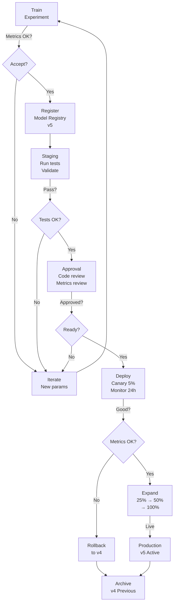

# Model Versioning & Registry: Managing Models in Production

## Comprehensive Overview

Model versioning tracks trained model artifacts—weights, code, dependencies, metrics—enabling teams to deploy, rollback, and compare models. Without versioning, teams deploy a model to production, but 3 months later, can't remember which code created it, what data it trained on, or why accuracy was 95%. Model registry is the central place: what models exist, which version is in production, which are candidates for deployment, what's archived.

The cost of poor model versioning is catastrophic. A production model degrades: accuracy drops from 95% to 92%. Engineers need to rollback to the previous version, but it's lost—nobody remembered to save weights or code. With versioning, they find the previous version in the registry, deploy with one command, rollback in minutes. Without it, they rebuild the model from scratch, losing days.

Modern teams implement model registries (MLflow Model Registry, Amazon SageMaker Model Registry) that track: model artifacts (weights), parameters used, training data version, code commit, metrics, and metadata. Registries enable governance: approval workflows (only approved models go to production), access control (who can deploy), and audit trails (who deployed what, when).

The operational challenge is managing lifecycle: train hundreds of models, only a few are candidates, one is in production, old ones archived. Registry enables this: transition states (staging, production, archived), approval workflows, A/B testing infrastructure, and automatic rollback on metric degradation.

## How It Works

### Model Registry Lifecycle

```
Train Experiment
    ↓ (if metrics good)
Register Model in Registry
    ├─ Version: v1
    ├─ Metrics: accuracy=0.95
    ├─ Parameters: learning_rate=0.01
    ├─ Data version: training_set_v3
    └─ Code: git commit abc123
    ↓
Model Staging
    ├─ Test in staging environment
    ├─ Run validation suite
    ├─ Check dependencies (transformers==4.30)
    └─ Compare with current production (v0)
    ↓
Approval & Promotion
    ├─ Code review: did training code change?
    ├─ Data review: what data trained this?
    ├─ Metrics review: is accuracy better than prod?
    └─ Approval: ready to go
    ↓
Production Deployment
    ├─ Blue-green: deploy v1, keep v0 active
    ├─ Monitor: track metrics in prod
    ├─ Canary: 5% traffic to v1, 95% to v0
    └─ Validation: if metrics degrade, rollback to v0
    ↓
(When new model approved)
Archive Previous Version
    ├─ Keep for compliance/audit
    ├─ Don't serve traffic
    └─ Retain weights for analysis
```



### Registry Entry Example

```yaml
Model: fraud_detection
Version: v5
Status: production
Created: 2026-05-16
CreatedBy: fraud_team
Metrics:
  precision: 0.98
  recall: 0.92
  f1: 0.95
Parameters:
  learning_rate: 0.001
  batch_size: 64
  model_type: XGBoost
Artifacts:
  model_weights: s3://models/fraud_v5.pkl
  model_config: s3://models/fraud_v5_config.json
  feature_importance: s3://models/fraud_v5_importance.pkl
Data:
  training_set_version: fraud_training_v12
  training_date: 2026-05-15
  rows: 1_000_000
Code:
  git_commit: abc123def456
  git_branch: main
  training_script: train_fraud_model.py
Dependencies:
  transformers: "==4.30.0"
  xgboost: "==1.7.5"
  pandas: "==1.5.3"
History:
  v4: archived, 2026-04-15
  v3: archived, 2026-03-15
  v2: archived, 2026-02-15
```

## Tool Comparisons

| Tool | Approach | Strengths | Weaknesses | Best For |
|------|----------|-----------|-----------|----------|
| **MLflow Model Registry** | Open-source, Python-first | Simple, free, integrates with MLflow tracking | Limited governance features, less polished | Small teams, startups, on-prem |
| **Amazon SageMaker** | AWS-native, enterprise | Strong governance, audit trails, model approval | AWS lock-in, steep learning curve, expensive | AWS shops, regulated industries |
| **Hugging Face Model Hub** | Community-focused | Large model library, easy sharing, versioning | Limited to NLP/vision, less governance for internal models | NLP teams, research, model sharing |
| **Databricks Model Registry** | Delta Lake integrated | Strong lineage, unity catalog, governance | Databricks ecosystem lock-in | Databricks shops, data-heavy teams |
| **Custom (S3 + metadata DB)** | Build your own | Full control, minimal cost, flexible | High maintenance, inconsistency risk | Well-resourced teams with specific needs |

**Decision Framework:**
- **Small team:** MLflow (free, simple)
- **AWS ecosystem:** SageMaker (governance, audit)
- **Databricks shop:** Databricks Model Registry (Delta integration)
- **NLP/HuggingFace:** Hugging Face Model Hub
- **Custom governance:** Build custom (S3 + metadata store)

## Interview Q&A

**Q: Design a model versioning system for a company deploying 10+ models across multiple teams. What goes in the registry?**

A: Registry entries should contain: (1) Model metadata (name, version, status, created_by), (2) Metrics (accuracy, precision, latency from testing), (3) Parameters (hyperparameters used), (4) Artifacts (model weights path, config), (5) Data (training set version, date), (6) Code (git commit, branch, training script), (7) Dependencies (library versions), (8) History (previous versions). Enables reproducibility, governance, and rollback.

**Q: A production model's accuracy dropped from 95% to 92%. How do you rollback?**

A: (1) Check registry: find previous version (v-1) with 95% accuracy. (2) Verify: same architecture, different training data? (3) Load weights: fetch from registry (S3 path). (4) Deploy: use blue-green (v-1 in parallel, gradually switch traffic). (5) Monitor: track accuracy in production. (6) Investigate: what changed between v and v-1? (code, data, hyperparams).

**Q: Model registry contains 1000 models across 10 teams. How do you organize and govern it?**

A: Organization: (1) Hierarchical (team/model_name/version). (2) Tags (model_type, status, dataset). (3) Ownership (which team owns this?). Governance: (1) Approval workflow (only approved models to prod). (2) Access control (team A can't deploy team B's models). (3) Audit trail (who deployed what, when, why). (4) SLA (how long between training and deployment?). (5) Deprecation (how to retire old models).

**Q: How do you prevent deploying a model trained on bad data?**

A: Validation in registry: (1) Capture data version with model. (2) Data validation: before training, validate that data meets quality checks (schema, completeness, distributions). (3) On deployment: cross-check—if data version is blacklisted (bad quality), block deployment. (4) Code review: who approved training data? (5) Test: compare model output on test set vs production ground truth (should match).

**Q: How do you handle model dependencies changing (pandas 1.5 → 2.0)?**

A: Dependency management: (1) Log dependencies in registry (exact versions, not ranges). (2) Create docker image with exact versions, version the image. (3) On deployment: use pinned image, not latest. (4) Upgrade strategy: test new version on canary traffic, validate metrics match, only then promote. (5) Compatibility: document breaking changes (pandas 2.0 has API changes). (6) Rollback: if new version breaks, revert to old image.

## Best Practices

1. **Semantic Versioning:** Use major.minor.patch (v1.2.3) to indicate breaking changes vs improvements.

2. **Rich Metadata:** Capture more than weights. Log code, data, dependencies, metrics, training date.

3. **Governance Workflow:** Don't allow manual deployments. Require approval before moving to production.

4. **Immutable Artifacts:** Once deployed, don't change. Create new version if changes needed.

5. **Audit Trail:** Log who deployed what, when, and why. Required for compliance.

6. **Monitor After Deployment:** Track production metrics. If degradation detected, automate rollback.

7. **Archive Old Versions:** Keep for compliance, but don't serve traffic. Saves compute.

8. **Test Before Deploy:** Staging environment with same data, traffic patterns as production.

## Common Pitfalls

1. **Lost Weights:** Trained model but forgot to save. Can't rollback.

2. **Missing Metadata:** Registered model but no data version or git commit. Can't reproduce.

3. **Version Explosion:** Too many versions clutters registry. Archive aggressively.

4. **No Audit Trail:** Can't tell who deployed what or why. Compliance risk.

5. **Dependency Hell:** Didn't pin library versions. Production breaks when dependencies upgrade.

6. **Manual Deployments:** Engineer manually copies model weights. Inconsistent, risky.

7. **No Rollback Plan:** Deployed new model, can't go back. Production broken for hours.

## Real-World Examples

### Netflix: Model Registry for Recommendations

Netflix's registry tracks 100+ recommendation models:
- Versions: daily updates, archive old after 30 days
- Governance: approval required before prod deployment
- Deployment: canary (5% traffic to new, 95% to old), monitor for 24h
- Rollback: automated if metrics degrade >1%
- Audit: logs all deployments for compliance

### Stripe: Model Registry for Fraud

Stripe's registry tracks fraud models with strict governance:
- Approval: code review + data review required
- Testing: validated on holdout test set before deployment
- Deployment: blue-green (both versions running), switch gradually
- Monitoring: false positive rate tracked in production
- Rollback: automated if false positive rate spikes >0.5%

### Uber: Multi-Model Registry

Uber tracks pricing, matching, ETA models:
- Teams: each team manages their models
- Registry: centralized (can see all models across Uber)
- Status: staging (validated), production (live), archived
- Rollback: one-click rollback to previous version
- Integration: automatic A/B test infrastructure

## Sample Interview Questions

1. "Design a model versioning system for a company with 50 models across 5 teams."

2. "Production model's accuracy dropped. Rollback is blocked. How do you troubleshoot?"

3. "How do you prevent deploying a model trained on corrupted data?"

## Interview Case Study

**Scenario:** You're deploying ML models at a large company. Design a model registry that enables: (1) Reproducibility, (2) Governance, (3) Rollback, (4) Audit trail.

**Solution Walkthrough:**

1. **Registry Metadata:**
   - Model info: name, version, status (staging/production/archived)
   - Metrics: accuracy, precision, latency from validation
   - Parameters: hyperparameters used
   - Artifacts: where model weights stored (S3 path)
   - Data: training set version, date
   - Code: git commit, branch, training script
   - Dependencies: library versions (pinned)
   - Created by, created at, approved by

2. **Workflow:**
   ```
   Train experiment → Log to tracking system (accuracy=0.95)
       ↓
   Register in model registry (v1, status=staging)
       ↓
   Validation (test on holdout set, check data quality)
       ↓
   Code review + Data review (approval gate)
       ↓
   Deploy to staging (run integration tests)
       ↓
   A/B test (canary: 5% traffic to v1, 95% to v0)
       ↓
   Monitor metrics (accuracy, latency, cost)
       ↓
   If metrics good → Promote v1 to production (v0 archived)
       ↓
   If metrics bad → Rollback to v0 (v1 archived)
   ```

3. **Governance:**
   - Approval: required before prod (code review, data review)
   - Access control: only authorized teams can deploy
   - Audit: log who deployed what, when, why

4. **Reproducibility:**
   - Fetch model: look up v5 in registry
   - Download weights: s3://models/v5.pkl
   - Check dependencies: transformers==4.30, pandas==1.5.3
   - Load code: git checkout abc123
   - Run model: should produce same output as in production

5. **Rollback:**
   - Metrics degrade in production
   - Trigger: if accuracy < v(n-1) by >1%
   - Action: deploy v(n-1), archive v(n)
   - Validation: verify accuracy returns to baseline

**Strong vs Weak Answers:**

Strong: "Registry should contain: model metadata, metrics, parameters, artifacts (S3 path), data version, git commit, pinned dependencies. Workflow: train → register (staging) → approve → deploy (canary) → monitor. Governance: approval gates, audit trail. Rollback: automated if metrics degrade."

Weak: "Store model weights in S3." (No metadata, no governance, no versioning)

---

## Related Concepts

- **Concept 05:** Experiment Tracking — Logging training runs
- **Concept 07:** Reproducibility — Reproducing exact results
- **Concept 08:** Hyperparameter Optimization — Finding best parameters

## Resources

- MLflow Model Registry: https://mlflow.org/docs/latest/model-registry.html
- SageMaker Model Registry: https://docs.aws.amazon.com/sagemaker/latest/dg/model-registry.html
- Databricks Model Registry: https://docs.databricks.com/machine-learning/model-registry/
