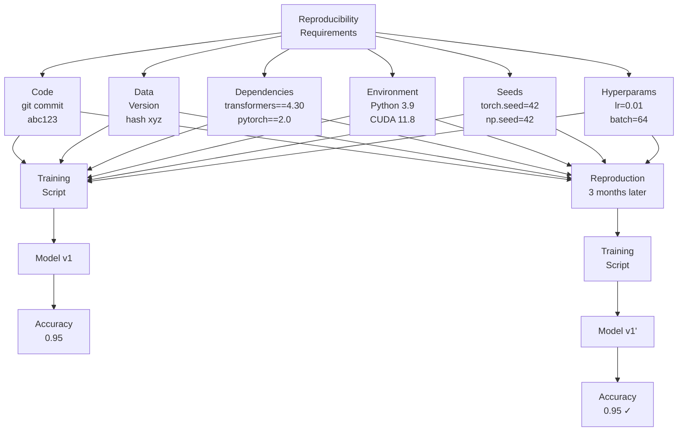

# Reproducibility: Exact Replication of ML Results

## Comprehensive Overview

Reproducibility is the foundation of scientific ML—the ability to run training once and get identical results forever. Yet this is surprisingly hard. Random seed controls stochasticity, but library versions, GPU floating-point differences, and environment variations introduce subtle changes. A model trained 3 months ago achieves 95% accuracy. Today, running the same code produces 94.8%—close but different. Without reproducibility, teams can't debug, can't compare, can't trust results.

The cost of irreproducible experiments is insidious. Research papers become unreplicable. Models trained locally don't match staging. Production models drift. Teams re-run experiments to check results, wasting time and compute. With reproducibility, you train once, lock it down, and trust the results forever.

Modern reproducibility requires versioning everything: data (version control datasets), code (git versioning), dependencies (lock library versions), and randomness (fixed seeds). Tools like Docker containerize environments, DVC versions data, and poetry pins dependencies. Together, they enable: given version X of code + data + dependencies, you'll get identical results.

The operational challenge is maintaining reproducibility at scale. 1000 experiments, each with different code commits, data versions, dependencies. Tools automate this: training scripts capture versions automatically, containers encapsulate environments, metadata stores record everything.

## How It Works

### Reproducibility Components

```
┌─────────────────────────────────┐
│   Reproducibility Checklist      │
├─────────────────────────────────┤
│ 1. Code Version (git commit)    │
│    ├─ Training script            │
│    ├─ Data loading code         │
│    └─ Evaluation code           │
├─────────────────────────────────┤
│ 2. Data Version                 │
│    ├─ Training set hash         │
│    ├─ Test set hash             │
│    └─ Random split seed         │
├─────────────────────────────────┤
│ 3. Environment                  │
│    ├─ Python version (3.9.0)    │
│    ├─ Library versions (pinned) │
│    ├─ CUDA/GPU drivers          │
│    └─ Docker image (hash)       │
├─────────────────────────────────┤
│ 4. Randomness Control           │
│    ├─ NumPy seed                │
│    ├─ PyTorch seed              │
│    ├─ TensorFlow seed           │
│    └─ Batch shuffling seed      │
├─────────────────────────────────┤
│ 5. Hyperparameters              │
│    ├─ Learning rate             │
│    ├─ Batch size                │
│    └─ Training epochs           │
└─────────────────────────────────┘

Given above: identical results ✓
```



### Reproduction Workflow

```
Experiment Results: accuracy=0.95
    ├─ Code: git commit abc123
    ├─ Data: training_set_v3 (hash def456)
    ├─ Libraries: transformers==4.30, pandas==1.5.3
    ├─ Seed: 42
    └─ Hyperparams: lr=0.01, batch=64
    
3 Months Later: need to reproduce
    ↓
Step 1: Fetch code
    git checkout abc123
    
Step 2: Fetch data
    Load training_set_v3 using hash verification
    
Step 3: Setup environment
    Docker run with pinned image (Python 3.9, transformers==4.30, ...)
    
Step 4: Run training
    python train.py --seed 42 --lr 0.01 --batch 64
    
Result: accuracy=0.95 (matches original) ✓
```

## Reproducibility Challenges & Solutions

### Challenge 1: Random Number Generation

**Problem:** Neural networks use randomness (weight initialization, dropout, shuffling). Different seeds produce different weights.

**Solution:**
```python
import torch
import numpy as np
import random

def set_seed(seed):
    torch.manual_seed(seed)
    torch.cuda.manual_seed(seed)
    torch.cuda.manual_seed_all(seed)  # for multi-GPU
    np.random.seed(seed)
    random.seed(seed)
    # Disable cuDNN non-determinism
    torch.backends.cudnn.deterministic = True
    torch.backends.cudnn.benchmark = False

set_seed(42)  # Fixed seed for reproducibility
```

### Challenge 2: Library Version Changes

**Problem:** PyTorch 1.10 vs 1.11 may produce slightly different results.

**Solution:** Pin library versions
```
transformers==4.30.0  (exact version, not >=4.30)
torch==2.0.0
numpy==1.24.0
```

### Challenge 3: GPU Floating-Point Differences

**Problem:** GPU floating-point operations have rounding differences between runs.

**Solution:** Accept small tolerance
```python
assert abs(accuracy_run1 - accuracy_run2) < 0.001  # Within 0.1%
```

### Challenge 4: Data Order

**Problem:** Training on shuffled data can produce different results (mini-batch order affects gradient).

**Solution:** Version and pin data splits
```python
# Train set: exactly these rows, in this order
# Use stratified split with fixed seed
train_data = load_data(seed=42, split='train')
```

### Challenge 5: Non-Deterministic Operations

**Problem:** Some PyTorch operations (scatter, gather) are non-deterministic on GPU.

**Solution:** Use deterministic versions or CPU
```python
torch.use_deterministic_algorithms(True)  # Enforce determinism
device = 'cpu'  # CPU is deterministic, GPU may not be
```

## Interview Q&A

**Q: You trained a model 3 months ago with 95% accuracy. Today, running the same code produces 94.8%. How do you ensure reproducibility?**

A: (1) Code: ensure same git commit. (2) Data: verify training data hash matches (same rows, same order). (3) Dependencies: pin library versions exactly. (4) Seed: set random seed (torch.manual_seed(42), np.random.seed(42)). (5) Environment: Docker image with exact Python version. (6) GPU: disable non-determinism (torch.backends.cudnn.deterministic=True). (7) Accept tolerance: 95% vs 94.8% is within floating-point rounding.

**Q: How do you make your ML pipeline reproducible for your team?**

A: (1) Version control: git for code, DVC/Delta for data. (2) Dependency pinning: requirements.txt with exact versions. (3) Docker: containerize training environment (Dockerfile). (4) Seed management: function to set all seeds (NumPy, PyTorch, random). (5) Metadata logging: capture code commit, data version, library versions with each run. (6) Documentation: explain how to reproduce ("git checkout X, python train.py --seed 42"). (7) Testing: periodic reproducibility check (train same experiment, verify metrics match).

**Q: Your training script works on your laptop but not on the server. How do you fix it?**

A: Reproducibility issue. Diagnose: (1) Code differences? Run `git diff` (laptop vs server). (2) Data differences? Check data paths, verify data hash. (3) Environment? Check Python version, library versions (pip list). (4) Seed set? Verify seed(42) being used. (5) GPU? Check CUDA version on server. Solution: Docker removes environment differences. Put everything in Dockerfile, run on both laptop and server (should match).

**Q: How do you handle randomness in validation and test sets?**

A: Use fixed seed for splits. (1) Train/val/test: stratified split with seed=42. (2) Data augmentation: use seeded random augmentation during training (transforms.RandomRotation(seed=42)). (3) Evaluation: don't add randomness (no dropout during evaluation). (4) Metrics: compute deterministically (numpy, not GPU if possible). (5) Result: same train/val/test split always, reproducible metrics.

## Best Practices

1. **Set Seeds Early:** Call set_seed() before any randomization.

2. **Pin Dependencies:** Use requirements.txt or poetry.lock with exact versions.

3. **Containerize:** Use Docker to encapsulate environment (Python version, system libraries).

4. **Version Data:** Use DVC or data hashes to track exact datasets.

5. **Document Steps:** Clear instructions: "git checkout X, docker build, python train.py --seed 42".

6. **Automate Verification:** Test reproducibility: periodically retrain, verify metrics match.

7. **Accept Tolerance:** Floating-point differences up to 0.1% are normal.

8. **Log Metadata:** Capture code, data, library versions with every run.

## Common Pitfalls

1. **No Seed Control:** Model produces different results every run.

2. **Library Drift:** Using `pandas>=1.5` means version changes break reproducibility.

3. **Data Order Matters:** Shuffling in different order produces different results.

4. **GPU Non-Determinism:** GPU operations have inherent randomness.

5. **No Environment Tracking:** Works on laptop, breaks on server.

6. **Missing Metadata:** Can't tell what code/data/version trained a model.

7. **Test on Laptop Only:** Doesn't work when deployed to server.

## Real-World Examples

### Netflix: Reproducible Recommendation Models

Netflix enforces reproducibility:
- All training code in git (versioned)
- All data versioned (DVC with hashes)
- Docker images for each training pipeline
- Requirements.txt pins library versions
- Seed: set at start of training script
- Metadata: every run logs git commit, data version, libraries
- Verification: retrain v5 model monthly, verify accuracy matches (within 0.1%)

### Stripe: Reproducible Fraud Models

Stripe requires reproducibility for compliance:
- Code: reviewed and committed
- Data: immutable in S3, hashed for verification
- Environment: Docker with pinned dependencies
- Seed: fixed (42)
- Metadata: logs environment, code, data with every model
- Audit: can show regulators exactly how model was trained

### Uber: Scale Reproducibility

Uber manages reproducibility across 100+ models:
- Infrastructure: containers ensure consistent environment
- Data: Spark jobs produce deterministic output (single-threaded writes)
- Seed: passed to training script
- Verification: automated reproducibility tests (retrain 1% of models, verify metrics)

## Sample Interview Questions

1. "How would you make training reproducible for your team?"

2. "You can't reproduce a result from 3 months ago. Debug it."

3. "Design a system ensuring every ML model can be retrained with identical results."

## Interview Case Study

**Scenario:** You're building an ML platform that trains 100+ models. How do you ensure reproducibility across all models?

**Solution Walkthrough:**

1. **Version Everything:**
   - Code: git with semantic versioning
   - Data: DVC with content hashes
   - Environment: Docker images
   - Dependencies: requirements.txt (exact versions)

2. **Capture Metadata:**
   ```yaml
   Model: fraud_v5
   Code:
     commit: abc123
     branch: main
   Data:
     training_set_v3: hash=def456
     test_set_v3: hash=ghi789
   Environment:
     python: 3.9.0
     pytorch: 2.0.0
     transformers: 4.30.0
   Seed: 42
   ```

3. **Reproduction Process:**
   ```bash
   # Step 1: Fetch code
   git checkout abc123
   
   # Step 2: Build container (ensures consistent Python, libs)
   docker build -t fraud:v5 .
   
   # Step 3: Run with data + seed
   docker run -v /data:/data fraud:v5 \
     python train.py \
     --data_path /data/training_set_v3 \
     --seed 42
   
   # Result: same metrics (within 0.1%)
   ```

4. **Verification:**
   - Monthly: retrain old models, verify metrics match
   - Before deployment: reproduce on staging, compare with production
   - CI/CD: automated reproducibility tests

5. **Documentation:**
   - README: "To reproduce: git checkout X, docker build, python train.py --seed 42"
   - Metadata logged with every model
   - Team wiki: reproducibility best practices

**Strong vs Weak Answers:**

Strong: "Version code (git), data (DVC), environment (Docker), pin dependencies, set seeds (NumPy, PyTorch), log metadata (code commit, data hash, library versions). Reproduction: fetch code, build Docker image, run with pinned seed. Accept floating-point tolerance (0.1%). Verify: monthly reproducibility tests."

Weak: "Use random.seed(42)." (Doesn't control PyTorch/NumPy, no environment control, incomplete)

---

## Related Concepts

- **Concept 05:** Experiment Tracking — Logging experiments
- **Concept 06:** Model Versioning — Storing models
- **Concept 04:** Data Versioning — Versioning datasets

## Resources

- PyTorch Reproducibility: https://pytorch.org/docs/stable/notes/randomness.html
- DVC (Data Versioning): https://dvc.org/
- Docker: https://www.docker.com/
