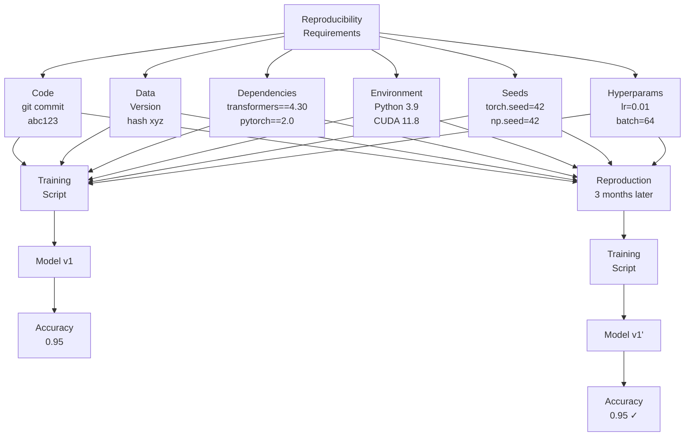
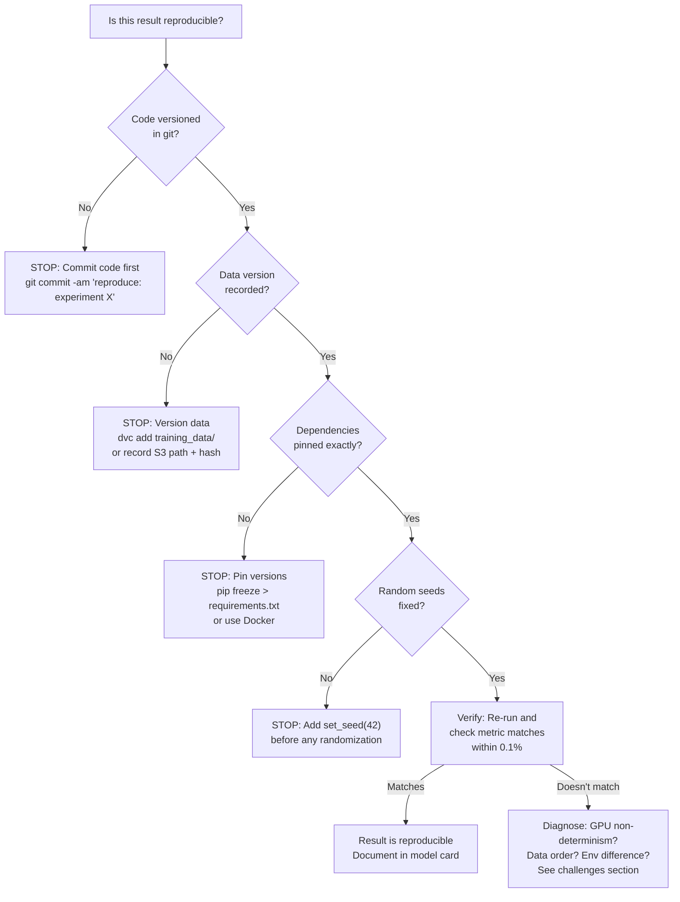

# Reproducibility: Exact Replication of ML Results

## Comprehensive Overview

Reproducibility is the foundation of scientific ML—the ability to run training once and get identical results forever. Yet this is surprisingly hard. Random seed controls stochasticity, but library versions, GPU floating-point differences, and environment variations introduce subtle changes. A model trained 3 months ago achieves 95% accuracy. Today, running the same code produces 94.8%—close but different. Without reproducibility, teams can't debug, can't compare, can't trust results.

The cost of irreproducible experiments is insidious. Research papers become unreplicable. Models trained locally don't match staging. Production models drift. Teams re-run experiments to check results, wasting time and compute. With reproducibility, you train once, lock it down, and trust the results forever.

Modern reproducibility requires versioning everything: data (version control datasets), code (git versioning), dependencies (lock library versions), and randomness (fixed seeds). Tools like Docker containerize environments, DVC versions data, and poetry pins dependencies. Together, they enable: given version X of code + data + dependencies, you'll get identical results.

The operational challenge is maintaining reproducibility at scale. 1000 experiments, each with different code commits, data versions, dependencies. Tools automate this: training scripts capture versions automatically, containers encapsulate environments, metadata stores record everything.

## How It Works

### Reproducibility Components

```
┌─────────────────────────────────┐
│   Reproducibility Checklist      │
├─────────────────────────────────┤
│ 1. Code Version (git commit)    │
│    ├─ Training script            │
│    ├─ Data loading code         │
│    └─ Evaluation code           │
├─────────────────────────────────┤
│ 2. Data Version                 │
│    ├─ Training set hash         │
│    ├─ Test set hash             │
│    └─ Random split seed         │
├─────────────────────────────────┤
│ 3. Environment                  │
│    ├─ Python version (3.9.0)    │
│    ├─ Library versions (pinned) │
│    ├─ CUDA/GPU drivers          │
│    └─ Docker image (hash)       │
├─────────────────────────────────┤
│ 4. Randomness Control           │
│    ├─ NumPy seed                │
│    ├─ PyTorch seed              │
│    ├─ TensorFlow seed           │
│    └─ Batch shuffling seed      │
├─────────────────────────────────┤
│ 5. Hyperparameters              │
│    ├─ Learning rate             │
│    ├─ Batch size                │
│    └─ Training epochs           │
└─────────────────────────────────┘

Given above: identical results ✓
```



### Reproduction Workflow

```
Experiment Results: accuracy=0.95
    ├─ Code: git commit abc123
    ├─ Data: training_set_v3 (hash def456)
    ├─ Libraries: transformers==4.30, pandas==1.5.3
    ├─ Seed: 42
    └─ Hyperparams: lr=0.01, batch=64
    
3 Months Later: need to reproduce
    ↓
Step 1: Fetch code
    git checkout abc123
    
Step 2: Fetch data
    Load training_set_v3 using hash verification
    
Step 3: Setup environment
    Docker run with pinned image (Python 3.9, transformers==4.30, ...)
    
Step 4: Run training
    python train.py --seed 42 --lr 0.01 --batch 64
    
Result: accuracy=0.95 (matches original) ✓
```

## Reproducibility Challenges & Solutions

### Challenge 1: Random Number Generation

**Problem:** Neural networks use randomness (weight initialization, dropout, shuffling). Different seeds produce different weights.

**Solution:**
```python
import torch
import numpy as np
import random

def set_seed(seed):
    torch.manual_seed(seed)
    torch.cuda.manual_seed(seed)
    torch.cuda.manual_seed_all(seed)  # for multi-GPU
    np.random.seed(seed)
    random.seed(seed)
    # Disable cuDNN non-determinism
    torch.backends.cudnn.deterministic = True
    torch.backends.cudnn.benchmark = False

set_seed(42)  # Fixed seed for reproducibility
```

### Challenge 2: Library Version Changes

**Problem:** PyTorch 1.10 vs 1.11 may produce slightly different results.

**Solution:** Pin library versions
```
transformers==4.30.0  (exact version, not >=4.30)
torch==2.0.0
numpy==1.24.0
```

### Challenge 3: GPU Floating-Point Differences

**Problem:** GPU floating-point operations have rounding differences between runs.

**Solution:** Accept small tolerance
```python
assert abs(accuracy_run1 - accuracy_run2) < 0.001  # Within 0.1%
```

### Challenge 4: Data Order

**Problem:** Training on shuffled data can produce different results (mini-batch order affects gradient).

**Solution:** Version and pin data splits
```python
# Train set: exactly these rows, in this order
# Use stratified split with fixed seed
train_data = load_data(seed=42, split='train')
```

### Challenge 5: Non-Deterministic Operations

**Problem:** Some PyTorch operations (scatter, gather) are non-deterministic on GPU.

**Solution:** Use deterministic versions or CPU
```python
torch.use_deterministic_algorithms(True)  # Enforce determinism
device = 'cpu'  # CPU is deterministic, GPU may not be
```

## Interview Q&A

**Q: You trained a model 3 months ago with 95% accuracy. Today, running the same code produces 94.8%. How do you ensure reproducibility?**

A: (1) Code: ensure same git commit. (2) Data: verify training data hash matches (same rows, same order). (3) Dependencies: pin library versions exactly. (4) Seed: set random seed (torch.manual_seed(42), np.random.seed(42)). (5) Environment: Docker image with exact Python version. (6) GPU: disable non-determinism (torch.backends.cudnn.deterministic=True). (7) Accept tolerance: 95% vs 94.8% is within floating-point rounding.

**Q: How do you make your ML pipeline reproducible for your team?**

A: (1) Version control: git for code, DVC/Delta for data. (2) Dependency pinning: requirements.txt with exact versions. (3) Docker: containerize training environment (Dockerfile). (4) Seed management: function to set all seeds (NumPy, PyTorch, random). (5) Metadata logging: capture code commit, data version, library versions with each run. (6) Documentation: explain how to reproduce ("git checkout X, python train.py --seed 42"). (7) Testing: periodic reproducibility check (train same experiment, verify metrics match).

**Q: Your training script works on your laptop but not on the server. How do you fix it?**

A: Reproducibility issue. Diagnose: (1) Code differences? Run `git diff` (laptop vs server). (2) Data differences? Check data paths, verify data hash. (3) Environment? Check Python version, library versions (pip list). (4) Seed set? Verify seed(42) being used. (5) GPU? Check CUDA version on server. Solution: Docker removes environment differences. Put everything in Dockerfile, run on both laptop and server (should match).

**Q: How do you handle randomness in validation and test sets?**

A: Use fixed seed for splits. (1) Train/val/test: stratified split with seed=42. (2) Data augmentation: use seeded random augmentation during training (transforms.RandomRotation(seed=42)). (3) Evaluation: don't add randomness (no dropout during evaluation). (4) Metrics: compute deterministically (numpy, not GPU if possible). (5) Result: same train/val/test split always, reproducible metrics.

## Best Practices

1. **Set Seeds Early:** Call set_seed() before any randomization.

2. **Pin Dependencies:** Use requirements.txt or poetry.lock with exact versions.

3. **Containerize:** Use Docker to encapsulate environment (Python version, system libraries).

4. **Version Data:** Use DVC or data hashes to track exact datasets.

5. **Document Steps:** Clear instructions: "git checkout X, docker build, python train.py --seed 42".

6. **Automate Verification:** Test reproducibility: periodically retrain, verify metrics match.

7. **Accept Tolerance:** Floating-point differences up to 0.1% are normal.

8. **Log Metadata:** Capture code, data, library versions with every run.

## Common Pitfalls

1. **No Seed Control:** Model produces different results every run.

2. **Library Drift:** Using `pandas>=1.5` means version changes break reproducibility.

3. **Data Order Matters:** Shuffling in different order produces different results.

4. **GPU Non-Determinism:** GPU operations have inherent randomness.

5. **No Environment Tracking:** Works on laptop, breaks on server.

6. **Missing Metadata:** Can't tell what code/data/version trained a model.

7. **Test on Laptop Only:** Doesn't work when deployed to server.

## Real-World Examples

### Netflix: Reproducible Recommendation Models

Netflix enforces reproducibility:
- All training code in git (versioned)
- All data versioned (DVC with hashes)
- Docker images for each training pipeline
- Requirements.txt pins library versions
- Seed: set at start of training script
- Metadata: every run logs git commit, data version, libraries
- Verification: retrain v5 model monthly, verify accuracy matches (within 0.1%)

### Stripe: Reproducible Fraud Models

Stripe requires reproducibility for compliance:
- Code: reviewed and committed
- Data: immutable in S3, hashed for verification
- Environment: Docker with pinned dependencies
- Seed: fixed (42)
- Metadata: logs environment, code, data with every model
- Audit: can show regulators exactly how model was trained

### Uber: Scale Reproducibility

Uber manages reproducibility across 100+ models:
- Infrastructure: containers ensure consistent environment
- Data: Spark jobs produce deterministic output (single-threaded writes)
- Seed: passed to training script
- Verification: automated reproducibility tests (retrain 1% of models, verify metrics)

## Sample Interview Questions

1. "How would you make training reproducible for your team?"

2. "You can't reproduce a result from 3 months ago. Debug it."

3. "Design a system ensuring every ML model can be retrained with identical results."

## Interview Case Study

**Scenario:** You're building an ML platform that trains 100+ models. How do you ensure reproducibility across all models?

**Solution Walkthrough:**

1. **Version Everything:**
   - Code: git with semantic versioning
   - Data: DVC with content hashes
   - Environment: Docker images
   - Dependencies: requirements.txt (exact versions)

2. **Capture Metadata:**
   ```yaml
   Model: fraud_v5
   Code:
     commit: abc123
     branch: main
   Data:
     training_set_v3: hash=def456
     test_set_v3: hash=ghi789
   Environment:
     python: 3.9.0
     pytorch: 2.0.0
     transformers: 4.30.0
   Seed: 42
   ```

3. **Reproduction Process:**
   ```bash
   # Step 1: Fetch code
   git checkout abc123
   
   # Step 2: Build container (ensures consistent Python, libs)
   docker build -t fraud:v5 .
   
   # Step 3: Run with data + seed
   docker run -v /data:/data fraud:v5 \
     python train.py \
     --data_path /data/training_set_v3 \
     --seed 42
   
   # Result: same metrics (within 0.1%)
   ```

4. **Verification:**
   - Monthly: retrain old models, verify metrics match
   - Before deployment: reproduce on staging, compare with production
   - CI/CD: automated reproducibility tests

5. **Documentation:**
   - README: "To reproduce: git checkout X, docker build, python train.py --seed 42"
   - Metadata logged with every model
   - Team wiki: reproducibility best practices

**Strong vs Weak Answers:**

Strong: "Version code (git), data (DVC), environment (Docker), pin dependencies, set seeds (NumPy, PyTorch), log metadata (code commit, data hash, library versions). Reproduction: fetch code, build Docker image, run with pinned seed. Accept floating-point tolerance (0.1%). Verify: monthly reproducibility tests."

Weak: "Use random.seed(42)." (Doesn't control PyTorch/NumPy, no environment control, incomplete)

---

## Related Concepts

- **Concept 05:** Experiment Tracking — Logging experiments
- **Concept 06:** Model Versioning — Storing models
- **Concept 04:** Data Versioning — Versioning datasets

## Resources

- PyTorch Reproducibility: https://pytorch.org/docs/stable/notes/randomness.html
- DVC (Data Versioning): https://dvc.org/
- Docker: https://www.docker.com/

---

## Quick Reference Card

### 2-Minute Elevator Pitch
Reproducibility is the guarantee that given the same code, data, environment, and random seed, you will get the same model and results — not approximately the same, but within floating-point tolerance. It's the foundation of trustworthy ML: without it, you can't debug performance regressions, can't validate audit claims, and can't confidently retrain models. The four pillars are code versioning (git), data versioning (DVC or content hashes), environment pinning (Docker with exact dependency versions), and randomness control (fixed seeds for NumPy, PyTorch, Python random). Missing any one pillar breaks reproducibility.

### Numbers to Know
- Floating-point tolerance for reproduction: <0.1% metric difference is acceptable (GPU rounding variance)
- PyTorch non-determinism: even with seed=42, some CUDA ops are non-deterministic; setting `torch.use_deterministic_algorithms(True)` forces determinism at 5-15% performance cost
- Docker image rebuild time: ~2-5 minutes for cached layers; forces pinned dependencies at build time
- DVC metadata overhead: ~1KB per versioned file, regardless of file size
- Stripe compliance requirement: any fraud model must be exactly reproducible for 7 years (regulatory)
- Netflix verification cadence: quarterly reproducibility audit — retrain 10% of production models, verify accuracy matches ±0.1%
- Library version impact: PyTorch minor version change (1.10 → 1.11) can shift results by 0.05-0.2%
- Python version impact: Python 3.8 vs 3.9 can change hash randomization behavior (affects dict ordering in some data loaders)

### Decision Framework: Reproducibility Checklist Before Claiming a Result



---

## Strong vs Weak Answers

### Q: You trained a model 3 months ago that achieved 95% accuracy. A colleague claims the same code produces only 93% accuracy today. How do you diagnose and resolve this?

**Weak Answer:** "I would compare the two runs to see what parameters were different and re-run with the same settings."

**Strong Answer:** "I'd diagnose this systematically with four checks. Check 1: Code version. Git log both runs — are they on the same commit? If not, `git diff commit_A commit_B` shows what changed. Even a 'minor refactor' can change tensor operations. Check 2: Data version. Compare dataset hashes — DVC's `dvc status` or a direct SHA-256 hash of the training files. If hashes differ, the dataset changed (new rows added, rows removed, preprocessing change). Check 3: Environment. Compare `pip list` output from both environments. A PyTorch minor version upgrade (2.0.0 → 2.0.1) can shift attention mechanism outputs slightly. Check 4: Random seed. Confirm both use `set_seed(42)` called at the same point in the script. If all four match and results still differ by 2%, I'd accept this as irreducible non-determinism from GPU floating-point operations (common in attention layers) — this is expected and not a reproducibility failure. Document: 'Expected variance: ±0.1-0.2% due to GPU non-determinism. Structural range: 94-96%.' If the difference is consistently 2% across 5 runs, there's a systematic issue — most likely a data version mismatch or environment difference."

---

### Q: How would you make a machine learning training pipeline reproducible for regulatory audit purposes?

**Weak Answer:** "I would use Docker and version control to ensure the environment and code are consistent, and set random seeds in the training script."

**Strong Answer:** "Regulatory reproducibility requires a higher standard than research reproducibility. Five requirements: First, immutable code: every training run is tagged with a git commit hash stored in the model registry — not branch name (branches move), but the commit hash (immutable). The training code at that hash is retrievable from git forever. Second, immutable data: training datasets are stored in S3 with Object Lock enabled (prevents deletion/modification) and indexed by a SHA-256 content hash stored in the model registry. Regulators can request 'reproduce model v12 from 18 months ago' and we can produce exact inputs. Third, environment snapshot: the Docker image used for training is tagged with the model version and pushed to ECR with a retention policy (kept for 7 years minimum). Image includes all system libraries, not just Python packages. Fourth, execution log: training produces a structured log including: git commit, data hash, random seed, all hyperparameters, hardware specs, and final metrics — all stored in the model registry. Fifth, quarterly verification: a reproducibility test reruns 5% of historical models and verifies output metrics match original values within 0.1%. This provides a continuous audit trail. Stripe uses exactly this approach for their fraud model audits — they can reproduce any model from the last 7 years in under an hour."

---

### Q: Your training script works on your MacBook (CPU, PyTorch 2.0) but fails to reproduce results on the GPU training server (A100, PyTorch 2.1). How do you fix this?

**Weak Answer:** "I would add random seeds to the code and make sure the server uses the same Python environment."

**Strong Answer:** "Three issues to resolve. First, GPU vs CPU non-determinism: CUDA operations like `torch.nn.MultiheadAttention` use non-deterministic algorithms by default for performance. Fix: add `torch.use_deterministic_algorithms(True)` and `torch.backends.cudnn.deterministic = True` at startup. Caveat: this adds 10-15% latency overhead — acceptable for reproducibility tests, but not for production training. Second, PyTorch version difference: 2.0 → 2.1 may have changed default behavior in attention computation, layer normalization, or numerical precision. Fix: build a Docker image pinning `torch==2.0.0` and run the server training inside that container. Never rely on the server having the right version pre-installed. Third, CPU vs GPU floating-point: even with identical seeds, CPU float32 operations use 80-bit extended precision while GPU float32 uses strict 64-bit. Fix: accept a tolerance window of ±0.2% for GPU vs CPU comparison (this is irreducible). The goal is bit-for-bit reproducibility on the same hardware type; cross-hardware reproducibility only needs to be within statistical tolerance. If the server training differs by more than 0.5% from MacBook training, diagnose further."

---

## System Design: Reproducibility Infrastructure for a Research-to-Production ML Pipeline

**Question:** "You're building the reproducibility infrastructure for an ML team at a pharmaceutical company that trains drug discovery models. Models must be reproducible for FDA regulatory submissions — the FDA may request that you reproduce any model prediction from the last 10 years during a drug review. Design the full reproducibility infrastructure."

**Walkthrough:**

1. **Immutable artifact storage.** AWS S3 with Object Lock (Governance mode for internal testing, Compliance mode for FDA submissions — Compliance mode prevents deletion even by admins). All training datasets, model weights, validation data, and experiment outputs are stored with Object Lock. Retention policy: 12 years (10 years + 2-year buffer). Total estimated storage: 500GB/year × 12 years = 6TB ≈ $180/month.

2. **Content-addressable dataset versioning.** Every training dataset is identified by its SHA-256 hash. Before training, compute hash and register it in the dataset registry (PostgreSQL). During training, the hash is embedded in the experiment record. For FDA reproduction: hash lookup → S3 path → exact dataset. Delta Lake on top of S3 provides time-travel queries as an alternative access method.

3. **Code versioning with signed commits.** All training code lives in a git repository with signed commits (GPG-signed). This creates a cryptographically verified chain: a given commit cannot have been tampered with after the fact. FDA can verify code authenticity with `git verify-commit HEAD`. Branch protection rules enforce: no force-pushes to main, all changes via reviewed PRs, commit signing required.

4. **Docker image as the environment contract.** Every training run uses a Docker image with: exact Python version (3.9.7), exact package versions (requirements.txt with hash verification), CUDA version (11.8), and the training code embedded. The image is signed with Docker Content Trust and pushed to AWS ECR with 12-year retention. Image digest (not tag) is stored in the experiment record — tags are mutable, digests are not.

5. **Randomness control.** A `set_all_seeds(seed=42)` function sets: Python `random.seed(42)`, NumPy `np.random.seed(42)`, PyTorch `torch.manual_seed(42)` and `torch.cuda.manual_seed_all(42)`, and environment variable `PYTHONHASHSEED=42`. Called as the first line of every training script, with the seed value stored in the experiment record.

6. **Hardware pinning for critical models.** For FDA submission models specifically, training runs on reserved GPU instances (not spot) with known hardware specs stored in the experiment record. This ensures: same CUDA driver version, same GPU architecture (not just GPU type). For most models, hardware variation is acceptable within ±0.1%; for FDA submissions, hardware consistency is documented.

7. **Experiment metadata record.** Each training run produces a reproducibility record stored in MLflow: git commit hash, dataset hash, Docker image digest, random seed, all hyperparameters, hardware specs (GPU type, driver version, memory), training start/end timestamp, and final metrics. This record is the "recipe" for reproduction.

8. **Automated reproducibility tests.** Monthly: randomly select 5% of models registered in the last year, re-run them using their stored reproducibility records, and compare output metrics to originals. A pass is defined as <0.1% difference in primary metric. Test results are logged. This provides FDA with evidence of a maintained reproducibility program.

9. **Reproduction workflow documentation.** For each model, the registry contains a `reproduce.sh` script: `docker pull {image_digest}; git checkout {commit_hash}; dvc pull {dataset_hash}; docker run -v /models:/output {image_digest} python train.py --seed 42 --config config_{version}.yaml`. An engineer who has never seen the model before can execute this and reproduce results in under 1 hour.

10. **Regulatory evidence package.** When the FDA requests reproduction for a specific drug model: generate a package containing — the reproducibility record (JSON), a signed attestation from the model owner, the automated reproducibility test results (showing the program is maintained), and the `reproduce.sh` script. This package is stored in S3 with a separate legally-required retention lock.

**Key decisions:**
- S3 Object Lock Compliance mode for FDA submissions: application-level immutability can be subpoenaed and overridden; storage-level locks cannot
- Docker image digests vs tags: tags are mutable (someone can push a new image with the same tag), digests are content-addressable (immutable)
- Reproducibility tests as a maintained program: the FDA's concern is not just "can you reproduce it once" but "do you have a process that ensures reproducibility is maintained"
