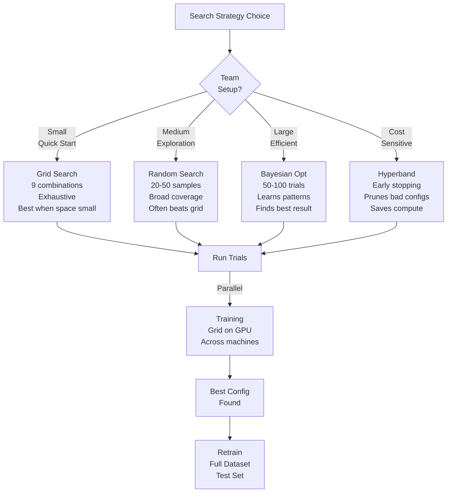
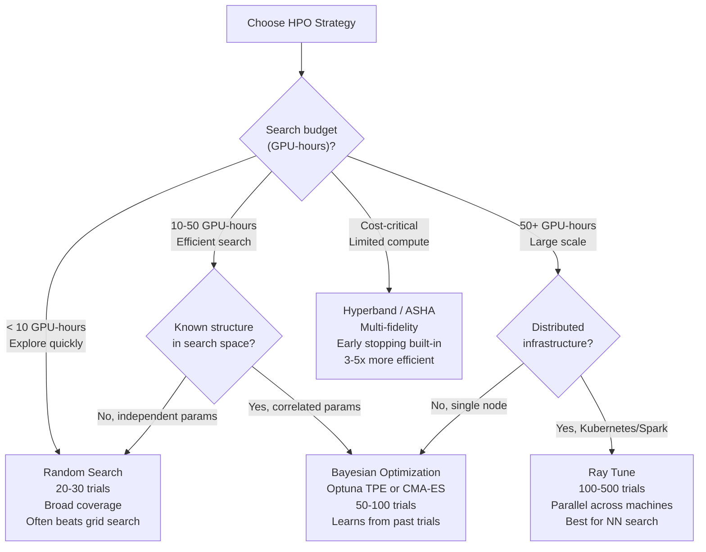

# Hyperparameter Optimization: Finding the Best Model Configuration

## Comprehensive Overview

Hyperparameter optimization (HPO) is the systematic search for model configuration parameters (learning rate, batch size, tree depth, regularization) that maximize performance. Without optimization, teams make arbitrary choices: "learning rate is 0.01" (why?), "batch size is 64" (why not 32?). With optimization, they search parameter space systematically, finding configurations that achieve 1-2% higher accuracy—sometimes worth millions in business impact.

The cost of poor hyperparameter choices is real. A model trained with learning_rate=0.001 achieves 90% accuracy. With learning_rate=0.01, the same model achieves 94%. That 4% difference comes from one parameter, not from new code. Yet teams often overlook this—they retrain from scratch, build features, refactor code. With HPO, they try a few learning rates first (1 hour), find the best, then do other work.

Modern HPO uses intelligent search: grid search (try all combinations), random search (sample randomly), Bayesian optimization (learn from past trials, propose promising parameters), and evolutionary algorithms. Tools like Optuna, Ray Tune, and Hyperband automate this: specify search space, let them find best configuration. Many support distributed search: train 100 models in parallel on 100 machines.

The operational challenge is search scale: 10 parameters × 10 values each = 10B combinations. Can't try them all. Solutions: dimensionality reduction (focus on important parameters), early stopping (kill unpromising runs), parallelization (search across machines), and smart sampling (Bayesian optimization learns which regions to explore).

## How It Works

### Search Strategy Comparison

```
Grid Search:
  Parameters: learning_rate ∈ [0.001, 0.01, 0.1], batch_size ∈ [32, 64, 128]
  Combinations: 3 × 3 = 9
  Trials: 9 models trained
  Best: learning_rate=0.01, batch_size=64 → accuracy=0.95
  Cost: 9 GPU-hours

Random Search:
  Sample 20 random combinations from same space
  Trials: 20 models trained
  Often finds better result than grid (explores more space)
  Cost: 20 GPU-hours
  
Bayesian Optimization:
  Trial 1: learning_rate=0.005, batch_size=50 → accuracy=0.91
  Trial 2: learning_rate=0.02, batch_size=100 → accuracy=0.93 (good)
  Trial 3: learning_rate=0.015, batch_size=90 → accuracy=0.94 (better)
  ...refine search around promising regions...
  Trial 50: learning_rate=0.01, batch_size=64 → accuracy=0.96
  Cost: 50 GPU-hours, but finds better result
  
Early Stopping:
  Trial runs for 100 epochs normally
  If validation loss not improving by epoch 10 → stop, free GPU
  Saves 90% compute for bad configs
```



### HPO Workflow

```
Define Search Space:
  learning_rate: [0.0001, 0.1]
  batch_size: [16, 256]
  dropout: [0.0, 0.5]
  weight_decay: [0.0, 0.01]
    ↓
Select Search Strategy:
  Grid: try all (exhaustive)
  Random: sample randomly (broad exploration)
  Bayesian: learn from trials (efficient)
    ↓
Initialize Study:
  Optuna Study with objective function
  Goal: maximize validation accuracy
    ↓
Run Trials (Parallel):
  Trial 1: lr=0.001, bs=32, drop=0.1, wd=0.0 → val_acc=0.88
  Trial 2: lr=0.01, bs=64, drop=0.3, wd=0.005 → val_acc=0.92
  Trial 3: lr=0.005, bs=128, drop=0.2, wd=0.001 → val_acc=0.91
  Trial 4-100: ...continue trials...
    ↓
Analyze Results:
  Best: Trial 47: lr=0.01, bs=64, drop=0.3, wd=0.005 → val_acc=0.95
  Plot importance: learning_rate most important, batch_size second
  Remove: weight_decay has no effect
    ↓
Retrain on Best Config:
  Use full dataset (not just validation split)
  Final model: accuracy=0.96 (test set)
```

## Tool Comparisons

| Tool | Approach | Strengths | Weaknesses | Best For |
|------|----------|-----------|-----------|----------|
| **Optuna** | Bayesian, open-source | Simple API, strong Bayesian optimization, integrates with PyTorch | Less distributed scaling, smaller community | Small-medium teams, quick iteration |
| **Ray Tune** | Distributed, ML-focused | Excellent parallelization (100s of trials), integrates with Pytorch Lightning | Steeper learning curve, more infrastructure | Large-scale search, distributed teams |
| **Hyperband** | Multi-fidelity, efficient | Early stopping built-in, efficient resource use | Newer tool, smaller ecosystem | Cost-sensitive optimization |
| **Keras Tuner** | Integration, TensorFlow-native | Simple for Keras/TF models, easy to use | Limited to TensorFlow ecosystem | TensorFlow teams, Keras models |
| **Scikit-Optimize** | Bayesian, light-weight | Simple, good for sklearn models | Limited to sklearn, less sophisticated | Sklearn teams, classical ML |

**Decision Framework:**
- **Small team, quick:** Optuna (simplicity)
- **Large-scale, distributed:** Ray Tune (parallelization)
- **Keras/TensorFlow:** Keras Tuner (native integration)
- **Sklearn models:** Scikit-Optimize
- **Cost-optimized:** Hyperband (early stopping)

## Interview Q&A

**Q: You're training a model and unsure about hyperparameters. How do you approach optimization?**

A: (1) Define search space: which parameters matter (learning_rate, batch_size, regularization)? (2) Choose strategy: start with random search (explores broadly), move to Bayesian for refinement. (3) Run trials: ideally in parallel (100 configs × 1 GPU-hour = 100 GPU-hours, parallelized across 10 GPUs = 10 hours). (4) Analyze: plot importance (which parameters matter?), remove non-impactful. (5) Retrain: use best config on full data, evaluate on test set.

**Q: Hyperparameter search is slow. 10 trials/day, but you need 100 trials. How do you speed it up?**

A: (1) Parallelize: run 10 trials in parallel instead of serial (10 GPUs). (2) Early stopping: kill unpromising runs by epoch 10 (saves 90% compute). (3) Reduce dataset: validate on subset during search, full dataset for final retrain. (4) Focus parameters: which matter most? Optimize those first. (5) Multi-fidelity: Hyperband uses cheap approximations (fewer epochs) for initial filtering.

**Q: You found optimal learning_rate=0.01 on small data. Will it generalize to production (larger data)?**

A: Maybe not. Learning rate often depends on batch size: larger batches need higher learning rates (gradient noise lower). On small data: learning_rate=0.01 works. On production (10x more data, 10x bigger batches): might need learning_rate=0.05. Solution: (1) Optimize on representative data (similar scale to production). (2) Fine-tune on production data before deployment. (3) Monitor: if training curve looks off in production, re-optimize.

**Q: How do you handle categorical hyperparameters (model_type ∈ [xgboost, lightgbm, neural_net])?**

A: Bayesian optimization handles categorical parameters. Define search space: model_type as categorical choice. Run trials: each trial trains different model type. Analyze: accuracy by model type. However, may need nested optimization: (1) Compare model types (3 trials). (2) For best model_type, optimize hyperparameters (20 trials). Total: 23 trials, not 3×20=60.

**Q: You want to share optimal hyperparameters across teams. How do you document it?**

A: (1) Registry: central place for hyperparameters (database, wiki, config file). (2) Context: document what data/task these optimal for. (3) Domain: learning_rate=0.01 optimal for NLP tasks, might differ for vision. (4) Validation: show metrics (accuracy on this task with these hyperparams). (5) Evolution: as data/task change, hyperparams may need re-optimization.

## Best Practices

1. **Start Simple:** Grid or random search first (easy to parallelize, understand results). Move to Bayesian if needed.

2. **Define Range Wisely:** learning_rate ∈ [0.0001, 0.1] (log scale). Don't waste on obviously bad ranges.

3. **Validate on Holdout:** Use validation set during search. Test set only at the end.

4. **Parallelize:** Run multiple trials simultaneously. Cost: same total GPU-hours, time reduced by parallelism.

5. **Early Stopping:** Kill unpromising runs. Saves 50-90% compute.

6. **Parameter Importance:** Plot which parameters matter. Often 1-2 matter, others don't.

7. **Report All Results:** Show distribution of accuracies, not just best. Understand search difficulty.

8. **Reproducibility:** Fix random seed. Same search should yield same best hyperparameters.

## Common Pitfalls

1. **Searching Too Many Parameters:** Explosion of combinations. Focus on known important ones.

2. **Search on Test Set:** Optimizing on test data leads to overfitting to test set, poor generalization.

3. **Single Run:** Hyperparameter search has randomness. Run multiple times, report mean ± std.

4. **Ignoring Context:** Learned learning_rate on small data may not work on production scale.

5. **No Time Budget:** Searching indefinitely. Set: "200 GPU-hours max" and stop there.

6. **Missing Analysis:** Know which parameters matter. Reporting "best=0.95" without explaining why.

## Real-World Examples

### Netflix: Recommendation Model HPO

Netflix optimizes 100+ recommendation models:
- Search space: 5-10 important parameters per model
- Strategy: Bayesian optimization (learns from past models)
- Parallelization: 100 trials × 2 GPU-hours = 200 GPU-hours, parallel on 50 GPUs = 4 hours
- Early stopping: validates on 1M user sample, full validation on best
- Result: 1-2% accuracy improvement over default params (worth millions in engagement)

### Stripe: Fraud Model HPO

Stripe optimizes fraud models with cost constraints:
- Goal: high precision (minimize false declines) + high recall (catch fraud)
- Trade-off: changing threshold changes both
- Search: regularization strength (C ∈ [0.001, 100])
- Validation: monthly re-optimization (patterns change)
- Result: achieves 98% precision, 92% recall (improved fraud economics)

### Uber: Pricing Model HPO

Uber optimizes pricing model hyperparameters:
- Parameters: 3 key ones (regularization, depth, learning_rate)
- Scale: distributed search across 100 machines
- Cost: optimize for accuracy + latency (<50ms inference)
- Trade-off: deeper models (better accuracy, slower). Search finds sweet spot.

## Sample Interview Questions

1. "Design a hyperparameter optimization system for your team."

2. "100 models, each needs HPO. How do you prioritize?"

3. "Optimal hyperparameters changed when data grew 10x. Why? How do you reoptimize?"

## Interview Case Study

**Scenario:** You're training XGBoost models for fraud detection. Hyperparameter choices affect accuracy significantly. Design an HPO strategy.

**Solution Walkthrough:**

1. **Define Search Space:**
   ```
   max_depth: [2, 3, 4, 5, 6, 8, 10]
   learning_rate: [0.001, 0.01, 0.05, 0.1]
   subsample: [0.5, 0.7, 1.0]
   colsample_bytree: [0.5, 0.7, 1.0]
   ```

2. **Strategy:**
   - Grid search: 7 × 4 × 3 × 3 = 252 combinations (too many)
   - Random search: sample 50 random configs
   - Better: Bayesian optimization with 50 trials

3. **Parallelization:**
   ```
   Trials: 50
   GPU-hours per trial: 2
   Total: 100 GPU-hours
   Parallelism: run 10 trials in parallel on 10 machines
   Wall time: 10 hours (not 50 hours)
   ```

4. **Early Stopping:**
   ```
   Train for 100 boosting rounds normally
   If validation metric not improving for 10 rounds → stop
   Saves 90% for bad configs
   Actual: 100 GPU-hours with ES = 30-50 GPU-hours
   ```

5. **Analysis:**
   - Plot importance: max_depth > learning_rate > subsample
   - Remove: colsample_bytree has no effect
   - Best config: max_depth=6, learning_rate=0.05, subsample=0.7

6. **Retrain & Validate:**
   - Retrain on full training set (not validation split)
   - Evaluate on held-out test set
   - Compare with baseline (default hyperparams)
   - Document: "optimal hyperparams achieve 0.95 accuracy vs 0.91 baseline"

**Strong vs Weak Answers:**

Strong: "Define search space (important parameters only). Use Bayesian optimization with 50 trials. Parallelize across GPUs (50 trials = 10 hours on 10 GPUs). Early stopping: kill bad configs by epoch 10. Analyze importance: which parameters matter. Retrain on best config, validate on test set. Result: typically 1-2% accuracy improvement."

Weak: "Try learning_rate=0.1, 0.01, 0.001." (Only 3 values, no systematic approach, no parallelization, no analysis)

---

## Related Concepts

- **Concept 05:** Experiment Tracking — Logging HPO trials
- **Concept 08:** Hyperparameter Optimization — This concept
- **Concept 06:** Model Versioning — Storing best models from HPO

## Resources

- Optuna: https://optuna.org/
- Ray Tune: https://docs.ray.io/en/latest/tune/
- Hyperband: https://arxiv.org/abs/1603.06393
- Keras Tuner: https://keras.io/keras_tuner/

---

## Quick Reference Card

### 2-Minute Elevator Pitch
Hyperparameter optimization is the systematic process of finding the configuration that maximizes model performance — and it delivers more value per engineering hour than almost any other ML activity. Random search over 50 configurations typically outperforms careful manual tuning. Bayesian optimization over 100 trials typically adds another 1-3% accuracy on top of random search. The key insight: learning rate and regularization account for 80% of the variance in model performance; optimizing these two parameters first is almost always sufficient. The rest is configuration details.

### Numbers to Know
- Learning rate sensitivity: moving from lr=0.1 to lr=0.01 can change accuracy by 3-5%; from 0.01 to 0.001 by 1-2%
- Batch size effect: doubling batch size requires increasing learning rate by ~√2 to maintain same convergence (square root scaling rule)
- Random search vs. grid search: random search finds equally good results with ~20% fewer trials (Bergstra & Bengio, 2012)
- Bayesian optimization efficiency: reaches 95% of maximum performance in 3-5x fewer trials than random search on typical benchmarks
- Early stopping savings: stopping at 20% of epochs for unpromising runs saves 70-80% of compute
- Hyperband efficiency: achieves same result as 100-trial random search with ~30 GPU-hours instead of 100
- Diminishing returns: after 50-100 trials with Bayesian optimization, improvements are typically <0.1% per additional trial
- Key parameters to always optimize: learning_rate (log scale, 1e-5 to 1e-1), batch_size (powers of 2: 16-512), dropout (0.0-0.5), weight_decay (log scale, 1e-6 to 1e-1)

### Decision Framework: Which HPO Strategy to Use



---

## Strong vs Weak Answers

### Q: You have a budget of 50 GPU-hours for hyperparameter optimization on a transformer model. How do you use it?

**Weak Answer:** "I would try different values of learning rate and batch size using grid search, then pick the best combination."

**Strong Answer:** "I'd allocate budget across three phases. Phase 1 (10 GPU-hours): rough exploration with random search over 20 trials. Search space: learning_rate (log-uniform 1e-5 to 1e-2), batch_size (16, 32, 64, 128), warmup_ratio (0.0 to 0.15). Each trial trains for 20% of full epochs, which is enough to distinguish promising from unpromising configurations. Phase 2 (30 GPU-hours): Bayesian optimization (Optuna TPE) with 50 trials, narrowed search space based on Phase 1 (focus on regions that showed promise). Train each trial for 50% of epochs with early stopping. Phase 3 (10 GPU-hours): retrain the top 3 configurations on full epochs with different random seeds (3 seeds each) to estimate variance and confirm the winner. This staged approach is how Hugging Face recommends HPO for language models — it avoids wasting compute on obviously bad regions while still exploring broadly. Expected result: 2-4% accuracy improvement over default hyperparameters, which at Netflix scale is worth millions in recommendation quality."

---

### Q: Optimal hyperparameters from a 1M-sample dataset don't transfer to a 100M-sample production dataset. Why, and what do you do?

**Weak Answer:** "The model might be overfitting on small data. I would re-run hyperparameter optimization on a larger dataset."

**Strong Answer:** "This is a well-documented phenomenon. When data scale increases 100x, several hyperparameters change their optimal values: (1) Learning rate: larger datasets benefit from higher learning rates (more gradient signal per update reduces noise, allows faster convergence) — the linear scaling rule suggests increasing lr proportionally with batch size. (2) Batch size: with 100M samples, larger batches (512-2048) improve GPU utilization without the variance problem that occurs on small datasets. (3) Regularization: with more data, the model is naturally less prone to overfitting, so optimal weight_decay and dropout are typically lower on large datasets. (4) Warmup: larger datasets with larger batches benefit from longer warmup periods. My approach: rather than re-running full HPO on 100M samples (expensive), I'd use a dataset-scale proxy search — run HPO on a stratified 5% sample (5M samples), which is 5x larger than the original but 20x cheaper than the full dataset. Then validate the top 3 configurations on the full dataset. This is the approach Google Brain used when scaling BERT fine-tuning across dataset sizes."

---

### Q: How do you share and reuse optimal hyperparameters across teams in a large organization?

**Weak Answer:** "I would document the best hyperparameters in a wiki or README file so other teams can reference them."

**Strong Answer:** "Manual documentation has a fundamental problem: it goes stale within months as datasets, model architectures, and libraries evolve. I'd build a living hyperparameter registry integrated with the experiment tracking system. Structure: each 'hyperparameter configuration' entry contains: model_architecture (bert-base, xgboost), task_type (classification, regression), dataset_characteristics (size, class balance, domain), optimal_config (the parameter values), expected_performance_range (accuracy 0.91-0.93), and a pointer to the experiment run that validated it. The registry is queryable: 'Show me XGBoost configurations for imbalanced binary classification datasets with >1M rows.' Teams submit new configurations after completing HPO, and the system tracks whether submitted configs hold up over time (if a config degrades when retested 6 months later, it's flagged). This is similar to what Google's Vizier service does internally — a hyperparameter recommendation service that learns across all of Google's models."

---

## System Design: Distributed HPO for a Large-Scale Search Ranking Model

**Question:** "You're the ML lead at an e-commerce company (think Amazon). The search ranking model has 12 important hyperparameters and trains on 100M query-product pairs. Current search is manual (engineers try values they 'feel' are good). Design a systematic HPO system that finds better hyperparameters within a $10K compute budget."

**Walkthrough:**

1. **Identify the 12 parameters and their types.** Learning rate (continuous, log scale), batch size (discrete, powers of 2), warmup steps (discrete, 500-5000), dropout (continuous, 0-0.5), weight decay (continuous, log scale), max sequence length (discrete, 128-512), hidden size (discrete, 256-1024), number of attention heads (discrete, 4-16), feed-forward dimension (discrete, 512-4096), layer normalization epsilon (continuous, log scale), label smoothing (continuous, 0-0.3), gradient clipping (continuous, 0.5-5.0).

2. **Estimate compute budget.** $10K / $2 per GPU-hour (A100) = 5,000 GPU-hours. Full training on 100M samples takes ~50 GPU-hours. So I can afford 100 full runs — reasonable for Bayesian optimization.

3. **Reduce effective search space.** Start with parameter importance analysis: run 20 random trials and use Optuna's `fanova` module to compute feature importance. Typically, 3-4 parameters account for 80% of variance (learning rate, batch size, warmup, dropout). Fix the others to reasonable defaults and search only the important ones. This reduces search space from 12 to 4 dimensions.

4. **Multi-fidelity strategy.** Use Hyperband (ASHA scheduler in Ray Tune): start all 100 trials, but kill the bottom 50% at 10% of training epochs (5 GPU-hours each), kill the bottom 50% of survivors at 33% of epochs, and let only the top 12 run to completion. Total compute: (50 × 5) + (25 × 16) + (12 × 50) = 250 + 400 + 600 = 1,250 GPU-hours — 4x more efficient than running all 100 to completion.

5. **Distributed execution with Ray Tune.** Deploy a Ray cluster on 10 GPU machines. Ray Tune distributes trials across machines, handles failed trials automatically, and provides real-time visualization. Search algorithm: Optuna TPE (Tree-structured Parzen Estimator) — learns which regions of parameter space produce good results and samples from them preferentially.

6. **Validation protocol.** Use a fixed validation set of 5M samples (stratified by query type) — the same set for all trials. This ensures fair comparison. Primary metric: NDCG@10 on the validation set. Guardrail: latency <100ms on a representative 10K query sample.

7. **Early stopping within trials.** Each trial uses learning rate warmup + cosine decay with early stopping: if validation NDCG@10 doesn't improve for 3 consecutive epochs, stop the trial. Saves 30-50% of compute on plateau runs.

8. **Budget allocation: reserve for retraining.** Allocate: 60% of budget (3,000 GPU-hours) for the search. 25% (1,250 GPU-hours) for retraining the top 5 configurations on full data with 3 different seeds each. 15% (750 GPU-hours) contingency for re-exploration if search results are poor.

9. **Analysis of search results.** After search: plot hyperparameter importance, parallel coordinates plot (which parameter combinations correlate with high NDCG?), and learning curves for top 10 trials. Document insights: 'For this model, learning_rate=0.0003 and warmup_steps=2000 are critical; batch_size and dropout have lower impact.'

10. **Integration with deployment pipeline.** The optimal configuration is automatically written to the model's config file and versioned in git. The deployment CI/CD pipeline reads this config — no manual copy-paste. Future retraining runs inherit the optimal config. Every 6 months, re-run HPO on the latest data (model distribution shifts, optimal hyperparameters may change).

**Key decisions:**
- Multi-fidelity (Hyperband) over pure Bayesian: Hyperband's early stopping makes it 3-5x more compute-efficient for large models where training is expensive
- Parameter importance before full search: reduces 12-dimensional search to 4-dimensional, dramatically improving search efficiency
- Fixed validation set for all trials: ensures fair comparison; a dynamic validation set would contaminate comparisons with data variance
