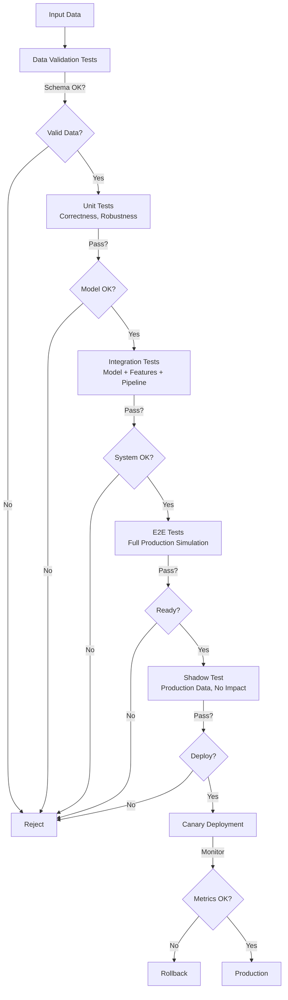
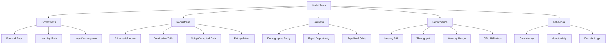

# Model Testing: Ensuring Production-Ready ML Systems

## Definition & Why It Matters

Model testing is the systematic evaluation of ML models across multiple dimensions: correctness, robustness, fairness, and performance. Unlike traditional software testing which validates against a fixed specification, model testing addresses the probabilistic nature of ML—a model with 95% accuracy is *expected* to fail on 5% of inputs, yet we must ensure those failures are acceptable.

**Why it matters in production:**
- **Prevents silent failures**: A model predicting wrong is worse than crashing; at least crashes are detected
- **Catches distribution shifts**: Training data may not represent production, and tests must catch this
- **Validates fairness**: Biased models compound harm at scale (lending, hiring, healthcare)
- **Meets compliance**: Financial, healthcare, and legal domains require audit trails
- **Enables iteration**: Without comprehensive tests, you can't safely improve models

Production systems treat model testing as seriously as software testing. Google's Google Cloud AI Principles mandate model testing before deployment; Netflix tests recommendation models on millions of user sessions; Stripe validates fraud models with weekly backtests.

---

## How It Works

### The Testing Pyramid

Model testing has multiple layers, each catching different categories of failures:

```
┌─────────────────────────────────────────────┐
│   E2E Tests (full pipeline with real data)  │  Slow, realistic
├─────────────────────────────────────────────┤
│   Integration Tests (model + data + features)
├─────────────────────────────────────────────┤
│   Model Tests (unit tests on model predictions) │ Fast
├─────────────────────────────────────────────┤
│   Data Tests (input quality, schema)        │
└─────────────────────────────────────────────┘
```



### Categories of Model Tests



**1. Correctness Tests** — Does the model work at all?
- Does the model produce sensible outputs on known inputs?
- Does it learn from training data? (loss decreasing)
- Can it overfit on small dataset? (sanity check)

Example: Test that a pretrained BERT model outputs higher similarity scores for paraphrases than for random sentences. Fraud model should assign higher scores to known fraud transactions than legitimate ones.

**2. Robustness Tests** — Does it handle edge cases and distribution shifts?
- How does the model behave on adversarial inputs? (intentional perturbations)
- What about rare cases in the tail of the distribution? (outliers)
- Does it gracefully degrade with corrupted inputs? (missing values, NaN, outliers)
- How does it perform on out-of-distribution data? (different geographies, time periods)

Example: Fraud model tested on transactions from 100+ countries, edge cases (midnight, holidays, max amount, zero amount, duplicate transactions). Models often fail on geographic shifts (model trained on US data, deployed to EU).

**3. Fairness Tests** — Is it biased?
- Does performance vary across demographic groups? (age, gender, geography)
- Are error rates equal across classes? (disparate impact)
- Is the model bias-aware and documented? (audit trail)
- Can users opt-out if they're harmed? (legal requirement)

Example: Lending model tested separately for male/female applicants, must have <1% performance gap. Netflix recommendation system measured separately for new users (cold start fairness) and long-term users (engagement fairness).

**4. Performance Tests** — Can it serve production traffic?
- What are latency and throughput SLOs? (p99 latency, requests/sec)
- How much memory and compute are required? (per-request and total)
- Can it handle traffic spikes? (auto-scaling, queue depth)
- What's the cost per prediction? (GPU hours, API calls)

Example: Real-time recommendation model must infer <50ms for a user profile lookup from 100M users with <2GB memory. Stripe fraud model must handle 500K transactions/second with <100ms latency.

**5. Behavioral Tests** — Does it follow domain rules?
- Does the model behave consistently across runs (given same seed)?
- Does it produce monotonic outputs where expected? (longer text shouldn't lower score, higher income shouldn't lower credit score)
- Does it follow domain logic? (prices shouldn't be negative, probabilities should be [0,1])
- Are outputs calibrated? (confidence matches accuracy)

Example: Credit scoring model should not lower scores if income increases. Recommendation model should not recommend the same item twice to one user. Fraud model confidence should match actual fraud rate (if confidence = 0.95, fraud should happen ~95% of the time).

### The Testing Workflow

1. **Unit tests on model**: Correctness, robustness on synthetic/controlled data
2. **Integration tests**: Model + feature store + data pipelines
3. **Backtesting**: Run model on historical data (cheaper than A/B tests)
4. **Shadow testing**: Run model in production but don't use predictions (real data, zero risk)
5. **Canary deployment**: Small % of traffic uses new model, monitor metrics
6. **A/B testing**: Production randomized experiment with statistical validation
7. **Monitoring**: Continuous evaluation in production (drift detection, feedback loops)

---

## Interview Q&A: Model Testing

### Q1: "Model achieves 95% accuracy on test set. Is it ready for production?"
**Answer outline:** Not necessarily. Accuracy is one dimension; ask:
1. **Test set composition**: Is it representative of production? (distribution shift is common)
2. **Class balance**: On balanced data? Accuracy is misleading on imbalanced (95% on fraud = useless if 95% of all txns are legitimate)
3. **Performance on subgroups**: Does accuracy vary across geographies, user types, time periods?
4. **Latency**: Can it serve real-time requests within SLO (e.g., <100ms)?
5. **Failure modes**: What kind of errors occur? Are they acceptable? (false positives vs false negatives)
6. **Monitoring**: Is production instrumentation ready? Can you detect accuracy drops?

**Strong answer:** "I'd check: (1) whether test set represents production—common issue, (2) fairness across groups, (3) latency/throughput on live traffic pattern, (4) acceptable error types, (5) monitoring in place to catch degradation."

### Q2: "How do you test a model with delayed labels? (e.g., fraud detected weeks later)"
**Answer outline:** Delayed labels break standard train-test-validation. Solution:
1. **Backtest on historical data**: Retrain model on data before a cutoff date, evaluate on held-out period. Compare: what model would have predicted vs what actually happened weeks later.
2. **Simulation**: Use labels available at test time as proxy (immediate fraud signals), measure agreement with delayed labels
3. **Production shadow testing**: Run model, store predictions, match with delayed labels when they arrive
4. **Feedback loops**: Monthly batch job: match predictions to labels, compute accuracy, alert if performance dropped

Example: Stripe fraud model trained on data through April 30, tested on May 1-30 behavior vs fraud labeled in June.

### Q3: "Model fails on tail cases (1% of data). How do you catch this in testing?"
**Answer outline:** 
1. **Stratified test split**: Ensure test set includes tail cases in proportion they appear in production
2. **Separately test tail**: Create holdout set of only tail cases, measure accuracy
3. **Synthetic tail generation**: Augment test data with edge cases (max values, combinations)
4. **Shadow testing**: Run model in production, collect failure cases, add to next training round
5. **Behavioral tests**: Define domain rules (latency shouldn't increase beyond X, scores shouldn't be negative), test against them

Strong approach: "Identify tail cases empirically—which 1% causes problems? Then: (1) ensure test set stratifies them, (2) add synthetic examples, (3) shadow test to catch production surprises."

### Q4: "How do you test fairness in a recommendation model?"
**Answer outline:** Fairness testing for ranking/recommendations differs from classification:
1. **Representation**: Measure if items/creators appear proportionally across demographics
2. **Calibration**: Does ranking quality vary across user demographics? (personalization fairness)
3. **Filter bubbles**: Does the model lock users into narrow content? (diversity metric)
4. **Feedback loops**: As model recommends, does it amplify biases over time? (long-term fairness)

Example: Spotify must ensure recommendations don't: (1) suppress artists by minority groups, (2) lock users into one genre, (3) recommend only popular songs (exclude emerging artists).

### Q5: "How do you design a test for latency and throughput?"
**Answer outline:** Performance testing requires realistic load and production patterns:
1. **Define SLO**: "p99 latency <50ms for single prediction," "throughput 10K pred/sec on 1 GPU"
2. **Load test**: Use load testing tool (Locust, k6) to simulate production traffic
3. **Test at scale**: Production may have batch requests (1000 samples), real-time requests (1 sample), or variable batch sizes—test all
4. **Test under memory pressure**: What happens when GPU memory fills? (batching reduces throughput)
5. **Test with model updates**: Does latency change when switching to new model size?

Production example: Netflix tests recommendation inference with millions of concurrent users → must optimize for throughput, not just latency.

### Q6: "Your model is trained on 2020 data. It's now 2026. How do you test for drift?"
**Answer outline:** Concept drift: distribution changes over time. Testing strategy:
1. **Backtest on historical time windows**: Train on 2020-2021, test on 2022, retrain on 2020-2022, test on 2023, etc. Does performance degrade monotonically?
2. **Compare input distributions**: Compute statistical distance (KL divergence, Kolmogorov-Smirnov test) between training and production data
3. **Monitor output distributions**: Are predictions drifting (average prediction changing)?
4. **Test specific drift types**: For fraud, test on seasonal patterns (holiday fraud spikes differently), new fraud types (new payment methods)
5. **Retrain cadence**: Quarterly? Monthly? Based on drift detection results

Example: Uber's demand model trained 5 years ago will fail—traffic patterns, user behavior, competitor landscape have changed. Must retrain and monitor continuously.

---

## Best Practices

1. **Test the data pipeline, not just the model**: Model can't overcome bad features. Test feature freshness, computation correctness, distribution changes.

2. **Create a baseline model**: Test new models against the current production model, not perfection. Is +0.5% accuracy worth the complexity increase?

3. **Separate concerns**: Unit test components (tokenizer, feature scaler) independently, then test integration.

4. **Use production-representative data**: Synthetic test data finds different bugs than real data. Always shadow-test on real data before canary.

5. **Measure error distributions, not just aggregates**: Which types of errors does the model make? False positives or false negatives? On which data? Helps prioritize improvements.

6. **Test for consistency**: Same input should produce same output (given same seed). Reproducibility is critical for debugging.

7. **Document acceptable error rates**: Not all errors are equal. Define tolerance: fraud model must catch 99% of fraud (high recall). Lending model must have <0.5% false positive rate for protected groups.

8. **Test in production (carefully)**: Shadow testing reveals issues synthetic tests miss. A/B testing validates business impact.

9. **Automate regression testing**: Every model release should run full test suite (unit → integration → shadow → monitor). Catches regressions immediately.

10. **Test the monitoring system**: Monitoring that doesn't alert is useless. Test that alerts trigger when accuracy actually drops.

---

## Common Pitfalls

1. **Only testing on aggregate metrics**: Accuracy of 95% can hide 50% accuracy on a critical subgroup. Always stratify.

2. **Ignoring class imbalance**: Test set imbalance mirrors training. A balanced test set that doesn't match production is misleading.

3. **Training on test set leakage**: Future information leaks into test set (e.g., using next day's weather to predict weather). Causes inflated metrics; real performance is much worse.

4. **No production monitoring**: Tests pass, model deploys, accuracy quietly drops in production. No one notices for weeks. Must monitor continuously.

5. **Testing without knowing acceptable error rate**: Is 2% error rate good or bad? Depends on domain. For medical diagnosis, <0.1% might be required.

6. **Synthetic data only**: Synthetic test data is clean and well-distributed. Real data has corruption, imbalance, edge cases synthetic data lacks.

7. **Testing model but not data pipeline**: Model works on clean data. Real pipeline has delays, errors, corruption. Integration tests catch these.

8. **No fairness testing**: Model fair on average but biased against minorities. Fairness tests required by law in many domains.

9. **Testing accuracy but not latency**: Model is 98% accurate but takes 10 seconds per prediction. Useless in production if SLO is <100ms.

10. **Assuming test set is permanent truth**: Production distribution changes. Tests that pass in month 1 fail in month 6. Continuous monitoring required.

---

## Real-World Examples

### Example 1: Google's BERT Testing
Google tests BERT before production deployment with:
- **Semantic similarity benchmark**: BERT should rank paraphrases higher than random sentences
- **Robustness**: Tested on adversarial examples (grammatically correct but semantically wrong sentences)
- **Cross-lingual fairness**: Does performance vary across 100+ languages?
- **Latency tests**: Inference must complete in <100ms on live traffic

Result: Catches that BERT fine-tuning on small datasets (e.g., 5K examples) can overfit; larger models sometimes underperform smaller ones on specific languages.

### Example 2: Stripe's Fraud Model Testing
Stripe tests fraud detection with:
- **Stratified test split**: Ensures test set represents all transaction types (geography, currency, MCC, payment method)
- **Fairness tests**: Measures false positive rate across countries (high FP in emerging markets damages trust)
- **Delayed label testing**: Matches predictions made 3 days ago to fraud labels that arrived today
- **Shadow testing**: Model runs on live traffic, predictions logged but unused, accuracy computed daily

Result: Caught that model trained in US performs poorly in India (different fraud patterns, regulatory requirements). Now country-specific models.

### Example 3: Netflix's Recommendation Testing
Netflix tests recommendation models on:
- **Diversity metrics**: Does model recommend only popular shows? Tests ensure <50% of recommendations are top 100 shows
- **A/B testing at scale**: New recommendation model tested on millions of users (not statistically valid to test on 1000 users)
- **Long-term fairness**: Does model amplify its own biases over time? (as users watch recommendations, does model narrow their choices?)
- **Cold-start testing**: How does model recommend to new users with no history?

Result: Ensures recommendations balance: popularity (users want to watch good shows) and discovery (users want to find new shows).

---

## Sample Interview Case Study

**Scenario:** Build recommendation system for DoorDash. 50M users, 500K restaurants. Model must recommend restaurants to order from.

**Testing strategy:**

1. **Correctness test**: Does model rank user's favorite restaurant higher than random ones?

2. **Fairness test**: Does recommendation quality vary by neighborhood? (model shouldn't favor wealthy areas)

3. **Latency test**: Must return 10 recommendations in <100ms (user waiting in app)

4. **Behavioral test**: If user rates restaurant 5 stars, should model increase its ranking? (consistency check)

5. **Cold-start test**: New user, new restaurant—can model recommend appropriately?

6. **Drift test**: Seasonal patterns (ice cream in summer, soup in winter)—does model adapt?

7. **Shadow test**: Run model on live traffic for 1 week, compare recommendations to what users actually click

8. **A/B test**: 50% users see old model, 50% see new model. Measure: CTR, conversion rate, user satisfaction

**Strong answer:** "I'd test: (1) correctness on known user preferences, (2) fairness across neighborhoods, (3) latency <100ms, (4) consistency (high-rated restaurants ranked higher), (5) cold-start handling, (6) seasonal drift detection, (7) 1-week shadow test on live traffic, (8) A/B test with 1M users to validate business impact."

---

## Key Takeaways

**Model testing is not optional**—it's as critical as software testing. The testing pyramid (data → model → integration → E2E) ensures correctness at each layer.

**Tests must be production-representative**. Synthetic data and clean splits catch different bugs than real, messy, shifting production data. Always shadow-test.

**Multiple dimensions matter**: correctness, robustness, fairness, latency, throughput. A high-accuracy model that's biased or slow is production-ready.

**Continuous monitoring is part of testing**. Tests on static data catch training bugs; monitoring on live data catches production bugs.

**Common interview question pattern:** "Model works in testing. Why does it fail in production?" Answer: "Distribution shift, fairness issues, latency SLO not met, or monitoring not detecting silent failures. Must shadow-test and monitor continuously."

---

## Related Concepts

- **Data Testing** (Concept 10): Ensures input quality
- **A/B Testing** (Concept 11): Production validation with statistical rigor
- **Evaluation Metrics** (Concept 12): Which metrics to optimize
- **Model Monitoring** (Concepts 19-20): Continuous production evaluation
- **Deployment Strategies** (Concept 16): Canary, shadow, blue-green testing in deployment
