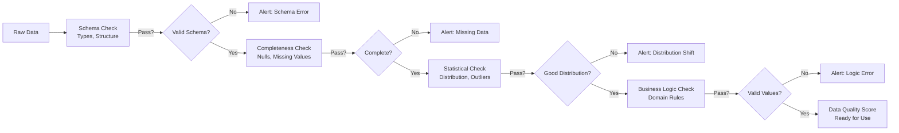
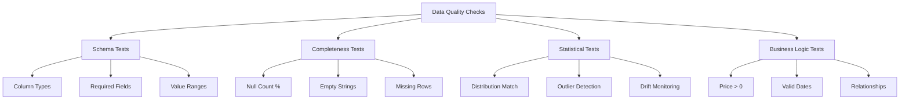
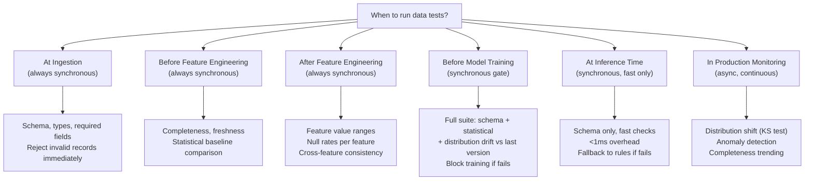

# Data Testing: Validating Input Quality for Production ML

## Definition & Why It Matters

Data testing validates that input data meets quality standards before training or inference. Unlike model testing (which validates predictions), data testing ensures the *inputs* to the model are correct, complete, and representative of the production distribution.

**The data quality problem:** Most ML failures are data failures, not model failures. Bad data flows silently through pipelines—no errors, just wrong predictions. Google found that 90% of ML bugs are data problems, not code. Stripe detected $50K in fraud losses monthly from data quality issues (transactions with missing merchant data, leading to wrong model features).

**Why testing matters:**
- **Silent failures**: Corrupt data produces confidently wrong predictions
- **Cascading issues**: Bad data in training breaks all downstream models
- **Compliance**: Financial/healthcare models must validate data lineage and quality
- **Cost**: Retraining on 1 month of bad data = wasted compute and delayed improvements
- **Trust**: Data quality is foundation of model trustworthiness

Production systems treat data testing as equally important as model testing. Netflix validates 1000+ features daily; Stripe validates 500+ data attributes pre-training; Uber validates real-time event streams continuously.

---

## How It Works

### The Data Testing Layers

```
Input Data
    ↓
[Schema Validation] - column types, required fields, value ranges
    ↓
[Completeness Check] - null counts, empty strings, missing required features
    ↓
[Statistical Validation] - distributions, outliers, changes from baseline
    ↓
[Business Logic Validation] - domain-specific rules (prices > 0, dates valid)
    ↓
[Data Contracts] - formal agreement: this data has X properties
    ↓
Clean Data (safe for training/inference)
```





### Categories of Data Tests

**1. Schema Validation**
- Do columns have correct types? (amount is float, not string)
- Are required columns present?
- Are ranges correct? (age 0-150, price > 0)

Example: Order data must have `user_id (int)`, `merchant_id (int)`, `amount (float > 0)`, `timestamp (datetime)`.

**2. Completeness Tests**
- What % of rows have nulls?
- Which columns are always required?
- What's the impact if a feature is missing?

Example: 5% of transactions missing `merchant_category` → feature engineering must handle null values, or drop 5% of data?

**3. Statistical Validation**
- Is the distribution what we expect?
- Are there sudden shifts (distribution drift)?
- Are there unexpected outliers?

Example: Transaction amounts: p99 usually $5K. Today p99 is $50K. Unusual or fraud spike? Must investigate.

**4. Business Logic Validation**
- Do amounts satisfy business rules? (price > 0, no negative quantities)
- Are dates in valid range? (not from future, not before company founding)
- Do relationships make sense? (order date < delivery date)

Example: Listing price can't be negative, address must be in valid country list.

**5. Data Contracts**
- Formal agreement between data producer and consumer
- Specifies: schema, quality thresholds, latency, completeness
- Enables automated validation

Example: "Orders table: schema fixed, 99.9% completeness guarantee, updated within 5 minutes of creation."

### Testing Strategy

1. **Baseline validation**: Know what "good" looks like from historical data
2. **Schema checks**: Type, required fields, ranges
3. **Freshness checks**: Is data up-to-date? (timestamps in last hour, not from yesterday)
4. **Distribution monitoring**: Compare production to training distribution
5. **Anomaly detection**: Sudden spikes in null %, outlier values, new categories
6. **Automated alerts**: Alert when quality degrades, block pipeline if critical

---

## Interview Q&A: Data Testing

### Q1: "What makes data 'production ready'?"
**Answer outline:** Production-ready data meets:
1. **Schema**: Fixed schema (column names, types won't change mid-pipeline)
2. **Completeness**: <1% nulls for critical features, <5% for optional
3. **Freshness**: Timestamps within SLA (e.g., within 1 hour of event)
4. **Statistical**: Distribution matches training data (KS test p > 0.05)
5. **Validity**: No invalid values (negative prices, impossible dates)
6. **Idempotency**: Same input twice produces same output (no duplicates within expected time window)
7. **Documentation**: Schema documented, known issues tracked

Example: Orders table is production-ready when: schema locked, 99.9% of orders have amount/merchant_id/timestamp, <5% have missing category, amounts > 0, timestamps from last week.

### Q2: "1% of transactions missing merchant_id. How do you handle it?"
**Answer outline:** Options depend on impact:
1. **Drop**: If merchant_id critical and 1% is acceptable loss, filter rows
2. **Impute**: Fill with most common merchant (loses information but keeps data)
3. **Features without it**: Train model without that feature (slower, less accuracy)
4. **Alert and block**: If 1% is abnormal, something is wrong—investigate

Decision framework:
- Critical feature + can't impute → drop rows if loss is acceptable
- Feature can be derived → recompute (e.g., merchant_id from transaction ID)
- Unexpected missing → alert, investigate root cause

Example: Stripe lost $100K in fraud due to 5% missing merchant category. Model couldn't detect category-based fraud. Solution: require category, fail upstream if missing.

### Q3: "Production data distribution shifted from training. Model accuracy dropped 3%. What do you check?"
**Answer outline:** Distribution shift root causes:
1. **Data quality degradation**: Is null % increasing? New outliers? Check schema changes.
2. **Upstream pipeline changes**: Did feature definition change? Did data source change?
3. **Real-world shift**: Legitimate distribution change (seasonality, new user cohort)
4. **Labeling delay impact**: If labels arrive late, evaluation might be on stale data

Diagnosis:
- Run KS test (training dist vs production dist) on each feature
- Identify which features shifted the most
- For top features, compare: value ranges, null %, type distribution
- If schema unchanged but values changed → real-world shift (expected sometimes)
- If schema changed → pipeline bug (urgent)

Example: Netflix saw 5% accuracy drop. Investigation: new countries added to product. User behavior different. Solution: retrain with new country data, segment model by region.

### Q4: "Design data validation for a real-time fraud model. 500M+ transactions/day."
**Answer outline:** Real-time validation at scale requires:
1. **Streaming validation**: As transactions arrive, validate immediately
2. **Fast checks**: Schema, type, range (can't afford 10s latency)
3. **Sampling-based stats**: Can't track all features in real-time; use reservoir sampling
4. **Alert strategy**: Alert on critical issues (5% null rate), warn on warnings (1% outlier jump)
5. **Fallback behavior**: Invalid transaction → use previous day's model/features, or reject

Implementation:
- Stream processor (Kafka, Spark Streaming)
- Checks: schema (instant), ranges (instant), statistical (minute-level aggregates)
- Monitoring: emit null%, outlier%, drift metrics every minute
- Alert: automatic alert if metric exceeds threshold

Example: Stripe validates every transaction in <100ms. Check: amount > 0, currency valid, merchant_id not null. Alert: 1% of txns now from new country (investigate). Block: if schema broken (new field without validation).

### Q5: "How do you prevent data leakage in train-test split?"
**Answer outline:** Data leakage: information from test set leaks into training. Model seems great, fails in production.

Common leakage sources:
1. **Future information**: Using next day's price to predict today's price
2. **Label leakage**: Using columns correlated with label but not available at prediction time
3. **Temporal leakage**: Training on data that includes test period
4. **Duplicates**: Same sample in train and test sets

Prevention:
- **Temporal split**: If data has timestamps, split by time (train on old, test on new)
- **Remove high-correlation columns**: Identify columns perfectly correlated with label, remove them
- **Domain review**: Have domain expert check: can this feature exist at prediction time?
- **Validation on holdout time period**: Test on data from future time period, not just random split

Example: Uber predicted ETA. Leaked features: delivery_duration_seconds (the thing you're predicting!). After removing, accuracy dropped from 95% to 85%. Real model.

---

## Best Practices

1. **Define data contracts early**: Document what each table/stream should contain. Enables automated validation.

2. **Version your validation rules**: As business logic changes, validation rules change. Track versions.

3. **Test the data pipeline, not just raw data**: Bugs in transformations create bad features. Test intermediate steps.

4. **Use sampling for large datasets**: Can't validate 1B rows; sample 1M and extrapolate.

5. **Monitor data quality continuously**: Set up daily dashboards: null%, outlier count, distribution shifts.

6. **Fail fast on critical issues**: If required field is 50% null, stop the pipeline. Don't train on garbage.

7. **Document acceptable values**: For each feature, document: range, expected null%, categories. Update when business logic changes.

8. **Test data freshness**: Stale data is bad data. Validate timestamps, check SLAs.

9. **Catch distribution shift early**: Weekly KS test comparing production to training. Alert on p-value < 0.01.

10. **Automate everything**: Data validation can't be manual. Every check automated, every alert monitored.

---

## Common Pitfalls

1. **No validation at all**: "The upstream team checks it." They don't. You're responsible.

2. **Validation only at training time**: Should validate at inference time too. Bad data will cause bad predictions.

3. **Silent failures**: Validation fails but doesn't alert. Model trains on bad data. Discovered too late.

4. **Threshold too loose**: Alert on 5% nulls, but 1% is already breaking. Thresholds must be tight.

5. **No temporal validation**: Don't check timestamps. Data from 2020 gets mixed with 2023 data.

6. **Ignoring distribution shift**: "Accuracy is still 95%." Maybe, but distribution changed. Retrain.

7. **No version control on schemas**: Schema changes without tracking. "Which version is production using?"

8. **Testing only final data**: Bugs in transformations get hidden. Test intermediate steps.

9. **No fairness checks in data**: Data might be biased (training set 95% from one country, 5% from another). Catches models.

10. **Assuming lab validation applies to production**: Lab has clean data. Production has mess. Always validate production data.

---

## Real-World Examples

### Example 1: Stripe Data Quality Incident
Stripe discovered 5% of transactions missing `merchant_category`. Root cause: new payment method (digital wallet) had null category. Impact: fraud model couldn't detect category-based patterns. Loss: $100K/month.

**Fix:** 
- Require merchant_category (no nulls)
- Fail upstream if missing
- Backfill historical data
- Retrain model

Lesson: One nullable field cascades through entire pipeline.

### Example 2: Google Ads Auction Data Drift
Google's ads system trains ranking model on historical CTR data. Distribution shifted: mobile traffic grew from 40% to 70% of volume. Mobile ads have different CTR patterns.

**Fix:**
- Stratified validation by platform (mobile vs desktop)
- Separate models for mobile/desktop
- Retrain monthly to catch distribution shifts

Lesson: Real-world shifts are expected. Continuous monitoring required.

### Example 3: Netflix Content Data Validation
Netflix validates 1000+ content features daily:
- New content: country-specific metadata must be present
- Availability: content should be available in specified regions (but found bugs where they weren't)
- Rating: IMDB score should be in valid range (found corrupted ratings from old ETL)

**Validation approach:**
- Automated checks: schema, type, range
- Sampling checks: relationships (if in US region, should have US availability)
- Manual review: 1% sample daily

Lesson: At scale, even 0.1% bad data affects millions of users.

---

## Sample Interview Case Study

**Scenario:** Build recommendation system for Airbnb. 7M+ listings, 200M+ bookings/year. Training data: booking history + listing attributes.

**Data quality testing:**

1. **Schema validation**: Listing has: `listing_id, price, country, amenities, reviews_count, host_id`

2. **Completeness check**: 
   - `listing_id`: 0% null (required)
   - `price`: <0.1% null (impute with median if missing)
   - `country`: <1% null (block if higher)

3. **Range validation**: 
   - `price`: > 0, < $50K/night (outliers allowed, flag if 5% changed)
   - `reviews_count`: >= 0
   - `rating`: 1-5 stars

4. **Statistical validation**:
   - Price distribution: median $120/night. Alert if median changes >30%
   - KS test: production price distribution vs training distribution

5. **Temporal validation**: Booking dates should be in past, future dates indicate pipeline bugs

6. **Fairness check**: Is price distribution different by country? (might indicate regional pricing strategy or data issues)

**Testing workflow:**
- Daily: schema + completeness checks (fail if >1% null)
- Weekly: statistical checks (alert if distribution shifted)
- Monthly: deep dive on outliers (why 10 listings now $100K+?)

**Strong answer:** "I'd validate: (1) schema is stable (required fields present, types correct), (2) completeness (null% within thresholds, alert if increasing), (3) ranges (prices positive, dates valid), (4) distributions (compare production to training, alert on KS p < 0.05), (5) temporal (bookings in past, future dates flagged), (6) relationships (country codes valid). Automated daily checks, fail fast on critical issues, monitor monthly for drift."

---

## Key Takeaways

Data testing is the foundation of production ML. Clean data doesn't guarantee accurate models, but dirty data guarantees failures.

**The testing pyramid:**
- Base: schema/type validation (always)
- Middle: completeness/range validation (always)
- Top: statistical/behavioral validation (continuous)

**Common interview pattern:** "Model was 95% accurate in testing, 82% in production. What went wrong?" → Answer: "Likely data quality degradation or distribution shift. Check: null%, outlier%, distribution changes. Validate production data with same rigor as training data."

**Key mindset:** Data quality is a feature, not a bug. Invest in validation infrastructure early.

---

## Related Concepts

- **Data Pipelines** (Concept 01): Produce the data being tested
- **Feature Stores** (Concept 02): Store validated features
- **Data Versioning** (Concept 04): Track which data versions were used
- **Model Testing** (Concept 09): Tests consuming this validated data
- **Data Monitoring** (Concept 18): Continuous production validation
- **Drift Detection** (Concept 20): Identifying distribution shifts

---

## Quick Reference Card

### 2-Minute Elevator Pitch
Data testing validates that the inputs feeding into ML pipelines meet quality standards. It's the difference between discovering a data quality issue at 3am when a model degrades, versus catching it at 9am when the pipeline runs. The testing pyramid runs from cheap-and-fast schema checks (milliseconds per row) to expensive-but-thorough statistical drift tests (minutes per batch). The key mindset shift: data quality is not someone else's responsibility — the team consuming the data must own their data contracts, and data testing is how those contracts are enforced automatically.

### Numbers to Know
- Schema checks: <1ms per row, should run on every single record, zero performance overhead
- Statistical distribution tests (KS test): ~1 second for 1M rows, run hourly or daily
- Great Expectations suite: typically catches 85-90% of data quality issues before they reach models
- Netflix validates 1000+ features daily; a single bad feature can degrade recommendation quality by 3-5%
- Stripe discovered $100K/month fraud losses from one nullable field (missing merchant_category)
- Google research: 90% of ML bugs are data problems, not code problems
- Acceptable null rate benchmarks: critical features <0.1%, important features <1%, optional features <5%
- Distribution drift alert threshold: KS test p-value < 0.01 (stricter than 0.05 to reduce false positives)
- Data freshness SLA: real-time features should be <1 minute stale; batch features <24 hours stale

### Decision Framework: Data Testing at Each Pipeline Stage



---

## Strong vs Weak Answers

### Q: You inherit a production ML system where data quality is "validated manually every week." The last major data issue cost $500K in incorrect predictions. How do you redesign the testing strategy?

**Weak Answer:** "I would automate the data validation using Great Expectations and set up alerts when checks fail. I would validate the data schema and check for nulls daily."

**Strong Answer:** "Manual weekly validation is a recipe for expensive incidents. I'd redesign across three time horizons. Immediate (same day): implement schema validation at the point of ingestion using Great Expectations. Every record runs through type checks, required field checks, and value range checks. This catches the most common data quality issues instantly. This week: implement automated completeness and statistical checks on each daily batch. For each feature: baseline null rate, baseline value distribution, baseline record count. Generate a daily quality report emailed to the team. Alert if any metric deviates >2 standard deviations from the 30-day baseline. Over the next month: build data contracts for each upstream feed, with formal SLAs (schema version, completeness guarantee, freshness SLA). Any contract violation generates a Jira ticket automatically, assigned to the data producer — not just a notification. The $500K incident was almost certainly preventable with the immediate step. The second step prevents recurring issues. The third step builds organizational accountability. Timeline: Day 1 automation should be live in 2 days (Great Expectations is fast to integrate), with a target to eliminate manual validation within 2 weeks."

---

### Q: Your model accuracy dropped 8% overnight. Data validation shows all checks passed. What do you investigate?

**Weak Answer:** "If validation passed, the issue is probably with the model itself. I would retrain the model or check for code issues."

**Strong Answer:** "Validation passing doesn't mean data is good — it means data met your existing checks. An 8% accuracy drop with clean validation suggests the checks are insufficient. I'd investigate four hypotheses in order. First, subtle distribution shift within validated bounds: your price feature passed its null check and range check, but the distribution of values within the valid range may have shifted significantly. Run a KS test comparing today's feature distributions to the 30-day baseline — look for features with p-value < 0.01. Second, feature-label correlation change: a feature that was a strong predictor may have changed its relationship with the label. Example: if a 'days since last login' feature was predictive of churn, but your login infrastructure changed how inactive accounts are handled, the feature's semantics changed without the schema changing. Third, upstream computation change: a feature computed by another team may have changed its calculation without changing the schema. Audit the changelog for the data pipeline that produces your features — any change in the last 48 hours is a suspect. Fourth, label definition change: if labels come from a downstream system (e.g., confirmed fraud labels), and that system changed its definition, your validation data is now different from your training data. The lesson: add KS test-based distribution checks to the validation suite so subtle shifts are caught automatically."

---

### Q: How do you test for data leakage in a train/test split before your team submits a model to production?

**Weak Answer:** "I would make sure the test set is from a different time period than the training set, and remove any features that are too highly correlated with the label."

**Strong Answer:** "Data leakage testing requires a systematic checklist, not ad-hoc inspection. Five specific tests. First, temporal split verification: confirm no data point in the test set has a timestamp earlier than the latest timestamp in the training set. A simple assertion: `assert test_df['timestamp'].min() > train_df['timestamp'].max()`. Second, identifier leakage check: any column that directly identifies an entity associated with the label (e.g., `fraud_case_id`, `customer_complaint_id`) must be removed before training. Automated check: correlation scan — any feature with absolute correlation >0.95 with the label is a leakage candidate. Third, temporal feature audit: for any feature with time in its name or that computes aggregates (7-day average, lifetime value), verify it uses only data available at the prediction time, not data from after the event. This requires code review of the feature engineering, not just data inspection. Fourth, duplicate detection: any samples appearing in both train and test sets (same entity, same timeframe) inflate test metrics. Check: if any entity_id appears in both splits, investigate why. Fifth, cross-validation temporal ordering: if using k-fold, ensure it's TimeSeriesSplit (not random), which respects temporal order and prevents future data from being in earlier folds."

---

## System Design: Data Testing Infrastructure for a Real-Time Recommendation System

**Question:** "You're designing the data testing infrastructure for a social media platform (like TikTok) with 1B daily active users. The recommendation algorithm consumes 200+ features from 15 different data sources. Data quality issues caused a major engagement drop last quarter that took 3 days to diagnose. Design a comprehensive data testing system that catches quality issues within 15 minutes of occurrence."

**Walkthrough:**

1. **Data contract registry.** Create a formal contract for each of the 15 data sources. Each contract specifies: schema (column names, types, constraints), freshness SLA (how often updated, maximum acceptable staleness), completeness guarantee (minimum % of expected entities present), and owner (who to page if the contract is violated). Contracts are stored in git (versioned, reviewed, auditable) and referenced by the testing infrastructure.

2. **Ingestion-time validation (synchronous, <5ms per record).** Every event entering the pipeline runs through a schema validation layer built on Apache Avro schemas. Invalid events go to a dead-letter Kafka topic (never silently dropped). Metrics emitted per event: `validation_passed` (counter), `schema_violations` (tagged by field name and violation type). A Grafana dashboard shows validation pass rate in real time.

3. **Batch completeness checks (runs every 5 minutes).** For each data source, check: (a) entity coverage — what % of the expected user base has data updated in the last SLA window? Alert if <99.5%. (b) Volume check — is today's ingested row count within 20% of the 7-day moving average? Alert if outside this range (indicates upstream issue or unusual traffic spike). (c) Freshness check — when was the latest event timestamp? Alert if older than 2× the SLA.

4. **Statistical distribution monitoring (runs hourly).** For each of the 200+ features, compute: (a) current null rate vs 30-day baseline null rate (alert if 2× increase), (b) KS test comparing today's distribution to 7-day baseline (alert if p < 0.01), (c) specific outlier detection for critical features (user engagement score outside [0, 1], item age negative). Use reservoir sampling (1M samples) for scalable KS tests.

5. **Cross-feature consistency checks (runs daily before training).** Verify relationships between features that must hold by definition: user's `total_watch_time` must equal sum of individual session watch times; item's `like_count` must be non-negative and not exceed its `view_count`; timestamp of most recent interaction must be ≤ current time. Violations indicate pipeline bugs, not just data quality issues.

6. **Training data gate (runs before every training job).** Automated pre-flight check: (a) all 15 data sources have been refreshed within their SLA, (b) all 200+ features pass their schema and completeness checks, (c) no statistical distribution check has flagged more than 5 features simultaneously (could indicate a widespread data issue), (d) no cross-feature consistency violations. If any gate fails, training is halted and a P1 alert fires.

7. **Inference-time validation (synchronous, <1ms).** At prediction time, validate each incoming request: schema check (required features present, correct types), range check (feature values within historical bounds), staleness check (feature last updated within SLA). If validation fails: log the failure, use a fallback prediction (global popularity ranking, no personalization), and emit a monitoring event. Never return an error to the user.

8. **Production distribution monitoring (continuous, async).** Compare the features used for the last 1M predictions to the training distribution. Use Population Stability Index (PSI): PSI < 0.1 = no significant shift, PSI 0.1-0.25 = moderate shift (alert), PSI > 0.25 = major shift (trigger retraining consideration). This runs continuously on sampled production traffic.

9. **Automated incident creation.** When any check fails: create a Jira ticket with severity based on: impact (how many users affected?), urgency (is this blocking serving or just monitoring?), and duration (how long has the issue persisted?). P1 (page on-call immediately): serving-impacting issues. P2 (next business day): non-serving issues detected by monitoring. Auto-assign to the data contract owner of the affected source.

10. **Root cause tooling.** When an issue is detected: automatically generate a "data quality dossier" containing: the specific check that failed (with exact values), the last 7 days of metrics for that check (trend line), the list of models and features that consume this data source (impact scope), and a comparison of today's data sample to yesterday's (schema diff, value distribution comparison). This reduces mean-time-to-diagnosis from 3 days (current state) to <2 hours.

**Key decisions:**
- 5-minute batch checks vs hourly: 5-minute checks catch freshness and volume issues within SLA; hourly statistical checks are expensive (KS test on 200 features) and don't need to run as frequently
- Dead-letter queue over silent drop: silent drops create invisible data quality issues; dead-letter queues make every failure visible and investigable
- Inference-time validation with fallback: never block serving on a data issue — degrade gracefully to a simpler model while the issue is resolved
