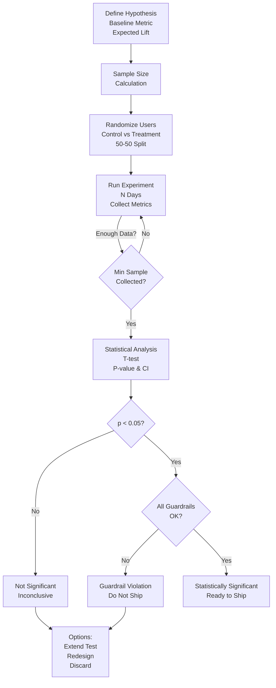
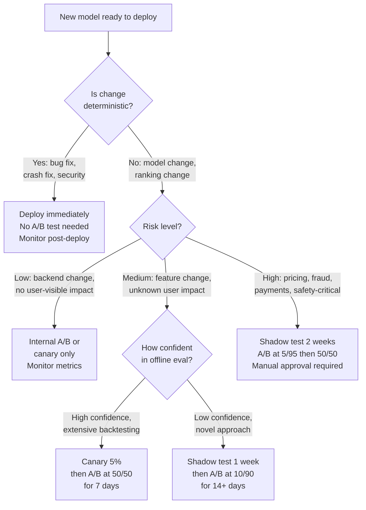

# A/B Testing & Experimentation: Validating Models with Statistical Rigor

## Definition & Why It Matters

A/B testing is a controlled experiment comparing two (or more) model versions on real production traffic. Unlike lab evaluation, A/B testing measures actual business impact with statistical rigor, accounting for natural variation.

**Why it's critical:**
- **Lab evaluation is wrong**: A model with 2% higher accuracy in testing might hurt user experience (users hate change). Lab results don't capture real-world behavior.
- **Guardrails**: A/B testing ensures you don't ship regressions. "Model A wins on accuracy, but users engage less." Catch it before full deployment.
- **Business metrics matter**: Model may be more accurate but slower (latency hurts engagement). Tests measure both.
- **Randomization prevents bias**: Non-randomized comparisons are unreliable. (If you give new model to power users only, of course it performs better.)

Netflix found that most models that won in lab evaluations hurt engagement in production. A/B testing is how they avoid shipping those.

---

## How It Works

### The Experimentation Process

```
Design experiment
    ↓
Run hypothesis test (power analysis)
    ↓
Randomize users into control/treatment
    ↓
Run experiment for N days (enough data)
    ↓
Compute p-value & confidence interval
    ↓
Make decision (ship, iterate, or discard)
```



### Key Components

**1. Hypothesis**
- Null: new model ≠ baseline (no difference)
- Alternative: new model > baseline (directional: must improve)
- Importance: guides sample size calculation, decision rules

**2. Sample Size Calculation**
- Need enough samples to detect effect if it exists
- Formula: depends on baseline metric, expected lift, confidence level
- Example: "Detect 2% improvement in CTR with 95% confidence: need 5M impressions"

**3. Randomization**
- Users/sessions randomly assigned to control/treatment
- Ensures differences aren't confounding (e.g., new model didn't just get lucky with good users)
- Methods: cookie-based, user-based, or session-based

**4. Metrics**
- **Primary metric**: what are you optimizing? (CTR, conversion, engagement)
- **Secondary metrics**: guardrails (latency, load)
- **Guardrail metrics**: don't ship if any degrades >1% (e.g., don't increase latency)

**5. Duration**
- Must run long enough to collect sample size
- Accounts for day-of-week effects (run ≥7 days)
- Seasonal effects (may need 2+ weeks)

**6. Analysis**
- Compute p-value (is difference statistically significant?)
- Compute 95% CI (expected improvement range)
- Success: p < 0.05 and CI doesn't include 0

---

## Interview Q&A: A/B Testing

### Q1: "When should you A/B test vs deploy immediately?"
**Answer outline:** Deploy immediately only for:
1. **Obviously better (deterministic)**: latency reduction, crash fix, bug fix
2. **Internal tooling**: backend changes users don't interact with
3. **Rollback tested**: known good previous version available if needed

A/B test for:
1. **Model changes**: new model architecture, retraining approach
2. **Feature changes**: new features affecting user experience
3. **Uncertain business impact**: model better in lab, but real-world impact unknown

Example: Deploy tokenizer fix immediately (no risk). A/B test new recommendation model (risky, unknown business impact).

### Q2: "You need 10M samples to detect 2% lift. Users = 50M/day. How long?"
**Answer outline:** Sample size calculation:
- 50M users/day × 50% in treatment = 25M treatment samples/day
- Need 10M samples → 10M / 25M = 0.4 days ≈ 10 hours

But wait: account for day-of-week effects (running only 10 hours misses weekly patterns). Solution: run ≥7 days minimum, even if sample size achieved earlier.

Example: 50M users/day, 7 days = 350M samples, easily >10M. Statistical significance reached after day 2, but run full 7 days to account for seasonality.

### Q3: "New model wins on primary metric (+3% CTR), but latency increased by 10%. Ship?"
**Answer outline:** Depends on guardrail thresholds:
1. **Guardrail for latency**: "Don't ship if latency increases >5%"
   → 10% increase violates guardrail. Don't ship.
2. **If guardrail was "don't ship if latency increases >15%"**:
   → 10% is acceptable. Ship, but monitor.

Trade-off analysis:
- 3% more clicks (good) vs 10ms slower (acceptable for most use cases)
- If users care about speed, latency increase hurts engagement even if CTR higher
- Solution: optimize model for latency (quantization, distillation) before shipping

Example: LinkedIn tested notification ranking, won on CTR, but engagement latency increased. Users disliked slower notifications. Didn't ship until optimized.

### Q4: "A/B test shows p=0.08 (not quite significant). What do you do?"
**Answer outline:** p=0.08 means: 8% chance you'd see this result if models were actually equal (threshold is 5%). Options:
1. **Extend test duration**: Collect more samples, increase power to reject null hypothesis
2. **Accept it's inconclusive**: Model probably not better, retry next month with improvements
3. **Dig deeper**: Maybe works better for specific user cohorts. Analyze subgroups.

Temptation: "Almost significant, let's ship anyway." Don't. p=0.08 is not statistically significant. Requires >0.05 iterations to ship.

Example: Email redesign shows p=0.08 improvement. Don't ship yet. Run for another week. If p-value improves to <0.05, ship. If not, revisit design.

### Q5: "Design A/B test for model serving latency optimization. 100K pred/sec."
**Answer outline:** Latency optimization (e.g., model quantization) requires careful testing:
1. **Primary metric**: p99 latency (what users experience)
2. **Secondary metrics**: accuracy (ensure quantization doesn't hurt too much), throughput (queries/sec)
3. **Guardrails**: don't ship if accuracy drops >0.1%
4. **Sample size**: latency is noisy. Need 24 hours to capture peak traffic patterns
5. **Analysis**: p99 latency should improve (e.g., 120ms → 95ms), accuracy should match

Challenge: latency A/B tests are hard because different times have different baselines. Solution: stratify by time-of-day, or run continuous test (all traffic sees both models in rotation).

Example: Quantized model shows 95ms latency vs 120ms baseline, accuracy 95.2% vs 95.8% (acceptable). Ship after 24-hour test.

---

## Best Practices

1. **Always set guardrails**: Define metrics you must not regress. Latency, error rate, engagement.

2. **Power analysis before starting**: Calculate sample size needed. Don't run "until significant."

3. **Lock analysis plan before starting**: Decide hypothesis, metrics, sample size upfront. Prevents p-hacking.

4. **Run for at least 7 days**: Accounts for day-of-week effects, seasonality.

5. **Stratify if possible**: Different user segments may have different responses. Subgroup analysis reveals this.

6. **Statistical significance ≠ business significance**: p < 0.05 means likely true, not necessarily worth shipping. 0.1% improvement in 10M users = significant but tiny ROI.

7. **Monitor post-deployment**: A/B test says "worked in lab," but monitoring catches real-world surprises (e.g., bugs specific to certain user profiles).

8. **Iterate, don't hoard improvements**: Ship winning models quickly, learn from failures.

9. **Use sequential analysis if available**: Can stop early if effect is larger than expected (save time/compute).

10. **Document all tests**: Create record of what you tried, results, learnings. Prevents duplicate work.

---

## Common Pitfalls

1. **p-hacking**: Run test, p=0.08, adjust parameters, run again, p=0.03. Multiple attempts invalidates p-value. Lock plan upfront.

2. **Peeking at results**: "Results are in, can we stop early?" Early stopping invalidates p-value. Commit to duration.

3. **Confounding variables**: Ran test during holiday weekend. Results don't generalize. Account for seasonality.

4. **Ignoring guardrails**: Model wins on CTR but latency increased. Shipped anyway. Users hated it. Don't ignore guardrails.

5. **Sample contamination**: Users in control group saw treatment, or vice versa. Results biased.

6. **No subgroup analysis**: Model works overall but fails for minority group. Didn't test subgroups. Always stratify.

7. **Shipping without follow-up monitoring**: A/B test passed. Shipped. Didn't monitor. Bugs discovered by users weeks later.

8. **Underpowered test**: Ran for 3 days. Need 7+ for statistical validity. P-value might be 0.08 (close) but invalid because duration too short.

9. **Effect size too small to matter**: P < 0.05 improvement of 0.01%. Statistically significant but business irrelevant.

10. **No holdout control**: Comparing variant to baseline, but baseline changed over time. Results confounded.

---

## Real-World Examples

### Example 1: Netflix Recommendation A/B Testing
Netflix runs 100s of recommendation experiments simultaneously.
- **Hypothesis**: New deep learning model improves watch hours
- **Sample size**: 5M users (control), 5M users (new model)
- **Duration**: 2 weeks (capture weekly patterns)
- **Primary metric**: watch hours/user (+1% = $50M/year revenue)
- **Guardrails**: don't increase abandonment rate, don't decrease diversity

Result: New model +3% watch hours, +1% abandonment, +5% diversity. Watch hours improvement worth shipping, monitor abandonment.

### Example 2: Stripe Fraud Model Testing
Stripe A/B tests fraud models carefully (false declines cost revenue).
- **Hypothesis**: New model catches more fraud without increasing false declines
- **Sample size**: 10M transactions (control), 10M (new model)
- **Duration**: 1 month (fraud patterns vary weekly)
- **Primary metric**: fraud detection rate (minimize loss)
- **Guardrails**: don't increase false decline rate >1% (hurts revenue)

Result: New model detects 2% more fraud, false declines up 0.5% (acceptable). Deploy incrementally.

### Example 3: Uber ETA Model Canary Test
Uber tests new ETA models with careful monitoring.
- **Hypothesis**: New model improves prediction accuracy
- **Canary phase**: 5% of users, 24 hours
- **Metrics**: prediction error, request latency, user complaints
- **Guardrail**: latency must stay <100ms

Result: New model MAE down 5%, latency stable, no complaints. Roll out to 25% for 3 days, then 100%.

---

## Sample Interview Case Study

**Scenario:** Netflix recommends new ranker model. Lab tests: +2% click-through rate. Design A/B test.

**Solution:**

1. **Hypothesis**: New ranker improves user engagement (watch hours)
2. **Sample size**: Netflix has 250M subscribers. Test on 10M (control), 10M (new model). Need 2 weeks to capture weekly patterns.
3. **Primary metric**: watch hours per user (main business metric)
4. **Secondary metrics**: engagement (whether recommendations are clicked), diversity (% of recommendations outside top 100 shows)
5. **Guardrails**: engagement ≥ baseline, diversity ≥ baseline
6. **Implementation**: Randomize at user level (user always sees same model, consistent experience). Cookie-based randomization.
7. **Analysis**: Compute p-value for watch hours metric. If p < 0.05, check guardrails. If all pass, deploy to 50% traffic, monitor 3 days, expand to 100%.

**Strong answer:** "Design A/B test: hypothesis is watch hours increase. Sample: 10M control vs 10M treatment for 2 weeks (capture weekly patterns). Primary metric: watch hours. Guardrails: engagement and diversity don't decrease. Randomize at user level for consistency. Analyze: p-value for watch hours, confidence interval for guardrails. Only ship if primary metric significant and all guardrails pass."

---

## Key Takeaways

A/B testing is the gold standard for model validation. Lab tests can be misleading; production A/B tests reveal true business impact.

**Experimentation pipeline:** hypothesis → sample size → randomization → run → analysis → decision → monitor

**Common interview pattern:** "Model is better in testing. Why A/B test?" → Answer: "Lab results often don't reflect production. A/B testing with randomization and statistical rigor reveals true impact on users and business."

---

## Related Concepts

- **Model Testing** (Concept 09): Lab evaluation before A/B test
- **Evaluation Metrics** (Concept 12): Metrics used in A/B tests
- **Canary Deployment** (Concept 16): Deployment strategy using A/B test framework
- **Monitoring** (Concept 18): Continuous monitoring post-A/B test deployment

---

## Quick Reference Card

### 2-Minute Elevator Pitch
A/B testing is how you validate that a model change creates real business value, not just improved offline metrics. Offline evaluation tells you whether a model is better in the lab; A/B testing tells you whether users actually behave differently. The key components: randomized assignment (avoid confounding), statistical power calculation (don't run underpowered tests), guardrail metrics (prevent shipping regressions), and minimum test duration (7 days minimum to capture day-of-week effects). Netflix found that 70% of models that improved offline metrics degraded business metrics in A/B tests — making A/B testing non-negotiable.

### Numbers to Know
- Netflix: 250M subscribers, runs 1000+ simultaneous A/B tests; 1% watch hours = ~$300M/year revenue
- Stripe: 1% false decline rate increase = $10M/year in lost revenue; drives conservative A/B guardrails
- Minimum test duration: 7 days (captures weekly patterns), 14+ days for seasonal products
- Typical sample size for 2% lift detection: 500K-2M users per variant (depends on metric variance)
- p-value threshold: 0.05 (industry standard); some teams use 0.01 for high-stakes decisions
- Guardrail threshold: ship only if primary metric improves AND no guardrail degrades >1%
- Multiple testing correction: with 10 metrics, use Bonferroni correction (p < 0.005) or FDR control
- Sequential testing: use SPRT (Sequential Probability Ratio Test) to stop early safely without inflating Type I error

### Decision Framework: A/B Test or Deploy Immediately?



---

## Strong vs Weak Answers

### Q: A new recommendation model improved offline NDCG by 5%. A colleague says "just ship it." What's your response?

**Weak Answer:** "I agree that we should test it further with an A/B test to make sure it actually improves user experience before fully deploying."

**Strong Answer:** "I'd push back on shipping immediately, and here's the specific risk. Offline NDCG measures ranking quality against historical interactions — but users are not static. A model that improves NDCG by 5% might achieve this by recommending more popular content, which historically has higher click rates, but decreases long-term engagement and diversity. Netflix found that 70% of models improving offline metrics hurt engagement in A/B tests. The right process: run a 2-week A/B test on 10% of users (control: current model, treatment: new model). Primary metric: watch hours per user. Guardrails: engagement breadth (% of recommendations outside top 100 titles must not decrease), session abandonment rate (must not increase >1%), p99 latency (must not increase). If all pass, roll out to 50%, then 100%. The offline metric is a signal for 'worth testing' — not 'worth shipping.'"

---

### Q: After 4 days, your A/B test shows p=0.03 improvement in the primary metric. Your manager wants to ship now. What do you do?

**Weak Answer:** "The p-value is below 0.05, so the result is statistically significant. I would ship it."

**Strong Answer:** "p=0.03 after 4 days is a dangerous place to stop. Three problems. First, day-of-week effects: if we started the test on a Monday, we've seen Tuesday-Thursday traffic heavily but barely any weekend traffic. Weekend users have different behavior patterns — a model that improves weekday engagement might hurt weekend engagement. Minimum 7 days captures one full weekly cycle. Second, novelty effect: users exposed to a new model often show temporary engagement increases ('shiny new thing') that fade within 2 weeks. Stopping at 4 days may capture novelty, not real improvement. Third, peeking inflates Type I error: if we were planning to run 14 days and instead peek at 4 days and stop early because it looks significant, we've effectively run multiple hypothesis tests, and our Type I error rate is much higher than 5%. The right answer to the manager: 'The signal is encouraging — let's keep running. Stopping early risks shipping a model that reverses in production within 2 weeks, which is far more disruptive than waiting 10 more days.' Use sequential testing (SPRT) if you genuinely need early stopping capability."

---

### Q: Design an A/B test for a new fraud detection model at Stripe that catches 5% more fraud but might increase false declines by 1%.

**Weak Answer:** "I would run an A/B test with 50% of transactions using the new model and 50% using the old model. After collecting enough data, I would compare fraud detection rates and false decline rates."

**Strong Answer:** "Fraud A/B tests are especially tricky because of delayed labels — fraud is confirmed 5-30 days after the transaction. My design: Primary metric: fraud loss rate ($ lost to fraud per $M transacted). Guardrails: false decline rate (must not increase >0.5% — at Stripe's scale, 1% false decline = $10M/year revenue loss), legitimate transaction approval rate, customer complaint rate. Sample size: at 500M transactions/month, even 1% traffic gives 5M transactions — enough for statistical significance on a 5% improvement within 2 weeks. Split: 5% treatment, 95% control (conservative because fraud model changes affect real money). Duration: 30 days minimum (need fraud label propagation — most fraud is confirmed within 21 days). Analysis: wait 30 days after test ends before analysis (let labels settle). Instrumentation: log every transaction's model version, prediction score, and decision. When fraud label arrives, join to the prediction. Guardrail: auto-rollback if false decline rate spikes >0.5% within the first 7 days (visible immediately). This is how Stripe caught a false decline issue in a 2022 model update before it hit full traffic."

---

## System Design: A/B Testing Platform for a Large-Scale ML Organization

**Question:** "Design an A/B testing platform for Netflix that runs 1000+ simultaneous experiments on 250M subscribers. The platform must support: randomized assignment, multiple concurrent experiments without interference, statistical analysis, guardrail enforcement, and automated rollout/rollback."

**Walkthrough:**

1. **Randomized assignment engine.** Use a deterministic hash function: `hash(user_id + experiment_id) % 100` determines which bucket a user falls into. This is: (a) deterministic (same user always sees same model), (b) stable across sessions (user experience is consistent), (c) independent per experiment (participation in experiment A doesn't affect B). Store assignments in Redis for <1ms lookups.

2. **Experiment namespace and mutual exclusion.** Some experiments must not interfere with each other (testing two different ranking changes simultaneously contaminates both signals). Implement an exclusion group system: experiments in the same group are mutually exclusive. Users in group A experiments are excluded from group B experiments. This limits concurrent experiment capacity but eliminates cross-experiment contamination.

3. **Metric collection pipeline.** User interactions (views, clicks, watch events) flow into a Kafka topic. A Flink consumer joins interactions with experiment assignments (Redis lookup) and writes to a ClickHouse analytical database partitioned by experiment_id. This enables real-time metric computation per variant.

4. **Statistical analysis engine.** For each experiment, run hourly: (a) t-test for continuous metrics (watch hours, session duration), (b) proportion test for binary metrics (click rate, abandonment), (c) CUPED (Controlled-experiment Using Pre-Experiment Data) variance reduction to improve statistical power. Alert when: p-value crosses 0.05 (possible significant result, needs human review), guardrail metrics degrade (immediate notification).

5. **Power analysis and test duration recommendation.** Before an experiment launches, engineers input: baseline metric value, minimum detectable effect, desired confidence level. The platform computes required sample size and recommended test duration. Prevents underpowered tests from being launched.

6. **Guardrail enforcement.** Each experiment declares guardrail metrics with degradation thresholds (e.g., "session abandonment rate must not increase >1%"). An automated monitor checks guardrails every 6 hours. If any guardrail trips: (a) send PagerDuty alert, (b) automatically reduce experiment traffic from current % to 0.1% (not a full stop, to preserve statistical evidence), (c) require manual override to restore traffic.

7. **Sequential testing for early stopping.** Implement SPRT (Sequential Probability Ratio Test) as an opt-in feature for experiments with clear directional signals. This allows safe early stopping when evidence accumulates faster than expected, without inflating Type I error rate. Not the default — only for experiments where time-to-decision is critical.

8. **Automated rollout.** When an experiment crosses statistical significance threshold AND all guardrails pass: (a) notify experiment owner, (b) automatically expand to 50% if currently at <10%, or (c) require manual approval for 100% rollout. No experiment goes to 100% without human sign-off.

9. **Experiment interaction detection.** Nightly job tests for experiment interactions: do users in experiments A and B simultaneously behave differently than users in just A or just B? Flag interactions for review. This catches interference from mutually exclusive group misconfigurations.

10. **Post-experiment analysis.** After 100% rollout, run a Difference-in-Differences analysis comparing the 30-day post-experiment metric trend to pre-experiment baseline. This validates that the A/B test benefit materialized in production and wasn't a novelty effect.

**Key decisions:**
- Deterministic hash assignment: ensures user experience consistency and enables reproducibility
- CUPED variance reduction: reduces required sample size by 30-50%, enabling faster experiments
- Guardrail auto-reduction (not full stop): preserves statistical evidence while limiting user impact
