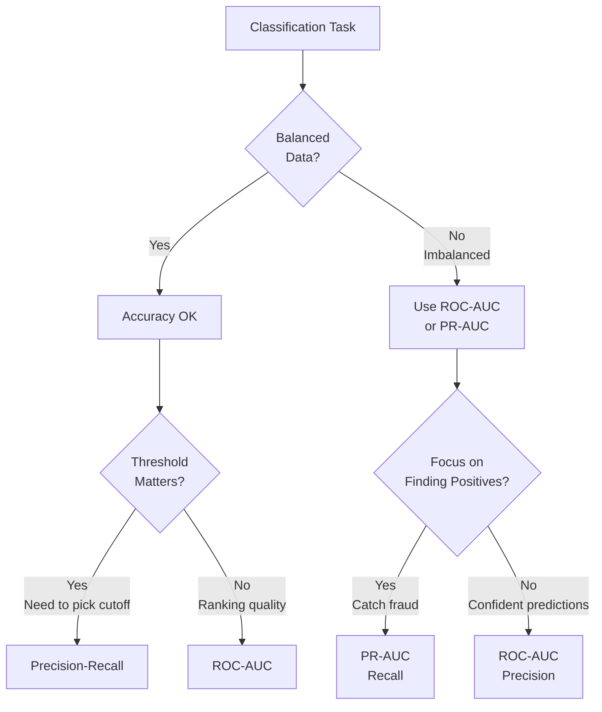

# Evaluation Metrics: Choosing the Right Measures of Success

## Definition & Why It Matters

Evaluation metrics quantify model performance on specific dimensions. Choosing the right metric shapes the entire ML project: it defines what you optimize during training, what you measure in A/B tests, and whether you ship or iterate.

**The metric problem:** Not all metrics matter equally. Accuracy works for balanced data but lies for imbalanced (95% accuracy on fraud = useless if 95% of transactions are legitimate). Precision vs recall trade-off exists; you must choose your priority. Business metrics (revenue, engagement) differ from technical metrics (accuracy, AUC).

**Why metric choice matters:**
- **Wrong metric = wrong optimization**: Optimize for accuracy instead of precision → release model that declines 10% of legitimate transactions
- **Technical vs business metrics**: Model may be 99% accurate but slow (latency hurts engagement). Technical metric good, business metric bad.
- **Trade-offs are real**: Higher accuracy might require longer latency, less fairness, or higher cost. Metrics help quantify trade-offs.

Netflix optimizes watch hours (business), not accuracy. Stripe optimizes fraud loss (business), not recall. Metrics must align with business goals.

---

## How It Works

### Classification Metrics

**Accuracy**: (TP + TN) / (TP + TN + FP + FN). Good only for balanced data (>10% minority class).

**Precision**: TP / (TP + FP). "Of predictions I made positive, how many are actually positive?" For fraud: "Of transactions I flag as fraud, how many are actual fraud?" Use when false positives are costly.

**Recall**: TP / (TP + FN). "Of all actual positives, how many did I catch?" For fraud: "Of all fraud transactions, what % do I detect?" Use when missing positives is costly.

**F1 Score**: 2 * (Precision * Recall) / (Precision + Recall). Harmonic mean. Good when you care about both precision and recall equally. Default choice for imbalanced classification.

**ROC-AUC**: Area under ROC curve. Threshold-invariant. Shows model ranking quality (does it rank positives higher than negatives?). Useful for model comparison across thresholds. Range: 0.5 (random) to 1.0 (perfect).

**PR-AUC**: Precision-recall curve AUC. Better for imbalanced data (where negatives >> positives). More informative than ROC-AUC when you care about precision-recall trade-off.

### Regression Metrics

**MAE (Mean Absolute Error)**: Average absolute difference. Robust to outliers. Example: ETA prediction error = 5 minutes on average.

**RMSE (Root Mean Squared Error)**: Root mean squared error. Penalizes large errors. More sensitive to outliers than MAE.

**MAPE (Mean Absolute Percentage Error)**: Error as % of true value. Good for understanding relative error. Example: 10% error on $100 prediction = $10 error.

**R² Score**: How much variance explained. 0.95 R² = model explains 95% of variance (good). 0.5 R² = model explains 50% (room for improvement).

### Ranking/Recommendation Metrics

**NDCG (Normalized Discounted Cumulative Gain)**: How well does ranking order match user preference? Penalizes bad items ranked high.

**MAP (Mean Average Precision)**: For top-K recommendations, average precision at each cutoff. Answers: "At position K, what % are relevant?"

**Hit Rate**: % of users who had at least one relevant recommendation. Measures discovery.

### Business Metrics

**Engagement**: Watch hours, clicks, shares (what users do with predictions)

**Conversion**: % of recommendations leading to purchase/transaction

**Revenue**: Direct dollar impact (includes both technical improvement and business factors)

**User Satisfaction**: Survey ratings, NPS (Net Promoter Score)

---

## Interview Q&A: Evaluation Metrics

### Q1: "Model has 98% accuracy on fraud detection. Is it good?"
**Answer outline:** Depends on data balance:
1. **If 98% of data is legitimate**: 98% accuracy is useless. You could achieve 98% by predicting "no fraud" on everything.
2. **Check**: What's the fraud rate in data? If 1% fraud + 99% legitimate, 98% accuracy is worthless.
3. **Better metrics**: Precision (if I flag as fraud, am I right?) and Recall (do I catch fraud?).
4. **For imbalanced data**: Use ROC-AUC or PR-AUC, not accuracy.

Example: Fraud data is 1% fraud, 99% legitimate. Naive model: always predict "no fraud." Accuracy = 99%. But useless.

### Q2: "Precision 95%, Recall 70%. What does this mean? Accept or improve?"
**Answer outline:** 
- **Precision 95%**: Of transactions I flag as fraud, 95% are actually fraud. Low false positive rate. (5% of flagged transactions are legitimate—users incorrectly declined).
- **Recall 70%**: I catch 70% of actual fraud. 30% of fraud slips through.

Depends on business:
- **If false declines are expensive**: High precision good (only decline when confident).
- **If missing fraud is expensive**: Low recall bad (losing $100 to fraud worse than declining 1 legitimate transaction).
- **Trade-off**: Can't simultaneously have precision 95% and recall 95%. Must choose priority.

Decision: "High precision but low recall" means I'm conservative. Good if false positives hurt. Bad if missing fraud is worse.

### Q3: "How do you measure model performance on imbalanced data (0.1% positive class)?"
**Answer outline:** Accuracy is useless. Use:
1. **Confusion matrix**: Track TP, FP, FN, TN separately.
2. **ROC-AUC**: Threshold-invariant. Shows if model ranks positives higher than negatives.
3. **PR-AUC**: Precision-Recall curve. Better for imbalanced.
4. **F1 Score**: Harmonic mean of precision + recall.
5. **Cost-weighted metrics**: Assign cost to FP vs FN. Model should minimize cost.

Example: Fraud (0.1%), use ROC-AUC. Model should show 0.85+ AUC (excellent) vs 0.5 (random).

### Q4: "Model optimizes for accuracy in training. Real business cares about latency. What goes wrong?"
**Answer outline:** Metric mismatch: optimized metric ≠ business metric.
- **Training metric**: Accuracy (iterative: train, improve accuracy, ship)
- **Business metric**: Latency (user experience: faster is better)
- **Result**: Model gets more accurate (good) but takes longer to predict (bad for users).

Example: Deeper neural network = higher accuracy but slower inference. Optimize for accuracy → ship slow model → users complain.

Solution: Multi-objective optimization. Define: "Accuracy ≥ 95% AND Latency < 100ms." Optimize both, don't sacrifice one for other.

### Q5: "Design metrics for Netflix recommendation model. What do you measure?"
**Answer outline:** Multiple metrics because recommendations have multiple objectives:

1. **Engagement** (primary): watch_hours_per_user. Direct business metric.
2. **Accuracy** (guardrail): Does model rank content user wants to watch?
3. **Diversity** (guardrail): % recommendations outside top 100 shows. (Avoid filter bubbles.)
4. **Fairness** (guardrail): Recommendation quality across user demographics.
5. **Latency** (guardrail): <500ms to return 10 recommendations.

Analyze in this order:
1. Does engagement improve? (primary)
2. Do all guardrails hold? (accuracy, diversity, fairness, latency)
3. If all pass → ship. If any fails → iterate.

Example: New model +3% engagement, +5% diversity, all guardrails pass. Ship. New model +5% engagement but latency increased 20% (violates guardrail). Don't ship.

---

## Best Practices

1. **Align metrics with business goals**: Don't optimize for what's easy to measure; optimize for what matters.

2. **Use multiple metrics**: One metric hides trade-offs. Always include primary metric + guardrails.

3. **Understand metric limitations**: Accuracy on balanced data doesn't mean accuracy on imbalanced. Know your data.

4. **Stratify by subgroup**: Aggregate metrics hide subgroup failures. Report metrics for key segments.

5. **Track metric distributions**: Not just average. P50, p95, and failure cases matter.

6. **Version your metrics**: As business evolves, metrics change. Track what you measured when.

7. **Define acceptable thresholds upfront**: Before running experiments. Prevents p-hacking with metrics.

8. **Separate training metrics from business metrics**: Training metric guides optimization; business metric guides decisions.

9. **Monitor metric drift**: Track metric values over time. Sudden changes indicate problems.

10. **Document trade-offs**: Why did you choose precision over recall? Document decisions.

---

## Common Pitfalls

1. **Using accuracy for imbalanced data**: Results are misleading. Use ROC-AUC or PR-AUC.

2. **Optimizing metric instead of outcome**: Accuracy increased 1%, but engagement decreased. Bad trade-off.

3. **No guardrails**: Ship model that wins on primary metric, regress on secondary. Broke production.

4. **Ignoring subgroup performance**: Model accurate on average, fails for minority group. Discovered by users, not tests.

5. **Metric that's hard to compute**: Choose a metric then realize you can't compute it in production. Wasted work.

6. **No baseline**: Compare new model to what? "Better" is meaningless without baseline. Always compare to current production model.

7. **Conflating metrics**: Accuracy, precision, recall, AUC are different. Don't confuse them.

8. **Manual metric computation**: Doesn't scale. Automate metric computation for every model.

9. **Metrics optimized in lab don't translate**: Lab: 95% accuracy. Production: 88% accuracy. Different data distributions.

10. **Not measuring latency**: Model is accurate but slow. Useless in production. Always measure latency.

---

## Real-World Examples

### Example 1: Stripe Fraud Detection Metrics
Stripe optimizes for fraud loss, not accuracy:
- **Fraud loss**: (fraud caught * 0) + (fraud missed * avg_fraud_amount) + (legitimate declined * 1)
- **Metric**: minimize total fraud loss, not maximize recall
- **Trade-off**: Stricter model (high precision) catches 85% fraud but declines 2% legitimate. Looser model catches 98% fraud but declines 10% legitimate.
- **Decision**: Based on business impact. If fraud $100 and decline costs $1, strict model is better. If fraud $100 and decline costs $10, loose model is better.

### Example 2: Google Search Ranking Metrics
Google optimizes search ranking with:
- **Relevance**: NDCG (do top results match query?)
- **User satisfaction**: Click-through rate (do users click results?)
- **Dwell time**: How long do users stay on clicked pages?
- **Trade-off**: Relevant result + poor user experience = metric conflict. Google uses dwell time as guardrail.

### Example 3: Netflix Engagement Metrics
Netflix measures:
- **Watch hours** (primary business metric)
- **Engagement** (% of recommendations clicked)
- **Diversity** (% from outside top 100 content)
- **Retention** (% of users returning next month)

Tracks all because optimizing watch hours alone (recommending only top hits) hurts diversity and long-term engagement.

---

## Sample Interview Case Study

**Scenario:** Building credit scoring model. Predict: "Will applicant default?" (binary classification).

**Choosing metrics:**

1. **Data**: 95% non-default, 5% default (imbalanced)
   → Don't use accuracy
   → Use ROC-AUC or PR-AUC

2. **Business**: Lending company cares about:
   - **False positives**: Declining eligible applicants (lost revenue)
   - **False negatives**: Approving applicants who default (lost money)
   - **Trade-off**: Stricter model (high precision) declines more qualified applicants; looser model (high recall) approves more defaulters.

3. **Metrics**:
   - **Primary**: Expected loss = (FN * avg_loan_amount) + (FP * 0). Minimize loss.
   - **Guardrails**: 
     - Recall ≥ 80% (catch 80% of defaulters)
     - Precision ≥ 70% (approved applicants should have 70% repayment)
     - Fairness: no >3% performance gap by demographic

4. **Threshold selection**: ROC curve shows precision/recall at different thresholds.
   - Threshold 0.3: Recall 95%, Precision 60% (approve many, high default rate)
   - Threshold 0.7: Recall 70%, Precision 85% (strict, fewer defaults)
   - Choose threshold that minimizes business loss while meeting fairness constraints.

5. **Decision**: "Choose threshold that minimizes expected loss. Require recall ≥ 80% (catch most defaults) and fairness constraint: no demographic group has <70% precision. Monitor precision in production to catch demographic shifts."

**Strong answer:** "For imbalanced classification (5% default), use ROC-AUC not accuracy. Primary metric: minimize expected loss (cost of FN + cost of FP). Guardrails: recall ≥ 80% (catch defaulters), precision ≥ 70% per demographic (fairness). Use threshold from ROC curve that minimizes loss while meeting constraints."

---

## Key Takeaways

**Metrics drive decisions.** Choose wrong metric = optimize wrong thing = ship wrong model.

**Multiple metrics are essential:** Primary metric (business goal) + guardrails (don't regress).

**Common interview pattern:** "Model has 95% accuracy. Good?" → Answer: "Depends on data balance and business metric. For imbalanced data, use ROC-AUC. For business impact, measure revenue or engagement, not accuracy. Different metrics guide different decisions."

---

## Related Concepts

- **A/B Testing** (Concept 11): Uses metrics to measure experiment success
- **Model Testing** (Concept 09): Validates metrics in lab before production
- **Monitoring** (Concept 18): Tracks metric drift in production
