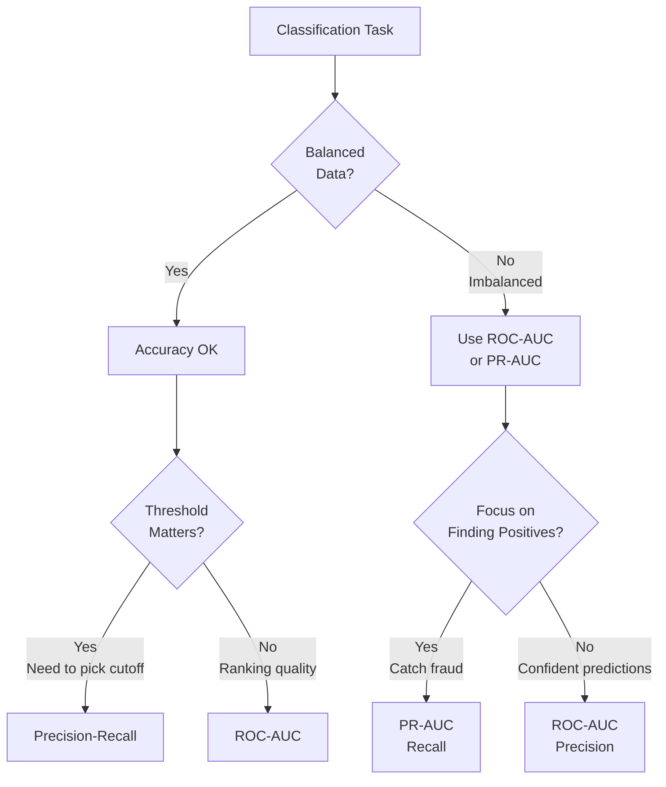
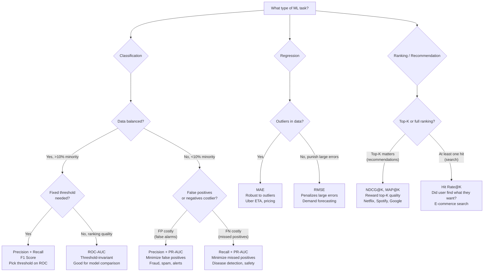

# Evaluation Metrics: Choosing the Right Measures of Success

## Definition & Why It Matters

Evaluation metrics quantify model performance on specific dimensions. Choosing the right metric shapes the entire ML project: it defines what you optimize during training, what you measure in A/B tests, and whether you ship or iterate.

**The metric problem:** Not all metrics matter equally. Accuracy works for balanced data but lies for imbalanced (95% accuracy on fraud = useless if 95% of transactions are legitimate). Precision vs recall trade-off exists; you must choose your priority. Business metrics (revenue, engagement) differ from technical metrics (accuracy, AUC).

**Why metric choice matters:**
- **Wrong metric = wrong optimization**: Optimize for accuracy instead of precision → release model that declines 10% of legitimate transactions
- **Technical vs business metrics**: Model may be 99% accurate but slow (latency hurts engagement). Technical metric good, business metric bad.
- **Trade-offs are real**: Higher accuracy might require longer latency, less fairness, or higher cost. Metrics help quantify trade-offs.

Netflix optimizes watch hours (business), not accuracy. Stripe optimizes fraud loss (business), not recall. Metrics must align with business goals.

---

## How It Works

### Classification Metrics

**Accuracy**: (TP + TN) / (TP + TN + FP + FN). Good only for balanced data (>10% minority class).

**Precision**: TP / (TP + FP). "Of predictions I made positive, how many are actually positive?" For fraud: "Of transactions I flag as fraud, how many are actual fraud?" Use when false positives are costly.

**Recall**: TP / (TP + FN). "Of all actual positives, how many did I catch?" For fraud: "Of all fraud transactions, what % do I detect?" Use when missing positives is costly.

**F1 Score**: 2 * (Precision * Recall) / (Precision + Recall). Harmonic mean. Good when you care about both precision and recall equally. Default choice for imbalanced classification.

**ROC-AUC**: Area under ROC curve. Threshold-invariant. Shows model ranking quality (does it rank positives higher than negatives?). Useful for model comparison across thresholds. Range: 0.5 (random) to 1.0 (perfect).

**PR-AUC**: Precision-recall curve AUC. Better for imbalanced data (where negatives >> positives). More informative than ROC-AUC when you care about precision-recall trade-off.

### Regression Metrics

**MAE (Mean Absolute Error)**: Average absolute difference. Robust to outliers. Example: ETA prediction error = 5 minutes on average.

**RMSE (Root Mean Squared Error)**: Root mean squared error. Penalizes large errors. More sensitive to outliers than MAE.

**MAPE (Mean Absolute Percentage Error)**: Error as % of true value. Good for understanding relative error. Example: 10% error on $100 prediction = $10 error.

**R² Score**: How much variance explained. 0.95 R² = model explains 95% of variance (good). 0.5 R² = model explains 50% (room for improvement).

### Ranking/Recommendation Metrics

**NDCG (Normalized Discounted Cumulative Gain)**: How well does ranking order match user preference? Penalizes bad items ranked high.

**MAP (Mean Average Precision)**: For top-K recommendations, average precision at each cutoff. Answers: "At position K, what % are relevant?"

**Hit Rate**: % of users who had at least one relevant recommendation. Measures discovery.

### Business Metrics

**Engagement**: Watch hours, clicks, shares (what users do with predictions)

**Conversion**: % of recommendations leading to purchase/transaction

**Revenue**: Direct dollar impact (includes both technical improvement and business factors)

**User Satisfaction**: Survey ratings, NPS (Net Promoter Score)

---

## Interview Q&A: Evaluation Metrics

### Q1: "Model has 98% accuracy on fraud detection. Is it good?"
**Answer outline:** Depends on data balance:
1. **If 98% of data is legitimate**: 98% accuracy is useless. You could achieve 98% by predicting "no fraud" on everything.
2. **Check**: What's the fraud rate in data? If 1% fraud + 99% legitimate, 98% accuracy is worthless.
3. **Better metrics**: Precision (if I flag as fraud, am I right?) and Recall (do I catch fraud?).
4. **For imbalanced data**: Use ROC-AUC or PR-AUC, not accuracy.

Example: Fraud data is 1% fraud, 99% legitimate. Naive model: always predict "no fraud." Accuracy = 99%. But useless.

### Q2: "Precision 95%, Recall 70%. What does this mean? Accept or improve?"
**Answer outline:** 
- **Precision 95%**: Of transactions I flag as fraud, 95% are actually fraud. Low false positive rate. (5% of flagged transactions are legitimate—users incorrectly declined).
- **Recall 70%**: I catch 70% of actual fraud. 30% of fraud slips through.

Depends on business:
- **If false declines are expensive**: High precision good (only decline when confident).
- **If missing fraud is expensive**: Low recall bad (losing $100 to fraud worse than declining 1 legitimate transaction).
- **Trade-off**: Can't simultaneously have precision 95% and recall 95%. Must choose priority.

Decision: "High precision but low recall" means I'm conservative. Good if false positives hurt. Bad if missing fraud is worse.

### Q3: "How do you measure model performance on imbalanced data (0.1% positive class)?"
**Answer outline:** Accuracy is useless. Use:
1. **Confusion matrix**: Track TP, FP, FN, TN separately.
2. **ROC-AUC**: Threshold-invariant. Shows if model ranks positives higher than negatives.
3. **PR-AUC**: Precision-Recall curve. Better for imbalanced.
4. **F1 Score**: Harmonic mean of precision + recall.
5. **Cost-weighted metrics**: Assign cost to FP vs FN. Model should minimize cost.

Example: Fraud (0.1%), use ROC-AUC. Model should show 0.85+ AUC (excellent) vs 0.5 (random).

### Q4: "Model optimizes for accuracy in training. Real business cares about latency. What goes wrong?"
**Answer outline:** Metric mismatch: optimized metric ≠ business metric.
- **Training metric**: Accuracy (iterative: train, improve accuracy, ship)
- **Business metric**: Latency (user experience: faster is better)
- **Result**: Model gets more accurate (good) but takes longer to predict (bad for users).

Example: Deeper neural network = higher accuracy but slower inference. Optimize for accuracy → ship slow model → users complain.

Solution: Multi-objective optimization. Define: "Accuracy ≥ 95% AND Latency < 100ms." Optimize both, don't sacrifice one for other.

### Q5: "Design metrics for Netflix recommendation model. What do you measure?"
**Answer outline:** Multiple metrics because recommendations have multiple objectives:

1. **Engagement** (primary): watch_hours_per_user. Direct business metric.
2. **Accuracy** (guardrail): Does model rank content user wants to watch?
3. **Diversity** (guardrail): % recommendations outside top 100 shows. (Avoid filter bubbles.)
4. **Fairness** (guardrail): Recommendation quality across user demographics.
5. **Latency** (guardrail): <500ms to return 10 recommendations.

Analyze in this order:
1. Does engagement improve? (primary)
2. Do all guardrails hold? (accuracy, diversity, fairness, latency)
3. If all pass → ship. If any fails → iterate.

Example: New model +3% engagement, +5% diversity, all guardrails pass. Ship. New model +5% engagement but latency increased 20% (violates guardrail). Don't ship.

---

## Best Practices

1. **Align metrics with business goals**: Don't optimize for what's easy to measure; optimize for what matters.

2. **Use multiple metrics**: One metric hides trade-offs. Always include primary metric + guardrails.

3. **Understand metric limitations**: Accuracy on balanced data doesn't mean accuracy on imbalanced. Know your data.

4. **Stratify by subgroup**: Aggregate metrics hide subgroup failures. Report metrics for key segments.

5. **Track metric distributions**: Not just average. P50, p95, and failure cases matter.

6. **Version your metrics**: As business evolves, metrics change. Track what you measured when.

7. **Define acceptable thresholds upfront**: Before running experiments. Prevents p-hacking with metrics.

8. **Separate training metrics from business metrics**: Training metric guides optimization; business metric guides decisions.

9. **Monitor metric drift**: Track metric values over time. Sudden changes indicate problems.

10. **Document trade-offs**: Why did you choose precision over recall? Document decisions.

---

## Common Pitfalls

1. **Using accuracy for imbalanced data**: Results are misleading. Use ROC-AUC or PR-AUC.

2. **Optimizing metric instead of outcome**: Accuracy increased 1%, but engagement decreased. Bad trade-off.

3. **No guardrails**: Ship model that wins on primary metric, regress on secondary. Broke production.

4. **Ignoring subgroup performance**: Model accurate on average, fails for minority group. Discovered by users, not tests.

5. **Metric that's hard to compute**: Choose a metric then realize you can't compute it in production. Wasted work.

6. **No baseline**: Compare new model to what? "Better" is meaningless without baseline. Always compare to current production model.

7. **Conflating metrics**: Accuracy, precision, recall, AUC are different. Don't confuse them.

8. **Manual metric computation**: Doesn't scale. Automate metric computation for every model.

9. **Metrics optimized in lab don't translate**: Lab: 95% accuracy. Production: 88% accuracy. Different data distributions.

10. **Not measuring latency**: Model is accurate but slow. Useless in production. Always measure latency.

---

## Real-World Examples

### Example 1: Stripe Fraud Detection Metrics
Stripe optimizes for fraud loss, not accuracy:
- **Fraud loss**: (fraud caught * 0) + (fraud missed * avg_fraud_amount) + (legitimate declined * 1)
- **Metric**: minimize total fraud loss, not maximize recall
- **Trade-off**: Stricter model (high precision) catches 85% fraud but declines 2% legitimate. Looser model catches 98% fraud but declines 10% legitimate.
- **Decision**: Based on business impact. If fraud $100 and decline costs $1, strict model is better. If fraud $100 and decline costs $10, loose model is better.

### Example 2: Google Search Ranking Metrics
Google optimizes search ranking with:
- **Relevance**: NDCG (do top results match query?)
- **User satisfaction**: Click-through rate (do users click results?)
- **Dwell time**: How long do users stay on clicked pages?
- **Trade-off**: Relevant result + poor user experience = metric conflict. Google uses dwell time as guardrail.

### Example 3: Netflix Engagement Metrics
Netflix measures:
- **Watch hours** (primary business metric)
- **Engagement** (% of recommendations clicked)
- **Diversity** (% from outside top 100 content)
- **Retention** (% of users returning next month)

Tracks all because optimizing watch hours alone (recommending only top hits) hurts diversity and long-term engagement.

---

## Sample Interview Case Study

**Scenario:** Building credit scoring model. Predict: "Will applicant default?" (binary classification).

**Choosing metrics:**

1. **Data**: 95% non-default, 5% default (imbalanced)
   → Don't use accuracy
   → Use ROC-AUC or PR-AUC

2. **Business**: Lending company cares about:
   - **False positives**: Declining eligible applicants (lost revenue)
   - **False negatives**: Approving applicants who default (lost money)
   - **Trade-off**: Stricter model (high precision) declines more qualified applicants; looser model (high recall) approves more defaulters.

3. **Metrics**:
   - **Primary**: Expected loss = (FN * avg_loan_amount) + (FP * 0). Minimize loss.
   - **Guardrails**: 
     - Recall ≥ 80% (catch 80% of defaulters)
     - Precision ≥ 70% (approved applicants should have 70% repayment)
     - Fairness: no >3% performance gap by demographic

4. **Threshold selection**: ROC curve shows precision/recall at different thresholds.
   - Threshold 0.3: Recall 95%, Precision 60% (approve many, high default rate)
   - Threshold 0.7: Recall 70%, Precision 85% (strict, fewer defaults)
   - Choose threshold that minimizes business loss while meeting fairness constraints.

5. **Decision**: "Choose threshold that minimizes expected loss. Require recall ≥ 80% (catch most defaults) and fairness constraint: no demographic group has <70% precision. Monitor precision in production to catch demographic shifts."

**Strong answer:** "For imbalanced classification (5% default), use ROC-AUC not accuracy. Primary metric: minimize expected loss (cost of FN + cost of FP). Guardrails: recall ≥ 80% (catch defaulters), precision ≥ 70% per demographic (fairness). Use threshold from ROC curve that minimizes loss while meeting constraints."

---

## Key Takeaways

**Metrics drive decisions.** Choose wrong metric = optimize wrong thing = ship wrong model.

**Multiple metrics are essential:** Primary metric (business goal) + guardrails (don't regress).

**Common interview pattern:** "Model has 95% accuracy. Good?" → Answer: "Depends on data balance and business metric. For imbalanced data, use ROC-AUC. For business impact, measure revenue or engagement, not accuracy. Different metrics guide different decisions."

---

## Related Concepts

- **A/B Testing** (Concept 11): Uses metrics to measure experiment success
- **Model Testing** (Concept 09): Validates metrics in lab before production
- **Monitoring** (Concept 18): Tracks metric drift in production

---

## Quick Reference Card

### 2-Minute Elevator Pitch
Evaluation metrics are the translation layer between ML model outputs and business outcomes. The core failure mode: optimizing for the wrong metric. A fraud model optimized for recall catches all fraud but declines 40% of legitimate transactions — users cancel their cards. A recommendation model optimized for click-through rate creates clickbait, reducing long-term retention. The key skill: defining a metric hierarchy (primary metric + guardrails) that captures both what you want to improve and what you must not regress, and understanding the limitations of every metric you use.

### Numbers to Know
- Fraud detection: typical industry targets are precision >95% (to limit false declines) and recall >90% (to catch fraud)
- Imbalanced data threshold: if minority class < 10% of data, accuracy becomes misleading — use PR-AUC instead
- ROC-AUC interpretation: 0.5 = random classifier, 0.70 = acceptable, 0.85 = good, 0.95+ = excellent
- NDCG@10: standard ranking metric for search/recommendation; measures quality of top-10 results
- Netflix primary metric: watch hours per member; 1% improvement ≈ $300M/year
- Stripe primary metric: fraud loss rate ($ lost per $M transacted); false decline rate is the key guardrail
- Uber ETA: MAE (Mean Absolute Error) in minutes; target MAE < 3 minutes for reliability
- Latency as a metric: always measure p99, not mean — mean latency can look good while 1% of users experience 10x worse latency

### Decision Framework: Choosing the Right Metric

---

## Strong vs Weak Answers

### Q: A credit scoring model achieves 97% accuracy. Is it production-ready?

**Weak Answer:** "97% accuracy is very high, so the model is likely production-ready. I would deploy it and monitor performance."

**Strong Answer:** "97% accuracy on credit scoring is almost meaningless without knowing the data distribution. If 95% of applicants are non-defaulters, a model that predicts 'no default' for everyone achieves 95% accuracy — and has zero predictive value. Credit scoring has a highly imbalanced dataset (default rates typically 3-8%), so accuracy is the wrong metric entirely. The right metrics depend on the business trade-off: precision (of those I approve, how many will repay?) and recall (of all qualified applicants, how many do I approve?) — and you must decide which side of this trade-off matters more. At a bank with thin margins, approving defaulters (low precision) is catastrophic; at a fintech trying to grow market share, denying creditworthy applicants (low recall) is the bigger problem. I'd report: PR-AUC (overall discrimination ability), precision at recall=80% (the operating point), and fairness metrics (is approval rate consistent across demographics?). Deploy only after satisfying compliance-mandated disparate impact testing."

---

### Q: You're building a recommendation model for Spotify. What metrics would you use in your evaluation framework?

**Weak Answer:** "I would use NDCG and click-through rate to measure recommendation quality and user engagement."

**Strong Answer:** "Spotify's recommendation system has multiple competing objectives, so I'd define a layered metric framework. Primary business metric: streams per user per session (direct revenue proxy). Without this, I'm optimizing a proxy. Technical metrics for model quality: NDCG@10 (ranking quality — do I rank songs users actually listen to highly?), diversity at @20 (what % of recommended songs are from outside the user's listening history? — prevents filter bubbles), and coverage (what % of the catalog appears in recommendations? — prevents long-tail artists from being invisible). Guardrail metrics: skip rate within 30 seconds (users skipping immediately indicates irrelevance), explicit negative feedback rate (thumbs down), session abandonment rate. The tension: optimizing purely for NDCG tends to recommend only popular tracks that historical data shows people like — but this doesn't surface new artists and kills long-term engagement. I'd optimize NDCG subject to diversity > 30% (at least 3 of 10 recommendations from outside top 10K tracks). Latency guardrail: <200ms for personalized recommendations at scale."

---

### Q: Your model's AUC-ROC is 0.92 in testing but only 0.78 in production. What happened?

**Weak Answer:** "The model is overfitting or the production data is different from the test data. I would retrain the model with more data."

**Strong Answer:** "A 14-point AUC drop from test to production is almost always distribution shift or data leakage in the test set — rarely a simple overfitting problem. I'd investigate three hypotheses in order. First, data leakage in test: did any feature in the test set carry information about the label that wouldn't be available at prediction time? Common in fraud (using post-fraud merchant features), medicine (using discharge diagnoses), and recommendations (using watch completion as both feature and label). Test: does AUC drop to ~0.78 if you remove features computed after the event? If yes, leakage confirmed. Second, temporal distribution shift: were test set and production data collected in different time windows? If test is random-sample from 2024 and production is streaming 2026 data, behavioral shifts explain the gap. Test: compute AUC on the chronologically latest 10% of your test set — does it already show AUC around 0.78? Third, real-world vs. curated data quality: test data may have been cleaned (nulls imputed, outliers removed) while production data is raw. Check null rates and outlier frequencies across both."

---

## System Design: Evaluation Metrics Framework for a Multi-Model ML Platform

**Question:** "You're building the evaluation framework for a large fintech company (think Robinhood) that uses ML models for: fraud detection, credit underwriting, investment recommendations, and customer lifetime value prediction. Each model has different stakeholders and risk profiles. Design a unified evaluation metrics framework."

**Walkthrough:**

1. **Define a primary metric per model.** Fraud detection: fraud loss rate ($ lost per $M transacted) — not recall, because recall ignores the cost of false declines. Credit underwriting: expected profit per approved application (accounts for approval rate and default rate jointly). Investment recommendations: 3-month return attribution (did users who followed recommendations outperform benchmark?). CLV prediction: mean absolute error on 6-month revenue prediction.

2. **Mandatory guardrail metrics for each model.** Fraud: false decline rate ≤ 0.5%, legitimate transaction approval rate ≥ 99%. Credit: demographic parity — approval rate gap across race/gender < 2% (regulatory compliance). Investment: annualized Sharpe ratio for recommendations ≥ 0.8 (risk-adjusted returns). CLV: coverage — model must generate predictions for ≥ 98% of customers.

3. **Fairness metrics as first-class metrics (not afterthoughts).** For credit underwriting: Equalized Odds (equal TPR and FPR across demographic groups), demographic parity (approval rate parity). These are legally required under the Equal Credit Opportunity Act. Fail any fairness metric = block deployment, no exceptions.

4. **Offline evaluation protocol.** All models use temporal validation: train on data through date T, evaluate on data from T+1 to T+30. This prevents temporal leakage. Separate holdout sets for: in-distribution evaluation (same distribution as training), out-of-distribution evaluation (new customer cohorts, new geographies), adversarial evaluation (deliberately crafted edge cases).

5. **Business impact estimation.** For each model, maintain a dollar-impact calculator: a 1% improvement in the primary metric translates to how much revenue or cost savings? This connects ML metrics to business decisions. Example: 1% reduction in fraud loss rate = $5M/year; 0.1% reduction in false decline rate = $2M/year in retained revenue.

6. **Calibration as a required metric.** For all probabilistic models: reliability diagram must show <5% gap between predicted probability and actual outcomes at each decile. Uncalibrated models make business decisions at wrong thresholds. Use Platt scaling or isotonic regression as post-processing if calibration is poor.

7. **Latency as a mandatory metric.** Fraud model SLO: p99 latency <50ms (transaction waiting). Credit model SLO: p99 latency <500ms (applicant waiting). Investment recommendation SLO: p99 latency <200ms (market is open). Track latency degradation per model version — a 2x latency regression blocks deployment even if accuracy improved.

8. **Automated metric computation and dashboards.** Every model has a Grafana dashboard updated daily showing: all primary and guardrail metrics over the last 90 days, comparison to previous version, and alerts for metrics outside acceptable ranges. Metric computation is automated — no manual spreadsheets.

9. **Version-specific metric baselines.** When a new model version is deployed, it establishes its own baseline. The monitoring system compares current metrics to: (a) the version's own deployment-time baseline (regression detection) and (b) the previous version's metrics (was the version transition worth it?).

10. **Escalation path for metric failures.** If primary metric degrades >2%: auto-alert data scientist. If primary metric degrades >5%: auto-alert engineering manager, initiate rollback consideration. If guardrail metric degrades >1%: auto-rollback (no human approval needed). This hierarchy prevents either over-reaction (rolling back 1% degradation) or under-reaction (ignoring 10% degradation).

**Key decisions:**
- Business metrics as primary (not technical metrics): aligns ML optimization with revenue and risk outcomes
- Temporal validation as mandatory: prevents leakage, the most common source of inflated offline metrics
- Fairness metrics as deployment blockers: regulatory compliance requires they be enforced automatically, not reviewed optionally
