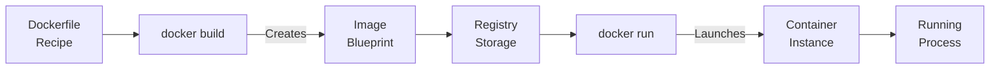
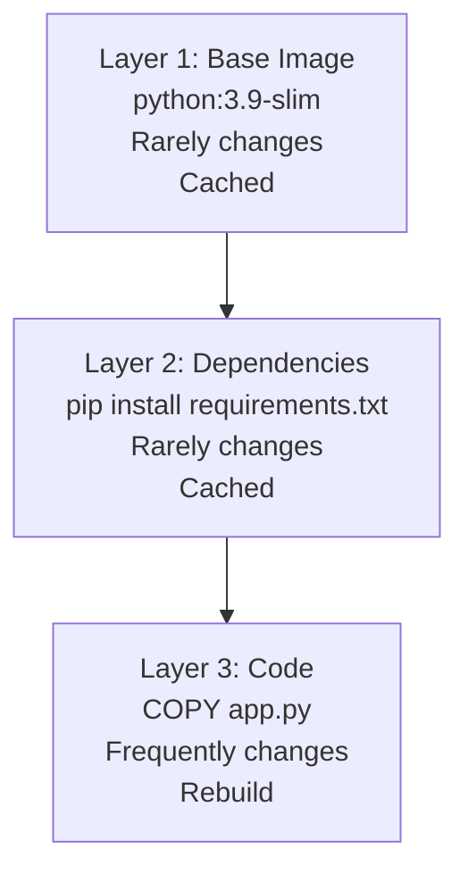
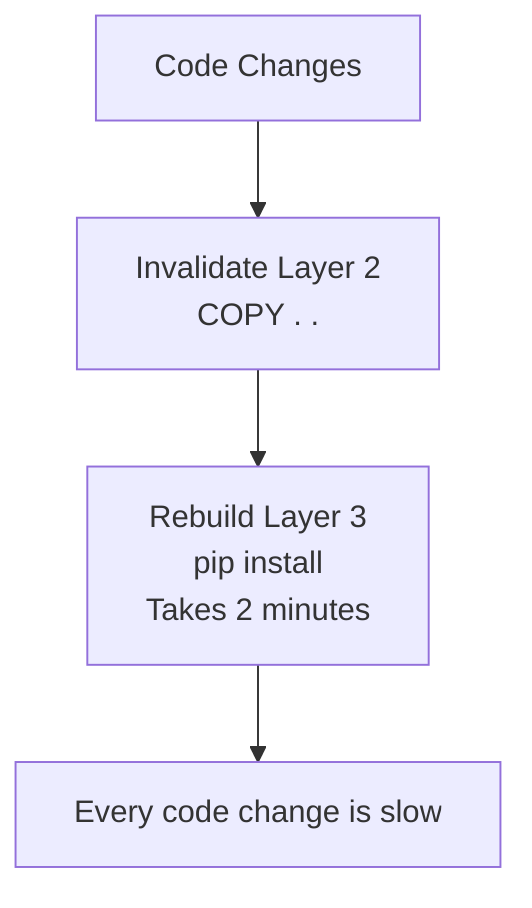
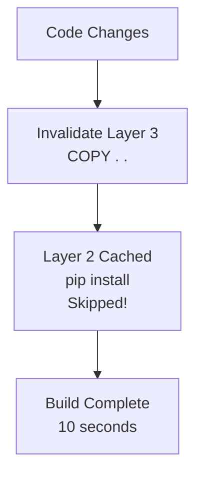
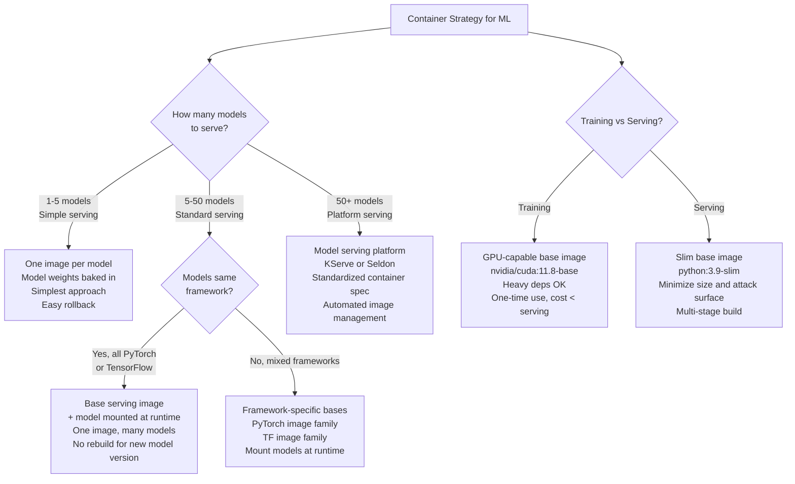

# Containerization & Docker: Packaging ML Systems for Deployment

## Definition & Why It Matters

Containerization packages code, dependencies, and environment into a reproducible unit that runs identically everywhere (laptop, staging, production). Docker is the standard container tool in ML.

**The environment problem:** Code works on laptop (Python 3.9, PyTorch 2.0), fails on server (Python 3.8, PyTorch 1.10). Root cause: environment differences. Containers solve this by bundling environment + code.

**Why containers matter:**
- **Reproducibility**: Same Docker image runs identically on any machine
- **Dependency isolation**: Image pins exact versions; can't have library conflicts
- **Scaling**: Deploy same image across 100 servers; all behave identically
- **Rollback**: Previous version is previous Docker image; instant rollback
- **CI/CD automation**: Pipeline builds image, runs tests, deploys image

Netflix uses Docker for all services. Stripe containerizes fraud models. Every ML system in production runs in containers.

---

## How It Works

### Docker Basics

```
Dockerfile (recipe)
    ↓
docker build (creates image)
    ↓
Image (blueprint: code + dependencies + environment)
    ↓
docker run (creates container from image)
    ↓
Container (running instance)
```



### Dockerfile Structure

```dockerfile
FROM python:3.9-slim              # Base image (OS + Python)
WORKDIR /app                      # Working directory inside container
COPY requirements.txt .           # Copy dependency list
RUN pip install -r requirements.txt  # Install dependencies
COPY train.py .                   # Copy application code
ENTRYPOINT ["python", "train.py"]  # Default command
```

### Layers & Caching

Docker images are built in layers. Each instruction (FROM, COPY, RUN) creates a layer.
- **Benefit**: If layer A hasn't changed, Docker reuses cached layer instead of rebuilding
- **Optimization**: Put slowly-changing layers first (base image), frequently-changing layers last (code)



### Example: Inefficient vs Efficient

**Inefficient:**
```dockerfile
FROM python:3.9-slim
COPY . .  # Copy all code (frequent changes)
RUN pip install -r requirements.txt  # Install (slow)
```
Each code change → rebuild dependencies (slow).



**Efficient:**
```dockerfile
FROM python:3.9-slim
COPY requirements.txt .  # Copy dependencies first (rare changes)
RUN pip install -r requirements.txt  # Install once
COPY . .  # Copy code last (frequent changes)
```
Code changes → reuse cached dependency layer (fast).



---

## Interview Q&A: Containerization

### Q1: "Code works on laptop, fails on server. Docker fixes it. How?"
**Answer outline:** Environment mismatch fixed:
1. **Dockerfile pins versions**: RUN pip install torch==2.0.0 (exact version, not torch==2.*)
2. **Base image is explicit**: FROM python:3.9-slim (specific Python version)
3. **System dependencies**: Docker image includes required system libs
4. **Reproducibility**: Same Dockerfile → same environment everywhere

Laptop failures → check: Python version, library versions, CUDA version, GPU drivers. Docker eliminates this.

### Q2: "Docker image is 5GB. Slow to push to registry. Optimize."
**Answer outline:** Reduce image size:
1. **Multi-stage builds**: Build in one image, copy artifacts to smaller image
   ```dockerfile
   FROM python:3.9 as builder
   # Install dependencies, build wheels
   FROM python:3.9-slim
   # Copy only wheels from builder, skip build tools
   ```
2. **Use slim base image**: python:3.9-slim (100MB) vs python:3.9-full (1GB)
3. **Remove unnecessary files**: pip cache, test files, documentation
4. **Layer caching**: Reuse cached layers when possible

Result: 5GB → 500MB (10x smaller, faster push/pull).

### Q3: "Production uses Python 3.8, new model needs Python 3.9. How do you transition?"
**Answer outline:** Docker enables safe migration:
1. **Build new container**: FROM python:3.9, new dependencies
2. **Test thoroughly**: Unit tests, integration tests, shadow test
3. **Canary deployment**: 5% of traffic gets new container, monitor
4. **Gradual rollout**: 25% → 50% → 100%
5. **Keep old container**: Can instantly revert if needed

Without Docker: "Upgrade production Python = risky, might break everything." With Docker: "Each version is separate container, easy rollback."

### Q4: "How do you version Docker images?"
**Answer outline:** Use git commit hash + semantic versioning:
1. **Tag with version**: docker tag model:latest model:v1.2.3
2. **Tag with git commit**: docker tag model:latest model:abc123 (first 7 chars of commit)
3. **Push to registry**: docker push myregistry.com/model:v1.2.3
4. **Deploy specific version**: kubectl set image deployment/model model=myregistry.com/model:v1.2.3

Enables: identify exactly which version is running, quick rollback (previous version is previous tag).

### Q5: "Design containerization strategy for 100 models."
**Answer outline:** Don't build 100 different images. Use base image + model mounting:

1. **Base image**: Python, PyTorch, inference server (Flask/FastAPI)
2. **Model mounting**: Mount model artifacts at /models/model_name (shared storage like S3)
3. **Configuration**: Environment variables specify which model to load

Result: One image deployed 100 times with different model configs. When model updates (new version pushed to S3), no container rebuild needed.

Alternative (for large models): Use versioned model images:
- myregistry.com/model-fraud:v1 (fraud model + inference server)
- myregistry.com/model-churn:v1 (churn model + inference server)

Enables: model-specific optimization (different frameworks, Python versions), independent deployment.

---

## Best Practices

1. **Pin dependency versions**: No ranges. torch==2.0.0, not torch>=2.0.0.

2. **Use slim base images**: python:3.9-slim is smaller than python:3.9.

3. **Multi-stage builds**: Reduce final image size by separating build and runtime.

4. **Order layers by change frequency**: Base → dependencies → code. Reuse cached layers.

5. **Run as non-root**: docker run creates root user by default; security risk. Add user.

6. **Health checks**: Define how to check if container is healthy. Kubernetes uses this for rollouts.

7. **Environment variables for config**: Don't hardcode paths, credentials. Use ENV variables.

8. **Minimize layers**: Each RUN/COPY adds layer. Combine when possible.

9. **Use .dockerignore**: Exclude large files (datasets, test data) from image.

10. **Tag and push to registry**: Don't just docker build locally. Push to registry for production.

---

## Common Pitfalls

1. **No version pinning**: RUN pip install torch. Dependencies change, breaks reproducibility.

2. **Large images**: Forgetting to clean up (pip cache, apt cache). Image 5GB when could be 500MB.

3. **Running as root**: Security vulnerability. Run as non-root user.

4. **Not testing image locally**: Build image, push, deploy, fails. Test docker run locally first.

5. **Frequent rebuilds**: Editing code → rebuild entire image (including dependencies). Use layer caching efficiently.

6. **No health checks**: Kubernetes thinks container is healthy when it's not. Define liveness probe.

7. **Hardcoded paths/credentials**: /home/user/model.pkl (won't exist in container). Use environment variables.

8. **Forgetting .dockerignore**: 1GB dataset copied into image (unnecessary). Use .dockerignore.

9. **No tagging strategy**: All images tagged "latest". Can't identify versions, rollback hard.

10. **Building image per model**: 100 models = 100 images. Maintenance nightmare. Use single image + model mounting.

---

## Real-World Examples

### Example 1: Netflix Model Container
Netflix containerizes ML models for recommendation:
```dockerfile
FROM nflx/python:3.9-slim
COPY requirements.txt .
RUN pip install -r requirements.txt --no-cache-dir
COPY /models/recommendation_model /app/model
COPY inference.py /app/
ENV MODEL_PATH=/app/model/model.pkl
HEALTHCHECK --interval=30s --timeout=10s CMD curl localhost:8000/health
ENTRYPOINT ["python", "/app/inference.py"]
```

- Slim base image (100MB)
- Requirements pinned (reproducible)
- Model pre-loaded in image
- Health check for Kubernetes monitoring
- Serves model on port 8000

### Example 2: Stripe Fraud Model Migration
Stripe migrated fraud model from Python 3.8 → 3.9:
- Built new container FROM python:3.9
- Tested: unit tests passed, integration tests passed, shadow test on 1% traffic passed
- Deployed: 5% traffic first (monitor error rates, latency)
- Result: no issues, rolled out to 100%
- Kept old container for instant rollback

Container made migration low-risk.

### Example 3: Uber Multi-Model Container Strategy
Uber uses base image for all models:
```dockerfile
FROM pytorch-serving:latest
# Base image: Python, PyTorch, Model Serving framework
# All models mounted at /models
```

Deploy same image 50 times (each with different model config). When fraud model updates:
- New model version uploaded to S3
- No container rebuild
- Pod restarts (reads new model)
- Instant update, no deployment latency

---

## Sample Interview Case Study

**Scenario:** Package ML training pipeline for production. Requirements: reproducible, scalable, rollback-able.

**Solution:**

1. **Dockerfile**:
```dockerfile
FROM python:3.9-slim
WORKDIR /app
COPY requirements.txt .
RUN pip install -r requirements.txt --no-cache-dir
COPY train.py /app/
COPY data /app/data
ENV SEED=42
ENTRYPOINT ["python", "train.py"]
```

2. **Build & Tag**:
```bash
git log -1 --format=%h  # Get commit hash
docker build -t training:abc123 .  # Tag with commit hash
docker push myregistry.com/training:abc123
```

3. **Run & Test**:
```bash
docker run -v /models:/app/output training:abc123  # Mount output volume
# Container trains, saves model to /models
```

4. **Production**:
```bash
kubernetes deploy training:abc123  # Deploy container
# If fails, rollback: kubernetes deploy training:def456
```

**Benefits:**
- ✓ Reproducible: same dependencies everywhere
- ✓ Scalable: run same image on 10 machines
- ✓ Rollback-able: previous version is previous image

**Strong answer:** "Containerize training pipeline: Dockerfile with pinned dependencies (PyTorch 2.0.0 exactly), slim base image, tag with git commit hash. Build locally, test (docker run), push to registry. In production, deploy via Kubernetes with previous image available for instant rollback. Enables reproducibility and safe deployment."

---

## Key Takeaways

Docker is fundamental to production ML. Environment reproducibility → deployment consistency → safe rollbacks.

**Container workflow:** Dockerfile → build → tag → push → test → deploy → monitor → rollback if needed

**Common interview pattern:** "Code works locally, fails in production." → Answer: "Likely environment mismatch. Containerize: Dockerfile pins dependencies, builds reproducible image. Run same image locally and production = identical behavior."

---

## Related Concepts

- **Reproducibility** (Concept 07): Docker ensures reproducible environments
- **Model Serving** (Concept 14): Servers run in containers
- **Deployment** (Concept 16): Containers deployed to Kubernetes
- **CI/CD** (Concept 15): Pipeline builds and pushes containers

---

## Quick Reference Card

### 2-Minute Elevator Pitch
Containerization solves the fundamental deployment problem in ML: "it works on my machine." A Docker container bundles code, dependencies, and environment into a single immutable artifact that runs identically everywhere — laptop, CI server, staging, production. For ML specifically, containers solve three problems: environment reproducibility (exact Python and library versions), safe rollback (previous version is a previous container image), and horizontal scaling (same image deployed to 100 servers). The key skill is writing efficient Dockerfiles that use layer caching to keep build times under 2 minutes.

### Numbers to Know
- Slim base image (python:3.9-slim): ~130MB vs python:3.9 (900MB) — 7x smaller
- Multi-stage build savings: production image often 3-5x smaller than build image (eliminates build tools)
- Docker layer cache benefit: dependency layer changes rarely (weekly), code layer changes daily — correct ordering makes rebuilds 10-30x faster
- Image push time: 1GB image to ECR = ~2 minutes; 100MB image = ~10 seconds (critical for CI pipeline speed)
- Netflix: all services run in containers; new model deployment = new container image (no SSH, no manual steps)
- Container startup time with ML model: 10-30 seconds for model loading; use readiness probes to prevent traffic before ready
- GPU containers: nvidia/cuda base images add ~2GB to image size; use runtime GPU libraries instead of build-time when possible
- Container security: running as root in a container is a major vulnerability; always specify USER directive

### Decision Framework: Container Strategy for ML Systems



---

## Strong vs Weak Answers

### Q: Your ML team currently deploys models by SSH-ing into servers and manually copying model weights. Convince them to adopt containerization.

**Weak Answer:** "Containers are more reproducible and reliable than manual deployment. I would recommend using Docker to package models and deploy them consistently."

**Strong Answer:** "The manual process has five concrete failure modes I'd highlight. First, environment drift: if server A has PyTorch 2.0 and server B has PyTorch 2.1 (installed manually over time), models behave differently across servers — you'll see inconsistent accuracy that's impossible to debug. Second, rollback impossibility: when a bad model is deployed manually, reverting requires finding the old weights file (often unnamed 'model_final_v2_actually_final.pkl') and re-SSHing to restore it. With containers, rollback is one command: `kubectl set image deployment/model model=registry:v14`. Third, no audit trail: manual deployments have no record of who deployed what and when. A month later, 'what changed?' is unanswerable. With containers, every deploy is a git-tagged image with a deployment record. Fourth, scale impossibility: copying files to 50 servers manually is not a deployment strategy. Containers + Kubernetes deploy to 50 servers in the same time as 1. Fifth, reproducibility: 'works on my laptop' stops being an excuse when the laptop and the server run the exact same container image. I'd propose a 2-sprint migration: sprint 1, containerize the most critical model (proves the approach), sprint 2, containerize all models and deprecate manual SSH access."

---

### Q: Your Docker build takes 15 minutes, making the CI pipeline painfully slow. Optimize it.

**Weak Answer:** "I would use multi-stage builds to reduce the image size and use a smaller base image to speed up the build."

**Strong Answer:** "15-minute builds are almost always caused by incorrect layer ordering invalidating the dependency cache. The fix is structural. Current bad pattern: `COPY . .` then `RUN pip install requirements.txt` — every code change invalidates the dependency layer and triggers a full pip install (10-12 minutes). Correct pattern: copy requirements first, install, then copy code. This ensures pip only re-runs when requirements change (typically weekly), not on every code push. Step-by-step optimization: (1) Reorder Dockerfile: `COPY requirements.txt .` → `RUN pip install` → `COPY . .`. This alone takes builds from 15 min to 2 min on cache hits. (2) Use a slim base image: switch from `python:3.9` (900MB) to `python:3.9-slim` (130MB), reducing push/pull time by 6x. (3) Multi-stage build for training images: first stage installs build tools and compiles dependencies, second stage copies only the compiled wheels. Eliminates 2-3GB of build tools from the final image. (4) Add `.dockerignore`: exclude datasets, test data, model weights from the build context — prevents accidental copying of 10GB+ artifacts into the image. Result: 15 minutes → 90 seconds on cache hit, 4 minutes on cache miss."

---

### Q: How do you secure a production Docker container running an ML model that accepts external user input?

**Weak Answer:** "I would run the container with limited permissions and keep the base image updated to patch security vulnerabilities."

**Strong Answer:** "ML inference containers have specific security concerns beyond standard web services. Seven controls I'd implement. First, run as non-root: `USER 1001` in Dockerfile prevents a container escape from granting host root access. This is the most important single control. Second, read-only filesystem: `--read-only` at runtime prevents an attacker who exploits the model service from writing malware to the container filesystem. Model weights are mounted read-only. Third, no capability escalation: `--no-new-privileges` flag prevents processes from gaining new Linux capabilities, even through setuid binaries. Fourth, network policy: Kubernetes NetworkPolicy restricts which pods can call the model service — only the API gateway, not internal services with no business need. Fifth, input validation: ML models are vulnerable to adversarial inputs that cause excessive compute (tokenizers that expand input 1000x, images that cause OOM). Validate input size and format before model inference. Sixth, resource limits: `requests.cpu`, `limits.memory` in Kubernetes prevents a compromised container from affecting neighboring services. Seventh, image signing: Docker Content Trust ensures only images signed by the CI/CD service account can be deployed — prevents deployment of unsigned (potentially tampered) images."

---

## System Design: Container Strategy for a Multi-Model ML Platform

**Question:** "You're the infrastructure lead at a fintech company with 50 ML models in production: 10 deep learning models (PyTorch), 20 gradient boosting models (XGBoost), and 20 statistical models (scikit-learn). Design a container strategy that: minimizes image storage costs, enables fast model updates, supports rollback, and can scale to 200 models in 18 months."

**Walkthrough:**

1. **Base image taxonomy.** Create three standardized base images: (a) `ml-serving-pytorch:2.0-slim` — Python 3.9 + PyTorch 2.0 + FastAPI + model loading utilities, ~4GB; (b) `ml-serving-sklearn:1.3-slim` — Python 3.9 + scikit-learn 1.3 + XGBoost 1.7 + FastAPI, ~500MB; (c) `ml-serving-base:latest` — Python 3.9 + FastAPI only (for statistical models), ~200MB. These are built monthly (only when dependencies update) and pushed to ECR with version tags.

2. **Model-as-mount pattern.** Model weights are NOT baked into images. Instead: the serving container loads from a model path specified by an environment variable (`MODEL_PATH=/models/fraud_v15/`). The model is mounted from S3 at container startup via an init container that runs `aws s3 sync s3://models/fraud_v15/ /models/fraud_v15/`. This means: updating a model requires zero container rebuild — just point the deployment to a new S3 path and restart pods. Image storage: 3 base images × 4GB = 12GB (vs 50 × 4GB = 200GB if each model had its own image).

3. **Container naming and versioning convention.** Base images: `ml-serving-pytorch:2.0.0-20260115` (framework version + build date). Deployment images: `fraud-model:v15-pytorch2.0` (model version + framework version). This makes it clear: fraud-model v15 uses PyTorch 2.0, so we know which base image compatibility to check if there's an issue.

4. **CI/CD pipeline for new model versions.** When a data scientist trains a new model: (a) model weights are uploaded to S3 with a versioned path, (b) CI runs integration tests (loads model from S3, runs inference, validates output format), (c) if tests pass, a Kubernetes ConfigMap is updated with the new model path, (d) pods rolling-restart to pick up new model. Total time: ~10 minutes (no image rebuild). Old model path remains in S3 for instant rollback.

5. **Rollback mechanism.** Two levels: (a) model rollback (change S3 path back to previous version, rolling restart — 5 minutes) for model weight changes, (b) container rollback (update Kubernetes image to previous container tag) for dependency or serving code changes. Both are one-command operations. Previous versions retained: S3 model paths kept for 90 days; container images kept for 12 months.

6. **GPU-specific containers.** 10 PyTorch deep learning models require GPU. Use `nvidia/cuda:11.8-cudnn8-runtime-ubuntu20.04` as the CUDA base (runtime only, not devel — saves 5GB). GPU containers run on GPU node pool with `nodeSelector: gpu: "true"`. Non-GPU models run on CPU node pool, reducing GPU costs by 40%.

7. **Container health checks.** Each container implements: (a) liveness probe: `GET /health` — returns 200 if process is running, (b) readiness probe: `GET /ready` — returns 200 only after model is fully loaded (models take 10-30 seconds to load from S3). Kubernetes waits for readiness before routing traffic — prevents new pods from receiving traffic before model is loaded.

8. **Image registry management.** ECR lifecycle policies: keep last 3 tags per repository for quick rollback; keep any image tagged as `production-*` for 12 months regardless of recency; delete untagged images after 7 days. This prevents ECR costs from growing unboundedly as new images are pushed daily.

9. **Secret management.** Model containers need access to S3 (model weights), feature store (Redis), and monitoring (Datadog). Secrets are never baked into images (they'd be in image layer history). Instead: IAM roles for service accounts (Kubernetes IRSA) grant S3 access without credentials; feature store and monitoring credentials are injected via Kubernetes Secrets mounted as environment variables. Regular secret rotation without container rebuild.

10. **Scaling strategy for 200 models.** The model-as-mount pattern scales linearly: 200 models with 3 base images still costs 3 × base image storage, not 200 × base image storage. For models with similar inference patterns, consolidate: run multiple models in one container instance with routing logic. A 'multi-model server' container loads whichever model is requested by the routing header, with model-level auto-scaling based on request rate per model.

**Key decisions:**
- Model-as-mount over baking weights into images: enables model updates in 10 minutes without CI pipeline; 20x storage savings
- Three base images vs one: PyTorch (~4GB with CUDA) is too heavy for scikit-learn models; separate bases keep most containers small and fast
- Readiness probes as mandatory: ML containers have longer startup times than web services; readiness probes prevent the common "model not loaded yet" production incident during deployments
