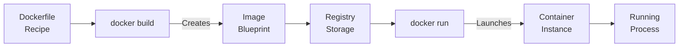
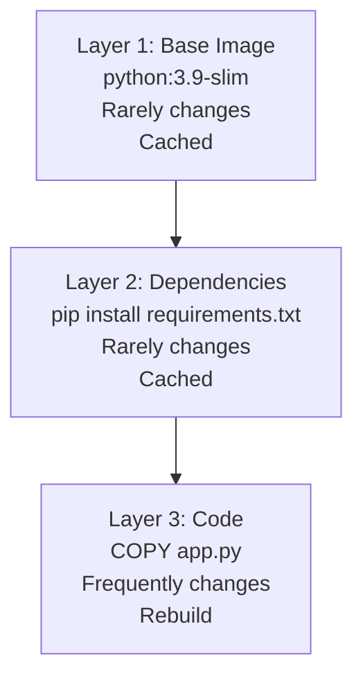
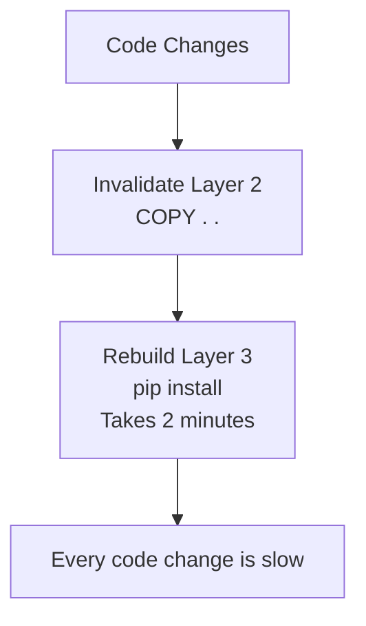
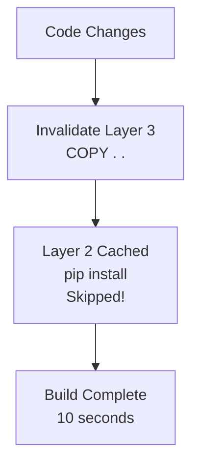

# Containerization & Docker: Packaging ML Systems for Deployment

## Definition & Why It Matters

Containerization packages code, dependencies, and environment into a reproducible unit that runs identically everywhere (laptop, staging, production). Docker is the standard container tool in ML.

**The environment problem:** Code works on laptop (Python 3.9, PyTorch 2.0), fails on server (Python 3.8, PyTorch 1.10). Root cause: environment differences. Containers solve this by bundling environment + code.

**Why containers matter:**
- **Reproducibility**: Same Docker image runs identically on any machine
- **Dependency isolation**: Image pins exact versions; can't have library conflicts
- **Scaling**: Deploy same image across 100 servers; all behave identically
- **Rollback**: Previous version is previous Docker image; instant rollback
- **CI/CD automation**: Pipeline builds image, runs tests, deploys image

Netflix uses Docker for all services. Stripe containerizes fraud models. Every ML system in production runs in containers.

---

## How It Works

### Docker Basics

```
Dockerfile (recipe)
    ↓
docker build (creates image)
    ↓
Image (blueprint: code + dependencies + environment)
    ↓
docker run (creates container from image)
    ↓
Container (running instance)
```



### Dockerfile Structure

```dockerfile
FROM python:3.9-slim              # Base image (OS + Python)
WORKDIR /app                      # Working directory inside container
COPY requirements.txt .           # Copy dependency list
RUN pip install -r requirements.txt  # Install dependencies
COPY train.py .                   # Copy application code
ENTRYPOINT ["python", "train.py"]  # Default command
```

### Layers & Caching

Docker images are built in layers. Each instruction (FROM, COPY, RUN) creates a layer.
- **Benefit**: If layer A hasn't changed, Docker reuses cached layer instead of rebuilding
- **Optimization**: Put slowly-changing layers first (base image), frequently-changing layers last (code)



### Example: Inefficient vs Efficient

**Inefficient:**
```dockerfile
FROM python:3.9-slim
COPY . .  # Copy all code (frequent changes)
RUN pip install -r requirements.txt  # Install (slow)
```
Each code change → rebuild dependencies (slow).



**Efficient:**
```dockerfile
FROM python:3.9-slim
COPY requirements.txt .  # Copy dependencies first (rare changes)
RUN pip install -r requirements.txt  # Install once
COPY . .  # Copy code last (frequent changes)
```
Code changes → reuse cached dependency layer (fast).



---

## Interview Q&A: Containerization

### Q1: "Code works on laptop, fails on server. Docker fixes it. How?"
**Answer outline:** Environment mismatch fixed:
1. **Dockerfile pins versions**: RUN pip install torch==2.0.0 (exact version, not torch==2.*)
2. **Base image is explicit**: FROM python:3.9-slim (specific Python version)
3. **System dependencies**: Docker image includes required system libs
4. **Reproducibility**: Same Dockerfile → same environment everywhere

Laptop failures → check: Python version, library versions, CUDA version, GPU drivers. Docker eliminates this.

### Q2: "Docker image is 5GB. Slow to push to registry. Optimize."
**Answer outline:** Reduce image size:
1. **Multi-stage builds**: Build in one image, copy artifacts to smaller image
   ```dockerfile
   FROM python:3.9 as builder
   # Install dependencies, build wheels
   FROM python:3.9-slim
   # Copy only wheels from builder, skip build tools
   ```
2. **Use slim base image**: python:3.9-slim (100MB) vs python:3.9-full (1GB)
3. **Remove unnecessary files**: pip cache, test files, documentation
4. **Layer caching**: Reuse cached layers when possible

Result: 5GB → 500MB (10x smaller, faster push/pull).

### Q3: "Production uses Python 3.8, new model needs Python 3.9. How do you transition?"
**Answer outline:** Docker enables safe migration:
1. **Build new container**: FROM python:3.9, new dependencies
2. **Test thoroughly**: Unit tests, integration tests, shadow test
3. **Canary deployment**: 5% of traffic gets new container, monitor
4. **Gradual rollout**: 25% → 50% → 100%
5. **Keep old container**: Can instantly revert if needed

Without Docker: "Upgrade production Python = risky, might break everything." With Docker: "Each version is separate container, easy rollback."

### Q4: "How do you version Docker images?"
**Answer outline:** Use git commit hash + semantic versioning:
1. **Tag with version**: docker tag model:latest model:v1.2.3
2. **Tag with git commit**: docker tag model:latest model:abc123 (first 7 chars of commit)
3. **Push to registry**: docker push myregistry.com/model:v1.2.3
4. **Deploy specific version**: kubectl set image deployment/model model=myregistry.com/model:v1.2.3

Enables: identify exactly which version is running, quick rollback (previous version is previous tag).

### Q5: "Design containerization strategy for 100 models."
**Answer outline:** Don't build 100 different images. Use base image + model mounting:

1. **Base image**: Python, PyTorch, inference server (Flask/FastAPI)
2. **Model mounting**: Mount model artifacts at /models/model_name (shared storage like S3)
3. **Configuration**: Environment variables specify which model to load

Result: One image deployed 100 times with different model configs. When model updates (new version pushed to S3), no container rebuild needed.

Alternative (for large models): Use versioned model images:
- myregistry.com/model-fraud:v1 (fraud model + inference server)
- myregistry.com/model-churn:v1 (churn model + inference server)

Enables: model-specific optimization (different frameworks, Python versions), independent deployment.

---

## Best Practices

1. **Pin dependency versions**: No ranges. torch==2.0.0, not torch>=2.0.0.

2. **Use slim base images**: python:3.9-slim is smaller than python:3.9.

3. **Multi-stage builds**: Reduce final image size by separating build and runtime.

4. **Order layers by change frequency**: Base → dependencies → code. Reuse cached layers.

5. **Run as non-root**: docker run creates root user by default; security risk. Add user.

6. **Health checks**: Define how to check if container is healthy. Kubernetes uses this for rollouts.

7. **Environment variables for config**: Don't hardcode paths, credentials. Use ENV variables.

8. **Minimize layers**: Each RUN/COPY adds layer. Combine when possible.

9. **Use .dockerignore**: Exclude large files (datasets, test data) from image.

10. **Tag and push to registry**: Don't just docker build locally. Push to registry for production.

---

## Common Pitfalls

1. **No version pinning**: RUN pip install torch. Dependencies change, breaks reproducibility.

2. **Large images**: Forgetting to clean up (pip cache, apt cache). Image 5GB when could be 500MB.

3. **Running as root**: Security vulnerability. Run as non-root user.

4. **Not testing image locally**: Build image, push, deploy, fails. Test docker run locally first.

5. **Frequent rebuilds**: Editing code → rebuild entire image (including dependencies). Use layer caching efficiently.

6. **No health checks**: Kubernetes thinks container is healthy when it's not. Define liveness probe.

7. **Hardcoded paths/credentials**: /home/user/model.pkl (won't exist in container). Use environment variables.

8. **Forgetting .dockerignore**: 1GB dataset copied into image (unnecessary). Use .dockerignore.

9. **No tagging strategy**: All images tagged "latest". Can't identify versions, rollback hard.

10. **Building image per model**: 100 models = 100 images. Maintenance nightmare. Use single image + model mounting.

---

## Real-World Examples

### Example 1: Netflix Model Container
Netflix containerizes ML models for recommendation:
```dockerfile
FROM nflx/python:3.9-slim
COPY requirements.txt .
RUN pip install -r requirements.txt --no-cache-dir
COPY /models/recommendation_model /app/model
COPY inference.py /app/
ENV MODEL_PATH=/app/model/model.pkl
HEALTHCHECK --interval=30s --timeout=10s CMD curl localhost:8000/health
ENTRYPOINT ["python", "/app/inference.py"]
```

- Slim base image (100MB)
- Requirements pinned (reproducible)
- Model pre-loaded in image
- Health check for Kubernetes monitoring
- Serves model on port 8000

### Example 2: Stripe Fraud Model Migration
Stripe migrated fraud model from Python 3.8 → 3.9:
- Built new container FROM python:3.9
- Tested: unit tests passed, integration tests passed, shadow test on 1% traffic passed
- Deployed: 5% traffic first (monitor error rates, latency)
- Result: no issues, rolled out to 100%
- Kept old container for instant rollback

Container made migration low-risk.

### Example 3: Uber Multi-Model Container Strategy
Uber uses base image for all models:
```dockerfile
FROM pytorch-serving:latest
# Base image: Python, PyTorch, Model Serving framework
# All models mounted at /models
```

Deploy same image 50 times (each with different model config). When fraud model updates:
- New model version uploaded to S3
- No container rebuild
- Pod restarts (reads new model)
- Instant update, no deployment latency

---

## Sample Interview Case Study

**Scenario:** Package ML training pipeline for production. Requirements: reproducible, scalable, rollback-able.

**Solution:**

1. **Dockerfile**:
```dockerfile
FROM python:3.9-slim
WORKDIR /app
COPY requirements.txt .
RUN pip install -r requirements.txt --no-cache-dir
COPY train.py /app/
COPY data /app/data
ENV SEED=42
ENTRYPOINT ["python", "train.py"]
```

2. **Build & Tag**:
```bash
git log -1 --format=%h  # Get commit hash
docker build -t training:abc123 .  # Tag with commit hash
docker push myregistry.com/training:abc123
```

3. **Run & Test**:
```bash
docker run -v /models:/app/output training:abc123  # Mount output volume
# Container trains, saves model to /models
```

4. **Production**:
```bash
kubernetes deploy training:abc123  # Deploy container
# If fails, rollback: kubernetes deploy training:def456
```

**Benefits:**
- ✓ Reproducible: same dependencies everywhere
- ✓ Scalable: run same image on 10 machines
- ✓ Rollback-able: previous version is previous image

**Strong answer:** "Containerize training pipeline: Dockerfile with pinned dependencies (PyTorch 2.0.0 exactly), slim base image, tag with git commit hash. Build locally, test (docker run), push to registry. In production, deploy via Kubernetes with previous image available for instant rollback. Enables reproducibility and safe deployment."

---

## Key Takeaways

Docker is fundamental to production ML. Environment reproducibility → deployment consistency → safe rollbacks.

**Container workflow:** Dockerfile → build → tag → push → test → deploy → monitor → rollback if needed

**Common interview pattern:** "Code works locally, fails in production." → Answer: "Likely environment mismatch. Containerize: Dockerfile pins dependencies, builds reproducible image. Run same image locally and production = identical behavior."

---

## Related Concepts

- **Reproducibility** (Concept 07): Docker ensures reproducible environments
- **Model Serving** (Concept 14): Servers run in containers
- **Deployment** (Concept 16): Containers deployed to Kubernetes
- **CI/CD** (Concept 15): Pipeline builds and pushes containers
