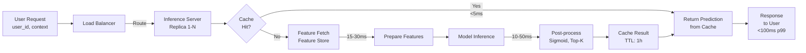
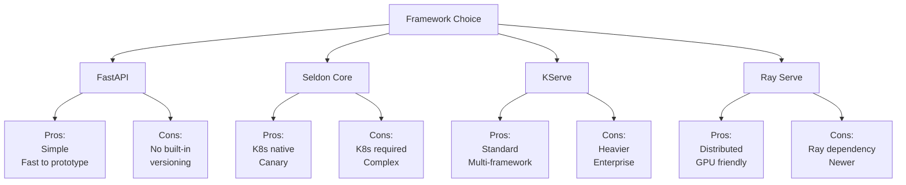
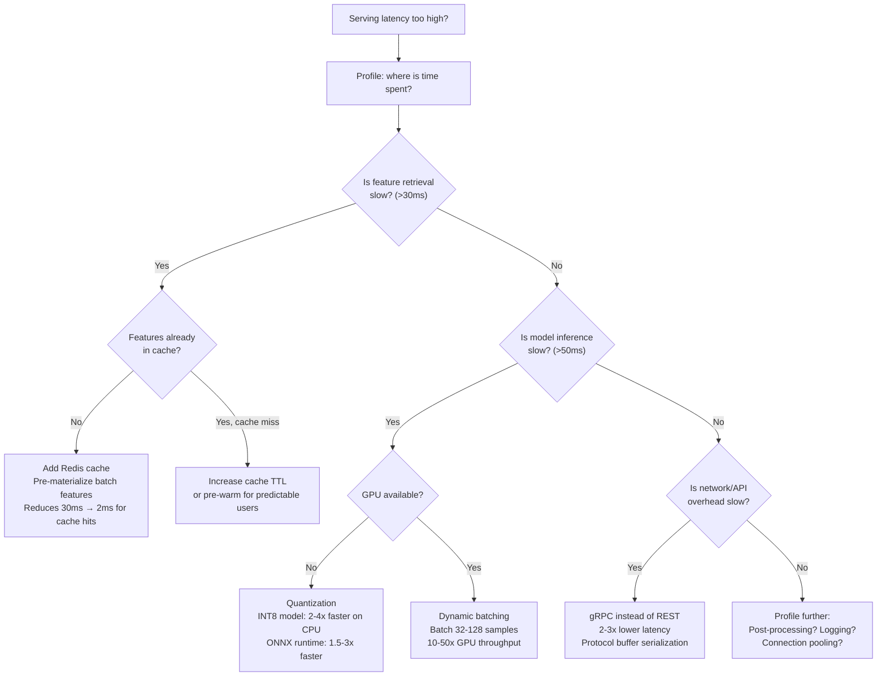

# Model Serving Frameworks: Making Models Available for Predictions

## Definition & Why It Matters

Model serving converts a trained model into a service that accepts requests and returns predictions. Unlike batch inference (process 1M samples overnight), serving handles real-time requests (1 request → 1 prediction in <100ms).

**The serving challenge:** Raw models can't handle production requirements. Needed: API endpoint, load balancing, caching, version management, rollback, monitoring. Serving frameworks provide these.

**Why frameworks matter:**
- **Performance**: Serving with FastAPI only? Then optimize caching, batching, GPU sharing yourself. Frameworks do this.
- **Scalability**: 100 concurrent requests? Framework load-balances across replicas, batches predictions.
- **Versioning**: Ship new model without downtime. Framework handles A/B testing, canary, instant rollback.
- **Operations**: Framework logs inference metrics, alerts on latency degradation.

Netflix uses custom serving framework on top of Kubernetes. Stripe uses Seldon Core. Uber uses KServe. Every high-scale ML system needs serving framework.

---

## How It Works

### Serving Patterns

**1. Batch Serving** (offline)
- Accept 1M samples overnight
- Return 1M predictions next morning
- Example: daily fraud score for all transactions

**2. Real-Time Serving** (online)
- Accept 1 request → 1 prediction in <100ms
- Example: user opens app → recommendation served in 100ms

**3. Streaming Serving** (streaming)
- Continuous event stream (Kafka) → predictions → downstream systems
- Example: anomaly detection on server metrics stream

### Frameworks

**FastAPI** (simple)
- Bare HTTP server
- You build: caching, batching, versioning, monitoring
- Good for: simple models, learning, prototypes
- Bad for: production, scale

```python
from fastapi import FastAPI
app = FastAPI()

@app.post("/predict")
def predict(input_data: dict):
    return model.predict(input_data)
```

**Seldon Core** (Kubernetes-native)
- Deploys models on Kubernetes
- Provides: versioning, canary, A/B testing, monitoring
- Good for: production, Kubernetes environments
- Bad for: non-Kubernetes, complex models

**KServe** (standardized)
- Open standard for model serving
- Supports: TensorFlow, PyTorch, Scikit-learn, custom models
- Features: auto-scaling, inference graphs, traffic splitting
- Good for: enterprise, multiple frameworks

**Ray Serve** (distributed)
- Serves models across cluster
- Features: dynamic batching, auto-scaling, fractional GPUs
- Good for: large models, distributed inference

**TensorFlow Serving** (TensorFlow-specific)
- Optimized for TensorFlow models
- Low-latency, supports multiple model versions
- Good for: pure TensorFlow systems

### Request Flow

```
User request
    ↓
Load balancer (routes to healthy replica)
    ↓
Inference server (receives request)
    ↓
[Cache hit?] → return cached prediction
    ↓
[Feature server] → fetch features
    ↓
[Model inference] → compute prediction
    ↓
[Cache] → store result
    ↓
Response returned to user
```





---

## Interview Q&A: Model Serving

### Q1: "Model inference takes 500ms. User needs response in 100ms. Fix it."
**Answer outline:** Multiple approaches:
1. **Optimize model**: Quantization (INT8), distillation, pruning → reduce inference time
2. **Optimize infrastructure**: GPU batching, reduce round-trip latency
3. **Caching**: If same predictions requested frequently, cache (miss → compute, hit → instant)
4. **Feature pre-computation**: Pre-compute expensive features, not at inference time
5. **Feature server**: Cache features in fast store (Redis), instant retrieval

Realistic example: 500ms → optimize model (350ms) + caching (instant on hits, 350ms on misses) + feature server (50ms feature fetch).

### Q2: "How do you deploy new model without downtime?"
**Answer outline:** Model versioning with no-downtime deployment:
1. **Canary**: Run 5% traffic on new model, 95% on old. Monitor. If good, expand.
2. **Blue-green**: Run both versions, switch traffic instantly. Instant rollback if needed.
3. **Shadow**: New model runs, predictions logged but unused. No user risk.
4. **Gradual rollout**: 5% → 25% → 50% → 100% over hours/days.

Framework support: Seldon, KServe support canary/blue-green natively. You manage versions, framework handles traffic splitting.

### Q3: "Model needs features from feature store, real-time API, and batch data. Latency <100ms. Design."
**Answer outline:** Latency breakdown:
- Feature store fetch: 10ms (fast)
- Real-time API: 20ms (slow)
- Batch data: 50ms (slowest)
- Total: 80ms (within budget)

But if serial: 10 + 20 + 50 = 80ms. If parallel: max(10, 20, 50) = 50ms. Much better.

Strategy:
```
Request arrives
    ↓
Parallel fetch:
  - Query feature store (10ms)
  - Call real-time API (20ms)
  - Fetch batch data (50ms)
    ↓
Inference (20ms)
    ↓
Response (90ms total)
```

Framework should support parallel feature fetching or you build it manually.

### Q4: "100K predictions/second. Cost is $1K/day per GPU. Optimize."
**Answer outline:** Reduce GPU usage:
1. **Batching**: Process 128 samples at once (128x faster than 1-at-a-time)
2. **Dynamic batching**: Framework waits 10ms for batch to fill (user latency +10ms, throughput 10x)
3. **Quantization**: INT8 model runs 2-4x faster on CPU
4. **Caching**: If 30% of predictions are repeats, cache (instant, no GPU)
5. **Feature caching**: Cache expensive features (feature computation often slower than model inference)

Result: 5 GPUs → 1 GPU (5x reduction, $5K → $1K/day).

### Q5: "Design serving infrastructure for model that requires feature store, GPU, and monitoring."
**Answer outline:** Full serving stack:

1. **Framework**: Kubernetes + KServe (standardized, scalable)
2. **Model serving**: KServe InferenceService with GPU resources
3. **Feature server**: Redis/DynamoDB for low-latency feature access
4. **API gateway**: Routes requests to service, handles auth
5. **Monitoring**: Prometheus (latency, error rates), logs to Datadog
6. **Versioning**: Multiple model versions deployed, traffic split via canary

Workflow:
```
Request → API Gateway → Load Balancer → KServe Pod
  ↓
Feature Server (Redis) [10ms]
  ↓
GPU Inference [50ms]
  ↓
Monitoring & Response [60ms total]
```

---

## Best Practices

1. **Use framework, don't build yourself**: FastAPI is seductive but missing versioning, monitoring. Use Seldon/KServe for production.

2. **Separate concerns**: Model inference server ≠ feature server ≠ API gateway. Deploy independently.

3. **Cache aggressively**: Most predictions are repeats. Cache in-memory (Redis).

4. **Monitor latency, not just accuracy**: User sees latency, not accuracy. Latency SLO is critical.

5. **Version models explicitly**: Never "latest." Tag releases (v1.2.3), deploy specific version, instant rollback.

6. **Batch requests when possible**: Inference usually much faster per-sample in batch. Wait 10ms for batch to fill.

7. **Pre-compute expensive features**: Compute high-cardinality features offline, store in feature server.

8. **Health checks**: Define liveness probe (is model responding?) and readiness probe (is model warm?).

9. **Auto-scaling**: Set up horizontal scaling: more traffic → more replicas.

10. **Test deployment locally**: docker run locally, verify inference works before deploying to production.

---

## Common Pitfalls

1. **No versioning strategy**: Deploy new model without version control. Can't identify what's running, can't rollback.

2. **Ignoring latency in optimization**: Model accuracy +1%, but inference 10x slower. Business metric bad.

3. **All traffic on new model immediately**: Deploy new model to 100% traffic. Hidden bug causes incident. Should canary first.

4. **Feature dependency unknown**: Model depends on feature A. Feature A compute changes. Inference breaks. Document dependencies.

5. **No monitoring**: Model serves silently, accuracy degrades, no one notices. Must monitor latency, error rate, predictions.

6. **Synchronous feature fetching**: Request → fetch features (slow) → infer (slow). Should prefetch or cache.

7. **No caching**: Same prediction computed 1M times. Cache 1M fast, compute 1 slow.

8. **Hot models cold**: Model reloads, first request slow (cold). Should warm-up after deployment.

9. **No graceful shutdown**: Deployment kills in-flight requests. Should drain connections.

10. **Underprovisioned resources**: Forecast peak traffic wrong, scale too small. Response times suffer.

---

## Real-World Examples

### Example 1: Netflix Recommendation Serving
Netflix serves recommendations to 250M+ users with <500ms latency:
- **Framework**: Custom Kotlin-based on top of Cassandra
- **Caching**: Local cache of user preferences (reduces feature fetch from 50ms → 5ms)
- **Batching**: Prefetch top-K recommendations for every user every 5 minutes (batch offline)
- **Versioning**: A/B test new ranker, shadow model runs in parallel
- **Result**: P99 latency <500ms, supports 1B+ requests/day

### Example 2: Stripe Real-Time Fraud Detection
Stripe serves fraud predictions for every transaction (<100ms):
- **Framework**: KServe on Kubernetes with GPU support
- **Latency optimization**: Quantized model (100ms → 20ms), dynamic batching
- **Feature server**: Redis for real-time transaction features
- **Fallback**: If inference takes >30ms, use simpler model (fast, less accurate)
- **Result**: 99.9% <100ms, 500M transactions/day

### Example 3: Uber ETA Serving
Uber predicts ETA for every matching request (<100ms):
- **Framework**: Ray Serve + Kubernetes
- **Optimization**: Pre-compute popular routes (frequent queries), cache
- **Monitoring**: Alert if p99 latency > 150ms (indicates scaling issue)
- **Versioning**: Canary new model (1% traffic), expand if metrics good
- **Result**: <50ms p99 latency, handles traffic spikes during events

---

## Sample Interview Case Study

**Scenario:** Airbnb recommendation serving. 50M users, 100K predictions/sec at peak.

**Design:**

1. **Framework**: KServe on Kubernetes (scalable, versioning, monitoring)

2. **Model optimization**:
   - Current model: 200ms inference on 1 GPU
   - Quantized (INT8): 50ms (4x faster)
   - CPU vs GPU: CPU 100ms (cheaper), GPU 50ms (expensive). Use GPU.

3. **Feature pipeline**:
   - User features: cached in Redis (1ms)
   - Listing features: cached in DynamoDB (5ms)
   - Real-time signals: fetch inline (5ms)
   - Total feature latency: 11ms (parallel)

4. **Inference latency**: 50ms GPU inference + 11ms features = 61ms (within 100ms budget)

5. **Throughput**: 100K pred/sec at peak
   - Current: 1 GPU → 10K pred/sec (need 10 GPUs)
   - With batching: dynamic batch 128 → 40K pred/sec per GPU (need 3 GPUs for peak + 1 for failover)
   - Cost: 4 GPUs × $1K/month = $4K/month

6. **Deployment**:
   - KServe InferenceService with 4 GPU replicas
   - Canary: new model 5% traffic, monitor latency/accuracy
   - Monitoring: Prometheus (latency, errors), alert if p99 > 100ms

7. **Result**: Serves 100K pred/sec, <100ms latency, $4K/month cost

**Strong answer:** "KServe on Kubernetes for production serving. Optimize model to 50ms with quantization. Feature server (Redis) for user features, cache listing features. Parallel feature fetch + GPU batching achieves 100K pred/sec, 61ms latency. Canary new models before full deployment."

---

## Key Takeaways

Serving is distinct from training. Raw models can't handle production load. Frameworks provide versioning, scaling, monitoring, and safe deployment.

**Serving workflow:** Framework (KServe) → Model versioning (canary) → Feature server (caching) → Monitoring (latency alerts)

**Common interview pattern:** "Model works in Jupyter. How do you serve?" → Answer: "KServe/Seldon on Kubernetes. Separate model server from feature server. Canary deployment for safety. Monitor latency/errors. Use caching for <100ms response."

---

## Related Concepts

- **Containerization** (Concept 13): Models run in containers
- **Deployment** (Concept 16): Serving infrastructure deployment strategy
- **Monitoring** (Concept 18): Monitor serving performance in production

---

## Quick Reference Card

### 2-Minute Elevator Pitch
Model serving is the engineering challenge of taking a trained model and making it reliably available to millions of concurrent requests with <100ms latency, high availability, and cost efficiency. It's distinct from training: the concerns are throughput (how many requests per second?), latency (how fast for each?), availability (what happens when a pod fails?), and versioning (how do you ship a new model without downtime?). The key insight: most serving latency comes from feature retrieval (10-30ms), not model inference (5-20ms) — optimizing the wrong layer is a common mistake.

### Numbers to Know
- Netflix: 250M users, p99 recommendation latency <500ms, 1B+ requests/day
- Stripe fraud: <100ms p99 for 500M transactions/day; uses quantized models (100ms → 20ms)
- Uber ETA: <50ms p99 latency; pre-computes popular routes to achieve this
- Dynamic batching benefit: 128-sample batch processes 10-50x faster than 128 individual requests on GPU
- Feature retrieval typically accounts for 40-60% of total serving latency
- Cache hit rate target for recommendation features: >90% (reduces feature latency from 30ms to 2ms)
- Model warm-up time: large PyTorch models take 5-30 seconds to load; readiness probes prevent cold-start traffic
- Auto-scaling rule of thumb: target 70% CPU/GPU utilization; scale up at 80%, scale down at 60%
- KServe vs custom FastAPI: KServe adds ~5ms overhead but provides versioning, monitoring, and auto-scaling for free

### Decision Framework: Choosing Model Serving Latency Optimizations



---

## Strong vs Weak Answers

### Q: Your model inference takes 500ms. The product team needs <100ms. Walk me through your optimization process.

**Weak Answer:** "I would use model quantization to make the model faster and add caching for repeated requests."

**Strong Answer:** "I'd attack this as an engineering problem with measurement before optimization. First, I'd profile the 500ms to understand where time goes. Typical breakdown: feature retrieval 150ms, model inference 250ms, pre/post-processing 50ms, network 50ms. This immediately shows where to focus. For feature retrieval (150ms → target <20ms): move features to Redis (lookup is 2ms vs database query at 150ms). Pre-materialize batch user features nightly; only compute truly real-time features (session context) at serving time. For model inference (250ms → target <50ms): first try ONNX export (PyTorch → ONNX typically gives 1.5-2x speedup on CPU). If still slow, try INT8 quantization (2-4x speedup with <1% accuracy drop for most models). If model is GPU-bound, enable dynamic batching (accumulate 50ms worth of requests into a batch of 32-64, then GPU processes in 30ms instead of 250ms × 64 = 16 seconds serially). For post-processing (50ms → target <5ms): vectorize operations, avoid Python loops, use NumPy batch operations. Result after optimization: 20ms feature retrieval + 50ms inference + 5ms post-processing + 25ms network = 100ms total. Then verify: load test confirms p99 at 100ms under production traffic patterns."

---

### Q: Design a serving system for a language model (LLM) that needs to handle 10K requests per second with <500ms latency. The model has 7B parameters.

**Weak Answer:** "I would deploy the model on multiple GPU servers with a load balancer in front to handle 10K requests per second. I would use vLLM or TensorRT for fast inference."

**Strong Answer:** "7B parameter LLM serving at 10K RPS is a serious infrastructure challenge. Let me work through the math. A 7B parameter model in FP16 requires 14GB GPU memory. An A100 (80GB) can hold ~5 model replicas or use tensor parallelism across 2 GPUs for larger context. With vLLM's continuous batching (key innovation: unlike static batching, continuous batching never waits for a full batch — it starts processing as soon as a request arrives, achieving ~3x better throughput than naive approaches), a single A100 can handle ~200-500 tokens/second throughput. At 10K RPS with average 50-output-token requests: 500K tokens/second needed. 200 tokens/second per GPU → 2,500 A100 GPUs needed. This is expensive — typical LLM serving cost is $0.001-0.01 per request. Architecture: (a) Gateway layer (nginx/Envoy): rate limiting, auth, request routing. (b) Model server tier: vLLM on A100 clusters with tensor parallelism (2 GPUs per model). (c) KV cache: vLLM's paged attention KV cache achieves near-zero memory waste vs traditional static KV allocation. (d) Prefix caching: if requests share common prefixes (system prompts), cache the KV cache for those prefixes — reduces compute 30-50% for chat applications. Latency: time-to-first-token target <200ms, streaming response for UX. Monitoring: tokens per second, queue depth, KV cache utilization, GPU memory pressure."

---

### Q: A model serving endpoint has 99.9% availability requirement. How do you achieve this?

**Weak Answer:** "I would run multiple replicas of the model with a load balancer to ensure high availability. I would also have health checks to detect failures and restart pods."

**Strong Answer:** "99.9% availability = <8.7 hours downtime per year, or <44 minutes per month. Achieving this requires defense in depth. Infrastructure layer: minimum 3 replicas deployed across 2+ availability zones (prevents single AZ failure from causing outage). Kubernetes HPA auto-scales based on CPU/latency — never goes below 3 replicas. Rolling deployment strategy ensures at least 2 replicas are always running during updates. Application layer: circuit breaker pattern (if >20% of requests timeout, stop calling the model and return cached/fallback predictions). Graceful degradation: if the ML model is unavailable, fall back to a rule-based predictor or cached predictions (users get degraded experience, not errors). Load balancer with health checks: every 10 seconds, if a replica fails 3 consecutive health checks, it's removed from rotation and a new one is started. The health check must verify model readiness (can it return a valid prediction?), not just process health (is the pod running?). Dependencies: if the feature store is unavailable, the model cannot serve personalized predictions. Design the fallback: serve global popular items or cached user features rather than failing. Test all this with chaos engineering: monthly game day where we kill replicas, inject latency into dependencies, and verify availability stays above 99.9%."

---

## System Design: High-Scale Model Serving for Real-Time Recommendation

**Question:** "You're the ML infrastructure lead at an e-commerce company similar to Amazon. The product recommendation model must serve 100K predictions/second at peak (holiday season), with p99 latency <100ms, and 99.95% availability. The model requires 50 features per prediction. Design the complete serving architecture."

**Walkthrough:**

1. **Capacity planning.** 100K predictions/second × 100ms per prediction = 10,000 concurrent requests in flight. Each prediction needs: feature retrieval (30ms), model inference (50ms), post-processing (10ms), networking (10ms) = 100ms total. For 100K RPS with GPU batching: batch size 64 → 1,562 batches/second. A100 GPU processes a 64-sample batch in ~5ms → single A100 can handle 12,800 samples/second. For 100K RPS: 8 A100 GPUs needed at peak + 2 spare (capacity buffer for holiday spikes).

2. **Feature serving architecture.** 50 features split into: (a) static user features (user embedding, historical preferences) — stored in DynamoDB, cache in Redis with 1-hour TTL; (b) real-time session features (last 5 clicks, cart contents) — stored in Redis directly, 5-minute TTL; (c) item features (price, category, stock) — stored in DynamoDB, cache in Redis with 15-minute TTL. Feature retrieval: parallel fetch from Redis (~2ms for cache hit) with DynamoDB fallback (~8ms for miss). Cache hit rate target: >95%. At 95% hit rate and 100K RPS: 5K cache misses/second to DynamoDB — DynamoDB provisioned for 5K read units.

3. **Model serving tier.** KServe InferenceService on Kubernetes. GPU node pool: 10 A100 nodes (8 for traffic, 2 on standby). Dynamic batching enabled: accumulate requests for up to 20ms or until batch size 64, whichever comes first. This trades 20ms latency for 50x throughput. Auto-scaling: scale from 8 to 20 GPUs during holiday peak based on GPU utilization threshold (>70% → add 2 GPUs).

4. **Load balancing and request routing.** nginx Ingress with least-connections routing (routes new requests to the replica with fewest in-flight requests, minimizing tail latency). Geographic routing: US-East and US-West deployments with Route53 latency routing — cuts cross-coast networking from 70ms to <10ms.

5. **Caching layer for popular items.** Top-1000 users (by request frequency) have their recommendations precomputed every 5 minutes and stored in Redis. These users account for ~15% of traffic. Cache hit for them: <5ms total (no model inference needed). This reduces effective throughput requirement by 15%, providing headroom.

6. **Circuit breaker pattern.** Hystrix-style circuit breaker: if >10% of model calls in a 10-second window fail or timeout, open the circuit and serve cached recommendations for 30 seconds. This prevents cascade failure: a temporarily overloaded model tier doesn't take down the entire product page.

7. **Graceful degradation tiers.** Tier 1 (normal): personalized ML recommendations. Tier 2 (model slow): serve cached recommendations from 5 minutes ago. Tier 3 (cache miss): serve user's top 10 historical categories. Tier 4 (feature store unavailable): serve globally popular items. Each tier is configured in the serving code; the system automatically falls through tiers based on availability.

8. **Versioning and deployment.** KServe traffic splitting: new model at 5% → 25% → 100% over 3 days. Both model versions run simultaneously with KServe routing. Rollback: reduce new model to 0% in <30 seconds by updating the traffic split configuration.

9. **Monitoring and alerting.** Prometheus metrics: p50/p99/p999 latency per endpoint, error rate, feature cache hit rate, GPU utilization, batch size distribution. Grafana dashboards. Alerts: p99 latency > 80ms (15-second budget before SLA breach), error rate > 0.1%, cache hit rate < 90% (indicates Redis capacity issue), GPU utilization > 85% (scale-up trigger).

10. **Cost optimization.** Spot instances for 6 of 8 baseline GPUs (60% cost savings, ~5% interruption rate). Spot interruption handler: graceful pod draining (in-flight requests complete before pod terminates), Kubernetes rebalances traffic automatically. Reserved instances for 2 minimum-baseline GPUs (always-on, no interruption). Holiday season: pre-scale to 12 GPUs 48 hours before event (Kubernetes pre-scaling based on historical traffic patterns). Total serving cost: $15K/month baseline, $25K/month peak (holiday season).

**Key decisions:**
- Dynamic batching as the key throughput lever: without batching, 100K RPS would require 50 A100s; with batching, 8 A100s suffice (6x cost savings)
- Parallel feature fetch: sequential fetching (feature A then B) doubles latency; parallel fetch keeps feature retrieval within 2ms budget
- Graceful degradation tiers: availability > perfection — a degraded recommendation is always better than a 500 error for conversion rate
