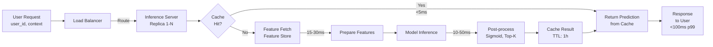
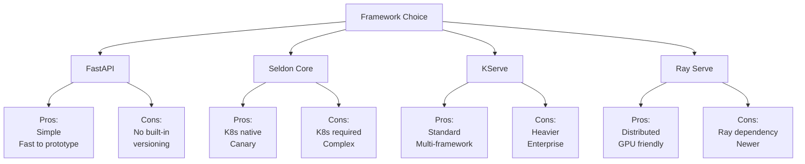

# Model Serving Frameworks: Making Models Available for Predictions

## Definition & Why It Matters

Model serving converts a trained model into a service that accepts requests and returns predictions. Unlike batch inference (process 1M samples overnight), serving handles real-time requests (1 request → 1 prediction in <100ms).

**The serving challenge:** Raw models can't handle production requirements. Needed: API endpoint, load balancing, caching, version management, rollback, monitoring. Serving frameworks provide these.

**Why frameworks matter:**
- **Performance**: Serving with FastAPI only? Then optimize caching, batching, GPU sharing yourself. Frameworks do this.
- **Scalability**: 100 concurrent requests? Framework load-balances across replicas, batches predictions.
- **Versioning**: Ship new model without downtime. Framework handles A/B testing, canary, instant rollback.
- **Operations**: Framework logs inference metrics, alerts on latency degradation.

Netflix uses custom serving framework on top of Kubernetes. Stripe uses Seldon Core. Uber uses KServe. Every high-scale ML system needs serving framework.

---

## How It Works

### Serving Patterns

**1. Batch Serving** (offline)
- Accept 1M samples overnight
- Return 1M predictions next morning
- Example: daily fraud score for all transactions

**2. Real-Time Serving** (online)
- Accept 1 request → 1 prediction in <100ms
- Example: user opens app → recommendation served in 100ms

**3. Streaming Serving** (streaming)
- Continuous event stream (Kafka) → predictions → downstream systems
- Example: anomaly detection on server metrics stream

### Frameworks

**FastAPI** (simple)
- Bare HTTP server
- You build: caching, batching, versioning, monitoring
- Good for: simple models, learning, prototypes
- Bad for: production, scale

```python
from fastapi import FastAPI
app = FastAPI()

@app.post("/predict")
def predict(input_data: dict):
    return model.predict(input_data)
```

**Seldon Core** (Kubernetes-native)
- Deploys models on Kubernetes
- Provides: versioning, canary, A/B testing, monitoring
- Good for: production, Kubernetes environments
- Bad for: non-Kubernetes, complex models

**KServe** (standardized)
- Open standard for model serving
- Supports: TensorFlow, PyTorch, Scikit-learn, custom models
- Features: auto-scaling, inference graphs, traffic splitting
- Good for: enterprise, multiple frameworks

**Ray Serve** (distributed)
- Serves models across cluster
- Features: dynamic batching, auto-scaling, fractional GPUs
- Good for: large models, distributed inference

**TensorFlow Serving** (TensorFlow-specific)
- Optimized for TensorFlow models
- Low-latency, supports multiple model versions
- Good for: pure TensorFlow systems

### Request Flow

```
User request
    ↓
Load balancer (routes to healthy replica)
    ↓
Inference server (receives request)
    ↓
[Cache hit?] → return cached prediction
    ↓
[Feature server] → fetch features
    ↓
[Model inference] → compute prediction
    ↓
[Cache] → store result
    ↓
Response returned to user
```





---

## Interview Q&A: Model Serving

### Q1: "Model inference takes 500ms. User needs response in 100ms. Fix it."
**Answer outline:** Multiple approaches:
1. **Optimize model**: Quantization (INT8), distillation, pruning → reduce inference time
2. **Optimize infrastructure**: GPU batching, reduce round-trip latency
3. **Caching**: If same predictions requested frequently, cache (miss → compute, hit → instant)
4. **Feature pre-computation**: Pre-compute expensive features, not at inference time
5. **Feature server**: Cache features in fast store (Redis), instant retrieval

Realistic example: 500ms → optimize model (350ms) + caching (instant on hits, 350ms on misses) + feature server (50ms feature fetch).

### Q2: "How do you deploy new model without downtime?"
**Answer outline:** Model versioning with no-downtime deployment:
1. **Canary**: Run 5% traffic on new model, 95% on old. Monitor. If good, expand.
2. **Blue-green**: Run both versions, switch traffic instantly. Instant rollback if needed.
3. **Shadow**: New model runs, predictions logged but unused. No user risk.
4. **Gradual rollout**: 5% → 25% → 50% → 100% over hours/days.

Framework support: Seldon, KServe support canary/blue-green natively. You manage versions, framework handles traffic splitting.

### Q3: "Model needs features from feature store, real-time API, and batch data. Latency <100ms. Design."
**Answer outline:** Latency breakdown:
- Feature store fetch: 10ms (fast)
- Real-time API: 20ms (slow)
- Batch data: 50ms (slowest)
- Total: 80ms (within budget)

But if serial: 10 + 20 + 50 = 80ms. If parallel: max(10, 20, 50) = 50ms. Much better.

Strategy:
```
Request arrives
    ↓
Parallel fetch:
  - Query feature store (10ms)
  - Call real-time API (20ms)
  - Fetch batch data (50ms)
    ↓
Inference (20ms)
    ↓
Response (90ms total)
```

Framework should support parallel feature fetching or you build it manually.

### Q4: "100K predictions/second. Cost is $1K/day per GPU. Optimize."
**Answer outline:** Reduce GPU usage:
1. **Batching**: Process 128 samples at once (128x faster than 1-at-a-time)
2. **Dynamic batching**: Framework waits 10ms for batch to fill (user latency +10ms, throughput 10x)
3. **Quantization**: INT8 model runs 2-4x faster on CPU
4. **Caching**: If 30% of predictions are repeats, cache (instant, no GPU)
5. **Feature caching**: Cache expensive features (feature computation often slower than model inference)

Result: 5 GPUs → 1 GPU (5x reduction, $5K → $1K/day).

### Q5: "Design serving infrastructure for model that requires feature store, GPU, and monitoring."
**Answer outline:** Full serving stack:

1. **Framework**: Kubernetes + KServe (standardized, scalable)
2. **Model serving**: KServe InferenceService with GPU resources
3. **Feature server**: Redis/DynamoDB for low-latency feature access
4. **API gateway**: Routes requests to service, handles auth
5. **Monitoring**: Prometheus (latency, error rates), logs to Datadog
6. **Versioning**: Multiple model versions deployed, traffic split via canary

Workflow:
```
Request → API Gateway → Load Balancer → KServe Pod
  ↓
Feature Server (Redis) [10ms]
  ↓
GPU Inference [50ms]
  ↓
Monitoring & Response [60ms total]
```

---

## Best Practices

1. **Use framework, don't build yourself**: FastAPI is seductive but missing versioning, monitoring. Use Seldon/KServe for production.

2. **Separate concerns**: Model inference server ≠ feature server ≠ API gateway. Deploy independently.

3. **Cache aggressively**: Most predictions are repeats. Cache in-memory (Redis).

4. **Monitor latency, not just accuracy**: User sees latency, not accuracy. Latency SLO is critical.

5. **Version models explicitly**: Never "latest." Tag releases (v1.2.3), deploy specific version, instant rollback.

6. **Batch requests when possible**: Inference usually much faster per-sample in batch. Wait 10ms for batch to fill.

7. **Pre-compute expensive features**: Compute high-cardinality features offline, store in feature server.

8. **Health checks**: Define liveness probe (is model responding?) and readiness probe (is model warm?).

9. **Auto-scaling**: Set up horizontal scaling: more traffic → more replicas.

10. **Test deployment locally**: docker run locally, verify inference works before deploying to production.

---

## Common Pitfalls

1. **No versioning strategy**: Deploy new model without version control. Can't identify what's running, can't rollback.

2. **Ignoring latency in optimization**: Model accuracy +1%, but inference 10x slower. Business metric bad.

3. **All traffic on new model immediately**: Deploy new model to 100% traffic. Hidden bug causes incident. Should canary first.

4. **Feature dependency unknown**: Model depends on feature A. Feature A compute changes. Inference breaks. Document dependencies.

5. **No monitoring**: Model serves silently, accuracy degrades, no one notices. Must monitor latency, error rate, predictions.

6. **Synchronous feature fetching**: Request → fetch features (slow) → infer (slow). Should prefetch or cache.

7. **No caching**: Same prediction computed 1M times. Cache 1M fast, compute 1 slow.

8. **Hot models cold**: Model reloads, first request slow (cold). Should warm-up after deployment.

9. **No graceful shutdown**: Deployment kills in-flight requests. Should drain connections.

10. **Underprovisioned resources**: Forecast peak traffic wrong, scale too small. Response times suffer.

---

## Real-World Examples

### Example 1: Netflix Recommendation Serving
Netflix serves recommendations to 250M+ users with <500ms latency:
- **Framework**: Custom Kotlin-based on top of Cassandra
- **Caching**: Local cache of user preferences (reduces feature fetch from 50ms → 5ms)
- **Batching**: Prefetch top-K recommendations for every user every 5 minutes (batch offline)
- **Versioning**: A/B test new ranker, shadow model runs in parallel
- **Result**: P99 latency <500ms, supports 1B+ requests/day

### Example 2: Stripe Real-Time Fraud Detection
Stripe serves fraud predictions for every transaction (<100ms):
- **Framework**: KServe on Kubernetes with GPU support
- **Latency optimization**: Quantized model (100ms → 20ms), dynamic batching
- **Feature server**: Redis for real-time transaction features
- **Fallback**: If inference takes >30ms, use simpler model (fast, less accurate)
- **Result**: 99.9% <100ms, 500M transactions/day

### Example 3: Uber ETA Serving
Uber predicts ETA for every matching request (<100ms):
- **Framework**: Ray Serve + Kubernetes
- **Optimization**: Pre-compute popular routes (frequent queries), cache
- **Monitoring**: Alert if p99 latency > 150ms (indicates scaling issue)
- **Versioning**: Canary new model (1% traffic), expand if metrics good
- **Result**: <50ms p99 latency, handles traffic spikes during events

---

## Sample Interview Case Study

**Scenario:** Airbnb recommendation serving. 50M users, 100K predictions/sec at peak.

**Design:**

1. **Framework**: KServe on Kubernetes (scalable, versioning, monitoring)

2. **Model optimization**:
   - Current model: 200ms inference on 1 GPU
   - Quantized (INT8): 50ms (4x faster)
   - CPU vs GPU: CPU 100ms (cheaper), GPU 50ms (expensive). Use GPU.

3. **Feature pipeline**:
   - User features: cached in Redis (1ms)
   - Listing features: cached in DynamoDB (5ms)
   - Real-time signals: fetch inline (5ms)
   - Total feature latency: 11ms (parallel)

4. **Inference latency**: 50ms GPU inference + 11ms features = 61ms (within 100ms budget)

5. **Throughput**: 100K pred/sec at peak
   - Current: 1 GPU → 10K pred/sec (need 10 GPUs)
   - With batching: dynamic batch 128 → 40K pred/sec per GPU (need 3 GPUs for peak + 1 for failover)
   - Cost: 4 GPUs × $1K/month = $4K/month

6. **Deployment**:
   - KServe InferenceService with 4 GPU replicas
   - Canary: new model 5% traffic, monitor latency/accuracy
   - Monitoring: Prometheus (latency, errors), alert if p99 > 100ms

7. **Result**: Serves 100K pred/sec, <100ms latency, $4K/month cost

**Strong answer:** "KServe on Kubernetes for production serving. Optimize model to 50ms with quantization. Feature server (Redis) for user features, cache listing features. Parallel feature fetch + GPU batching achieves 100K pred/sec, 61ms latency. Canary new models before full deployment."

---

## Key Takeaways

Serving is distinct from training. Raw models can't handle production load. Frameworks provide versioning, scaling, monitoring, and safe deployment.

**Serving workflow:** Framework (KServe) → Model versioning (canary) → Feature server (caching) → Monitoring (latency alerts)

**Common interview pattern:** "Model works in Jupyter. How do you serve?" → Answer: "KServe/Seldon on Kubernetes. Separate model server from feature server. Canary deployment for safety. Monitor latency/errors. Use caching for <100ms response."

---

## Related Concepts

- **Containerization** (Concept 13): Models run in containers
- **Deployment** (Concept 16): Serving infrastructure deployment strategy
- **Monitoring** (Concept 18): Monitor serving performance in production
