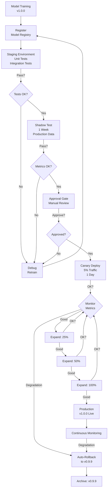

# Model Registry & CI/CD: Automating Model Deployment Pipelines

## Definition & Why It Matters

Model registry is a centralized repository managing model lifecycle: registration → staging → approval → production → archive. CI/CD automation runs tests, builds artifacts, deploys automatically when criteria met.

**The deployment problem:** Manual model deployment is error-prone. Engineer retrains, uploads model to random S3 path, tells ops team "it's ready." Ops team forgets to test, deploys, breaks production. Solution: automated pipeline.

**Why CI/CD for models matters:**
- **Consistency**: Every model deployment follows same workflow (train → test → build → deploy)
- **Validation**: Pipeline runs tests before deploying (catches bugs)
- **Audit trail**: Every deployment logged (who deployed what when)
- **Rollback**: Previous version tracked; instant rollback if needed
- **Speed**: Automation = hours not days from training to production

Netflix has fully automated model deployment. Stripe validates with shadow testing before auto-deploying. Every high-velocity ML team automates.

---

## How It Works

### Model Lifecycle

```
Development
    ↓
Train new model
    ↓
[Model Registry] Register model, version 1.0.0
    ↓
Staging
    ↓
Validation pipeline: unit tests, integration tests, shadow test (1 week)
    ↓
[Approval Gate] Engineering lead approves (code review style)
    ↓
Production
    ↓
Canary: 5% traffic (1 day), monitor
    ↓
Rollout: 25% → 50% → 100% (over 3 days)
    ↓
Monitoring: track metrics continuously
    ↓
If degradation detected → auto-rollback to previous version
    ↓
Archive: version 1.0.0 available for history
```



### CI/CD Pipeline Stages

**Stage 1: Model Training**
- Trigger: code pushed, new data available, on-schedule
- Output: trained model, metrics (accuracy, latency)
- Validation: accuracy > threshold? Save model. Else: training failed, alert.

**Stage 2: Validation**
- Unit tests: model forward pass works?
- Integration tests: model + data pipeline together?
- Shadow test: model runs on production data, predictions compared to baseline
- Output: passed/failed

**Stage 3: Build**
- Package model: into Docker image or model artifact
- Tag version: git commit hash, semantic version
- Push to registry: model registry and container registry

**Stage 4: Staging Approval**
- Requires: 2 approvals (code review style)
- Checklist: metrics acceptable? Shadow test passed? Documentation complete?
- Can be automatic if all checks pass, or manual review

**Stage 5: Production Deployment**
- Canary: 5% traffic
- Monitor: latency, error rate, business metrics
- Expand: 25% → 50% → 100%
- Rollback: if any metric degrades > threshold, auto-rollback

### Example: Fraud Model Pipeline

```yaml
# .github/workflows/deploy-fraud-model.yml
on:
  push:
    paths: [fraud_model/**, test/**]

jobs:
  train:
    runs-on: gpu-runner
    steps:
      - train model
      - if accuracy > 0.95: save model  # validation
      - else: fail
  
  validate:
    needs: train
    steps:
      - run unit tests
      - run integration tests with real data
      - shadow test: run on 1-week production data
      - if shadow accuracy ~= baseline: pass
      - else: fail
  
  build:
    needs: validate
    steps:
      - docker build fraud-model:abc123  # tag with commit
      - docker push registry/fraud-model:abc123
  
  stage-approval:
    needs: build
    steps:
      - create merge request for approval
      - require 2 approvals
      - comment checklist (metrics, testing, docs)
  
  canary:
    needs: stage-approval
    steps:
      - deploy fraud-model:abc123 to 5% traffic
      - monitor latency, error rate, fraud detection rate
      - if degraded: auto-rollback
      - if stable 24h: proceed
  
  rollout:
    needs: canary
    steps:
      - 25% traffic (24h)
      - 50% traffic (24h)
      - 100% traffic
      - monitor continuously
```

---

## Interview Q&A: Model Registry & CI/CD

### Q1: "Model is trained. How do you safely deploy it?"
**Answer outline:** Not "push to production immediately." Pipeline:
1. **Register**: Model registry records training run, metrics, code version
2. **Validate**: Unit + integration + shadow tests (shadow = production data, no user risk)
3. **Approve**: Code review style, 2 approvals confirm metrics acceptable
4. **Canary**: 5% traffic, 24h monitoring (catch any issues)
5. **Rollout**: Gradual expansion (25% → 50% → 100%)
6. **Monitor**: Continuous monitoring (auto-rollback if degradation)

Example: Fraud model trained, registered in MLflow. Shadow test compares to baseline on last week's data. Approval gate checks: accuracy good? False positive rate acceptable? Then canary to 5% fraud detection traffic.

### Q2: "Model deployed at 10am. By 4pm, accuracy dropped from 95% → 91%. Auto-rollback?"
**Answer outline:** Yes, with caveats:
1. **Immediate**: Auto-rollback to previous version (instant)
2. **Investigation**: Why did accuracy drop? Data quality issue? Code bug? Real-world shift?
3. **Fix**: Address root cause
4. **Re-deploy**: With fix, run through pipeline again (not skipping validation)

Without auto-rollback: Someone monitors manually, notices at 6pm, tells ops team, ops team manually switches. 8 hours of bad predictions. With auto-rollback: instant, <10 seconds of bad predictions.

Threshold: auto-rollback if any metric degrades >2% (configurable).

### Q3: "How do you version models? How do you know which version is production?"
**Answer outline:** Multi-level versioning:
1. **Semantic versioning**: 1.2.3 (major.minor.patch)
   - 1.0.0 → 2.0.0: breaking change (different input format)
   - 1.0.0 → 1.1.0: new feature (new input optional)
   - 1.0.0 → 1.0.1: bug fix (same behavior)

2. **Git versioning**: Tag commit: v1.2.3-fraud-model-2024-05-17

3. **Registry versioning**: Model registry tags production versions
   ```
   myregistry/fraud-model:1.2.3 (production)
   myregistry/fraud-model:1.2.2 (previous, rollback available)
   myregistry/fraud-model:1.3.0-rc1 (release candidate, staging)
   ```

4. **Deployment**: Deploy specific version
   ```
   kubectl set image fraud-model=myregistry/fraud-model:1.2.3
   ```

### Q4: "Design approval workflow for 100 models in production."
**Answer outline:** Workflow scales with automation:
1. **Automatic approval** if all gates pass:
   - Accuracy > threshold ✓
   - Latency < SLO ✓
   - Shadow test passed ✓
   - Fairness metrics acceptable ✓
   - All tests green ✓
   → Auto-approve, deploy to canary

2. **Manual approval** if flags raised:
   - Accuracy slightly above threshold (85% vs 84% required)
   - Latency at edge of SLO (99ms vs 100ms SLO)
   → Require 1 senior engineer approval

3. **Blocked** if critical failures:
   - Accuracy below threshold
   - Fairness metrics show bias
   - Tests failed
   → Require retraining

For 100 models: auto-approve 80% (no human intervention), manual 15% (quick engineer review), block 5% (needs retrain).

### Q5: "Model pipeline takes 2 hours (training + tests). How do you speed up feedback?"
**Answer outline:** Optimize each stage:
1. **Training**: Parallel hyperparameter search (reduce 1 hour → 20 min), early stopping, smaller validation set
2. **Unit tests**: Run fast tests only (skip integration), parallelize test suites (5 tests in parallel)
3. **Integration tests**: Subset of data (1 week instead of 1 year), mock external APIs
4. **Shadow test**: Skip pre-deployment shadow, do shadow in parallel with approval (not sequential)
5. **Build**: Docker layer caching (skip rebuilds of unchanged layers)

Result: 2 hours → 30 minutes. Enables iteration: train → validate → deploy in 30 minutes.

---

## Best Practices

1. **Automate everything possible**: Manual approvals are OK, manual deployments are not.

2. **Fail fast**: If model doesn't meet accuracy threshold, fail immediately, don't proceed.

3. **Separate concerns**: Training pipeline ≠ validation ≠ deployment. Orchestrate with workflow (Airflow, GitHub Actions).

4. **Track lineage**: Which training data created which model? Which model is production? Traceable.

5. **Approve before deploying**: Code review for models (approval gate) same as code review for code.

6. **Canary before rollout**: Never deploy to 100% without testing on small traffic first.

7. **Monitor continuously**: Metrics should auto-rollback if degrading, not rely on manual detection.

8. **Version everything**: Code (git), data (DVC), model (registry), and config (git). Reproducibility.

9. **Document rollback strategy**: If current version fails, which version to rollback to? How long does rollback take?

10. **Communicate changes**: When deploying, notify stakeholders (data scientists, product, ops). Don't surprise them.

---

## Common Pitfalls

1. **No versioning**: "Latest" is ambiguous. Multiple people training simultaneously creates confusion.

2. **Manual deployment**: Engineer trains, pushes to S3 by hand, tells ops "deploy this." Error-prone, no audit trail.

3. **No validation before production**: Deploy directly to 100% traffic, break something, debug in production.

4. **Slow feedback loop**: Train → wait 4 hours for tests → results. Iteration stalled.

5. **No rollback plan**: Deployed bad version. Previous version is "somewhere." Can't quickly rollback.

6. **Approval is rubber-stamp**: Engineers approve without reading metrics. Bad models go to production.

7. **No monitoring**: Model deployed, metrics not monitored. Degradation discovered by users, not alerts.

8. **All traffic at once**: Deploy to 100% traffic immediately. Hidden bugs affect all users.

9. **Pipeline is "black box"**: Engineer doesn't understand what pipeline does. Can't debug when it fails.

10. **No reproducibility**: Can't retrain exact model from 3 months ago (data/code versions lost).

---

## Real-World Examples

### Example 1: Netflix ML Pipeline
Netflix fully automates model deployment:
- **Training**: Spark job runs nightly, trains 100+ models
- **Validation**: Each model shadow-tested on 1 week production data
- **Approval**: Auto-approval if metrics passed, no human review needed
- **Canary**: 5% Netflix members see new recommendation for 24h
- **Rollout**: Successful → 100% rollout. Failure → auto-rollback.
- **Frequency**: Deploy 50+ new models/day

### Example 2: Stripe Fraud Model Safety
Stripe CI/CD prioritizes safety:
- **Training**: Daily fraud model retraining with latest data
- **Validation**: Shadow test compares new model to production on real fraud cases
- **Approval**: Manual code review (what changed in model?) + metrics review
- **Canary**: 1% of transactions with new fraud model, compared to baseline
- **Monitoring**: Alert immediately if false-positive rate increases >1%
- **Rollback**: Auto-rollback if fraud loss increases

### Example 3: Uber ETA Model Updates
Uber continuously improves ETA model:
- **Training**: Weekly retraining with latest traffic data
- **Validation**: Test on historical data, shadow test on real requests
- **Deployment**: Canary 1% of requests (24h), expand if MAE improved
- **Monitoring**: Track p99 latency, alert if increased >10%
- **Frequency**: Deploy ~3 new versions/week

---

## Sample Interview Case Study

**Scenario:** Build CI/CD for recommendation model. 50M users, requires approval before production.

**Pipeline:**

1. **Training stage** (2 hours):
   - Engineer pushes code
   - GitHub Actions triggers training job
   - Spark job trains on 2 weeks data
   - Output: model metrics (click-through rate, diversity)

2. **Validation stage** (1 hour):
   - Unit tests: model inference works?
   - Integration tests: with feature store?
   - Shadow test: model on last week's production data
   - Comparison: click-through rate within 1% of baseline?

3. **Approval stage** (30 min):
   - Create merge request with metrics
   - Require 2 engineer approvals
   - Checklist: accuracy acceptable? Shadow test good? Documentation?
   - Auto-comment with: "Ready to canary if approved"

4. **Canary stage** (24 hours):
   - Deploy model to 5% of users
   - Monitor: click-through rate, latency, user complaints
   - Automated alert: if click-through rate drops >1%

5. **Rollout stage** (3 days):
   - Day 1: 25% of users
   - Day 2: 50% of users
   - Day 3: 100% of users
   - Continuous monitoring

**Result:** Safe, auditable, fast (3 hours from code push to canary).

**Strong answer:** "Full CI/CD pipeline: training stage produces metrics, validation (shadow test on production data), approval gate (2 engineers check metrics), canary to 5% (24h monitoring), gradual rollout. Auto-rollback if any metric degrades >1%."

---

## Key Takeaways

CI/CD transforms ML deployment from risky to routine. Automated testing + approval gates + canary deployment = safe, fast iteration.

**Pipeline stages:** Train → Validate → Approve → Canary → Rollout → Monitor → (auto-rollback if needed)

**Common interview pattern:** "Model is ready. How do you deploy?" → Answer: "Full CI/CD: shadow test on production data, approval gate, canary to 5% traffic, monitor for degradation, auto-rollback if metrics drop."

---

## Related Concepts

- **Model Registry** (this concept): Stores models
- **Containerization** (Concept 13): Package models for deployment
- **Model Serving** (Concept 14): Serving infrastructure
- **Monitoring** (Concept 18): Monitor deployment metrics
