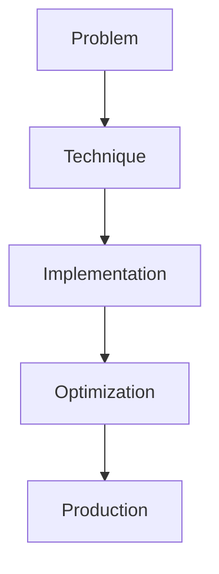

# LLM Evaluation Harness

## Detailed Explanation

LLM Evaluation Harness is a crucial modern technique in AI engineering. Systematic benchmarking frameworks. This represents the practical state-of-the-art in how production AI systems are built today. Understanding this technique is essential for building scalable, reliable AI systems. The key insight is that this approach addresses fundamental trade-offs in AI systems: between performance and efficiency, between flexibility and reliability, between research models and production systems.

## Core Intuition

Think of LLM Evaluation Harness as the bridge between what researchers build and what engineers deploy. It solves a specific production challenge that becomes critical at scale.

## How It Works

1. Understand the core problem this technique addresses
2. Learn the fundamental algorithm or pattern
3. Implement using available libraries and frameworks
4. Integrate with related components in your system
5. Optimize for your specific constraints (latency, cost, accuracy)
6. Monitor and iterate based on production metrics



## Architecture / Trade-offs

Different evaluation harnesses offer distinct trade-offs based on your metrics needs and infrastructure constraints.

| Framework | Setup Complexity | Metric Coverage | Evaluation Speed | Customization | Cost |
|-----------|------------------|-----------------|------------------|---------------|------|
| lm-eval | Low | Very High (200+) | Slow | High | Low |
| OpenAI Evals | Low | Medium (30-50) | Medium | Medium | Medium |
| AlpacaEval | Very Low | Low (single ranking) | Fast | Low | Medium |
| Custom Harness | Very High | Varies | Varies | Very High | Low |

**Key trade-offs:**

- **lm-eval vs OpenAI Evals:** lm-eval covers more standard benchmarks but requires more infrastructure; OpenAI Evals integrates tightly with their APIs but covers fewer metrics. Choose lm-eval for comprehensive research, OpenAI Evals for production systems already using their services.

- **Speed vs Coverage:** AlpacaEval runs fast (minutes) with a single metric, making it good for iteration; lm-eval is slower but gives you MMLU, HellaSwag, and specialized metrics. Fast evaluation is useful during development but risks overfitting to a single metric.

- **Custom Harness:** Building your own gives maximum control over domain-specific metrics but requires maintaining test sets, preventing contamination, and scaling infrastructure. Most production systems start with lm-eval and gradually add custom metrics.

## Design Challenges

- **Benchmark contamination:** Your training data may overlap with public benchmarks, causing false inflation of eval scores. Detect this by checking if model performance on held-out test sets matches benchmark results, or use data decontamination tools.

- **Prompt sensitivity:** LLM outputs vary significantly with phrasing, shot count, and formatting. A 5% difference in prompt engineering can obscure real model improvements. Mitigate by using multiple prompt variations and averaging results, then only trusting improvements >2%.

- **Metric-performance mismatch:** High MMLU or HELM scores don't guarantee real-world utility. A model may excel at benchmarks but fail at your actual use cases. Monitor user satisfaction and task-specific metrics in parallel with benchmarks.

- **Evaluation cost at scale:** Running comprehensive evals (lm-eval suite) on large models costs hundreds to thousands of dollars. Plan eval budget early and consider cheaper proxies (AlpacaEval, specific tasks) for iteration, saving full evals for release milestones.

- **Non-determinism in results:** Some evaluation frameworks produce inconsistent scores across runs due to floating-point differences, sampling randomness, or API throttling. Fix by fixing random seeds, using deterministic decoding, and averaging over multiple runs.

## Interview Q&A

**Q: When would you use MMLU vs AlpacaEval for comparing two models?**
A: Use AlpacaEval during rapid iteration—it's fast (minutes) and cheap. Switch to MMLU or broader lm-eval for release decisions because AlpacaEval is a single metric prone to overfitting. MMLU is more stable and covers reasoning across domains, though it takes hours to run. The pitfall is optimizing for AlpacaEval during dev then seeing that number collapse when you switch frameworks.

**Q: How do you detect benchmark contamination in your test set?**
A: Check if your eval results significantly outperform published baselines for similar-sized models. If your 7B model beats reported 13B performance, contamination is likely. Use tools like decontamination libraries or manually inspect overlaps between training and test sets. When detected, retrain on cleaned data and re-evaluate.

**Q: What's the danger of optimizing a single metric?**
A: You'll see beautiful benchmark improvements that don't translate to user value. For example, optimizing for MMLU at the expense of instruction-following hurts real usage. Mitigate by tracking 3-5 diverse metrics—reasoning (MMLU), instructions (ifeval), factuality (TruthfulQA)—and requiring improvement across most, not just one.

**Q: How do you decide between building a custom evaluation harness vs using lm-eval?**
A: Start with lm-eval for standard benchmarks. Build custom only if you have domain-specific requirements (e.g., code generation, biomedical reasoning) that existing benchmarks don't cover well. Custom evals require maintaining clean test sets and preventing data leakage, which is expensive. Only add custom metrics if they correlate with your real-world task success.

**Q: When would you re-run evaluations vs trusting cached results?**
A: Re-run on model changes, framework updates, or when comparing against new baselines. Don't trust cached results across different hardware (GPU/CPU differences add noise) or API versions. If results seem inconsistent, average over 3-5 runs with different random seeds to account for inherent variance.

**Q: How do you debug a case where eval scores improve but user metrics decline?**
A: This signals metric-performance mismatch. First, check for contamination or prompt manipulation. Then examine what changed: if you optimized for accuracy at the cost of latency, users may timeout. If you improved on synthetic tasks, verify those tasks match real usage patterns. Use error analysis to see which categories of user requests the new model handles worse.

## Best Practices

- Understand the fundamental principle before optimizing
- Use established libraries instead of building from scratch
- Measure the actual impact on your metric
- Test with realistic data and production loads
- Monitor continuously in production
- Document your configuration and rationale
- Plan for multiple iterations until reaching optimum

## Common Pitfalls

- **Benchmark contamination:** Model was trained on test data, inflating eval scores. Symptom: your 7B model outperforms published 13B results. Fix: check train/test overlap, use decontamination tools, retrain on clean data.

- **Optimizing a single metric:** MMLU improves 70%→75% but real usage breaks because model sacrificed instruction-following. Symptom: eval scores up, user complaints up. Fix: track 3+ diverse metrics and require improvement across the portfolio, not single-metric optimization.

- **Trusting cached results across hardware:** GPU vs CPU evaluation produces different numerical results due to floating-point precision. Symptom: same model, different eval results. Fix: always re-run on consistent hardware, average over multiple runs, report variance.

- **Prompt sensitivity artifacts:** Changing zero-shot to few-shot or rephrasing questions shifts scores 5-10%, masking real model quality. Symptom: hard to reproduce eval results. Fix: test multiple prompt templates and average, report confidence intervals, use prompt optimization tools cautiously.

- **Skipping cost analysis:** Running full lm-eval suite on a 70B model costs thousands per eval cycle. Symptom: eval becomes bottleneck. Fix: use cheap proxies (AlpacaEval, domain-specific benchmarks) for iteration, reserve full evals for milestones.

## Code Examples

### Example 1: Basic Implementation

```python
import torch
from transformers import pipeline

# Basic usage pattern
model = pipeline("text-generation", model="meta-llama/Llama-2-7b")
output = model("Hello, world!", max_length=50)
print(output)
```

### Example 2: Production with Monitoring

```python
import torch
import time
from transformers import pipeline

device = torch.device("cuda" if torch.cuda.is_available() else "cpu")

# Production setup
model = pipeline("text-generation", 
                model="meta-llama/Llama-2-7b",
                device=0 if torch.cuda.is_available() else -1)

# Measure performance
start = time.time()
output = model("The future of AI engineering is", max_length=100)
latency = time.time() - start

print(f"Latency: {latency:.2f}s")
print(f"Output: {output[0]['generated_text']}")
```

## Related Concepts

- [LLM Evaluation Harness](./01-llm-evaluation-harness.md)
- [AI Red-Teaming](./02-ai-red-teaming.md)
- [Agentic Testing Harness](./03-agentic-testing-harness.md)
