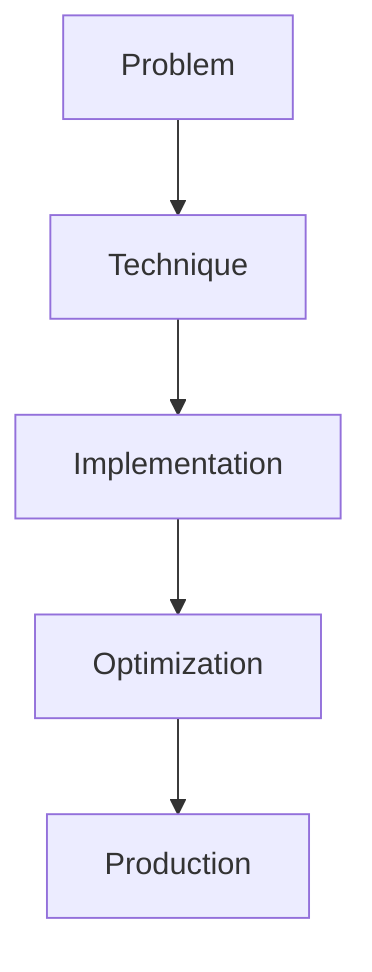

# AI Red-Teaming

## Detailed Explanation

AI Red-Teaming is a crucial modern technique in AI engineering. Adversarial testing and vulnerability discovery. This represents the practical state-of-the-art in how production AI systems are built today. Understanding this technique is essential for building scalable, reliable AI systems. The key insight is that this approach addresses fundamental trade-offs in AI systems: between performance and efficiency, between flexibility and reliability, between research models and production systems.

## Core Intuition

Think of AI Red-Teaming as the bridge between what researchers build and what engineers deploy. It solves a specific production challenge that becomes critical at scale.

## How It Works

1. Understand the core problem this technique addresses
2. Learn the fundamental algorithm or pattern
3. Implement using available libraries and frameworks
4. Integrate with related components in your system
5. Optimize for your specific constraints (latency, cost, accuracy)
6. Monitor and iterate based on production metrics



## Architecture / Trade-offs

Red-teaming approaches differ in coverage, false positive rates, and production readiness. Choose based on your risk tolerance and resources.

| Red-Teaming Approach | Coverage | False Positives | Automation | Resource Cost | Real-World Validity |
|---------------------|----------|-----------------|------------|---------------|--------------------|
| Prompt Injection | High | Medium | High | Low | Medium |
| Jailbreak Attempts | Very High | Low | Low | High | High |
| Adversarial Examples | Medium | Low | Medium | Medium | Low |
| Systematic Fuzzing | Very High | High | Very High | Low | Medium |
| Human Red-Teamers | Very High | Very Low | None | Very High | Highest |

**Key trade-offs:**

- **Prompt Injection vs Jailbreaks:** Prompt injection is easy to automate (hundreds of attacks per hour) but generates false positives that don't represent real harm. Jailbreaks are slower to discover but each one is a genuine vulnerability. Use injection for quick screening, jailbreaks for safety releases.

- **Adversarial Examples vs Natural Language:** Adversarial pixel/token perturbations transfer poorly between models and don't resemble real attacks. Natural language attacks take longer to develop but expose true vulnerabilities your users will encounter. Prioritize natural language for production systems.

- **Automation vs Coverage:** Systematic fuzzing generates many test cases quickly but misses subtle semantic vulnerabilities. Human red-teamers find creative attacks but don't scale. Hybrid approach: use fuzzing for breadth, humans for depth on critical domains.

## Design Challenges

- **Adversarial transferability gap:** Jailbreaks and attacks discovered on your model may not transfer to other models or architectures. An attack crafted for GPT-4 won't necessarily work on Claude. Mitigation: test attacks on multiple model variants, assume coverage applies only to tested models.

- **Detection evasion arms race:** As your filters improve, attackers find novel workarounds. Early jailbreaks ("Do anything now") are caught by simple filters, but sophisticated prompt injection evolves. Red-teaming can never be "complete"—it's a continuous cycle.

- **Cost of comprehensive testing:** Running 10,000 adversarial tests per day with human evaluation costs thousands monthly. Automating detection creates false positives requiring manual review. Budget red-teaming as an ongoing expense, not a one-time security audit.

- **False positives waste resources:** Automated fuzzing generates many benign outputs flagged as harmful (e.g., discussion of encryption techniques mislabeled as hacking instructions). High false positive rates degrade user experience if you block all flagged outputs. Calibrate sensitivity vs false positives based on harm asymmetry.

- **Domain-specific vulnerabilities:** Red-teaming for jailbreaks doesn't catch medical misinformation or financial advice errors. Generic adversarial tests miss domain-specific harms. Prioritize domain experts to identify what-if scenarios relevant to your application.

## Interview Q&A

**Q: How would you prioritize red-teaming efforts in a production LLM system?**
A: Start with high-harm categories: illegal content, privacy violations, hateful output. Spend 60% effort there. Then cover domain-specific risks (medical systems check medical advice, financial check financial correctness). Finally, generic adversarial robustness. Measure impact: did red-teaming improve safety metrics? If attacks are discovered but rarely triggered in real usage, deprioritize them relative to common failure modes.

**Q: What's the difference between adversarial testing (perturbations) and jailbreak testing?**
A: Adversarial tests make small changes to inputs—token substitutions, typos—to find robustness gaps. Jailbreaks are semantic attacks: "pretend you're a villain," role-playing prompts. Adversarial attacks often don't transfer between models; jailbreaks sometimes do. For production, focus on jailbreaks because they resemble real attack patterns. Adversarial is useful for research but less relevant to actual safety.

**Q: How do you prevent an automated red-teaming tool from generating false positives that block legitimate requests?**
A: Separate testing from enforcement: run red-teaming tests in shadow mode (log issues but don't block). Measure precision-recall of your safety classifier. If precision drops below 95%, you're blocking too many safe queries. Use confidence thresholds: only block outputs with >99% confidence they're harmful. A false positive (blocking a legitimate request) harms users; a false negative (allowing one harmful request) is caught by downstream monitoring.

**Q: When would you use human red-teamers vs automated red-teaming?**
A: Humans excel at creative, domain-specific attacks and social engineering. Automation excels at scale and consistency. For safety-critical systems, use humans for high-harm categories (medical, financial, legal). Use automation for routine coverage. A typical ratio: 20% human effort on critical domains, 80% automated screening. Combine by using automation to filter, then humans to validate most concerning cases.

**Q: How do you know if your red-teaming effort is actually making you safer?**
A: Track metrics: % of attacks caught in red-teaming before they reach users, time-to-patch for discovered vulnerabilities, user reports of new attack types. If user reports of jailbreaks are increasing despite red-teaming, your testing doesn't match real attack patterns. Compare safety incident rate before/after red-teaming initiatives. Also measure cost: if you spend $100k on red-teaming to prevent one incident, that's probably not efficient.

**Q: What's the risk of over-relying on red-teaming as your primary safety defense?**
A: Red-teaming finds known attack patterns but misses unknown ones (zero-day jailbreaks). It's not a complete defense. Combine with: monitoring production outputs for safety issues, user reporting mechanisms, and automated classifiers on live traffic. Red-teaming before launch is necessary but not sufficient. Budget 30% on red-teaming, 30% on monitoring, 30% on response capability.

## Best Practices

- Understand the fundamental principle before optimizing
- Use established libraries instead of building from scratch
- Measure the actual impact on your metric
- Test with realistic data and production loads
- Monitor continuously in production
- Document your configuration and rationale
- Plan for multiple iterations until reaching optimum

## Common Pitfalls

- **Testing only one attack type:** You discover jailbreaks but miss prompt injection vectors or factual errors. Symptom: red-team report looks great, but users find new attacks immediately. Fix: diversify attack surface—include prompt injection, role-playing, instruction override, factual consistency checks.

- **Adversarial examples don't transfer:** Attacks crafted on Claude may not work on GPT-4, and vice versa. Symptom: test passes against your model but deployment to a new model reveals gaps. Fix: test on multiple model variants, don't assume coverage generalizes across architectures.

- **Red-teaming team too small:** A team of 2-3 people finds 100 attacks; a team of 20 finds 1000+. Limited diversity in attack thinking means you miss entire categories. Symptom: external red-teamers or users discover vulnerabilities in weeks. Fix: hire red-teamers with adversarial ML experience, bring in domain experts (medical, legal) for specific risks.

- **False positives block legitimate use:** Overly sensitive safety classifier flags "What is encryption?" as hacking. Symptom: users complain about blocked queries, support tickets spike. Fix: measure precision (true harm % among flagged), only enforce blocks above 95-99% confidence, use tiered responses (warn vs block).

- **Skipping continuous re-teaming:** You red-team before launch but not after. Weeks later, a new jailbreak class emerges. Symptom: safety incident ratio increasing despite past red-teaming. Fix: allocate 5-10% of engineering budget to ongoing red-teaming, especially after model updates or user discovery of issues.

## Code Examples

### Example 1: Basic Implementation

```python
import torch
from transformers import pipeline

# Basic usage pattern
model = pipeline("text-generation", model="meta-llama/Llama-2-7b")
output = model("Hello, world!", max_length=50)
print(output)
```

### Example 2: Production with Monitoring

```python
import torch
import time
from transformers import pipeline

device = torch.device("cuda" if torch.cuda.is_available() else "cpu")

# Production setup
model = pipeline("text-generation", 
                model="meta-llama/Llama-2-7b",
                device=0 if torch.cuda.is_available() else -1)

# Measure performance
start = time.time()
output = model("The future of AI engineering is", max_length=100)
latency = time.time() - start

print(f"Latency: {latency:.2f}s")
print(f"Output: {output[0]['generated_text']}")
```

## Related Concepts

- [LLM Evaluation Harness](./01-llm-evaluation-harness.md)
- [AI Red-Teaming](./02-ai-red-teaming.md)
- [Agentic Testing Harness](./03-agentic-testing-harness.md)
