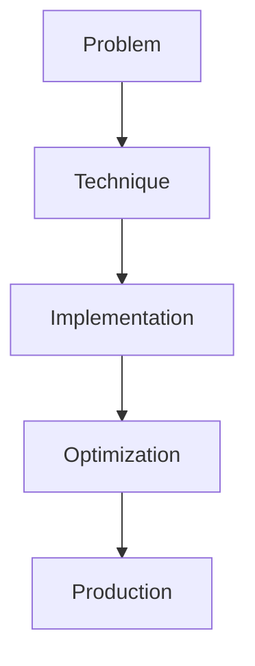

# Agentic Testing Harness

## Detailed Explanation

Agentic Testing Harness is a crucial modern technique in AI engineering. End-to-end agent workflow testing. This represents the practical state-of-the-art in how production AI systems are built today. Understanding this technique is essential for building scalable, reliable AI systems. The key insight is that this approach addresses fundamental trade-offs in AI systems: between performance and efficiency, between flexibility and reliability, between research models and production systems.

## Core Intuition

Think of Agentic Testing Harness as the bridge between what researchers build and what engineers deploy. It solves a specific production challenge that becomes critical at scale.

## How It Works

1. Understand the core problem this technique addresses
2. Learn the fundamental algorithm or pattern
3. Implement using available libraries and frameworks
4. Integrate with related components in your system
5. Optimize for your specific constraints (latency, cost, accuracy)
6. Monitor and iterate based on production metrics



## Architecture / Trade-offs

Agent testing strategies vary significantly in how they handle tool mocking, non-determinism, and coverage. Pick based on your environment and reliability requirements.

| Testing Strategy | Tool Mocking | Non-Determinism | Coverage | Execution Time | Cost |
|------------------|--------------|-----------------|----------|-----------------|------|
| Unit Tests | Full Mock | Deterministic | Low (single steps) | Fast | Low |
| Integration Tests | Partial Mock | Medium | Medium (tool chains) | Medium | Medium |
| End-to-End Tests | Real Tools | High | High (full workflows) | Slow | High |
| Simulation/Replay | Recorded | Deterministic | Medium (fixed scenarios) | Fast | Low |

**Key trade-offs:**

- **Unit vs E2E:** Unit tests with full mocks run in seconds but miss tool integration bugs and API failures. E2E tests catch real problems but take minutes per test and cost money (real API calls). Use unit tests for agent logic (planning, tool selection), E2E for critical paths before deployment.

- **Determinism vs Reality:** Mocked tools always respond the same way, making tests pass reliably but missing failure modes. Real tools introduce flakiness (network timeouts, rate limits) that mocks hide. Mitigate: record real responses for replay testing, add chaos injection (10% failure rate) to mocks.

- **Coverage vs Execution Speed:** Testing all possible agent paths (decision trees explode exponentially) takes days. Cover critical paths and failure modes, not all paths. Acceptance: 80% path coverage in minutes beats 100% coverage in hours.

## Design Challenges

- **Mocking vs reality gap:** Mocked tools always succeed and respond instantly. Real tools timeout, fail with rate limits, return malformed data. Symptom: tests pass locally but agent fails in production. Fix: use chaos injection in mocks (fail 5-10% of calls), record real API responses for replay testing.

- **Non-determinism from agent decisions:** LLM outputs vary due to temperature, sampling, context. Same input can trigger different tool choices. Symptom: test passes sometimes, fails others (flaky). Fix: seed randomness in tests, use deterministic tool selection (e.g., greedy argmax), run critical tests 5+ times to catch flakiness.

- **Race conditions in async agents:** If your agent runs tools in parallel, timing matters. Tool A and Tool B might both modify state, causing inconsistent results. Symptom: rare failures in high-concurrency scenarios that don't reproduce locally. Fix: serialize critical operations in tests, add explicit synchronization, use deterministic replay for debugging.

- **Brittleness to tool response changes:** Agent logic assumes tools return specific fields or formats. When an API changes response format, tests pass but agent crashes. Symptom: silent failures or downstream errors. Fix: validate tool responses early, have fallback parsing, test with multiple response variations.

- **State explosion in decision trees:** An agent with 5 tools and 3 states each has 15 possible first steps. Testing all paths becomes combinatorial. Symptom: impossible to test all scenarios. Fix: focus on critical paths (high-impact workflows), error recovery paths, and edge cases. Accept 70-80% path coverage as practical maximum.

## Interview Q&A

**Q: How do you test error recovery in an agentic system?**
A: Test failure modes explicitly: what happens when a tool times out? Returns invalid data? Hits rate limits? Write test cases for each failure type, then verify the agent either retries correctly or escalates to a human. Measure recovery: track how many failures the agent handles vs how many it escalates. For production, aim for 95%+ self-recovery on transient failures (timeouts), escalate on permanent failures (API deprecated).

**Q: What's the challenge of testing non-deterministic agent behavior?**
A: The agent's tool choices vary with temperature, context, and sampling. One run might call tool A first, another run calls tool B first. Both may be valid. Flaky tests fail intermittently. Fix: either make the agent deterministic (set temperature=0, use argmax tool selection) for testing, or run critical tests 10+ times and accept passing if 95%+ succeed. For non-determinism you want to keep (e.g., exploration), use simulation/replay with fixed random seeds.

**Q: When would you use mocks vs real tools in agent tests?**
A: Use mocks for speed during development (unit tests on planning logic, tool selection). Switch to real tools for integration and E2E tests before release. A hybrid approach: mock for fast feedback loop, record real responses, replay recordings in CI for both speed and realism. Only call real tools in pre-deployment validation to avoid burning API quota and money.

**Q: How do you catch the gap between mocked and real tool behavior?**
A: Mocks always succeed instantly; real tools fail intermittently. Add chaos injection to mocks: fail 5-10% of calls with random errors, add 100-500ms latency. Then test that your agent handles failures gracefully. If the agent only works against perfect mocks, it will fail in production. Use recorded responses from real API calls as a middle ground: realistic data, no API costs.

**Q: What's the right approach for testing an agent with multiple tool chains?**
A: Test bottom-up: unit test each tool independently, then integration test tool sequences that commonly occur (e.g., search -> summarize -> format). For complex sequences, use simulation: record a set of realistic scenarios, replay them to verify the agent's decision paths. Don't try to test all 2^n path combinations; focus on high-value paths (happy path, common error paths, edge cases).

**Q: How do you detect if your agent is stuck in a loop or hanging?**
A: Set explicit timeouts: if an agent makes >N tool calls without reaching a terminal state, it's looping. Flag the test as failed. Log decision history: print which tools were chosen and why to debug oscillation patterns. Add assertions: after K iterations, require progress toward the goal (tool output should reduce uncertainty). In production, use watchdog timers: if an agent doesn't complete in 5 minutes, interrupt and escalate.

## Best Practices

- Understand the fundamental principle before optimizing
- Use established libraries instead of building from scratch
- Measure the actual impact on your metric
- Test with realistic data and production loads
- Monitor continuously in production
- Document your configuration and rationale
- Plan for multiple iterations until reaching optimum

## Common Pitfalls

- **Brittle mocks mask real failures:** Tools always succeed, return formatted data instantly. Tests pass but production agent crashes on malformed API responses or timeouts. Symptom: high pass rate in CI but frequent failures in production. Fix: add chaos injection (failures, latency, malformed responses), use recorded real API responses, test error paths explicitly.

- **Non-deterministic flaky tests:** Agent logic uses sampling, so tests pass 80% of the time. CI is unreliable. Symptom: "tests pass locally but fail on CI" or random failures. Fix: seed randomness for deterministic behavior, use temperature=0 for tool selection, or accept non-determinism and run critical tests 10+ times, passing if >95% succeed.

- **Not testing failure paths:** You test the happy path but not timeout, rate limit, or invalid response handling. Symptom: agent works fine in demo, breaks when tool unavailable. Fix: explicitly test failure modes—mock tools to fail 10-20% of calls, verify agent retries or escalates correctly.

- **Combinatorial explosion in test coverage:** 5 tools × 3 decision points = 15 paths, then considering failures, concurrency, state = hundreds of scenarios. Impossible to test all. Symptom: incomplete coverage, hard-to-find bugs. Fix: prioritize testing critical paths (high-value workflows), failure recovery, and edge cases. Accept 70-80% coverage as practical.

- **Race conditions in async agents:** Multiple tools execute in parallel, leading to non-deterministic state. Only happens under high concurrency. Symptom: rare failures, impossible to reproduce locally. Fix: add mutex/synchronization for critical sections, use deterministic replay with recorded execution traces for debugging, test under high concurrency in staging.

## Code Examples

### Example 1: Basic Implementation

```python
import torch
from transformers import pipeline

# Basic usage pattern
model = pipeline("text-generation", model="meta-llama/Llama-2-7b")
output = model("Hello, world!", max_length=50)
print(output)
```

### Example 2: Production with Monitoring

```python
import torch
import time
from transformers import pipeline

device = torch.device("cuda" if torch.cuda.is_available() else "cpu")

# Production setup
model = pipeline("text-generation", 
                model="meta-llama/Llama-2-7b",
                device=0 if torch.cuda.is_available() else -1)

# Measure performance
start = time.time()
output = model("The future of AI engineering is", max_length=100)
latency = time.time() - start

print(f"Latency: {latency:.2f}s")
print(f"Output: {output[0]['generated_text']}")
```

## Related Concepts

- [LLM Evaluation Harness](./01-llm-evaluation-harness.md)
- [AI Red-Teaming](./02-ai-red-teaming.md)
- [Agentic Testing Harness](./03-agentic-testing-harness.md)
