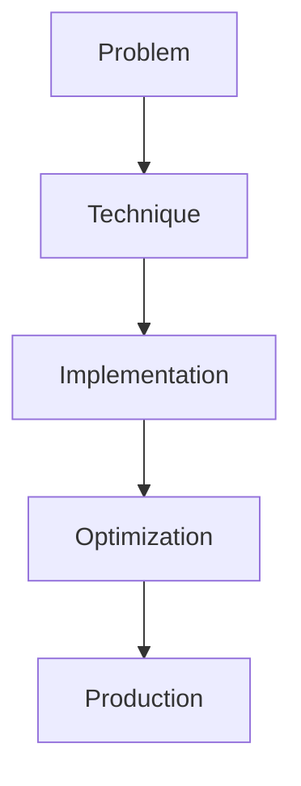

# Persistent AI Memory

## Detailed Explanation

Persistent AI Memory is a crucial modern technique in AI engineering. Long-term episodic, semantic, procedural memory. This represents the practical state-of-the-art in how production AI systems are built today. Understanding this technique is essential for building scalable, reliable AI systems. The key insight is that this approach addresses fundamental trade-offs in AI systems: between performance and efficiency, between flexibility and reliability, between research models and production systems.

## Core Intuition

Think of Persistent AI Memory as the bridge between what researchers build and what engineers deploy. It solves a specific production challenge that becomes critical at scale.

## How It Works

1. Understand the core problem this technique addresses
2. Learn the fundamental algorithm or pattern
3. Implement using available libraries and frameworks
4. Integrate with related components in your system
5. Optimize for your specific constraints (latency, cost, accuracy)
6. Monitor and iterate based on production metrics



## Architecture / Trade-offs

Memory types serve different retrieval and update patterns. Choose based on your latency, consistency, and recall requirements.

| Memory Type | Retrieval Latency | Update Frequency | Retrieval Accuracy | Storage Cost | Privacy Risk |
|-------------|-------------------|------------------|-------------------|--------------|--------------|
| Episodic | Fast (vector search) | On-demand | Medium (similarity) | Medium | High (stores conversations) |
| Semantic | Medium (graph/link traversal) | Batch (aggregation) | High (exact facts) | Low | Medium |
| Procedural | Instant (cache/rules) | Never (fixed) | Perfect (rules) | Low | Low |
| Hybrid | Medium (combined search) | Mixed | High (both pathways) | High | High |

**Key trade-offs:**

- **Episodic vs Semantic:** Episodic memory (e.g., "user said X last week") is easy to store but scales poorly—storing thousands of past conversations uses vector DB space and retrieval slows down. Semantic memory (e.g., "user likes coffee") aggregates episodes into facts, compressing storage but losing temporal context. Use episodic for recent interactions (sliding window), semantic for long-term patterns.

- **Freshness vs Cost:** Real-time memory updates (append every interaction) are fresh but expensive (constant writes to vector DB, graph updates). Batch updates (aggregate daily) are cheap but stale—"user preferences last updated 24 hours ago." For most applications, hourly or 6-hour batches balance freshness and cost.

- **Privacy vs Utility:** Storing user conversations enables better personalization but creates privacy and compliance risk (GDPR, PII retention). Semantic-only memory (store facts, not raw data) reduces risk but requires robust extraction. Hybrid: store recent episodic memory (48 hours), aggregate to semantic, delete raw conversations.

## Design Challenges

- **Memory staleness vs freshness tradeoff:** Real-time updates to vector DB on every interaction are expensive; batch updates (hourly, daily) are cheap but outdated. A user's preference learned 12 hours ago may have changed. Symptom: agent gives recommendations inconsistent with recent behavior. Fix: use tiered memory—recent episodic in fast cache, semantic summaries in vector DB, refresh semantic memory hourly.

- **Vector DB scaling and cost:** Each interaction adds a vector embedding (~1KB per message). 1M users × 100 messages = 100M vectors. At $0.10 per million vectors stored, this costs $10k+/month. Symptom: memory costs exceed model inference. Fix: compress by summarizing conversations (abstract to key facts), delete old interactions (30-90 day retention), use sparse embeddings.

- **Privacy and compliance with persistent data:** Storing user conversations violates GDPR retention rules and increases PII exposure. Symptom: user deletion requests require scanning entire conversation history, audit burden is heavy. Fix: minimize what you store (semantic facts only, not raw text), encrypt memory storage, implement automatic deletion policies (45-day TTL on raw conversations).

- **Cold start problem:** New users have no memory. Agent can't personalize until enough interactions accumulate. Symptom: first session has generic responses, improves after 5-10 interactions. Fix: use demographic/behavioral priors, learn quickly from explicit feedback, implement rapid memory consolidation (not waiting for batch cycle).

- **Conflicting or stale facts:** Memory contains contradictions (user said "I like coffee" and "I hate coffee" weeks apart). Extracting current truth from noisy history is hard. Symptom: agent makes wrong recommendations, trusts outdated information. Fix: version facts with timestamps, weight recent facts higher, use active confirmation (ask user to verify preferences periodically).

## Interview Q&A

**Q: How would you choose between episodic and semantic memory for a chatbot?**
A: Use episodic for short-term context and explicit queries ("what did I ask about last session?"). Use semantic for long-term personalization ("I know you prefer X"). For a practical system, combine both: store recent conversations (7 days) in episodic memory for context, aggregate into semantic facts (user preferences, learned patterns) daily and keep for 6 months. This balances recall (context), utility (personalization), and cost (don't store forever).

**Q: What's the challenge of keeping memory fresh without constant updates?**
A: Real-time updates are expensive (write latency, storage costs). Batch updates are cheap but stale—if you update memory daily, a user's preference change at hour 1 isn't reflected until hour 25. Solution: use a tiered approach. Cache recent interactions in fast memory (hours), batch-update semantic facts (daily). For critical updates (explicit user feedback), trigger immediate memory refresh. Accept that historical preferences are more stable than real-time signals.

**Q: How do you handle memory that contradicts itself or is outdated?**
A: Version facts with timestamps: "User likes coffee (updated Tuesday), User avoids caffeine (updated Friday)." When both exist, weight recent facts higher or ask for clarification. Use decay—older facts have lower confidence. For truly conflicting information, add a human review step or ask the user directly. Don't silently use stale facts; log confidence scores so the agent can express uncertainty ("I recall you liked coffee, but that was a while ago—is that still true?").

**Q: When would you delete memory vs archive it?**
A: Delete sensitive data (PII, conversations with private info) after a compliance window (30-45 days typically). Archive non-sensitive interactions for analytics/learning. For GDPR compliance, enable user deletion on request—map user ID to all memory entries and remove them. In practice: archive raw conversations for 90 days (for user support), delete after that, keep semantic summaries longer (1+ years for learning user patterns).

**Q: What's the pitfall of over-relying on semantic memory?**
A: Aggregating conversations to facts loses nuance and context. Fact: "User interested in travel" may hide that they only travel in summer or within budget constraints. The extracted fact is too coarse. Solution: store multi-level semantic facts (category, detail, context). Include confidence scores so the agent knows when it's making a guess. For mission-critical personalization, validate facts with fresh episodic context.

**Q: How do you measure if your memory system actually improves user experience?**
A: Track metrics: user satisfaction with recommendations, task success rate, average conversation length (longer = more personalized?). Compare: agent with memory vs baseline (no memory). Measure memory accuracy: does remembered fact match user intent? Query memory periodically: "Do you still prefer X?" Use A/B tests: 50% of users get memory-based recommendations, 50% get generic. Measure if the memory group has better outcomes.

## Best Practices

- Understand the fundamental principle before optimizing
- Use established libraries instead of building from scratch
- Measure the actual impact on your metric
- Test with realistic data and production loads
- Monitor continuously in production
- Document your configuration and rationale
- Plan for multiple iterations until reaching optimum

## Common Pitfalls

- **Memory bloat:** Store everything—every conversation, every interaction. Vector DB grows unbounded, retrieval slows, costs soar. Symptom: response latency increases over time; memory costs dominate. Fix: implement retention policies (delete conversations after 90 days), compress via semantic aggregation, use sparse embeddings, sample interactions for long-term users.

- **Using stale memory for critical decisions:** User preferences stored 3 months ago don't reflect current state. Agent recommends old preferences as truth. Symptom: recommendations drift away from user actual preferences over time. Fix: timestamp facts, decay old facts, explicitly refresh on user updates, show confidence ("Based on past data, but let me check current info").

- **Cold start: new users have zero personalization:** Without interaction history, agent is generic. Users don't benefit from memory until they interact 5-10 times. Symptom: poor experience for new users. Fix: use demographic/behavioral priors, request explicit preferences on signup, implement rapid learning (single interaction updates memory immediately), personalize from first interaction.

- **Privacy violations: storing raw PII in memory:** Conversations contain passwords, emails, credit cards. Stored indefinitely. Symptom: GDPR violations, data breach risk. Fix: immediately redact PII from stored conversations, encrypt memory at rest, implement automatic deletion (45-day TTL for sensitive data), enable user deletion on request.

- **Conflicting or noisy facts in memory:** User says "I like coffee" then "I hate coffee." Memory contains both; agent doesn't know which is true. Symptom: contradictory recommendations, user confusion. Fix: version facts with timestamps and weight recent facts higher, add explicit user confirmation ("Still true?"), use probabilistic facts ("70% confidence user likes coffee").

## Code Examples

### Example 1: Basic Implementation

```python
import torch
from transformers import pipeline

# Basic usage pattern
model = pipeline("text-generation", model="meta-llama/Llama-2-7b")
output = model("Hello, world!", max_length=50)
print(output)
```

### Example 2: Production with Monitoring

```python
import torch
import time
from transformers import pipeline

device = torch.device("cuda" if torch.cuda.is_available() else "cpu")

# Production setup
model = pipeline("text-generation", 
                model="meta-llama/Llama-2-7b",
                device=0 if torch.cuda.is_available() else -1)

# Measure performance
start = time.time()
output = model("The future of AI engineering is", max_length=100)
latency = time.time() - start

print(f"Latency: {latency:.2f}s")
print(f"Output: {output[0]['generated_text']}")
```

## Related Concepts

- [LLM Evaluation Harness](./01-llm-evaluation-harness.md)
- [AI Red-Teaming](./02-ai-red-teaming.md)
- [Agentic Testing Harness](./03-agentic-testing-harness.md)
