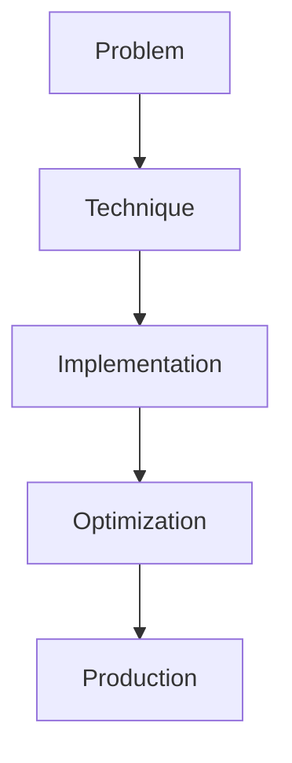

# Advanced RAG Patterns

## Detailed Explanation

Advanced RAG Patterns is a crucial modern technique in AI engineering. HyDE, re-ranking, iterative, GraphRAG. This represents the practical state-of-the-art in how production AI systems are built today. Understanding this technique is essential for building scalable, reliable AI systems. The key insight is that this approach addresses fundamental trade-offs in AI systems: between performance and efficiency, between flexibility and reliability, between research models and production systems.

## Core Intuition

Think of Advanced RAG Patterns as the bridge between what researchers build and what engineers deploy. It solves a specific production challenge that becomes critical at scale.

## How It Works

1. Understand the core problem this technique addresses
2. Learn the fundamental algorithm or pattern
3. Implement using available libraries and frameworks
4. Integrate with related components in your system
5. Optimize for your specific constraints (latency, cost, accuracy)
6. Monitor and iterate based on production metrics



## Architecture / Trade-offs

RAG variants differ in retrieval quality, latency, and computational cost. Select based on answer accuracy requirements and infrastructure constraints.

| RAG Variant | Retrieval Quality | Latency | Implementation Complexity | Cost | Hallucination Risk |
|-------------|-------------------|---------|---------------------------|------|------------------|
| Basic Dense | Medium | Fast (1-2s) | Low | Low | High |
| HyDE | High | Medium (2-5s) | Medium | Low | Medium |
| Multi-Hop | Very High | Slow (5-15s) | High | Medium | Low |
| Re-ranking | High | Medium (3-6s) | Medium | Medium | Medium |
| GraphRAG | Very High | Slow (10-30s) | Very High | High | Low |

**Key trade-offs:**

- **Basic vs HyDE:** Basic retrieval uses query embedding directly (fast, simple). HyDE generates hypothetical documents from the query, then retrieves (higher quality but 2-3x slower). For customer support (need answer in <1s), use basic. For research/analytical queries (user willing to wait), use HyDE. HyDE typically improves retrieval quality 10-20% at cost of latency.

- **Re-ranking latency:** Adding a cross-encoder reranker improves top-1 accuracy (halves hallucinations) but doubles latency. If your SLA is <2s, reranking may break it. Mitigation: rerank only top-10 candidates, use lightweight rerankers (distilled models), make reranking async (show initial results, refine as reranking completes).

- **GraphRAG vs simpler approaches:** Graph-based retrieval handles multi-hop queries (traverse relationships) and catches complex reasoning tasks basic retrieval misses. But GraphRAG requires building knowledge graphs (expensive, error-prone) and slower traversal. Use only if your queries require entity relationships or reasoning; most FAQ/customer support doesn't.

## Design Challenges

- **Chunk boundary artifacts:** Information is split across chunks. Question needs "A and B" but A is at end of chunk 1, B at start of chunk 2. Retrieval gets each chunk separately, missing the connection. Symptom: model hallucinates connection. Fix: overlap chunks (chunk i-1, i, i+1 together), use dynamic chunking based on semantic boundaries, retrieve more chunks and let the LLM filter.

- **Latency from re-ranking:** Adding a cross-encoder reranker improves answer quality but adds 2-3 seconds latency. If your SLA is <2s total, reranking breaks it. Symptom: user experience degrades from latency increase despite better answers. Fix: apply reranking only to top-10-20 (not all 100 candidates), use smaller rerankers (distilled), make it async (show basic results while reranking completes).

- **Balancing coverage vs precision:** Return 5 documents, miss relevant info; return 50 documents, user drowns in irrelevant context. Passage retrieval precision-recall tradeoff. Symptom: either missing context (model hallucinates) or too much noise (model ignores relevant info). Fix: use retrieval metrics (MRR, NDCG) on validation set, target top-5 precision >80%, adaptive thresholding based on query confidence.

- **HyDE amplifies errors:** Hypothetical document generation is fast but sometimes generates off-topic documents. Retrieving based on hallucinated hypotheses can degrade quality. Symptom: quality worse than basic retrieval on some queries. Fix: use HyDE for searches where quality matters (not speed), validate retrieval quality on held-out test set, don't blindly replace basic with HyDE.

- **Knowledge graph brittleness:** GraphRAG requires extracting entities and relationships from documents. Extraction errors propagate—if entity A is mislabeled, all relationships break. Symptom: graph queries fail silently or return wrong results. Fix: validate entity extraction separately, use conservative thresholds (high confidence entity extraction only), hybrid approach (graph + dense fallback).

## Interview Q&A

**Q: When is HyDE better than basic dense retrieval?**
A: HyDE shines on complex queries requiring reasoning ("Compare X and Y pros/cons"). It struggles on simple lookups ("What is X?") where it may hallucinate. Test both on your domain: if HyDE improves top-1 accuracy >15%, use it. If improvement is <5%, stick with basic for speed. Practical approach: use basic as fast path (return in 1s if confident), use HyDE as slow path (spend 3s for harder queries where you're unsure).

**Q: How do you debug a re-ranking system that hurts precision instead of helping?**
A: This happens when the reranker is trained on different data or disagrees with the LLM. Measure: compare precision@1 before/after reranking. If it drops, reranking is making things worse. Debug by examining examples: what does the reranker rank first? Compare to LLM's preference. If mismatch is systematic (reranker prefers long documents, LLM prefers short), retrain reranker or adjust scoring formula. As fallback, use reranking only when confidence is low (base ranker gave tied scores).

**Q: What's the right chunk size for RAG?**
A: No universal answer—depends on domain. Scientific papers: 512 tokens (paragraph-sized). Customer support: 256 tokens (FAQ entry-sized). Code: 100-200 tokens (function-sized). Too small: lose context (chunk is a sentence fragment). Too large: retrieval returns irrelevant info from dense chunks. Empirically test: measure retrieval quality (F1 of answer presence) over a range (128, 256, 512, 1024) and pick best. For your domain, start at 256 and adjust.

**Q: When would you use multi-hop retrieval vs single-hop?**
A: Single-hop (retrieve once) is fast and works for 80% of queries ("What is X?" "Where is X?"). Multi-hop is needed for reasoning queries that require chaining: "X caused Y, which led to Z—what's the impact?" Single retrieval won't find the chain. Implement multi-hop only if you observe that single-hop fails on common query types. Cost: multi-hop is 3-5x slower (multiple retrieval rounds), so only use when needed.

**Q: How do you prevent hallucinations when retrieval returns no relevant documents?**
A: Measure retrieval confidence: if top result similarity is <0.5 (or your domain threshold), don't pass to LLM; return "I don't know" instead. Alternatively, retrieve more aggressively (top-20 instead of top-5) but let LLM know confidence is low. Add explicit prompt: "Only answer based on provided documents; if no documents match, say 'I don't have information on that.'" Test on queries with no valid answer—measure false positive (model hallucinates answer anyway).

**Q: What's the pitfall of treating RAG as a magic solution for hallucination?**
A: RAG helps but doesn't eliminate hallucinations. If retrieval is wrong (gets irrelevant documents), LLM hallucinates based on wrong context. If retrieval is right but sparse, LLM fills gaps from training data (hallucination). RAG reduces hallucinations by ~30-50% typically, not 100%. For applications with hallucination cost (medical, legal), add layers: retrieval + validation (check answer against source documents) + human review. Don't rely on RAG alone.

## Best Practices

- Understand the fundamental principle before optimizing
- Use established libraries instead of building from scratch
- Measure the actual impact on your metric
- Test with realistic data and production loads
- Monitor continuously in production
- Document your configuration and rationale
- Plan for multiple iterations until reaching optimum

## Common Pitfalls

- **Chunk boundary information split:** "A caused B" is split across chunks—chunk 1 ends with "A caused," chunk 2 starts with "B." Each chunk retrieved individually misses the connection, LLM hallucinates link. Symptom: model provides logically disconnected reasoning. Fix: use overlapping chunks (chunk i-1, i, i+1 together), semantic chunking (split on sentence/paragraph boundaries), retrieve larger context and let LLM filter.

- **Re-ranking latency kills SLA:** Adding cross-encoder reranking improves quality but adds 2-3 seconds. If SLA is <2s, reranking breaks it and users see timeouts. Symptom: latency spike post-reranking deployment; quality up, latency violations up. Fix: rerank only top-10 (not all 100), use lighter reranker (distilled 6-layer model), make async (return initial results, refine in background).

- **Precision-recall tradeoff unbalanced:** Retrieve 5 docs, miss important context (hallucinate). Retrieve 50, LLM drowns in noise (ignores signal). Symptom: either wrong answers or lost accuracy in long contexts. Fix: find optimal k via metrics (MRR, NDCG) on validation set, aim for precision@5 >75%, use adaptive retrieval (retrieve more for complex queries).

- **HyDE hallucination:** Generating hypothetical documents can be off-topic. Retrieving based on hallucinated hypotheses degrades quality. Symptom: "HyDE performed worse than basic" on your test set. Fix: validate HyDE improvement on held-out test (must beat basic by >10%), don't deploy universally, use A/B testing to confirm improvement on real users.

- **Graph extraction brittleness:** GraphRAG requires accurate entity/relationship extraction. Mistakes propagate—missed entity breaks graph traversal. Symptom: queries that need graph path fail silently. Fix: validate extraction quality separately, use high-confidence thresholds, hybrid fallback (graph + dense retrieval), don't solely rely on graph.

## Code Examples

### Example 1: Basic Implementation

```python
import torch
from transformers import pipeline

# Basic usage pattern
model = pipeline("text-generation", model="meta-llama/Llama-2-7b")
output = model("Hello, world!", max_length=50)
print(output)
```

### Example 2: Production with Monitoring

```python
import torch
import time
from transformers import pipeline

device = torch.device("cuda" if torch.cuda.is_available() else "cpu")

# Production setup
model = pipeline("text-generation", 
                model="meta-llama/Llama-2-7b",
                device=0 if torch.cuda.is_available() else -1)

# Measure performance
start = time.time()
output = model("The future of AI engineering is", max_length=100)
latency = time.time() - start

print(f"Latency: {latency:.2f}s")
print(f"Output: {output[0]['generated_text']}")
```

## Related Concepts

- [LLM Evaluation Harness](./01-llm-evaluation-harness.md)
- [AI Red-Teaming](./02-ai-red-teaming.md)
- [Agentic Testing Harness](./03-agentic-testing-harness.md)
