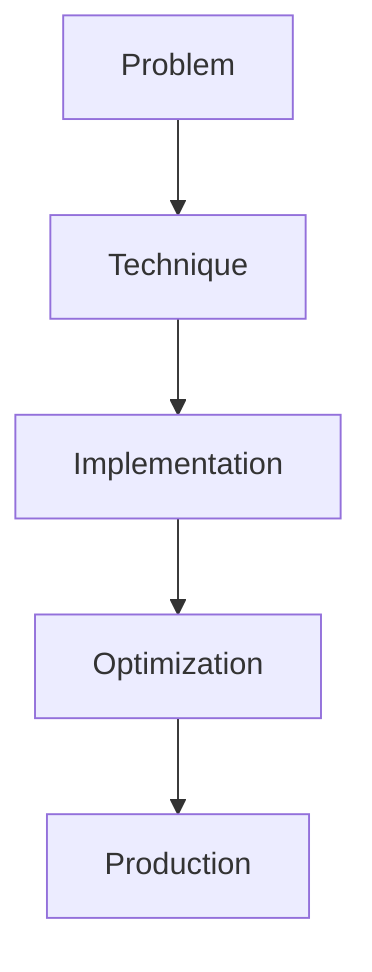

# Context Distillation

## Detailed Explanation

Context Distillation is a crucial modern technique in AI engineering. Compressing long contexts for efficiency. This represents the practical state-of-the-art in how production AI systems are built today. Understanding this technique is essential for building scalable, reliable AI systems. The key insight is that this approach addresses fundamental trade-offs in AI systems: between performance and efficiency, between flexibility and reliability, between research models and production systems.

## Core Intuition

Think of Context Distillation as the bridge between what researchers build and what engineers deploy. It solves a specific production challenge that becomes critical at scale.

## How It Works

1. Understand the core problem this technique addresses
2. Learn the fundamental algorithm or pattern
3. Implement using available libraries and frameworks
4. Integrate with related components in your system
5. Optimize for your specific constraints (latency, cost, accuracy)
6. Monitor and iterate based on production metrics



## Architecture / Trade-offs

Context distillation offers multiple methods, each with different characteristics for compressing contexts while preserving relevance.

| Method | Speed | Information Retention | Implementation Complexity | Best For |
|--------|-------|----------------------|--------------------------|----------|
| LLM-as-Summarizer | Slow (10-30s) | High (85-95%) | Medium (API calls) | Complex documents, nuanced content |
| Extractive Distillation | Fast (<1s) | Medium (70-80%) | Low (string matching) | Factual retrieval, structured data |
| Token Pruning | Very Fast (<100ms) | Variable (60-90%) | High (model modification) | Latency-critical paths |

**Trade-off Analysis:**

LLM-as-Summarizer provides the best information retention but incurs significant latency and API costs (often $0.01-0.05 per document). Use this when accuracy is critical and latency is not a constraint, such as in document analysis or knowledge base creation. Extractive distillation speeds up processing 10-100x by selecting existing chunks, but loses context transitions and may miss non-verbatim paraphrases. This works well for QA systems where questions map directly to document sections. Token pruning operates at inference time, removing low-attention tokens without separate compression steps. This minimizes latency overhead but requires careful calibration to avoid truncating important context at critical points.

## Design Challenges

- **Information loss vs compression ratio tradeoff:** Aggressive compression (50% reduction) often loses critical details that emerge later in reasoning. For legal documents or code, even small losses cause errors. Empirically, keeping 60-80% of tokens preserves 90%+ of reasoning ability, but your specific task requires empirical measurement on your data distribution.

- **Handling diverse context types:** Long contracts differ from code snippets differ from conversation histories. Token pruning trained on news articles may over-compress code blocks. Context distillation requires different strategies: legal documents benefit from LLM summarization (preserving nuance), code from extractive methods (preserving syntax), conversations from recent-window approaches.

- **Preserving temporal information:** In long conversations or time-series data, chronological ordering matters. Summarization can scramble temporal sequences. Extractive methods preserve order but may miss earlier context that becomes relevant later. Pruning must weight recency carefully without losing foundational context set at the beginning.

- **Query-dependent compression:** The same context is useful or wasteful depending on the downstream query. Compressing before knowing the question leads to irreversible loss. Ideal systems compress after retrieval, but this adds per-query latency. Production systems must choose: compress once offline (fast) or compress per-query (accurate).

- **Measuring information loss empirically:** BLEU/ROUGE scores on summaries don't correlate with downstream task performance. You need task-specific metrics: test on your actual QA pairs, your actual code understanding task, your actual decision-making scenario. A "compressed" context that keeps 80% of text but loses key examples may score well on text similarity but fail at the task.

## Interview Q&A

**Q: When would you use distillation vs keeping the full context?**
A: Use distillation when your latency budget is tight (sub-second inference) or when token costs dominate your budget (common with large models or high throughput). Keep full context if your bottleneck is accuracy and you have compute to spare. A practical heuristic: if the original context fits comfortably in your model's context window without slowing inference, don't distill.

**Q: How do you measure information loss from context compression?**
A: Never trust generic text similarity metrics like ROUGE or BLEU. Instead, measure on your actual task: run your downstream application on the compressed context vs full context and compare final outputs. For QA systems, track exact-match accuracy and F1 on held-out test sets. For code understanding, measure whether the compressed context still contains examples the model needs. The only metric that matters is task performance.

**Q: What breaks when you compress context too aggressively?**
A: The model loses reasoning breadth. It might answer simple factual queries correctly but fail on questions requiring synthesis across multiple parts of the context. You also lose rare-but-important details: an edge case mentioned once in a long contract becomes invisible. In practice, compression above 80% typically causes measurable accuracy drops. Always test on diverse query types, not just the common case.

**Q: How would you debug if distillation hurts performance?**
A: First, confirm the information loss: compare summaries side-by-side against full context. Often the compression method itself is sound but tuned for the wrong distribution (trained on news, applied to legal). Try a more conservative compression ratio (50% instead of 80%) to isolate whether it's the method or the aggressiveness. If that helps, recalibrate. If not, the distillation approach itself isn't suited to your task; switch to a different method.

**Q: Should distillation happen offline (once) or per-query (each time)?**
A: Offline distillation (during indexing) is 10-100x faster but loses query-dependent signal. Per-query distillation adds latency (500ms-2s depending on method) but compresses only what's relevant to the query. Use offline if latency is critical and your distillation method is query-agnostic (e.g., token pruning). Use per-query if you have latency budget and expect high variability in which context matters.

**Q: How do you handle multiple document types in one system?**
A: Don't use a single distillation strategy across all types. Route based on document classification: legal documents use LLM summarization (preserves nuance), code uses extractive methods (preserves syntax), conversations use sliding-window approaches (preserves recency). Implement a type-specific compression pipeline, possibly with different models for each type. This is more engineering overhead but avoids the brittleness of a one-size-fits-all approach.

**Q: What's the relationship between distillation and retrieval quality?**
A: Distillation can't fix poor retrieval. If your retriever returns documents that don't contain the answer, no amount of compression helps. Good distillation assumes the retrieved context is relevant and just makes it concise. Conversely, excellent retrieval with naive compression (no distillation) often outperforms poor retrieval with perfect distillation. Build retrieval quality first, then layer distillation for latency gains.

## Best Practices

- Understand the fundamental principle before optimizing
- Use established libraries instead of building from scratch
- Measure the actual impact on your metric
- Test with realistic data and production loads
- Monitor continuously in production
- Document your configuration and rationale
- Plan for multiple iterations until reaching optimum

## Common Pitfalls

- **Over-compressing beyond information-loss tolerance:** You compress to 40% of original length to save latency, but lose critical examples or edge cases that appear once. Symptom: performance is fine on simple queries but drops on complex reasoning. Fix: measure task performance across diverse query types, establish a minimal compression threshold by A/B testing (e.g., stop at 60% if accuracy drops measurably), and implement monitoring to catch degradation in production.

- **Not testing on diverse context distributions:** Your distillation works great on the 20 documents you tested on but fails on documents with unusual structure (headers-heavy, code-heavy, tables). Symptom: inconsistent accuracy across document types. Fix: test on a stratified sample covering all document types your system will encounter. If distillation degrades certain types, implement type-specific compression strategies.

- **Losing critical ordering information:** Extractive methods might select relevant chunks but lose the logical flow between them. In a persuasive document, the conclusion strengthens earlier claims; extracting chunks in isolation loses this effect. Symptom: compressed context answers factual questions but fails on understanding intent or argument structure. Fix: preserve local context windows around selections, not just the selected chunks. Include transitions or connective phrases.

- **Mismatch between distillation cost and gain:** You pay expensive API calls to summarize with GPT-4, but your use case was fine with 10% latency overhead and no API cost. Symptom: distillation provides minimal speed improvement but high API costs. Fix: measure the actual latency and accuracy of no distillation baseline before implementing. If latency is acceptable, don't distill. If it must be reduced, use cheaper methods (extractive, pruning) first.

- **Distillation optimizing for metrics instead of task:** You optimize summarization to maximize ROUGE score, but your actual downstream task needs specific details that ROUGE doesn't value. Symptom: high summary quality scores but worse downstream task performance. Fix: treat task performance as the primary metric and measure distillation on actual QA pairs, code understanding tasks, etc., not on text similarity scores.

## Code Examples

### Example 1: Basic Implementation

```python
import torch
from transformers import pipeline

# Basic usage pattern
model = pipeline("text-generation", model="meta-llama/Llama-2-7b")
output = model("Hello, world!", max_length=50)
print(output)
```

### Example 2: Production with Monitoring

```python
import torch
import time
from transformers import pipeline

device = torch.device("cuda" if torch.cuda.is_available() else "cpu")

# Production setup
model = pipeline("text-generation", 
                model="meta-llama/Llama-2-7b",
                device=0 if torch.cuda.is_available() else -1)

# Measure performance
start = time.time()
output = model("The future of AI engineering is", max_length=100)
latency = time.time() - start

print(f"Latency: {latency:.2f}s")
print(f"Output: {output[0]['generated_text']}")
```

## Related Concepts

- [LLM Evaluation Harness](./01-llm-evaluation-harness.md)
- [AI Red-Teaming](./02-ai-red-teaming.md)
- [Agentic Testing Harness](./03-agentic-testing-harness.md)
