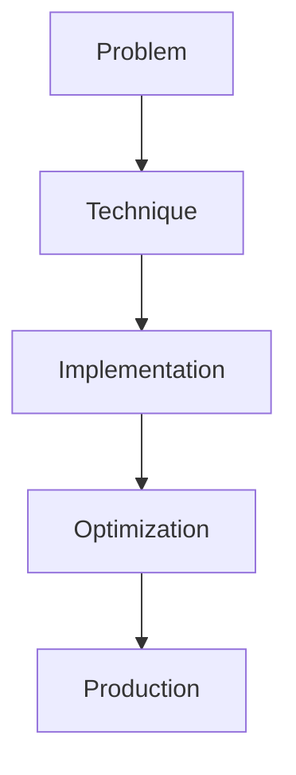

# Synthetic Data Generation

## Detailed Explanation

Synthetic Data Generation is a crucial modern technique in AI engineering. Self-instruct, Magpie-style data pipelines. This represents the practical state-of-the-art in how production AI systems are built today. Understanding this technique is essential for building scalable, reliable AI systems. The key insight is that this approach addresses fundamental trade-offs in AI systems: between performance and efficiency, between flexibility and reliability, between research models and production systems.

## Core Intuition

Think of Synthetic Data Generation as the bridge between what researchers build and what engineers deploy. It solves a specific production challenge that becomes critical at scale.

## How It Works

1. Understand the core problem this technique addresses
2. Learn the fundamental algorithm or pattern
3. Implement using available libraries and frameworks
4. Integrate with related components in your system
5. Optimize for your specific constraints (latency, cost, accuracy)
6. Monitor and iterate based on production metrics



## Architecture / Trade-offs

Synthetic data generation approaches vary in data quality, generation speed, and cost tradeoffs. Each method has distinct strengths for different scenarios.

| Method | Quality | Generation Speed | Cost | Diversity | Best For |
|--------|---------|-----------------|------|-----------|----------|
| Self-Instruct | Medium (70-80%) | Fast (100s of examples/hour) | Low ($0) | Low (repetitive) | Bootstrap from small seeds, task-specific data |
| Magpie-style | Medium-High (75-85%) | Medium (10s of examples/min) | Low (open-source) | Medium (clustered) | Diverse instruction data, alignment |
| GPT-4 Generation | High (85-95%) | Slow (1-2 examples/min) | High ($0.03-0.10 per example) | High (diverse) | Complex reasoning, high-stakes fine-tuning |

**Trade-off Analysis:**

Self-Instruct is fastest and cheapest: given a base instruction, automatically generate variations and outputs using a weaker model. Works well for narrow domains but tends to produce repetitive, mode-collapsed data because the generation process lacks diversity constraints. Use when you need quick bootstrapping and can accept lower data diversity. Magpie methods cluster examples by semantic similarity then generate variations within clusters, improving diversity while staying fast. Medium quality but better distribution coverage than self-instruct. Use for data augmentation when diversity matters and cost is constrained. GPT-4 generation produces the highest quality, most diverse data but at 10-100x higher cost per example. Worth using when fine-tuning expensive models (code understanding, reasoning) where data quality directly impacts final performance, but prohibitive for large-scale data collection.

## Design Challenges

- **Quality control and garbage-in-garbage-out:** If your seed prompts are low quality or unrepresentative, synthetic data amplifies the problem. Self-instruct methods inherit the distribution from seeds, and weak generation models may produce invalid outputs (syntactically broken code, incoherent explanations). Quality filtering is essential: automated checks (syntax validation, embedding-based outlier detection) catch some issues, but near-duplicates and subtle errors slip through. Plan 20-50% rejection rate for synthetic data vs 5-10% for human data.

- **Mode collapse and distribution mismatch:** Without careful diversity constraints, generation models collapse to repeating the same style, tone, and structure. Self-Instruct data often exhibits this: hundreds of examples that look like variations of the same pattern. Real data has long-tail edge cases that synthetic generation misses. Models fine-tuned on synthetic data excel on common cases but fail on rare patterns. Mitigation: cluster generated examples by semantics and selectively regenerate underrepresented clusters, or sample generation prompts from a broader distribution.

- **Filtering and quality detection at scale:** You can't manually review thousands of synthetic examples. Automated filtering needs to be sensitive (catch errors) without being over-aggressive (reject good examples). Heuristics like "reject if length > 2x median" catch some issues but miss subtle ones like logically inconsistent explanations. Using embeddings to filter outliers helps, but requires labeled validation data to calibrate thresholds.

- **Synthetic data memorization and overfitting:** If fine-tuned on synthetic data generated from the same base model used for inference, the model may memorize patterns rather than learn generalizable skills. Results look good on the generation model but degrade on real-world inputs with different styles. Cross-model generation (use GPT-4 for generation, Llama for fine-tuning) partially mitigates this but increases cost.

- **Evaluation of synthetic data quality:** Holding out synthetic data for validation biases results upward; the model has already learned from nearly-identical examples during training. True evaluation requires human-written holdout sets or real-world benchmark data. You must measure: does fine-tuning on synthetic data improve performance on human-written test sets? If gains don't transfer, your synthetic data isn't generalizable.

## Interview Q&A

**Q: When is synthetic data generation worth the effort over just collecting more human data?**
A: When human data collection is slow, expensive, or prohibitive. If you can collect 100 human examples per day for $500, but synthetic generation produces 5000 examples per hour for $50, synthetic wins on speed and cost. However, if your domain requires nuance (customer service, medical writing), human data quality often can't be matched by synthetic methods. Use synthetic to bootstrap, then validate with human data.

**Q: How do you validate synthetic data quality without human annotation?**
A: Never rely on generation metrics alone. Instead, run downstream evaluation: fine-tune on synthetic data and measure on a human-written test set. If performance improves, the data is useful; if it doesn't transfer, the data isn't generalizable. Use embeddings to check coverage: do your synthetic examples span the full feature space, or are they clustered? Run automatic checks (syntax validation for code, entity recognition for NLP) to catch obvious errors.

**Q: When is GPT-4 generation better than self-instruct, and when would you stick with self-instruct?**
A: Use GPT-4 for complex reasoning, rare patterns, or high-stakes tasks where a 10-20% quality improvement justifies 100x higher cost. Use self-instruct for broad coverage of simple tasks where quantity matters more than individual example quality. Self-instruct shines for bootstrap phases; GPT-4 for refining a mature system. In practice, use both: self-instruct to create 100k examples for pretraining data breadth, GPT-4 to create 5k high-quality examples for fine-tuning depth.

**Q: What's the first sign your synthetic data is suffering from mode collapse?**
A: Run semantic similarity clustering on your generated data. If 80%+ of examples cluster into a few similar groups, you have mode collapse. Manually inspect examples from each cluster: if they're nearly identical in structure or style, regeneration with stronger diversity constraints is needed. Performance plateau on your validation set while training loss continues improving is another signal.

**Q: How do you prevent your fine-tuned model from memorizing synthetic data instead of generalizing?**
A: Mix synthetic and human data in a 70-30 or 50-50 split, with human data concentrated in the validation set. Validate on genuinely new holdout sets (not synthetic). Use cross-model generation if possible: generate with GPT-4, fine-tune with Llama. Measure generalization by evaluating on real-world benchmarks and user feedback, not metrics computed on the training set.

**Q: What architectural choices help ensure synthetic data diversity?**
A: Use prompt diversity: instead of one seed prompt, generate from 50+ different prompt templates to cover more of the instruction space. Add noise injection: paraphrase prompts before generation to reduce exact-match repetition. Implement semantic diversity constraints: cluster generated examples and selectively regenerate under-represented clusters. Use multiple generation models: some examples from GPT-4, others from Llama, to introduce style variation.

**Q: How do you handle domain-specific synthetic data generation (code, medical, legal)?**
A: Domain knowledge must guide generation. For code, use syntax-aware generation (generate valid Python, not hallucinated syntax). For medical, enforce accuracy constraints (don't generate plausible-sounding but false medical facts). For legal, preserve exact terminology and regulatory context. Use domain-specific filtering and validation: lint for code, expert review for medical/legal. A general-purpose generator applied to specialized domains produces useless-looking outputs that pass generic checks but fail domain expertise validation.

## Best Practices

- Understand the fundamental principle before optimizing
- Use established libraries instead of building from scratch
- Measure the actual impact on your metric
- Test with realistic data and production loads
- Monitor continuously in production
- Document your configuration and rationale
- Plan for multiple iterations until reaching optimum

## Common Pitfalls

- **Not filtering low-quality synthetic examples:** You generate 10000 examples but never inspect or filter them. The model trains on incorrect outputs, hallucinations, and malformed data alongside good examples. Symptom: fine-tuned model performance is inconsistent, often produces plausible-sounding but incorrect outputs. Fix: implement automated filtering (syntax checks, embedding-based outlier detection), do manual spot-checks on 100+ examples to estimate error rate, and discard low-quality examples. Budget 20-50% rejection rate.

- **Distribution mismatch between synthetic and real data:** Your synthetic data is clean, evenly balanced, and well-formed. Real user queries are noisy, imbalanced (some topics rare), and include typos. The model generalizes poorly to real data. Symptom: excellent performance on synthetic validation set, but poor real-world results. Fix: add noise to synthetic generation (typos, paraphrasing, style variation), stratify generation to match expected real distribution (if 10% of queries are edge cases, generate 10% edge cases), and validate always on human-written test data.

- **Mode collapse reducing effective dataset size:** You generate 50000 examples but 80% are near-duplicates due to lack of diversity constraints. You effectively have 10000 unique examples. Symptom: training loss plateaus despite large dataset, performance gains slow. Fix: implement semantic diversity constraints during generation, use multiple generation prompts to encourage variation, cluster examples and regenerate underrepresented clusters, sample prompts from broader distributions.

- **Overfitting to generation model artifacts:** Your synthetic data was generated by GPT-3.5 with a specific style and patterns. Fine-tuned models learn those artifacts and fail when inputs come from different sources or users with different writing styles. Symptom: model trained on synthetic data underfits compared to models trained on diverse human data of equivalent size. Fix: use multiple generation models (GPT-4, Claude, open-source), add human-written examples even in small quantities, validate on diverse real-world data sources.

- **Evaluating synthetic data quality using the wrong metrics:** You measure synthetic data quality with BLEU/ROUGE or perplexity scores, which don't predict downstream task performance. Clean synthetic data scores high but provides no gain when fine-tuning. Symptom: synthetic data looks perfect on metrics but fine-tuning doesn't improve real task performance. Fix: use only downstream task performance as the metric. Fine-tune on synthetic data and evaluate on human-written test sets; if accuracy improves, data is good; if not, it's not useful regardless of generation metrics.

## Code Examples

### Example 1: Basic Implementation

```python
import torch
from transformers import pipeline

# Basic usage pattern
model = pipeline("text-generation", model="meta-llama/Llama-2-7b")
output = model("Hello, world!", max_length=50)
print(output)
```

### Example 2: Production with Monitoring

```python
import torch
import time
from transformers import pipeline

device = torch.device("cuda" if torch.cuda.is_available() else "cpu")

# Production setup
model = pipeline("text-generation", 
                model="meta-llama/Llama-2-7b",
                device=0 if torch.cuda.is_available() else -1)

# Measure performance
start = time.time()
output = model("The future of AI engineering is", max_length=100)
latency = time.time() - start

print(f"Latency: {latency:.2f}s")
print(f"Output: {output[0]['generated_text']}")
```

## Related Concepts

- [LLM Evaluation Harness](./01-llm-evaluation-harness.md)
- [AI Red-Teaming](./02-ai-red-teaming.md)
- [Agentic Testing Harness](./03-agentic-testing-harness.md)
