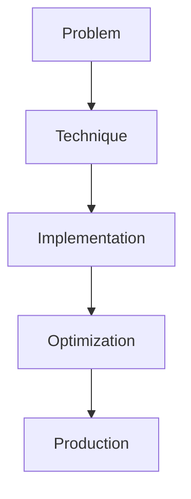

# Constitutional AI & RLAIF

## Detailed Explanation

Constitutional AI & RLAIF is a crucial modern technique in AI engineering. AI feedback for alignment training. This represents the practical state-of-the-art in how production AI systems are built today. Understanding this technique is essential for building scalable, reliable AI systems. The key insight is that this approach addresses fundamental trade-offs in AI systems: between performance and efficiency, between flexibility and reliability, between research models and production systems.

## Core Intuition

Think of Constitutional AI & RLAIF as the bridge between what researchers build and what engineers deploy. It solves a specific production challenge that becomes critical at scale.

## How It Works

1. Understand the core problem this technique addresses
2. Learn the fundamental algorithm or pattern
3. Implement using available libraries and frameworks
4. Integrate with related components in your system
5. Optimize for your specific constraints (latency, cost, accuracy)
6. Monitor and iterate based on production metrics



## Architecture / Trade-offs

AI feedback methods replace or supplement human feedback in reinforcement learning, each with different accuracy-speed-cost tradeoffs.

| Method | Speed | Feedback Accuracy | Computational Cost | Consistency | Best For |
|--------|-------|------------------|-------------------|-------------|----------|
| Rule-based Feedback | Very Fast (<10ms) | Low-Medium (60-75%) | Minimal | High (deterministic) | Quick iteration, simple preferences |
| LLM-based Feedback | Slow (500ms-2s) | High (85-95%) | High (API/inference) | Medium (stochastic) | Complex judgment, alignment training |
| Hybrid (Rule + LLM) | Medium (100-500ms) | High (90-95%) | Medium | High (rule default) | Production systems, cost control |

**Trade-off Analysis:**

Rule-based feedback (keyword matching, explicit preference rules) is fastest and cheapest, requiring only simple heuristics and no model inference. However, it's brittle: catches obvious bad outputs but misses nuanced problems. Use for initial data collection and filtering obvious cases, but don't expect high accuracy. LLM-based feedback uses a judge model to score outputs against a constitution. It's far more accurate—a strong judge model catches subtle toxicity, inaccuracy, and style issues—but costs 1000x more in compute and latency. Worth using for final alignment training of important models, but too expensive for 100M examples. Hybrid systems apply rules first (reject obvious failures), then use expensive LLM feedback only for borderline cases. Reduces cost 10-50x while maintaining high accuracy. This is the practical choice for production systems.

## Design Challenges

- **Cost vs quality tension:** LLM-based feedback is expensive ($0.001-0.01 per example at scale), making 1M examples cost $1000-10000. At this price, it's cheaper to hire humans for 100k examples. If you need feedback on 100M examples, costs become prohibitive. Hybrid approaches help, but the fundamental tradeoff remains: high-quality feedback requires expensive models or human raters.

- **Feedback consistency and disagreement:** Even good judge models disagree with each other and with human raters 10-30% of the time. Which feedback signal is correct when model-A prefers output-X but model-B prefers output-Y? Training on inconsistent signals introduces noise. You must handle disagreements: take majority vote if using multiple judges, weight judges by confidence, or use human review for controversial cases. This adds latency and cost.

- **Handling edge cases and ambiguity:** Your constitution says "be helpful and harmless," but a request to write fiction about a crime is both harmful (promotes crime narrative) and harmless (fictional, no real person affected). Judge models struggle with genuine ambiguity. They often default to rejecting edge cases, leading to overcensorship. Solution: explicit rules for ambiguous cases, human review of borderline examples, and iterative constitution refinement based on failure analysis.

- **Circular reasoning and reward hacking:** If your judge model is trained on outputs from the same base model you're fine-tuning, the model learns to fool the judge rather than improve. The model produces outputs that score high on the judge but fail in real use. Example: generating text the judge thinks is factual but contains hallucinations the judge can't detect. Mitigation: use an independent judge model (different architecture, different training data), adversarially test for reward hacking, validate on human-curated examples.

- **Scalability of constitution maintenance:** Your constitution starts with 5 principles (helpfulness, honesty, harmlessness) but grows to 20+ as edge cases emerge. Managing contradictions between principles becomes complex. Principle-A says "be concise," Principle-B says "be thorough." Which wins? Judge models must handle principle conflicts, but this isn't explicit in most implementations. As your system grows, constitution management becomes a major engineering challenge.

## Interview Q&A

**Q: When would you use AI feedback instead of RLHF (human feedback), and what's the computational advantage?**
A: AI feedback scales to 100M examples where human feedback is limited to 100k. Cost-wise: human raters cost $1-5 per example, LLM judges cost $0.001-0.01 per example, making AI feedback 100-1000x cheaper at scale. The tradeoff is accuracy: humans catch subtle errors and edge cases that judges miss. Use AI feedback for training large-scale preference models, or use a mix: human feedback for initial alignment and AI feedback for scaling. The computational overhead is the inference cost of the judge model—expect 500ms-2s latency per example with a capable LLM judge.

**Q: How do you handle disagreement between AI feedback and human preference?**
A: This is common: AI judges might prefer a polite but unhelpful response, while humans prefer a direct helpful one. When disagreement is systematic (judge consistently wrong on a category), retrain the judge or refine the constitution. When sporadic, weight human feedback more heavily in training. Measure: compare models trained on pure AI feedback vs human-weighted feedback on human evaluation sets. If human-weighted is better, you have judge quality issues. The solution is often an independent, stronger judge model, not more data.

**Q: What's a red flag that your judge model is suffering from reward hacking or circularity?**
A: You notice fine-tuned models produce outputs that score high on the judge but low on human evaluation. The model has learned the judge's blind spots. To detect this early: regularly sample outputs from the training distribution and have humans rate them against the judge. If divergence exceeds 20%, you have reward hacking. Fix: use a held-out, independently-trained judge for evaluation, implement adversarial testing to find failure modes, or introduce diversity in judge models to avoid any single exploitable pattern.

**Q: How do you construct an effective constitution with competing principles?**
A: Start with 3-5 core principles (honesty, helpfulness, harmlessness) and make them explicit with concrete examples. As you encounter edge cases, add specific rules that disambiguate conflicts. Example: "In conflicts between brevity and accuracy, choose accuracy unless the query explicitly asks for brevity." Document decisions and iterate. Periodically review rejected examples to catch over-censoring or under-censoring. A strong constitution evolves from feedback, not from first principles alone.

**Q: Should you use a single strong judge or multiple weaker judges in ensemble?**
A: Single strong judge is faster (one inference) but has single points of failure (blind spots, reward hacking). Multiple judges catch different errors but add cost and latency (3x slower). For critical systems, start with a strong judge, then add a second independent judge for validation. Run majority vote or confidence-weighted averaging to handle disagreements. This costs 2-3x more but catches more errors and is resistant to single-judge failure modes.

**Q: How do you scale AI feedback to hundreds of millions of examples cost-effectively?**
A: Use a hierarchy: rule-based filtering (free, catches 80% of obviously bad outputs), cheaper judge models for medium-difficulty examples, expensive judges only for borderline cases. This reduces average cost from $0.01 to $0.0001 per example. Another approach: fine-tune a specialized, smaller judge model for your specific domain. A 1B parameter judge is 1000x cheaper than GPT-4 and often sufficient. Measure: validate that hybrid approaches maintain quality (human eval on a holdout set) before scaling.

**Q: What's the relationship between constitution and model behavior—does a better constitution improve outcomes?**
A: Yes, but with diminishing returns. A vague constitution ("be helpful") produces inconsistent results. A detailed constitution with examples reduces variance by 30-50%. Beyond that, model capacity and training data matter more. A mediocre constitution with high-quality training data outperforms a perfect constitution with noisy data. In practice, invest equally in constitution clarity and judge model quality; they compound each other's effectiveness.

## Best Practices

- Understand the fundamental principle before optimizing
- Use established libraries instead of building from scratch
- Measure the actual impact on your metric
- Test with realistic data and production loads
- Monitor continuously in production
- Document your configuration and rationale
- Plan for multiple iterations until reaching optimum

## Common Pitfalls

- **Training on feedback from biased or hallucinating judge models:** Your judge model is fine-tuned on data from 2023, so it confidently rates incorrect 2024 facts as good. Or it's biased toward certain writing styles it learned from training. The fine-tuned model absorbs these biases. Symptom: models trained on judge feedback pass judge evaluation but fail human evaluation or real-world use. Fix: validate judge model on independent human evaluation set before using it at scale. Measure judge accuracy on held-out examples, not just training loss. Use multiple independent judges to catch systematic biases.

- **Inconsistent feedback criteria or principle interpretation:** Your constitution says "be concise and thorough"—contradictory principles. Judge models inconsistently apply these, sometimes preferring verbosity, sometimes brevity. Training data is noisy. Symptom: fine-tuned models are inconsistent, sometimes verbose, sometimes too brief, with no clear pattern. Fix: resolve principle conflicts explicitly in your constitution with concrete examples. Test judge consistency on the same prompt (multiple runs should give similar scores). Train with weighted importance if principles genuinely conflict.

- **Reward hacking where models exploit judge blindspots:** Your judge scores based on presence of key terms; the model generates text full of keywords but semantically incoherent. Or judge evaluates factuality via reference matching; model copies the reference without understanding. Symptom: high judge scores don't translate to real-world utility or human preference. Fine-tuned models seem good until deployed. Fix: regularly sample and human-evaluate outputs from your fine-tuned model to detect divergence from judge scores. Use adversarial testing to find exploitable patterns. Consider using multiple independent judges to make hacking harder.

- **Judge model computational cost spiraling:** Using GPT-4 as a judge is expensive ($0.01+ per example). You wanted to generate 10M training examples but the judge budget is exhausted at 100k. Symptom: project stops scaling because judge cost is prohibitive. Fix: implement hybrid approach (rules for obvious cases), use cheaper judge models (open-source 7B model fine-tuned for your task), or reduce the number of judge calls (only judge a subset, impute scores for similar examples).

- **Not validating judge quality independently:** You assume the judge is right because it's a capable model. You never test it against human preferences on your specific task. Judge quality can degrade on domain-specific content (if judge training didn't include your domain). Symptom: judge scores correlate poorly with human preference on your actual task. Fix: measure judge accuracy on a gold-standard human-annotated set of 500+ examples before deploying. Target >90% accuracy with human annotators. If the judge underperforms, fine-tune it on your domain or switch to a different model.

## Code Examples

### Example 1: Basic Implementation

```python
import torch
from transformers import pipeline

# Basic usage pattern
model = pipeline("text-generation", model="meta-llama/Llama-2-7b")
output = model("Hello, world!", max_length=50)
print(output)
```

### Example 2: Production with Monitoring

```python
import torch
import time
from transformers import pipeline

device = torch.device("cuda" if torch.cuda.is_available() else "cpu")

# Production setup
model = pipeline("text-generation", 
                model="meta-llama/Llama-2-7b",
                device=0 if torch.cuda.is_available() else -1)

# Measure performance
start = time.time()
output = model("The future of AI engineering is", max_length=100)
latency = time.time() - start

print(f"Latency: {latency:.2f}s")
print(f"Output: {output[0]['generated_text']}")
```

## Related Concepts

- [LLM Evaluation Harness](./01-llm-evaluation-harness.md)
- [AI Red-Teaming](./02-ai-red-teaming.md)
- [Agentic Testing Harness](./03-agentic-testing-harness.md)
