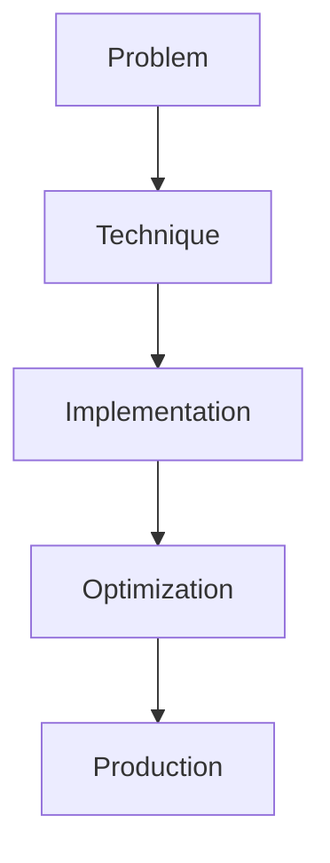

# RAFT

## Detailed Explanation

RAFT is a crucial modern technique in AI engineering. Combining retrieval and fine-tuning. This represents the practical state-of-the-art in how production AI systems are built today. Understanding this technique is essential for building scalable, reliable AI systems. The key insight is that this approach addresses fundamental trade-offs in AI systems: between performance and efficiency, between flexibility and reliability, between research models and production systems.

## Core Intuition

Think of RAFT as the bridge between what researchers build and what engineers deploy. It solves a specific production challenge that becomes critical at scale.

## How It Works

1. Understand the core problem this technique addresses
2. Learn the fundamental algorithm or pattern
3. Implement using available libraries and frameworks
4. Integrate with related components in your system
5. Optimize for your specific constraints (latency, cost, accuracy)
6. Monitor and iterate based on production metrics



## Architecture / Trade-offs

Combining retrieval with fine-tuning involves tradeoffs between accuracy, training time, and inference cost. Different approaches suit different scenarios.

| Approach | Accuracy | Training Time | Inference Latency | Complexity | Best For |
|----------|----------|---------------|-------------------|-----------|----------|
| RAG Only | Medium (70-80%) | None (~10s inference) | Fast (500-2000ms) | Low | Real-time systems, frequent updates |
| Fine-tuning Only | Medium-High (75-85%) | High (1-24 hours) | Very Fast (<100ms) | Low | Fixed knowledge, simple domains |
| RAFT (RAG + FT) | High (85-95%) | Medium (2-8 hours) | Medium (500-1000ms) | Medium | Complex domains, static knowledge |

**Trade-off Analysis:**

RAG-only systems retrieve documents at inference time, enabling real-time updates and flexibility. Latency is moderate (documents retrieved + context consumed), and no training is needed. Works well for frequently updated knowledge bases (news, documentation), but accuracy plateaus around 80% because the model can't deeply understand complex patterns that appear in isolated documents. Fine-tuning-only encodes knowledge directly in weights, enabling very fast inference and strong accuracy on complex reasoning. Training is expensive but happens once. Not flexible: updating knowledge requires retraining. Use for static, deep domains like math, coding, specialized reasoning. RAFT combines both: retrieve relevant documents as training examples, fine-tune the model on those examples. This creates a model that understands complex patterns (from fine-tuning) while retaining ability to ground reasoning (from retrieved documents). Accuracy is highest but training takes longer and inference still requires retrieval. Use for complex domains (scientific QA, legal analysis) where accuracy is critical and you have time for training.

## Design Challenges

- **Circular reasoning: retrieved documents become training data, then retrieval targets:** If you fine-tune on documents retrieved by your initial retriever, then use the fine-tuned model for inference with the same retriever, the model learns shortcuts specific to that retriever's behavior. When combined with a different retriever or when retrieval quality degrades, accuracy drops sharply. The model hasn't learned general knowledge; it's learned to work with a specific retriever. Mitigation: fine-tune on diverse document sources (not just top-retrieved), validate with multiple retrievers at inference time, and measure how sensitive accuracy is to retriever quality changes.

- **Computational cost of training with retrieved documents:** RAFT requires retrieval during training (find relevant docs for each training example). This is expensive: for 100k training examples, you need 100k+ retrieval operations. If each retrieval takes 100-500ms, training takes 10-50 hours just for retrieval. Add fine-tuning on top and you're looking at 24+ hours total. Systems with tighter deadlines may not afford this cost. Solution: cache retrieved documents if possible (if training data is static), use approximate retrieval (HNSW, quantized embeddings), or reduce training set size (5k examples cached beats 100k examples uncached).

- **Inference latency from retrieval requirement:** Unlike pure fine-tuning which is fast (<100ms), RAFT inference includes retrieval (500-2000ms), context encoding, and generation. Total latency becomes 1-5 seconds. For real-time systems (chat, search), this is prohibitive. You gain accuracy over RAG-only but lose speed compared to fine-tuning-only. Solution: pre-compute and cache retrievals for frequent queries, use approximate retrieval methods, or run retrieval and generation in parallel with speculative decoding.

- **Knowledge from fine-tuning vs knowledge from retrieval separation:** When does the model use knowledge learned during fine-tuning vs knowledge from retrieved context? If the model relies too heavily on retrieved context, it's just doing RAG with extra training steps. If it relies on fine-tuned knowledge, it doesn't truly use the retrieved documents. Optimal RAFT leverages both: fine-tuning provides background knowledge and reasoning skills, retrieval provides grounding and specificity. Measurement is tricky: test fine-tuned model without retrieval (relies on fine-tuning), test with retrieval (leverages both). If performance gap is <5%, retrieval isn't adding value.

- **Handling distribution shift between training and inference retrieval:** Your fine-tuning documents come from one set of queries (e.g., Q&A pairs), but at inference, your retriever encounters different query distributions. Retriever returns different documents, the model struggles. Example: trained on legal QA with carefully curated documents, deployed on customer support with messy documentation. Solution: continuously measure whether training distribution matches inference distribution (sample retrieved documents, compare embeddings), retrain periodically with new distribution, or use domain adaptation techniques.

## Interview Q&A

**Q: Why combine RAG and fine-tuning (RAFT) instead of just using one approach?**
A: RAG alone caps accuracy around 80% because the model sees no examples during training and struggles with complex reasoning across documents. Fine-tuning alone lacks grounding and flexibility: knowledge is frozen in weights and updating requires retraining. RAFT gets the best of both: fine-tuning teaches the model deep patterns and reasoning (85-95% accuracy), while retrieval at inference provides grounding and flexibility. The cost is training latency (24+ hours) and inference latency (retrieval overhead). Use RAFT when accuracy is critical, knowledge is mostly static, and you can afford training time.

**Q: How do you prevent circular reasoning where the model becomes dependent on the specific retriever used in training?**
A: Use different retrieval strategies during fine-tuning than inference, or train with diverse retrievers. Example: fine-tune with top-1 and top-5 retrievals (sees different document distributions), then at inference use your production retriever. Validate: measure how sensitive accuracy is to retriever quality. If swapping retrievers causes >10% accuracy drop, you have dangerous circularity. Solution: fine-train with retrieved documents from multiple sources, not just one retriever; test with held-out retriever at evaluation time.

**Q: What's the typical training time tradeoff for RAFT, and when would you skip it and go pure fine-tuning?**
A: RAFT training is 2-8 hours plus retrieval time (often another 10-20 hours for large datasets), totaling 12-28 hours. Pure fine-tuning is 1-4 hours. If you can afford the extra 12 hours and accuracy gains are 10%+ (measured on your task), RAFT is worth it. If you need a model in 4 hours or accuracy gains are <5%, skip RAFT and use pure fine-tuning. Make this decision empirically: train both on a subset (1k examples) and measure accuracy gain; if it's large, the full RAFT pipeline is justified.

**Q: How do you measure whether the model is actually using retrieved documents or just relying on fine-tuned knowledge?**
A: Run two evaluations: (1) model alone without retrieval, (2) model with retrieval. If performance is similar (within 5%), retrieval isn't helping; the model has memorized sufficient knowledge and retrieval is wasted inference cost. If retrieval provides significant gains (10%+), the model is using it. To go deeper: measure what happens if retrieval quality degrades. If accuracy drops sharply with poor retrieval, the model is genuinely dependent on it and getting value. If not, reduce retrieval cost or reconsider RAFT.

**Q: What's the right retriever choice for RAFT: keyword-based (BM25) vs dense (embedding-based)?**
A: Dense retrievers (embedding-based) typically outperform keyword methods by 10-30% on semantic similarity tasks. Fine-tuning on dense-retrieved documents gives the model better examples. However, dense retrievers have cold-start problems (need good embeddings) and can be brittle. For RAFT, use dense retrievers if they're reliable in your domain; the model will learn to leverage them. Validate: compare fine-tuning on BM25 vs dense retrieval documents and measure final accuracy. Most successful RAFT systems use dense retrieval.

**Q: Should you retrain the RAFT model when your knowledge base (corpus) changes?**
A: Yes, but incrementally. If 10% of documents change, retraining the entire model is expensive. Instead: identify which training examples are affected (questions whose retrieved documents changed), retrain on just those examples (efficient). For major corpus changes (>30% new content), consider full retraining. Monitor accuracy metrics on production to detect degradation; this signals when retraining is needed. Automate retraining on a schedule (monthly, weekly) if your corpus evolves quickly.

**Q: How does RAFT compare to simply in-context-learning (providing documents at inference) with a larger context window?**
A: In-context learning with long context windows is faster to deploy (no training needed) but produces lower accuracy on complex reasoning tasks (80-85% vs 85-95% with RAFT). RAFT is worth the training effort when accuracy is critical or you're running at high scale where training cost per query is amortized. For prototypes or frequently changing knowledge, in-context learning is faster to ship; for production systems where accuracy is critical, RAFT is the right choice.

## Best Practices

- Understand the fundamental principle before optimizing
- Use established libraries instead of building from scratch
- Measure the actual impact on your metric
- Test with realistic data and production loads
- Monitor continuously in production
- Document your configuration and rationale
- Plan for multiple iterations until reaching optimum

## Common Pitfalls

- **Circular reasoning where models overfit to the training retriever:** You fine-tune on documents retrieved by BM25, deploy with the same BM25 retriever. The model learns BM25-specific patterns (document structure, keyword density) that don't generalize. When you later try a different retriever, accuracy drops sharply. Symptom: RAFT model is brittle; switching retrievers causes unexpected degradation. Fix: fine-train with multiple different retrievers, validate on held-out retriever at evaluation time, measure accuracy under varying retriever quality (simulate poor retrieval), and ensure the model learns general reasoning, not retriever quirks.

- **Expensive training due to retrieval overhead:** RAFT requires retrieval during training (100k+ queries = 100k+ retrievals). If retrieval takes 200ms/query, training retrieval phase alone takes 5+ hours. Add fine-tuning (2-4 hours) and total training time is 7-10 hours or more. For rapidly iterating teams, this is too slow. Symptom: RAFT training blocked on retrieval latency. Fix: cache retrieved documents if dataset is static, use approximate retrieval (HNSW with quantization), batch retrievals to amortize latency, or reduce training set size (5k cached examples beats 100k uncached).

- **Inference latency degradation from mandatory retrieval:** RAFT adds retrieval latency (500-2000ms) to inference. For real-time systems (chat), this is problematic. You pay accuracy gains but lose speed. Symptom: RAFT model is accurate but too slow for production SLA (need <500ms, getting 2000ms). Fix: implement caching (cache top-k retrievals for common queries), use approximate retrieval, parallelize retrieval and generation, or accept the latency tradeoff and optimize other parts of the pipeline.

- **Not measuring actual value of retrieved documents in training:** You assume retrieval helps fine-tuning, but never measure. You might be wasting training time on retrieval. Symptom: RAFT model isn't significantly better than pure fine-tuning despite extra training cost. Fix: measure two scenarios: (1) fine-tune on random documents (baseline), (2) fine-tune on retrieved documents (RAFT). If accuracy gap is <5%, the retrieval signal isn't strong enough to justify extra cost. Consider simpler alternatives.

- **Distribution mismatch between training and inference retrieval quality:** Fine-tuning assumes you have good retrieved documents (top-1 or top-5 from your retriever). At inference, retrieval quality varies: sometimes you get perfect documents, sometimes poor ones. Model is trained on good-document distribution but sees varying quality in production. Symptom: model degrades when retrieval quality decreases (corpus changed, query distribution shifted). Fix: train with augmented data: include some examples with lower-ranked documents, simulate poor retrieval scenarios, and measure sensitivity to retrieval quality. Design model to be robust to retrieval variance.

## Code Examples

### Example 1: Basic Implementation

```python
import torch
from transformers import pipeline

# Basic usage pattern
model = pipeline("text-generation", model="meta-llama/Llama-2-7b")
output = model("Hello, world!", max_length=50)
print(output)
```

### Example 2: Production with Monitoring

```python
import torch
import time
from transformers import pipeline

device = torch.device("cuda" if torch.cuda.is_available() else "cpu")

# Production setup
model = pipeline("text-generation", 
                model="meta-llama/Llama-2-7b",
                device=0 if torch.cuda.is_available() else -1)

# Measure performance
start = time.time()
output = model("The future of AI engineering is", max_length=100)
latency = time.time() - start

print(f"Latency: {latency:.2f}s")
print(f"Output: {output[0]['generated_text']}")
```

## Related Concepts

- [LLM Evaluation Harness](./01-llm-evaluation-harness.md)
- [AI Red-Teaming](./02-ai-red-teaming.md)
- [Agentic Testing Harness](./03-agentic-testing-harness.md)
