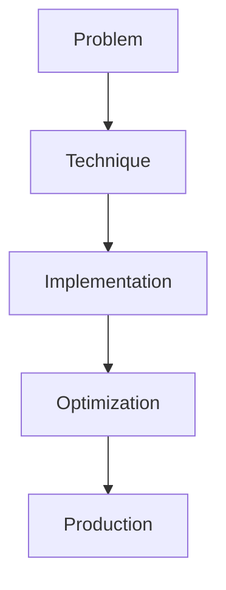

# Model Merging

## Detailed Explanation

Model Merging is a crucial modern technique in AI engineering. SLERP, DARE, Task Arithmetic. This represents the practical state-of-the-art in how production AI systems are built today. Understanding this technique is essential for building scalable, reliable AI systems. The key insight is that this approach addresses fundamental trade-offs in AI systems: between performance and efficiency, between flexibility and reliability, between research models and production systems.

## Core Intuition

Think of Model Merging as the bridge between what researchers build and what engineers deploy. It solves a specific production challenge that becomes critical at scale.

## How It Works

1. Understand the core problem this technique addresses
2. Learn the fundamental algorithm or pattern
3. Implement using available libraries and frameworks
4. Integrate with related components in your system
5. Optimize for your specific constraints (latency, cost, accuracy)
6. Monitor and iterate based on production metrics



## Architecture / Trade-offs

Model merging combines multiple fine-tuned models into a single model, each method with different tradeoffs in quality, computation, and memory.

| Method | Quality Preservation | Computational Cost | Memory Overhead | Implementation | Best For |
|--------|----------------------|-------------------|-----------------|----------------|----------|
| SLERP | High (90-95%) | High (matrix ops on full weights) | 3x during merge | Medium (spherical interpolation) | Merging 2-3 models, final optimization |
| DARE | Medium-High (80-90%) | Low (magnitude-based masking) | 1.5x | Low (thresholding + scaling) | Quick merging, adaptive dropping |
| Task Arithmetic | Medium (70-85%) | Medium (compute difference deltas) | 2x | Low (addition of delta weights) | Merging many models, scaling |

**Trade-off Analysis:**

SLERP (spherical linear interpolation) treats weight vectors as points on a hypersphere and interpolates between them. Preserves relationships between model parameters and produces smooth merged models. High quality but computationally expensive (matrix operations on full weight matrices). Use when merging 2-3 models and quality is critical. Task Arithmetic computes delta weights (fine-tuned model - base model) and averages deltas before applying to base. Fast and scales to 10+ models, but information is lost when deltas conflict (different fine-tunings may change weights oppositely). Works well for multiple related tasks. DARE (Drop And REscale) randomly drops weight updates and scales survivors, reducing redundancy. Cheaper than SLERP, better quality than naive averaging, but requires tuning the drop rate. Good for 3-5 models where you need a balance of quality and cost.

## Design Challenges

- **Merging models with incompatible architectures fails silently:** Merging a 7B model with a 13B model fails because weight shapes don't match. Some merging code doesn't validate shapes upfront, producing cryptic errors or incomplete merges. Models can also have different tokenizer vocabularies (one supports 32k tokens, another 64k), making merged models unstable. Symptom: merge produces a model that loads but crashes during inference on certain inputs. Validation is essential: check architecture match, tokenizer compatibility, weight shape consistency before merging.

- **Knowledge interference when merging opposite tasks:** Fine-tune model-A for customer service (polite, helpful tone), model-B for code review (critical, direct tone). Merge them and you get inconsistent behavior. Depending on the task, the merged model might be too polite for code review or too critical for support. Task-specific knowledge conflicts. This is hardest for truly opposite tasks; closely related tasks merge more smoothly. Solution: don't merge truly opposite models; use ensemble or routing instead. If merging is necessary, weight related models more heavily and downweight conflicting ones.

- **Parameter space conflicts where different fine-tunings change weights oppositely:** Task-A fine-tuning increases certain attention weights, Task-B decreases them. Averaging (Task Arithmetic) produces weights between them, satisfying neither task well. This isn't a rare case—it's common in multi-task learning. Symptom: merged model performance on both tasks degrades compared to single-task models. Measuring this: benchmark merged model separately on Task-A and Task-B. If both degrade >10%, you have parameter conflicts. Solution: weight merging toward the more important task, or use adaptive merging (weight parameters based on importance).

- **Scalability degradation with many models:** Merging 2-3 models works well. Merging 10+ models is harder: conflicts accumulate, averaging becomes less effective. Memory overhead during merging (need full models + merged model in memory) becomes prohibitive. Symptom: trying to merge 20 fine-tuned models produces a merged model that's worse than any individual model on most benchmarks. Solution: don't merge all models; cluster related models and merge within clusters, use hierarchical merging (merge A+B, merge C+D, then merge AB+CD), or use a different approach like mixture-of-experts or ensemble.

- **Loss of task-specific knowledge in the merged model:** When you merge models optimized for Task-A and Task-B, the merged model is often suboptimal for both. Performance is typically 80-90% of the best single-task model. The merged model has compromised between tasks, losing task-specific capabilities. For some applications (need a single model for multiple tasks), this is acceptable. For others (need state-of-the-art on each task), merging is not the right approach. Measurement: benchmark merged model on each original task vs the single-task baseline. If performance gaps are acceptable (<5%), merge is viable.

## Interview Q&A

**Q: How do you know if two models can be merged without catastrophic failure?**
A: Check three things: (1) Same base architecture (7B Llama merges with 7B Llama, not with 13B), (2) Compatible tokenizers (same vocabulary, embedding dimensions), (3) Semantic compatibility (models trained for similar tasks merge better). If these match, the merge will work; whether it's *good* depends on actual performance. Run a quick merge test on CPU to verify technical compatibility before committing time. Never assume same-size models are mergeable; verify architecture details.

**Q: What's the practical difference between SLERP and Task Arithmetic for merging multiple models?**
A: SLERP interpolates in weight space, preserving model relationships; Task Arithmetic averages delta changes. SLERP is higher quality (90%+ performance on both tasks) but expensive—you compute spherical distances between all weight pairs. Task Arithmetic is fast (just averaging deltas) but lower quality (80-85% performance). For 2-3 models, SLERP is worth the cost. For 5+ models, Task Arithmetic scales better and quality dropoff is acceptable. You're choosing between accuracy and computational feasibility.

**Q: When would merging fail completely, and how would you detect it?**
A: Merging fails when: (1) architectures are incompatible (shapes don't align, merge code produces wrong tensor dimensions), (2) models encode opposite knowledge (customer service + code review), or (3) you're merging too many divergent models (10+ models optimized for different tasks). Detection: try the merge on a small sample, verify shapes match, then benchmark the merged model on both original tasks. If performance on both tasks drops >20% compared to the better single-task model, you have failure. Solution: don't merge, use ensemble or mixture-of-experts instead.

**Q: Should you weight models equally when merging, or should some models contribute more?**
A: Weight by task importance or model quality. If Task-A is 3x more important, weight that model 3x more in merging. If model-B is weaker (lower validation accuracy), downweight it. SLERP and Task Arithmetic both support weighting. Empirically measure: equal weighting is the baseline; if it's unbalanced after merging (one task degrades), adjust weights toward the important task and re-merge. Tuning weights is quick once you can benchmark; the hard part is defining importance upfront.

**Q: How does merging compare to using mixture-of-experts or ensemble methods for multi-task scenarios?**
A: Merging combines models into a single artifact, minimizing deployment complexity (one model, one GPU). Mixture-of-experts uses a router to dynamically select model outputs—complex but flexible. Ensembles run all models and combine predictions—expensive but often higher quality. Merging is best when you need a single model for deployment and can accept 80-90% performance on each task. Mixture-of-experts when you need adaptive routing. Ensembles when latency allows and accuracy is critical.

**Q: What's the computational cost of merging large models like 70B parameters?**
A: SLERP on 70B models requires holding full weight matrices in memory (3 copies: model-A, model-B, merged), totaling 210GB+ for the full model. Most systems don't have that GPU memory. Solution: use Task Arithmetic (lower memory: just two models + delta in memory), merge on CPU (slow but possible), or use quantization (8-bit weights reduce memory 4x). A practical approach: quantize to int8, merge, then dequantize. Cost is 5-30 minutes for large models.

**Q: Can you merge models that were trained on different tokenizers or vocabularies?**
A: Merging requires matching tokenizer vocabularies. If models have different vocabularies (one supports 32k tokens, another 64k), embeddings and output layers won't align. You can adapt: train a new embedding layer that bridges tokenizers, or retokenize all data to a common vocabulary and fine-tune a small adapter. This adds complexity. Best practice: merge models trained with the same tokenizer. If vocabularies differ, it's better to use an ensemble or routing approach than to force a merge.

## Best Practices

- Understand the fundamental principle before optimizing
- Use established libraries instead of building from scratch
- Measure the actual impact on your metric
- Test with realistic data and production loads
- Monitor continuously in production
- Document your configuration and rationale
- Plan for multiple iterations until reaching optimum

## Common Pitfalls

- **Merging models with different architectures or tokenizers, causing silent failures:** You have a 7B and a 13B Llama model and try to merge them. The code runs without errors, producing a model that loads fine. At inference, it crashes on certain inputs because embedding shapes don't match. Or you merge models with different tokenizer vocabularies, producing a model that tokenizes inputs inconsistently. Symptom: merged model loads but produces errors during inference, or produces nonsensical outputs. Fix: validate architecture compatibility before merging—check weight shapes, tokenizer vocab size, embedding dimensions. Write validation code that catches these issues upfront.

- **Knowledge interference where one task overwrites another in merged model:** Merge a model fine-tuned for customer service (conversational, polite) with a model fine-tuned for legal QA (precise, dense). The merged model is inconsistent: sometimes conversational, sometimes dense. Performance on both tasks degrades. Symptom: merged model underperforms compared to the best single-task model. Fix: measure performance on each task separately. If loss is >15%, the models are too different for merging. Consider ensemble (run both models, select by task) or mixture-of-experts (route by task) instead.

- **Memory explosion during merging large models:** Merging requires holding multiple models in memory simultaneously. For a 70B model, SLERP needs 210GB (three copies of the model). Most systems can't hold this. Symptom: out-of-memory error during merging. Fix: use Task Arithmetic (needs less memory), quantize models to int8 before merging (reduces size 4x), or merge incrementally (merge two, save, merge result with third). Accept longer wall-clock time for reduced memory.

- **Merging degrades performance on both tasks instead of creating a good compromise:** You fine-tune Task-A (accuracy 90%) and Task-B (accuracy 92%), merge them, and get 78% on both. This is worse than the single-task baseline. Symptom: merged model is significantly worse than the best single-task option. Fix: benchmark this upfront on a toy example before investing time. If compromise model underperforms, don't merge; use ensemble, routing, or train a multi-task model from scratch. Merging works best for very similar tasks (different domains of the same task type) and fails for dissimilar tasks.

- **Scaling failure when merging many models:** Merging 2-3 models works; merging 10 models doesn't. Each additional model adds conflicting weight updates, degrading final quality. Task Arithmetic quality drops to 60-70% with 10 models, while SLERP runs out of memory. Symptom: quality degradation is non-linear—adding the 8th model causes a bigger drop than adding the 3rd. Fix: don't merge large numbers of models directly. Use hierarchical merging (merge into groups, then merge groups), cluster models by similarity and merge within clusters, or use a different approach (ensemble, mixture-of-experts, or separate models).

## Code Examples

### Example 1: Basic Implementation

```python
import torch
from transformers import pipeline

# Basic usage pattern
model = pipeline("text-generation", model="meta-llama/Llama-2-7b")
output = model("Hello, world!", max_length=50)
print(output)
```

### Example 2: Production with Monitoring

```python
import torch
import time
from transformers import pipeline

device = torch.device("cuda" if torch.cuda.is_available() else "cpu")

# Production setup
model = pipeline("text-generation", 
                model="meta-llama/Llama-2-7b",
                device=0 if torch.cuda.is_available() else -1)

# Measure performance
start = time.time()
output = model("The future of AI engineering is", max_length=100)
latency = time.time() - start

print(f"Latency: {latency:.2f}s")
print(f"Output: {output[0]['generated_text']}")
```

## Related Concepts

- [LLM Evaluation Harness](./01-llm-evaluation-harness.md)
- [AI Red-Teaming](./02-ai-red-teaming.md)
- [Agentic Testing Harness](./03-agentic-testing-harness.md)
