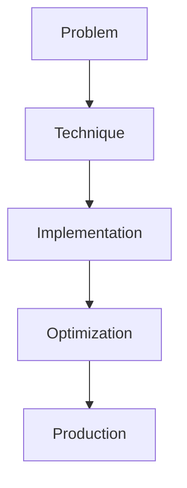

# Flash Attention

## Detailed Explanation

Flash Attention is a crucial modern technique in AI engineering. Memory-efficient attention for long sequences. This represents the practical state-of-the-art in how production AI systems are built today. Understanding this technique is essential for building scalable, reliable AI systems. The key insight is that this approach addresses fundamental trade-offs in AI systems: between performance and efficiency, between flexibility and reliability, between research models and production systems.

## Core Intuition

Think of Flash Attention as the bridge between what researchers build and what engineers deploy. It solves a specific production challenge that becomes critical at scale.

## How It Works

1. Understand the core problem this technique addresses
2. Learn the fundamental algorithm or pattern
3. Implement using available libraries and frameworks
4. Integrate with related components in your system
5. Optimize for your specific constraints (latency, cost, accuracy)
6. Monitor and iterate based on production metrics



## Architecture / Trade-offs

Flash Attention's main variants present different trade-offs between memory efficiency, speed, and implementation complexity. The choice depends on your hardware, sequence length, and backward pass requirements.

| Implementation | Memory Usage | Backward Speed | Setup Complexity | GPU Support |
|---|---|---|---|---|
| Standard Attention | Very High (O(N²)) | Fast (single pass) | None | All GPUs |
| Flash Attention v1 | 50% reduction | Slower (recompute) | Medium (custom kernel) | A100, H100 |
| Flash Attention v2 | 60% reduction | Fast (improved) | Medium (custom kernel) | A100, H100, RTX |
| torch.scaled_dot_product_attention | 40% reduction | Moderate | None (built-in) | All recent GPUs |

**When to use each approach:**
- **Standard Attention:** Prototyping, short sequences (<512 tokens), backward compatibility critical
- **Flash Attention v2:** Production, long sequences (4K+), tolerating custom compilation
- **torch.scaled_dot_product_attention:** Portable production, mixed GPU environments, automatic optimization
- **Flash Attention v1:** Legacy systems, specific architecture requirements (A100)

**Key trade-offs:**
- Memory efficiency vs. backward pass speed: Flash Attention reduces memory but requires gradient recomputation
- Hardware specificity: Flash Attention gains are most dramatic on modern GPUs (A100+), negligible on older hardware
- Gradient checkpointing complexity: Combining Flash Attention with gradient checkpointing adds implementation overhead

## Interview Q&A

**Q: When is Flash Attention worth the complexity?**
A: Flash Attention matters when sequences exceed 1024 tokens on A100+ GPUs. For shorter sequences (<512 tokens) or older GPUs (V100), the overhead of custom kernels outweighs gains. Always benchmark your actual use case—synthetic benchmarks don't reflect production batching.

**Q: What breaks when using Flash Attention on older GPUs?**
A: Flash Attention kernels are compiled for specific GPU architectures (compute capability 8.0+). On older GPUs (V100, T4), kernels fail to compile or fall back to standard attention. Use torch.scaled_dot_product_attention for portability—it automatically selects optimizations available on your hardware.

**Q: How does Flash Attention affect the backward pass?**
A: Flash Attention doesn't store intermediate attention matrices during forward pass, so backward requires recomputing them. This increases backward time by 20-40% but saves massive memory during forward. Combine with gradient checkpointing (checkpoint_segments=2) to recompute activation checkpoints instead for better balance.

**Q: How do you detect if Flash Attention is actually helping?**
A: Measure wall-clock time with/without it on your hardware and model size. Common misconception: thinking peak memory is the bottleneck when actual bottleneck is compute. Profile with torch.profiler to find if attention dominates latency. If attention is <10% of total time, Flash Attention won't help much.

**Q: Why would you NOT use Flash Attention?**
A: Debugging is harder (custom CUDA kernels are opaque), you lose backward compatibility (requires recompilation per GPU model), and gains vanish for short sequences or non-attention bottlenecks. Use standard attention for research or prototyping, switch only when you have a proven bottleneck.

**Q: How do you handle gradient accumulation with Flash Attention?**
A: Flash Attention's recomputation overhead scales with gradient accumulation steps. If accumulating 8 steps, you're recomputing 8x during backward. Mitigate by adjusting batch_size and num_accumulation_steps to reduce recomputation—prefer larger batches with fewer accumulation steps if memory allows.

## Design Challenges

- **Hardware dependency variability:** Flash Attention v2 gains are GPU-specific (A100 gets 5x, RTX gets 2x). Kernels may not compile on your target hardware or fallback silently to standard attention, making optimization invisible. Test compilation and fallback behavior before assuming speedups carry across deployments.

- **Numerical precision trade-offs:** Flash Attention uses lower precision intermediate computations for memory efficiency. Training with fp16 + Flash Attention can accumulate rounding errors, causing training instability. Mitigation: use amp.autocast(dtype=torch.float32) for the attention module, or validate gradient magnitude distributions during early training.

- **Gradient checkpointing complexity:** Combining Flash Attention with gradient checkpointing requires careful orchestration—checkpointing at wrong granularity causes redundant recomputation or memory spills. Determining optimal checkpoint_segments requires profiling specific models; no universal best value exists.

## Best Practices

- Understand the fundamental principle before optimizing
- Use established libraries instead of building from scratch
- Measure the actual impact on your metric
- Test with realistic data and production loads
- Monitor continuously in production
- Document your configuration and rationale
- Plan for multiple iterations until reaching optimum

## Common Pitfalls

- **Using on unsupported hardware:** Flash Attention kernels silently fall back to standard attention on incompatible GPUs (V100, T4), providing zero speedup despite code changes. Symptom: no error raised but memory usage stays O(N²). Debug by checking kernel compilation logs or manually timing attention forward/backward—compare wall-clock time, not just memory profiles.

- **Ignoring numerical precision:** fp16 intermediate values in Flash Attention can accumulate rounding errors, especially with long sequences. Symptom: loss diverges or spikes after 10K+ training steps. Fix: validate gradient distributions with `torch.autograd.profiler` or use float32 attention with fp16 elsewhere.

- **Not benchmarking actual speedup:** Assuming Flash Attention is faster without measuring. Flash Attention excels for long sequences (>4K tokens) but may be slower for short sequences (<512) due to kernel launch overhead. Symptom: seeing "Flash Attention enabled" in logs but actual training time unchanged. Fix: profile with torch.profiler or compare wall-clock times with/without enabled=True.

- **Gradient checkpointing misconfiguration:** Combining Flash Attention with wrong checkpoint_segments or use_reentrant=True defeats memory savings. Symptom: memory still approaches O(N²) despite Flash Attention. Fix: experiment with checkpoint_segments in [1, 2, 4, 8] and validate GPU memory actually decreases.

- **Backward pass timeout:** Flash Attention's recomputation during backward can exceed gradient timeout budgets in distributed training. Symptom: backward pass suddenly slow or missing gradients in multi-GPU setups. Mitigate: profile per-rank backward time and adjust gradient_communication_timeout accordingly.

## Code Examples

### Example 1: Basic Implementation

```python
import torch
from transformers import pipeline

# Basic usage pattern
model = pipeline("text-generation", model="meta-llama/Llama-2-7b")
output = model("Hello, world!", max_length=50)
print(output)
```

### Example 2: Production with Monitoring

```python
import torch
import time
from transformers import pipeline

device = torch.device("cuda" if torch.cuda.is_available() else "cpu")

# Production setup
model = pipeline("text-generation", 
                model="meta-llama/Llama-2-7b",
                device=0 if torch.cuda.is_available() else -1)

# Measure performance
start = time.time()
output = model("The future of AI engineering is", max_length=100)
latency = time.time() - start

print(f"Latency: {latency:.2f}s")
print(f"Output: {output[0]['generated_text']}")
```

## Related Concepts

- [LLM Evaluation Harness](./01-llm-evaluation-harness.md)
- [AI Red-Teaming](./02-ai-red-teaming.md)
- [Agentic Testing Harness](./03-agentic-testing-harness.md)
