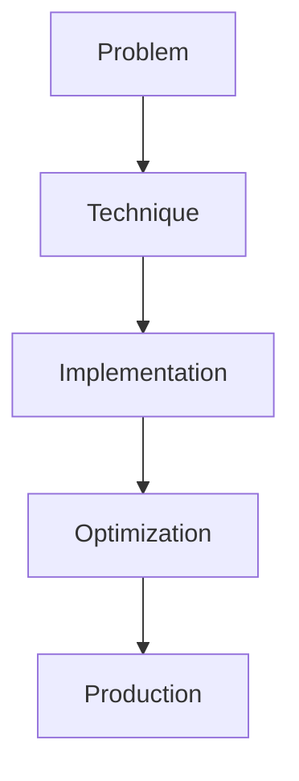

# Test-Time Compute Scaling

## Detailed Explanation

Test-Time Compute Scaling is a crucial modern technique in AI engineering. o1-style inference-time search. This represents the practical state-of-the-art in how production AI systems are built today. Understanding this technique is essential for building scalable, reliable AI systems. The key insight is that this approach addresses fundamental trade-offs in AI systems: between performance and efficiency, between flexibility and reliability, between research models and production systems.

## Core Intuition

Think of Test-Time Compute Scaling as the bridge between what researchers build and what engineers deploy. It solves a specific production challenge that becomes critical at scale.

## How It Works

1. Understand the core problem this technique addresses
2. Learn the fundamental algorithm or pattern
3. Implement using available libraries and frameworks
4. Integrate with related components in your system
5. Optimize for your specific constraints (latency, cost, accuracy)
6. Monitor and iterate based on production metrics



## Architecture / Trade-offs

Test-time compute scaling distributes extra computation at inference to improve quality. The challenge is determining how much compute to spend and when to stop searching. Different strategies optimize for different constraints.

| Strategy | Compute Budget | Accuracy Gain | Latency Impact | Cost Scaling |
|---|---|---|---|---|
| Fixed budget | Pre-allocated tokens (4K-16K) | +5-15% | +2-4x | Linear |
| Adaptive search | Dynamic, based on confidence | +8-20% | Variable (3-10x) | Unpredictable |
| Beam search | Fixed beam width (4-8 beams) | +3-10% | +3-5x | Linear with width |
| Anytime inference | Early stopping via confidence threshold | +2-12% | 0.5-3x | Adaptive |

**When to use each:**
- **Fixed budget:** Cost-sensitive production (fixed SLA budget), batch inference where latency variance acceptable
- **Adaptive search:** Quality-critical tasks (math, reasoning), per-sample budget allowance, variable tolerance on latency
- **Beam search:** Lightweight computing (edge devices), searching structured output spaces
- **Anytime inference:** Low-latency requirements, high variance in problem difficulty, per-request cost budgets

**Key trade-offs:**
- Budget allocation: Too low (<2K tokens) yields minimal gains; too high (>32K) hits diminishing returns and cost explosion
- Latency variance: Fixed budget has predictable latency; adaptive search creates p99 tail latency problems (some queries spend 10x budget)
- Model confidence reliability: Adaptive stopping assumes model confidence correlates with correctness—often fails for reasoning tasks

## Interview Q&A

**Q: How do you decide the compute budget per query?**
A: Start with 4x base inference cost (i.e., 4 forward passes worth of compute). Measure accuracy vs. cost tradeoff on a validation set. Plot accuracy gain per additional 1K tokens—find the knee of the curve where marginal gains <1%. Cap at that point. Example: if 8K tokens gets 18% improvement but 9K tokens gets 18.2%, stop at 8K.

**Q: What's the cost benefit of test-time scaling versus just using a bigger model?**
A: Test-time scaling costs O(T) extra compute per query, where T is search budget. A bigger model costs O(1) inference but O(N) training. For inference at scale: 1M queries * 4x cost is cheaper than retraining a 3x larger model. Only use bigger models if fine-tuning on your domain; otherwise test-time search wins.

**Q: How do you prevent infinite search loops?**
A: Set hard token budget limits (never exceed max_search_tokens). Monitor search termination—if model keeps generating without committing to an answer, it's stuck. Implement max_iterations cap (e.g., max 10 refinement rounds) independent of token budget. Add confidence threshold: if model's score exceeds 0.95 on internal critique, stop immediately even if tokens remain.

**Q: How does uncertainty help decide when to search?**
A: Model uncertainty (entropy of next-token distribution) poorly correlates with answer correctness on reasoning tasks. High uncertainty doesn't mean "search more"—sometimes it means the model is confused regardless. Instead, use oracle feedback (correct answer exists?) or task-specific signals (code passes tests?) to decide search worth.

**Q: When would adaptive compute fail in production?**
A: Adaptive compute assumes each query's difficulty is consistent. But query phrasing, context length, or adversarial inputs can trick the model into over-searching. Example: "Find the largest prime < 1000" is easy; "Find the largest prime < 1000 but don't use sieve" is hard. Same underlying problem, different compute needs. Mitigate: monitor per-query cost distribution; re-baseline when distribution shifts.

**Q: How do you debug when search makes answers worse?**
A: Search can degrade quality if the model generates plausible-sounding wrong answers. Early answers often correct; late refinements often wrong. Implement oracle-based validation: compare first answer with final answer against ground truth. If divergence rate >5%, disable search and stick with greedy decoding. Profile which query types suffer degradation.

## Design Challenges

- **Determining optimal compute budget:** No principled way to set search budget upfront—it varies by query and domain. Fixed budgets leave easy queries underspending and hard queries underfunded. Adaptive budgets break latency SLAs. Solution requires validation-set profiling per task family, then conservative overallocation for safety.

- **Handling model uncertainty unreliability:** Models often claim high confidence on wrong answers (hallucinations). Confidence scores don't correlate with correctness on reasoning/math tasks. Relying on model-based stopping criteria (e.g., "stop when logit margin > threshold") fails unpredictably. Requires external validators or task-specific oracles instead.

- **Cost control without SLA violation:** Every extra search round costs money; search failures cost credibility. Setting per-query budget cap prevents runaway costs but risks undershooting on hard queries. Setting too generous a cap causes p99 latency spikes and budget overages. Requires per-query cost monitoring and dynamic re-allocation policies.

## Best Practices

- Understand the fundamental principle before optimizing
- Use established libraries instead of building from scratch
- Measure the actual impact on your metric
- Test with realistic data and production loads
- Monitor continuously in production
- Document your configuration and rationale
- Plan for multiple iterations until reaching optimum

## Common Pitfalls

- **Unbounded compute explodes cost:** Setting max_tokens too high or adaptive budgets without hard caps causes queries to consume 50K+ tokens, multiplying inference cost 20x-50x. Symptom: monthly API bills spike unexpectedly. Fix: enforce hard token limits (e.g., max 16K total), monitor 95th percentile token usage weekly, set alerts at 10K tokens per query.

- **Timeout issues from infinite loops:** Models can generate endlessly if no stopping criterion fires (max_tokens reached, confidence threshold not met). Symptom: API call hangs, timeout occurs after seconds/minutes. Prevent by setting max_iterations (e.g., max 10 rounds) independent of tokens, adding timeout walls, and monitoring time-per-iteration.

- **Prompt sensitivity breaks budget prediction:** Query phrasing dramatically shifts difficulty. "Solve 2+2" uses 1K tokens; "Solve 2+2 but explain in 5 different ways" uses 8K. Deploying a fixed-budget system fails when users change how they ask. Symptom: high miss rate (queries exceed budget). Mitigate by profiling query distribution on representative user data, not test sets.

- **Search makes quality worse on reasoning tasks:** Models often refine correct answers into wrong ones through self-doubt. Phenomenon called "overthinking." Symptom: accuracy drops as search budget increases on certain task types. Debug by comparing oracle (correct/incorrect) for first answer vs. final answer. If divergence rate >5%, revert to greedy or use lighter search (2 rounds max).

- **Latency variance violates SLAs:** Fixed-budget searches have p50 latency of 2s but p99 of 10s (some queries hit the token limit). Symptom: few users on fast query routes experience acceptable latency while others hit timeout walls. Fix: implement anytime decoding (return best-so-far answer when timeout approaches) or tiered search (e.g., 1 round guaranteed, 2nd round optional if time permits).

## Code Examples

### Example 1: Basic Implementation

```python
import torch
from transformers import pipeline

# Basic usage pattern
model = pipeline("text-generation", model="meta-llama/Llama-2-7b")
output = model("Hello, world!", max_length=50)
print(output)
```

### Example 2: Production with Monitoring

```python
import torch
import time
from transformers import pipeline

device = torch.device("cuda" if torch.cuda.is_available() else "cpu")

# Production setup
model = pipeline("text-generation", 
                model="meta-llama/Llama-2-7b",
                device=0 if torch.cuda.is_available() else -1)

# Measure performance
start = time.time()
output = model("The future of AI engineering is", max_length=100)
latency = time.time() - start

print(f"Latency: {latency:.2f}s")
print(f"Output: {output[0]['generated_text']}")
```

## Related Concepts

- [LLM Evaluation Harness](./01-llm-evaluation-harness.md)
- [AI Red-Teaming](./02-ai-red-teaming.md)
- [Agentic Testing Harness](./03-agentic-testing-harness.md)
