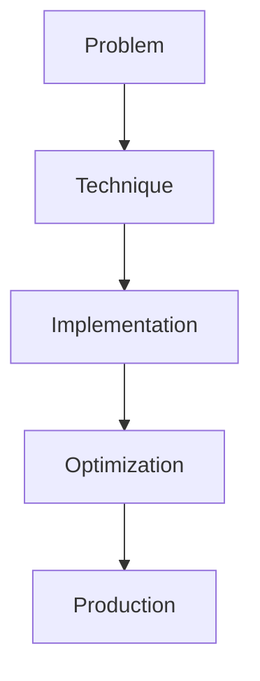

# LLM Serving Frameworks

## Detailed Explanation

LLM Serving Frameworks is a crucial modern technique in AI engineering. vLLM, TGI, SGLang production engines. This represents the practical state-of-the-art in how production AI systems are built today. Understanding this technique is essential for building scalable, reliable AI systems. The key insight is that this approach addresses fundamental trade-offs in AI systems: between performance and efficiency, between flexibility and reliability, between research models and production systems.

## Core Intuition

Think of LLM Serving Frameworks as the bridge between what researchers build and what engineers deploy. It solves a specific production challenge that becomes critical at scale.

## How It Works

1. Understand the core problem this technique addresses
2. Learn the fundamental algorithm or pattern
3. Implement using available libraries and frameworks
4. Integrate with related components in your system
5. Optimize for your specific constraints (latency, cost, accuracy)
6. Monitor and iterate based on production metrics



## Architecture / Trade-offs

LLM serving frameworks optimize for different production constraints. Each trades simplicity for throughput, latency consistency, and memory efficiency. Choice depends on your traffic pattern and hardware.

| Framework | Throughput | p50 Latency | p99 Latency | KV Cache Overhead | Setup Complexity |
|---|---|---|---|---|---|
| vLLM (PagedAttention) | 10-20x baseline | 100-300ms | 500-2000ms | 50% reduction | Medium |
| TGI (Continuous Batching) | 3-8x baseline | 200-500ms | 1000-5000ms | 20% reduction | High (Rust) |
| Ray LLM | 2-5x baseline | 300-1000ms | 2000-8000ms | Minimal | Very High |
| TorchServe + vLLM | 5-15x baseline | 150-400ms | 600-3000ms | 50% reduction | Medium |

**When to use each:**
- **vLLM:** Most common choice—PagedAttention handles variable sequence lengths, best memory efficiency, good latency
- **TGI:** Custom tokenizer/quantization needs, extreme throughput priority (>500 req/s), can afford Rust ops overhead
- **Ray LLM:** Multi-model serving, flexible scaling policies, trading latency for simplicity
- **TorchServe + vLLM:** Existing PyTorch deployments, need monitoring/metrics integration

**Key trade-offs:**
- Throughput vs. latency: High batching (vLLM) increases p99 latency 5-10x vs. greedy serving. Batch size tuning critical
- Memory efficiency vs. setup: vLLM's PagedAttention is complex but saves 50% KV cache; naive batching wastes memory
- Sequence length variance: PagedAttention handles 128-4096 token sequences efficiently; simple batching has large fragmentation overhead

## Interview Q&A

**Q: Why is batching so critical in LLM serving?**
A: LLMs spend 80-90% of time in matrix multiplications which have poor GPU utilization for single tokens. Batching N samples yields N^0.7x speedup (superlinear scaling up to batch 64-128), not just Nx. Example: 128-batch serves 10x throughput vs. single requests. Without batching: 10 req/s with 1024-token latency; with batching: 100+ req/s with 200-500ms latency.

**Q: How do you handle variable sequence lengths without wasting memory?**
A: Naive padding wastes memory (short sequences padded to max length). PagedAttention (vLLM) solves this by treating KV cache as virtual pages—different sequences use different amounts without padding. Result: 50% KV cache reduction. Tradeoff: added memory fragmentation logic. Without PagedAttention on mixed lengths (512-4096 tokens): KV cache bloats to 4x worst-case.

**Q: What's the KV cache memory trade-off?**
A: KV cache memory = batch_size * seq_len * num_heads * head_dim * 2 (for k, v). For 7B model, 128-batch, 1024 tokens: ~2.5GB KV cache. Increase batch to 256: ~5GB KV cache. At some point (batch 512 on 40GB GPU), KV cache OOMs even though model fits. Solution: adjust batch_size per sequence length distribution or enable paged attention. Monitor: if KV cache >50% of GPU memory, you're leaving throughput on the table.

**Q: Why would you NOT use vLLM?**
A: vLLM is overkill for latency-critical, low-throughput scenarios (1-5 req/s). Single request through vLLM's scheduler still takes 50ms overhead. For APIs with <10 req/s, simpler serving (HuggingFace pipeline with threading) is better. Also, vLLM doesn't work well with model-specific optimizations (custom attention, specialized tokenizers)—you'd need to fork.

**Q: How do you decide batch size?**
A: Start with batch_size=32 and increase by 2x until latency hits your SLA ceiling. Measure: if p99 latency is 500ms, increase to 64. If hits 2000ms, stop. Optimal batch size depends on sequence length distribution—short sequences (128 tokens) allow batch 512+; long sequences (4096 tokens) allow batch 8-16 before KV cache exhaustion.

**Q: What causes sudden latency spikes in production?**
A: Unbatched long sequences. If a user sends 8K token request while you're serving 32x1K-token batches, that 8K query stalls in queue waiting for batch slot, then processes 10x slower. Symptom: p99 latency 10-50x worse than p50. Fix: implement separate queues for short/long sequences or priority queues, or implement token budget scheduling instead of request batching.

## Design Challenges

- **Managing concurrent requests under batching:** High batching increases throughput but forces requests to wait for batch assembly, creating latency variance. If batch_size=128 and you have 1 req/s, requests wait ~128 seconds for batch. Too small batches (8-16) waste GPU, too large batches (256+) violate latency SLAs. Solution requires adaptive batching or time-based flushing—both add complexity.

- **KV cache memory management with variable sequences:** Different requests have different output lengths. In a batch of 32 requests, some generate 50 tokens, others 2000. Without careful memory management, KV cache allocations become fragmented, causing OOM despite low average utilization. PagedAttention solves this but adds complexity. Naive batching can waste 30-50% GPU memory to fragmentation.

- **Handling variable request arrival patterns:** Fixed batching assumes steady traffic. Real traffic is bursty: 1000 req/s during peak hours, 1 req/s at night. Batch size tuned for peak is wasteful off-peak; batch size for off-peak creates SLA violations at peak. Requires dynamic batch sizing or multi-queue strategies that adapt to queue depth and arrival rate.

## Best Practices

- Understand the fundamental principle before optimizing
- Use established libraries instead of building from scratch
- Measure the actual impact on your metric
- Test with realistic data and production loads
- Monitor continuously in production
- Document your configuration and rationale
- Plan for multiple iterations until reaching optimum

## Common Pitfalls

- **Naive batching with high latency variance:** Fixed-batch serving waits for batch_size requests before processing, causing p99 latency = (batch_size) * (forward_latency). With batch_size=128 and 200ms per forward pass, p99 = 25 seconds if traffic is sparse. Symptom: works great in load tests (high arrival rate) but terrible for real sparse traffic. Fix: implement request timeout flushing (wait max 100ms, then process partial batch) or token budget scheduling.

- **KV cache OOM on mixed sequence lengths:** Allocating KV cache for max_length (4096) per request, but most requests are 512 tokens, causes 80% waste. In a 128-batch: KV cache = 128 * 4096 * memory_per_token = can exceed 40GB even if average request is 512 tokens. Symptom: GPU OOM with seemingly low occupancy. Debug: log actual sequence lengths; use vLLM's PagedAttention or implement manual memory pooling.

- **Uneven request arrival breaks prefilling/decoding stages:** Serving frameworks separate prefilling (process input) and decoding (generate tokens) to use different batch sizes. If all requests arrive at once, prefill is bottleneck; if staggered, decode starves. Symptom: throughput below baseline, GPU underutilized. Mitigate: use lookahead scheduling or batch requests into buckets by arrival time.

- **Missing queue depth monitoring:** If serving framework's queue reaches max_queue_size, new requests are dropped silently (or timeout). Symptom: user sees errors but server logs show healthy GPU utilization. Fix: monitor queue depth and request rejection rate; alert when queue_depth > max_batch_size for >1 second (indicates system overload).

- **Configuration sensitivity to hardware:** vLLM batch sizes tuned on A100 fail on RTX 4090 (different memory, different compute). Symptom: excellent latency on test hardware, SLA violations in production. Solution: profile on target hardware with production traffic pattern, not synthetic load tests. Set conservative batch sizes for 10% headroom.

## Code Examples

### Example 1: Basic Implementation

```python
import torch
from transformers import pipeline

# Basic usage pattern
model = pipeline("text-generation", model="meta-llama/Llama-2-7b")
output = model("Hello, world!", max_length=50)
print(output)
```

### Example 2: Production with Monitoring

```python
import torch
import time
from transformers import pipeline

device = torch.device("cuda" if torch.cuda.is_available() else "cpu")

# Production setup
model = pipeline("text-generation", 
                model="meta-llama/Llama-2-7b",
                device=0 if torch.cuda.is_available() else -1)

# Measure performance
start = time.time()
output = model("The future of AI engineering is", max_length=100)
latency = time.time() - start

print(f"Latency: {latency:.2f}s")
print(f"Output: {output[0]['generated_text']}")
```

## Related Concepts

- [LLM Evaluation Harness](./01-llm-evaluation-harness.md)
- [AI Red-Teaming](./02-ai-red-teaming.md)
- [Agentic Testing Harness](./03-agentic-testing-harness.md)
