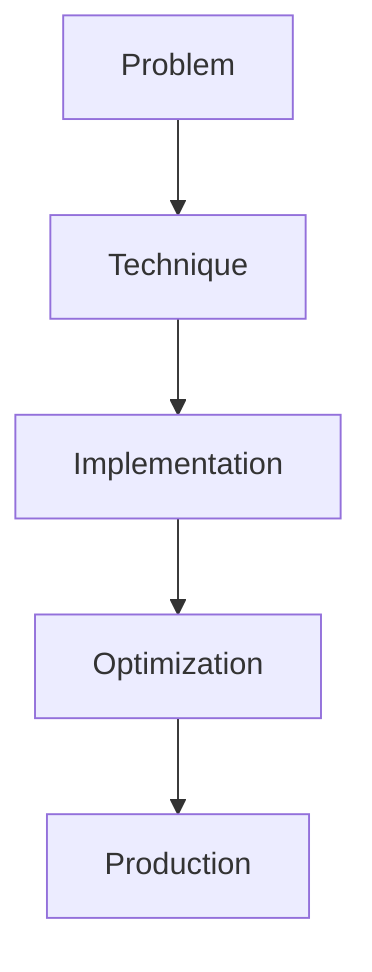

# Structured Generation

## Detailed Explanation

Structured Generation is a crucial modern technique in AI engineering. Constrained JSON, grammar, regex output. This represents the practical state-of-the-art in how production AI systems are built today. Understanding this technique is essential for building scalable, reliable AI systems. The key insight is that this approach addresses fundamental trade-offs in AI systems: between performance and efficiency, between flexibility and reliability, between research models and production systems.

## Core Intuition

Think of Structured Generation as the bridge between what researchers build and what engineers deploy. It solves a specific production challenge that becomes critical at scale.

## How It Works

1. Understand the core problem this technique addresses
2. Learn the fundamental algorithm or pattern
3. Implement using available libraries and frameworks
4. Integrate with related components in your system
5. Optimize for your specific constraints (latency, cost, accuracy)
6. Monitor and iterate based on production metrics



## Architecture / Trade-offs

Structured generation enforces output format through different constraint mechanisms. Each trades flexibility for strictness, speed, and error handling guarantees.

| Constraint Type | Format Guarantee | Speed Overhead | Flexibility | Error Handling | Use Case |
|---|---|---|---|---|---|
| JSON Schema | 100% valid JSON | 5-15% slower | Medium (schema-defined keys) | All invalid outputs rejected | APIs, data pipelines |
| Grammar-Guided | Grammar compliance | 10-20% slower | High (EBNF flexibility) | Custom rules in grammar | Domain-specific formats |
| Regex Constraints | Pattern matching | 2-5% slower | Low (limited to patterns) | Rejections on mismatch | Simple formats (dates, IDs) |
| Token Masking | Vocabulary constraints | <1% overhead | Low (limited tokens) | Rejects invalid tokens | Code generation, SQL |

**When to use each:**
- **JSON Schema:** REST APIs, LLM-to-LLM chains, database inserts—need guaranteed schema validity
- **Grammar-Guided:** Complex formats (YAML, HTML, domain DSLs), programmatic validation rules
- **Regex:** Simple patterns (dates, phone numbers, URLs), where schema is overkill
- **Token masking:** Code gen, SQL generation, controlled vocabulary (multiple choice)

**Key trade-offs:**
- Strictness vs. expressiveness: JSON Schema is strict (rejects all invalid) but limits output diversity; grammar allows custom rules but needs careful design to avoid deadlocks
- Speed vs. guarantee: Token masking is fastest but coarsest control; grammar-guided gives fine control but slower
- Error recovery: JSON Schema fails hard (invalid output); grammar can guide away from errors if well-designed

## Interview Q&A

**Q: When would you use JSON Schema vs. Grammar-Guided constraints?**
A: JSON Schema when output is pure JSON with defined fields (APIs, data collection). Grammar-guided when you need custom rules (e.g., "price must be >0", "category must be from list X", or non-JSON formats). Grammar is more expressive but requires careful design to avoid deadlock states where no valid token exists. For APIs, always prefer JSON Schema—simpler, faster, guaranteed validity.

**Q: How do you handle constraint violations gracefully?**
A: Strict constraint: invalid output is rejected and re-sampled (costs extra tokens/latency). Soft constraint: generate unconstrained, then post-process/correct invalid parts. Example: JSON Schema rejects malformed JSON; regex-based post-processor fixes it. Tradeoff: strict gives 100% valid outputs but slower; soft is faster but can corrupt data. Choose based on downstream tolerance (APIs need strict; summarization can be soft).

**Q: What's the performance overhead of constraint checking?**
A: Token masking: <1% overhead (happens in softmax). Regex: 2-5% (per-token pattern matching). JSON Schema: 5-15% (token-by-token validity tracking). Grammar: 10-20% (maintaining parse state). For 100 token generation: regex adds 2-5 tokens latency, grammar adds 10-20 tokens. At inference scale (100K tokens/sec), 15% overhead = 15K tokens/sec wasted on validation. Budget accordingly.

**Q: What breaks if your constraint is too strict?**
A: Model gets stuck in states where no valid next token exists (grammar deadlock). Example: "must output exactly 3 array elements" but model wants to stop at 2. Symptom: generation loops or times out. Debug: check grammar for unreachable states. Solution: loosen constraints (e.g., "3-5 elements") or implement fallback (if no valid token, relax constraint dynamically).

**Q: How do you prevent prompt injection in constraints?**
A: User prompt could include instructions to break constraints: "Output any JSON: {...}" in user input might trick model. Solution: separate constraint definitions from user data (never build grammar from user strings). Example: don't construct regex dynamically from user input. Use pre-defined, validated constraint templates instead.

**Q: When is constraint checking slower than re-sampling?**
A: If constraints are very restrictive (e.g., only 10 valid tokens at each step), constraint checking per token is fast but model struggles to generate valid output (requires retries). Sometimes un-constrained generation + post-processing is faster. Example: "must output valid Python code" constrained is slow (many deadlock states); un-constrained + linter fixing is faster. Measure on your task.

## Design Challenges

- **Constraint validation deadlock states:** Grammar or schema constraints can reach states where no valid next token exists. Example: "must output exactly 3 items" but model generates 2 and tries to stop. Symptom: generation hangs or produces invalid output. Avoiding this requires careful constraint design (allow flexibility, validate post-hoc) or implementing automatic constraint relaxation when deadlock detected.

- **Prompt injection through constraints:** User inputs in constraint definitions (e.g., building regex from user keywords) allow adversarial users to craft prompts that violate constraints intentionally. Example: "category must be in [A, B]" but user appends "or anything" to user text. Solution requires separating constraint definitions from user data; all constraints pre-defined and validated.

- **Performance overhead growing with constraint complexity:** Simple regex (2-5% overhead) vs. complex grammar (15-25% overhead) vs. full schema validation (10-15% per step). With streaming generation, overhead multiplies over 1000+ tokens. At inference scale, 15% overhead per token is significant. Requires profiling actual constraint overhead on target model and hardware, not synthetic benchmarks.

## Best Practices

- Understand the fundamental principle before optimizing
- Use established libraries instead of building from scratch
- Measure the actual impact on your metric
- Test with realistic data and production loads
- Monitor continuously in production
- Document your configuration and rationale
- Plan for multiple iterations until reaching optimum

## Common Pitfalls

- **Constraints too strict causing rejections:** Overly strict JSON schema (e.g., enum with 3 values only) causes model to repeatedly try invalid tokens, hitting max_length without valid output. Symptom: high failure rate, requests timeout. Example: "category must be [A, B, C]" but model wants D. Fix: loosen constraints slightly, make fields optional, or implement intelligent retry with relaxed schema.

- **Overly permissive constraints passing invalid outputs:** Constraints too loose (e.g., "contains JSON-like content" without validation) let garbage through. Symptom: downstream systems break on invalid data despite "structured" output. Example: JSON schema validation disabled to allow flexibility. Fix: validate strictly at generation time, not later—post-hoc validation is slow and loses opportunity to re-generate.

- **Performance cliff from constraint checking:** Constraint validation is fast until scale hits. Single inference token with regex: negligible. 1000 tokens per request * 1000 requests/sec = 1M validation operations/sec can saturate CPU. Symptom: latency spikes when throughput increases. Mitigate: profile constraint overhead at target scale, implement batched validation, or move constraint checking to accelerator.

- **Grammar deadlock from unreachable states:** Well-intentioned grammar rules can create scenarios where no token satisfies them. Example: "array of 3 items, each with id>0" but model generates item with id=0. Symptom: generation gets stuck in retry loop or outputs invalid JSON to escape. Debug by checking grammar coverage—use grammar visualizers (graphviz) to find unreachable paths. Solution: test grammar on representative outputs before deployment.

- **Ignoring model tendency to violate soft constraints:** Post-hoc constraint enforcement ("generate freely, then fix") assumes violations are rare. But unconstrained models violate soft constraints 20-50% of the time on complex formats. Symptom: constant post-processing overhead. Solution: use hard constraints (token masking, JSON schema) upstream rather than fixing after generation.

## Code Examples

### Example 1: Basic Implementation

```python
import torch
from transformers import pipeline

# Basic usage pattern
model = pipeline("text-generation", model="meta-llama/Llama-2-7b")
output = model("Hello, world!", max_length=50)
print(output)
```

### Example 2: Production with Monitoring

```python
import torch
import time
from transformers import pipeline

device = torch.device("cuda" if torch.cuda.is_available() else "cpu")

# Production setup
model = pipeline("text-generation", 
                model="meta-llama/Llama-2-7b",
                device=0 if torch.cuda.is_available() else -1)

# Measure performance
start = time.time()
output = model("The future of AI engineering is", max_length=100)
latency = time.time() - start

print(f"Latency: {latency:.2f}s")
print(f"Output: {output[0]['generated_text']}")
```

## Related Concepts

- [LLM Evaluation Harness](./01-llm-evaluation-harness.md)
- [AI Red-Teaming](./02-ai-red-teaming.md)
- [Agentic Testing Harness](./03-agentic-testing-harness.md)
