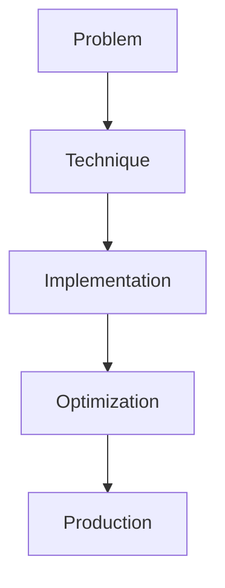

# Reflexion & Self-Critique

## Detailed Explanation

Reflexion & Self-Critique is a crucial modern technique in AI engineering. SELF-RAG, critique loops. This represents the practical state-of-the-art in how production AI systems are built today. Understanding this technique is essential for building scalable, reliable AI systems. The key insight is that this approach addresses fundamental trade-offs in AI systems: between performance and efficiency, between flexibility and reliability, between research models and production systems.

## Core Intuition

Think of Reflexion & Self-Critique as the bridge between what researchers build and what engineers deploy. It solves a specific production challenge that becomes critical at scale.

## How It Works

1. Understand the core problem this technique addresses
2. Learn the fundamental algorithm or pattern
3. Implement using available libraries and frameworks
4. Integrate with related components in your system
5. Optimize for your specific constraints (latency, cost, accuracy)
6. Monitor and iterate based on production metrics



## Architecture / Trade-offs

Reflexion systems use different feedback sources to improve outputs. Each trades cost, latency, and feedback quality. The key challenge is getting reliable signals to refine answers.

| Feedback Source | Feedback Quality | Cost | Latency | Reliability | Use Case |
|---|---|---|---|---|---|
| Rule-Based (checksum, syntax) | Low (format only) | Minimal | 0ms (inline) | 100% deterministic | Code gen, JSON validation |
| Model-Based (LLM critique) | Medium (broad but noisy) | 2x inference cost | 2x latency | 60-80% accurate | Question answering, reasoning |
| Oracle (ground truth) | High (exact) | Variable | 0-500ms | 100% accurate | Testing, offline refinement |
| Execution (run code/API) | High (functional) | Code-dependent | 100-5000ms | 100% on success | Code gen, SQL, API calls |

**When to use each:**
- **Rule-based:** Quick filtering (reject obvious errors), gating before expensive refinement
- **Model-based:** When no oracle available, need broad feedback, willing to accept some noise
- **Oracle:** Test harnesses, offline batch refinement, user-provided correct answers
- **Execution:** Code generation, SQL, anything with deterministic correctness signal

**Key trade-offs:**
- Cost explosion: Oracle/execution feedback costs 2-10x base inference; model feedback costs 2x but can be noisy
- Feedback reliability: Rule-based is deterministic but limited; model feedback is rich but unreliable; oracle is perfect but expensive
- Latency variance: Model feedback adds streaming latency; execution adds network latency; rule-based is free

## Interview Q&A

**Q: How do you prevent infinite critique loops?**
A: Set max_refinement_rounds hard limit (e.g., max 3 iterations). Monitor if feedback is improving output—if iteration N produces same score as N-1, stop. Implement "last mile" detection: if first answer has >90% confidence and refinement keeps it similar, accept first answer. Example: math problem solved correctly on first try—critique usually makes it wrong.

**Q: When is model feedback better than oracle feedback?**
A: Never for accuracy (oracle is ground truth). Model feedback is better only for cost: oracle feedback costs API calls (expensive); model feedback is free (uses your models). Tradeoff: model feedback is 20-40% less reliable. Use model feedback for low-stakes refinement (improve clarity); oracle feedback for high-stakes (verify correctness).

**Q: How do you debug when critique makes things worse?**
A: Critique degradation happens when model is confused by its own output ("thinking in circles"). First, validate the critic model is correct—test its feedback on known good/bad examples. Second, check if critique is contradicting the base model—if so, the two models disagree fundamentally. Solution: either retrain critic to align with base, or disable refinement and accept base output degradation.

**Q: What signals indicate the critique loop is working?**
A: Measure baseline accuracy vs. after 1 refinement vs. after 2 refinements. Good loop: accuracy improves 5-15% with each round, plateaus after 2-3 rounds. Bad loop: accuracy fluctuates randomly or gets worse. Plot the accuracy curve—if monotonic increasing then plateauing, you have a working loop; if noisy or decreasing, disable refinement.

**Q: How do you handle critique failures (critic says answer is wrong when it's correct)?**
A: Implement oracle validation on test set: compare critic's assessment with ground truth. If critic accuracy <90%, don't use it (will degrade production accuracy). Example: critic says "2+2=5 is wrong" correctly, but says "LLM safety is important is wrong" (hallucination). Detect by logging all critiques and checking agreement with oracle on sample.

**Q: What's the cost tradeoff of multiple refinement rounds?**
A: Each round = 1 base inference + 1 critic inference + optional execution test = 2-3x base cost. With 3 rounds: 6-9x cost for potential 10-20% accuracy gain. Only worth it for high-value tasks. Example: customer support (low cost per query) can afford 3 rounds; real-time inference (cost-sensitive) should do 1 round max.

## Design Challenges

- **Feedback loop consistency failure:** Model feedback is often inconsistent—the critic agrees with version A, but disagrees with refinement of A. Root cause: base model and critic model disagree fundamentally on what "good" means. Symptom: loop never converges, keeps changing output without improving. Solution requires either retraining critic to align with base model, or accepting degradation.

- **Infinite refinement loops:** Without clear stopping criteria, loops can run forever if feedback keeps suggesting changes. Example: model refines answer, critic finds issue, model refines again, loop repeats. Hard to detect because latency keeps increasing without bounded termination. Requires external timeout + confidence-based early stopping + validation that recent iterations are improving score.

- **Cost explosion preventing deployment:** Reflexion's multi-round design multiplies inference cost (each round = base + critic + maybe execution = 2-10x). At scale (1M queries/day), cost becomes prohibitive. Requires careful budgeting: which tasks benefit most from refinement, which should skip it. Example: FAQ queries (deterministic) don't benefit; complex reasoning queries do.

## Best Practices

- Understand the fundamental principle before optimizing
- Use established libraries instead of building from scratch
- Measure the actual impact on your metric
- Test with realistic data and production loads
- Monitor continuously in production
- Document your configuration and rationale
- Plan for multiple iterations until reaching optimum

## Common Pitfalls

- **Critique worse than original:** Reflexion loops can degrade quality if the critic model is weaker than the base model or gives conflicting feedback. Symptom: after refinement, accuracy drops 5-10% vs. no refinement. Example: base model gets 85% accuracy; critic suggests changes that drop it to 78%. Debug by measuring accuracy before/after each round. If degrading, disable critique and stick with base output.

- **Infinite refinement loops:** No clear stopping criterion causes loops to run indefinitely. Symptom: requests timeout, cost explodes. Example: critic keeps finding issues, model keeps refining, never satisfied. Fix: hard max_iterations cap (e.g., max 3 rounds), confidence threshold (if score >0.95, stop), or time budget (max 5 seconds total per query).

- **Critic agreement failures:** Model feedback inconsistent—same answer critiqued differently in different rounds. Symptom: loop oscillates between two answers, never converges. Root cause: critique model and base model fundamentally misaligned. Validate by testing critic on known good/bad examples; if critic accuracy <90%, don't use it.

- **Cost explosion without benefit:** Enabling 3-round refinement assumes significant accuracy gains. Reality: if first answer is already good (85%+), refinement adds 6x cost for 2% gain. Symptom: monthly bill triples, accuracy improvement not proportional. Solution: use confidence gating—only refine if first answer score <0.7. Skip refinement for high-confidence answers.

- **Monitoring blindness to degradation:** Deployed loops can silently degrade if critic model quality decays (e.g., after fine-tuning, drift over time). Users see wrong answers but logs show "loop completed successfully." Prevent by continuously validating critic accuracy on held-out set, alerting if critic accuracy drops >5% quarter-over-quarter.

## Code Examples

### Example 1: Basic Implementation

```python
import torch
from transformers import pipeline

# Basic usage pattern
model = pipeline("text-generation", model="meta-llama/Llama-2-7b")
output = model("Hello, world!", max_length=50)
print(output)
```

### Example 2: Production with Monitoring

```python
import torch
import time
from transformers import pipeline

device = torch.device("cuda" if torch.cuda.is_available() else "cpu")

# Production setup
model = pipeline("text-generation", 
                model="meta-llama/Llama-2-7b",
                device=0 if torch.cuda.is_available() else -1)

# Measure performance
start = time.time()
output = model("The future of AI engineering is", max_length=100)
latency = time.time() - start

print(f"Latency: {latency:.2f}s")
print(f"Output: {output[0]['generated_text']}")
```

## Related Concepts

- [LLM Evaluation Harness](./01-llm-evaluation-harness.md)
- [AI Red-Teaming](./02-ai-red-teaming.md)
- [Agentic Testing Harness](./03-agentic-testing-harness.md)
