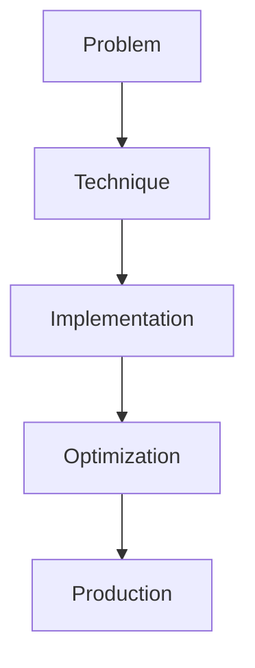

# Chain-of-Draft

## Detailed Explanation

Chain-of-Draft is a crucial modern technique in AI engineering. Scratchpad reasoning, draft-then-refine. This represents the practical state-of-the-art in how production AI systems are built today. Understanding this technique is essential for building scalable, reliable AI systems. The key insight is that this approach addresses fundamental trade-offs in AI systems: between performance and efficiency, between flexibility and reliability, between research models and production systems.

## Core Intuition

Think of Chain-of-Draft as the bridge between what researchers build and what engineers deploy. It solves a specific production challenge that becomes critical at scale.

## How It Works

1. Understand the core problem this technique addresses
2. Learn the fundamental algorithm or pattern
3. Implement using available libraries and frameworks
4. Integrate with related components in your system
5. Optimize for your specific constraints (latency, cost, accuracy)
6. Monitor and iterate based on production metrics



## Architecture / Trade-offs

Chain-of-Draft presents three fundamental reasoning strategies, each optimized for different constraints:

| Strategy | Quality | Latency | Token Cost | Use Case |
|----------|---------|---------|------------|----------|
| Single Pass | Medium (65-75%) | 1x | 1x | Real-time systems, cost-sensitive |
| Draft + Refine | High (80-85%) | 2-3x | 2-3x | Balanced quality/speed, customer-facing |
| Multi-Draft + Select | Very High (90%+) | 4-6x | 4-6x | Critical decisions, offline processing |

**Single Pass** generates one response end-to-end. It's fast and cheap but prone to logical errors and hallucinations on complex tasks. Use this for simple queries where latency matters more than perfect accuracy.

**Draft + Refine** (the core Chain-of-Draft approach) generates an initial draft, then refines or critiques it. This catches logical inconsistencies and improves reasoning without requiring multiple independent passes. It roughly doubles latency but significantly improves quality for mathematical reasoning and code generation.

**Multi-Draft + Selection** generates multiple independent drafts and selects the best via consistency voting or a critic model. This maximizes quality but is expensive and slow. Reserve this for critical use cases like medical diagnosis or legal document analysis.

Trade-off matrix: Draft+Refine often offers the best balance, delivering 25-30% quality improvement for only 2-3x token cost. Single Pass becomes preferable below 500ms latency budgets; Multi-Draft makes sense only when accuracy exceeds 90% requirement.

## Design Challenges

- **Detecting when refinement helps vs hurts:** Refinement can introduce new errors (the model "changes its mind"). You need automated metrics to detect when a revision actually improves reasoning versus when it makes things worse. Consensus metrics (comparing drafts) work, but add latency.

- **Token cost explosion:** Each refinement pass consumes tokens. A task that costs $0.01 in single-pass can cost $0.03-0.06 with refinement. At scale (millions of requests/day), this compounds quickly. Cost estimation requires tracking both generation and refinement token usage separately.

- **Determining stopping criteria:** When do you stop refining? After one revision? Until the model is confident? Until two consecutive passes match? No universal rule exists. Some systems use fixed iterations; others use semantic similarity thresholds. Each approach has failure modes.

- **Measuring actual improvement:** Benchmarks (MATH, HumanEval) show 10-20% gains, but production metrics often differ. A revision that passes a test might still fail on subtle edge cases. You need production-grade evaluation that accounts for partial correctness and downstream errors.

## Interview Q&A

**Q: When is draft-and-refine better than single-shot generation?**
A: Use draft-and-refine for reasoning-heavy tasks (math, code, logic chains) where a second pass catches errors. Single-shot is fine for summarization or creative writing where refinement doesn't add much value. The trade-off is roughly 2-3x tokens for 15-20% quality improvement on MATH/code benchmarks. In practice, measure on your actual task—some domains see 30%+ gains, others see minimal improvement.

**Q: How do you detect when refinement is actually helping?**
A: Compare refinement output against the original using semantic similarity or task-specific metrics. On code, check if refined code passes more test cases. On reasoning, check if both drafts reach the same conclusion (consensus). Watch for "oscillation"—when the model changes its answer multiple times without converging. That's a sign refinement is hurting, not helping.

**Q: What's the token cost tradeoff of using this technique?**
A: Single pass might cost $0.005 per request. Draft+refine is typically 2-3x ($0.01-0.015). Multi-draft selection is 4-6x ($0.02-0.03). For a million requests/day, that's $5K vs $15K vs $30K monthly. Most teams start with draft+refine and only add multi-draft if accuracy requirements justify it. Use a cost multiplier in your router to prevent drafting on high-volume, low-importance queries.

**Q: When would you NOT use this approach?**
A: Skip refinement for latency-critical systems (chat bots need <500ms responses), high-volume low-value queries (search autocomplete), or tasks where model output is already accurate. If your single-pass accuracy is 95%+ and latency is critical, refinement's cost often exceeds benefits.

**Q: How do you handle the case where refinement makes the answer worse?**
A: Always compare refined output to original using a scoring function. If refined quality is lower, return the original. Some systems use an oracle scorer (like GPT-4 judging its own refinement); others use task-specific metrics (test case pass rate for code). Build fallback logic: if refinement diverges from original beyond a threshold, return the safer choice.

**Q: What's a production pattern for managing tokens across multi-step reasoning?**
A: Use a token budget system: allocate tokens for draft (say, 50-70% of budget), then refine with remainder. If the model uses >70% in drafting, skip refinement to stay under total budget. Log token usage per request and per user to identify optimization opportunities. Gating refinement on request complexity (only refine queries above difficulty threshold) also reduces costs.

## Best Practices

- Understand the fundamental principle before optimizing
- Use established libraries instead of building from scratch
- Measure the actual impact on your metric
- Test with realistic data and production loads
- Monitor continuously in production
- Document your configuration and rationale
- Plan for multiple iterations until reaching optimum

## Common Pitfalls

- **Refinement making outputs worse (garbage in = garbage out):** If the initial draft is fundamentally flawed, refinement often reinforces the error rather than fixing it. Example: wrong reasoning path gets "refined" but leads to the same wrong conclusion. Mitigation: use diversity in drafts (temperature > 0) to explore different reasoning paths, or add a consistency check that rejects refinements that diverge too far from the original.

- **Token cost explosion without monitoring:** Each refinement pass costs tokens. Without per-request tracking, costs can 3x without your noticing. Teams have deployed draft+refine systems only to discover $50K/month bills versus expected $10K. Mitigation: log tokens (draft vs refine) separately; implement cost-aware routing that skips refinement for low-value queries; set hard budget caps.

- **No stopping criteria or infinite loops:** Some implementations refine recursively until "confident," leading to variable latency and costs. One request refines once; another refines five times. No clear stopping signal. Mitigation: use fixed iteration counts (refine exactly once or twice), or semantic similarity thresholds (stop if two consecutive drafts agree on key points).

- **Measuring on benchmarks, failing in production:** MATH benchmark shows 20% improvement with draft+refine. Your real user queries (open-ended, ambiguous) see only 2-5% improvement. You've paid 3x tokens for minimal real-world gain. Mitigation: evaluate on representative production data, not just public benchmarks. Include partial-credit metrics (a partially correct refined answer still counts).

- **Not accounting for model-specific behavior:** Refinement works differently across models. Claude refines well; some open-source models degrade on refinement. GPT-4 drafts might be so good that refinement adds little value. Mitigation: benchmark draft vs draft+refine for your specific model. Don't assume patterns from one model transfer.

## Code Examples

### Example 1: Basic Implementation

```python
import torch
from transformers import pipeline

# Basic usage pattern
model = pipeline("text-generation", model="meta-llama/Llama-2-7b")
output = model("Hello, world!", max_length=50)
print(output)
```

### Example 2: Production with Monitoring

```python
import torch
import time
from transformers import pipeline

device = torch.device("cuda" if torch.cuda.is_available() else "cpu")

# Production setup
model = pipeline("text-generation", 
                model="meta-llama/Llama-2-7b",
                device=0 if torch.cuda.is_available() else -1)

# Measure performance
start = time.time()
output = model("The future of AI engineering is", max_length=100)
latency = time.time() - start

print(f"Latency: {latency:.2f}s")
print(f"Output: {output[0]['generated_text']}")
```

## Related Concepts

- [LLM Evaluation Harness](./01-llm-evaluation-harness.md)
- [AI Red-Teaming](./02-ai-red-teaming.md)
- [Agentic Testing Harness](./03-agentic-testing-harness.md)
