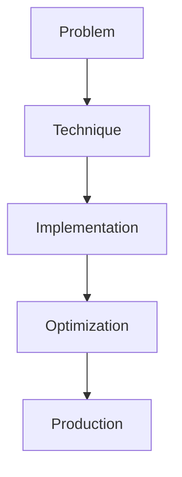

# Continual Learning for LLMs

## Detailed Explanation

Continual Learning for LLMs is a crucial modern technique in AI engineering. Learning without catastrophic forgetting. This represents the practical state-of-the-art in how production AI systems are built today. Understanding this technique is essential for building scalable, reliable AI systems. The key insight is that this approach addresses fundamental trade-offs in AI systems: between performance and efficiency, between flexibility and reliability, between research models and production systems.

## Core Intuition

Think of Continual Learning for LLMs as the bridge between what researchers build and what engineers deploy. It solves a specific production challenge that becomes critical at scale.

## How It Works

1. Understand the core problem this technique addresses
2. Learn the fundamental algorithm or pattern
3. Implement using available libraries and frameworks
4. Integrate with related components in your system
5. Optimize for your specific constraints (latency, cost, accuracy)
6. Monitor and iterate based on production metrics



## Architecture / Trade-offs

Continual learning for LLMs requires balancing forward transfer (learning new tasks), backward transfer (retaining old knowledge), and computational cost:

| Method | Forward Transfer | Backward Transfer | Memory | Compute Cost | Best For |
|--------|------------------|------------------|--------|--------------|----------|
| Experience Replay | High (90%+) | Very High (95%+) | High (buffer > model) | Medium (replay passes) | General-purpose, stable learning |
| Elastic Weight Consolidation | Medium (75%) | High (85-90%) | Low | Low | Budget-constrained, stable updates |
| Adapter Tuning | High (85%+) | Perfect (100%) | Very Low | Low | Modular, many-task systems |
| Fine-tune + Merge | Very High (95%+) | Low (60-70%) | Medium | High | Few new tasks, accepts some forgetting |

**Experience Replay** stores samples from previous tasks and mixes them into new training. Backward transfer is near-perfect because the model sees both old and new data. The trade-off is memory (buffer grows) and compute (replaying old data). Good for production systems that need stability.

**Elastic Weight Consolidation** uses Fisher information to identify and protect important weights. It's memory-efficient and fast but typically allows some knowledge loss (80-85% retention). Used when you want one consolidated model without storing historical data.

**Adapter Tuning** freezes the base model and trains small adapters per task. This guarantees zero catastrophic forgetting (old adapters remain unchanged) and memory efficiency, but requires routing logic to select adapters at inference time.

**Fine-tune + Merge** is the simplest: fine-tune the base model on new data, then merge. Forward transfer is excellent, but backward transfer suffers. Acceptable only if you don't care much about old task performance.

## Design Challenges

- **Measuring forgetting vs learning on new data:** It's easy to see test accuracy on new tasks go up. But did old tasks degrade? You need a held-out test set for every previous task. At 50+ tasks, that's expensive. Additionally, humans forget gradually; models often have cliff-edge failures (accuracy drops suddenly). Detecting this requires careful metric design and separate monitoring for "old task performance."

- **Gradient interference and task conflicts:** When learning task B, gradients for task A and B might point in opposite directions. The model optimizes for the average, and both tasks suffer. This gets worse with more tasks. Mitigation strategies (replay, elastic weights, adapters) add cost. No silver bullet exists for free learning of infinitely many conflicting tasks.

- **Compute cost of replay and rehearsal:** Experience replay fixes catastrophic forgetting but requires storing data and doing replay passes. A buffer of 10K samples from 50 tasks, replayed in each new training loop, doubles or triples compute. For resource-constrained systems (edge devices, low-cost inference), this is prohibitive. Trade-off: stability vs cost.

- **Determining replay ratio and buffer size:** How much historical data should you mix with new data? 10% old / 90% new? 50/50? Too little old data = forgetting. Too much = slow learning on new tasks. No principled rule; it's task and data dependent. Production systems often need per-task tuning of these ratios.

- **Knowing when new tasks are actually novel:** How do you detect that a new task is different enough to warrant continual learning vs just being noise variation on an old task? Dissimilarity metrics (e.g., embedding distance) help, but false positives (treating similar tasks as different) blow up your replay buffer and compute.

## Interview Q&A

**Q: What's catastrophic forgetting in LLMs and why does it happen?**
A: Catastrophic forgetting occurs when fine-tuning on task B causes performance on task A to drop sharply. This happens because the model optimizes weights to minimize loss on task B, overwriting the patterns learned for task A. In large models, this can be sudden and severe—task A accuracy might drop from 90% to 20% after just a few gradient steps. This is worse in LLMs because a single fine-tuning pass affects many shared layers used across all tasks.

**Q: How would you measure catastrophic forgetting in a production system?**
A: You need three metrics: forward transfer (new task accuracy), backward transfer (old task accuracy after learning new task), and forward/backward transfer gap. Measure on held-out test sets for every task you've ever trained on. Typical approach: before deploying a fine-tuned model, run it on your previous 5-10 task test sets. If any previous task drops >10%, don't deploy without mitigation (replay, fine-tuning on mixture). Log these metrics per fine-tuning event to track overall system health.

**Q: When would you use replay vs elastic weights vs adapters?**
A: Use **replay** if you have storage and compute budget—it's most reliable for preventing forgetting. Use **elastic weights** if you want a single consolidated model with modest memory footprint and can tolerate some forgetting. Use **adapters** if you need zero forgetting and have multiple tasks to serve—adapters stay independent, so adding task 50 doesn't affect tasks 1-49. The choice depends on your constraint: stable model → replay; single model, limited memory → EWC; many tasks, full isolation → adapters.

**Q: What goes wrong when you have too little replay data or the wrong replay ratio?**
A: Too little replay → catastrophic forgetting of old tasks. Too much replay → the model barely learns the new task (it's fighting gradients from old data). A 10% old / 90% new split works for some tasks; others need 50/50. There's no universal ratio. In practice, you need to experiment or use a curriculum approach: heavier replay early in training, then gradually shift ratio toward new data as the model becomes more stable.

**Q: How do you know when a fine-tuning run is safe to deploy?**
A: Don't deploy based on new-task metrics alone. Always A/B test on a production canary: 5-10% of traffic gets the new model, 90% gets the old. Monitor both new-task metrics (should improve) and old-task metrics (should stay flat). If any old task metric drops >5%, investigate before full rollout. Set up automated monitoring of backward transfer; alert if old task accuracy degrades more than expected drift.

**Q: What's a practical pattern for continual learning at scale?**
A: (1) Maintain a replay buffer of 10K-50K samples from previous tasks (organized by task ID). (2) When a new task comes in, fine-tune on 80% new task + 20% replay buffer for 1-2 epochs. (3) Evaluate on both new and old task test sets. (4) If forward transfer < threshold or backward transfer drops > threshold, increase replay ratio or add elastic weight penalties. (5) After deployment, monitor metrics for task drift. (6) Periodically retrain from scratch on all-tasks-mixed data to prevent task order effects.

## Best Practices

- Understand the fundamental principle before optimizing
- Use established libraries instead of building from scratch
- Measure the actual impact on your metric
- Test with realistic data and production loads
- Monitor continuously in production
- Document your configuration and rationale
- Plan for multiple iterations until reaching optimum

## Common Pitfalls

- **Testing only on new data (missing the forgetting):** You fine-tune on task B and get 92% accuracy. You deploy it. A week later, customers report that task A (the old one) now fails 50% of the time. This happens because you never tested old tasks after fine-tuning. Always maintain and evaluate on previous task test sets. The most common failure pattern: forget to allocate compute/storage for backward transfer evaluation.

- **Wrong replay ratio (too little = forgetting, too much = no learning):** You include 5% old data in replay. Forgetting happens anyway. You increase to 80% old data. Now the model barely learns the new task. No universal sweet spot exists. Mitigation: treat replay ratio as a hyperparameter. Start with 20-30% replay and tune it per task pair. If specific task pairs interact poorly, increase ratio just for them.

- **Compute cost of replay is underestimated:** Each fine-tuning pass with replay requires sampling from the buffer and doing forward/backward passes on both old and new data. A system that previously fine-tuned in 1 hour now takes 3-4 hours. Scale this to 100 fine-tuning events/month, and you've doubled your training infrastructure costs. Mitigation: pre-compute and cache embeddings for replay samples; use mixed-precision training; batch old-task examples efficiently.

- **Deploying without canary/rollback plan:** You deploy a fine-tuned model. Backward transfer metrics look okay in your lab, but in production, 10 different downstream tasks fail in subtle ways (edge cases, distribution shift). Now rolling back requires retraining the whole system. Mitigation: always canary new models on 5-10% traffic first. Monitor all downstream metrics for 24-48 hours before full rollout. Keep the old model running for quick rollback.

- **Not accounting for task order effects:** Continual learning performance depends on the order tasks are learned. Learn task A then B → 85% average accuracy. Learn B then A → 92% average. This order effect is hard to predict and test. Mitigation: if possible, vary task order during training (shuffle the task sequence). Document what order you used. If deploying many fine-tuning pipelines, occasionally retrain from scratch on all-tasks-mixed to reset any order bias.

## Code Examples

### Example 1: Basic Implementation

```python
import torch
from transformers import pipeline

# Basic usage pattern
model = pipeline("text-generation", model="meta-llama/Llama-2-7b")
output = model("Hello, world!", max_length=50)
print(output)
```

### Example 2: Production with Monitoring

```python
import torch
import time
from transformers import pipeline

device = torch.device("cuda" if torch.cuda.is_available() else "cpu")

# Production setup
model = pipeline("text-generation", 
                model="meta-llama/Llama-2-7b",
                device=0 if torch.cuda.is_available() else -1)

# Measure performance
start = time.time()
output = model("The future of AI engineering is", max_length=100)
latency = time.time() - start

print(f"Latency: {latency:.2f}s")
print(f"Output: {output[0]['generated_text']}")
```

## Related Concepts

- [LLM Evaluation Harness](./01-llm-evaluation-harness.md)
- [AI Red-Teaming](./02-ai-red-teaming.md)
- [Agentic Testing Harness](./03-agentic-testing-harness.md)
