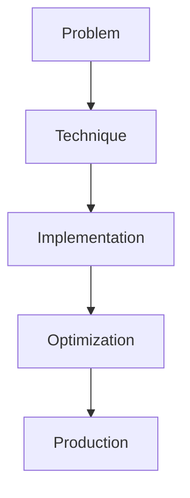

# LLMOps

## Detailed Explanation

LLMOps is a crucial modern technique in AI engineering. Full lifecycle: versioning, monitoring, rollback. This represents the practical state-of-the-art in how production AI systems are built today. Understanding this technique is essential for building scalable, reliable AI systems. The key insight is that this approach addresses fundamental trade-offs in AI systems: between performance and efficiency, between flexibility and reliability, between research models and production systems.

## Core Intuition

Think of LLMOps as the bridge between what researchers build and what engineers deploy. It solves a specific production challenge that becomes critical at scale.

## How It Works

1. Understand the core problem this technique addresses
2. Learn the fundamental algorithm or pattern
3. Implement using available libraries and frameworks
4. Integrate with related components in your system
5. Optimize for your specific constraints (latency, cost, accuracy)
6. Monitor and iterate based on production metrics



## Architecture / Trade-offs

LLMOps platforms vary significantly in their feature depth, deployment complexity, and operational overhead:

| Platform Feature | Prompt Versioning | Experiment Tracking | A/B Testing | Monitoring | Setup Cost | Operational Cost |
|------------------|------------------|-------------------|-------------|------------|-----------|-----------------|
| **DIY (Git-based)** | Git branches/tags | Spreadsheet/logs | Manual | Custom dashboards | Low | High (manual) |
| **LLM-specific** (LangSmith, Prompt Flow) | Built-in versioning | Integrated tracking | Web UI | Real-time dashboards | Medium | Low (hosted) |
| **ML Ops platforms** (MLflow, Weights & Biases) | Generic model versioning | Full experiment tracking | Built-in | Comprehensive | High | Medium |
| **Enterprise solutions** (Datadog, New Relic) | Version control + audit log | Advanced analytics | Full A/B | SLA monitoring | Very High | Very High |

**DIY (Git-based)** is cheapest initially but operationally expensive. You store prompts in Git, track experiments in a spreadsheet, and build custom monitoring. This works for 5-10 prompts. At 100+ prompts with multiple versions, tracking becomes a nightmare.

**LLM-specific platforms** (LangSmith, Azure Prompt Flow) are purpose-built for LLM workflows. They handle version control, live experiment comparison, and cost tracking out of the box. Setup is straightforward; operational overhead is minimal.

**ML Ops platforms** (MLflow) are generic and powerful but require custom configuration for prompts. You get rigorous experiment tracking and integration with ML pipelines, but setup complexity is higher.

**Enterprise solutions** offer comprehensive monitoring, compliance, and SLAs. They're appropriate for financial institutions or healthcare where regulatory requirements justify cost.

## Design Challenges

- **Tracking thousands of prompt versions:** You have 200 prompts in production, each with 10+ versions. Which version is currently live? Which version fixed the "bad output" issue from last week? How do you roll back to the previous version safely? Git tracks code well, but prompt versioning requires semantic tracking: what changed, why, and what effect did it have?

- **Detecting model drift and degradation:** Baseline metrics were great when you deployed. Two weeks later, the same model produces worse outputs. Why? Model capabilities didn't change. The input distribution shifted (customers now asking different questions), or the baseline was measured on atypical data. You need continuous monitoring with anomaly detection, not just point-in-time evaluation.

- **Correlating experiments to real performance:** Your lab shows prompt A is 3% better than prompt B on BLEU score. You deploy prompt A. Real user satisfaction doesn't improve (or worsens). This happens because lab metrics (BLEU, ROUGE) don't capture real user experience. You need a mapping from lab metrics to production metrics, which requires careful instrumentation and often A/B testing.

- **Managing version sprawl and technical debt:** After six months, you have 50 prompt versions, 5 different retrieval strategies, and 3 base models in production. Which combination is actually live? How do you ensure new versions don't break downstream systems? Versioning without cleanup leads to accumulated technical debt and confusion.

- **Cost attribution and optimization:** You deployed a new prompt that's 20% more sophisticated. Did costs increase by 10%, 20%, or 50%? Which prompts are costing the most? Without per-prompt cost tracking, you can't optimize. You might be running expensive prompts on low-value use cases.

## Interview Q&A

**Q: How do you track LLM experiments at scale (50+ prompts, 10+ versions each)?**
A: Use a dedicated LLMOps platform (LangSmith, Prompt Flow) or implement version control: each prompt version gets a unique ID (git commit, timestamp, or semantic hash), metadata (author, change description, test results), and a link to production metrics. Store this in a database, not a spreadsheet. For each production request, log which prompt version was used and what the output was. Then you can run analyses: "which version produced the most user complaints?" or "which version's cost increased most?" without manual digging.

**Q: Why is prompt versioning hard and how do you solve it?**
A: Unlike code (easy to diff), prompts are text-sensitive: a comma changes output. You can't just use Git's line-based diff. Solution: (1) store prompts in a structured format (JSON with system, user, examples as fields), (2) track changes at the semantic level (if system prompt changed, flag it), (3) pair each version with reproducible test results (a specific prompt version always produces the same output on the same input). This lets you answer: "what changed between versions?" and "did it help?"

**Q: How do you detect model degradation in production?**
A: Set up continuous monitoring with baselines. Measure output quality on a held-out test set daily or weekly. Alert if quality drops >5% from baseline. Also monitor input distribution: if user queries shift, baseline model performance might naturally degrade. When alerting fires, auto-run diagnostics: compare model outputs side-by-side with previous version, run qualitative analysis on failures. Was it a model change, input change, or data drift? Alert should include root cause hypothesis, not just "quality down."

**Q: What metrics should you track to correlate lab experiments with production results?**
A: Lab metrics: BLEU, ROUGE, token count. Production metrics: user satisfaction (thumbs up/down), task completion rate, downstream errors, cost per request. For each experiment, record both sets. Then run correlation analysis: "experiments that improved BLEU by 10% improved user satisfaction by X%." Build a mapping function. If BLEU doesn't correlate with satisfaction, don't use it for decisions. Include at least one true outcome metric (user feedback, business impact) in every experiment.

**Q: How do you prevent version sprawl and manage technical debt in prompt management?**
A: Implement deprecation policies: each prompt version gets a TTL (time-to-live). After 30 days, if not live or under active test, archive it. Archive doesn't delete, just moves it out of the active set. Also use semantic versioning: major version when behavior changes significantly, minor for tweaks. Require code review before deploying a new major version. Periodically (quarterly) audit live prompts, merge similar versions, and retire ones that underperform.

**Q: What's the relationship between cost and quality, and how do you optimize?**
A: Typically, more sophisticated prompts cost more but produce better quality. This forms a cost-quality tradeoff curve. For each use case, identify the sweet spot: minimal cost where quality is acceptable. Some prompts might be using expensive models (GPT-4) unnecessarily; switch them to cheaper ones (Claude Haiku) and measure quality loss. If it's acceptable, save money. Use per-prompt cost tracking and A/B tests: "prompt A + GPT-4 vs prompt B + Claude Haiku—which offers better quality per dollar?"

## Best Practices

- Understand the fundamental principle before optimizing
- Use established libraries instead of building from scratch
- Measure the actual impact on your metric
- Test with realistic data and production loads
- Monitor continuously in production
- Document your configuration and rationale
- Plan for multiple iterations until reaching optimum

## Common Pitfalls

- **Losing prompt history and being unable to rollback:** You deploy a new prompt that looked great in testing. In production, it breaks for a specific user cohort. You want to rollback, but the old prompt was overwritten and you don't remember what it was. Without version control, rollback is impossible. Mitigation: treat prompts like code. Every version goes into a repository (Git, database, or LLMOps platform) with metadata: deploy date, author, test results, who approved it. Enforce a review process before deploying. This doubles setup time but saves hours during incidents.

- **Not correlating experiments to real production metrics:** Lab evaluation shows prompt A is 15% better (BLEU score). You deploy it. User satisfaction doesn't change or worsens. This happens because BLEU doesn't measure what users care about. You optimized the wrong metric. Mitigation: for every experiment, measure at least one true outcome metric (user feedback, task success rate, business impact). If lab metric doesn't correlate with outcomes, stop using it. Build correlation empirically.

- **Prompt drift (gradual changes breaking downstream systems):** You tweak a prompt slightly each week. After six weeks, the output format has drifted so much that the downstream parser breaks. You don't realize it because you didn't formally document the expected output format. Mitigation: capture format expectations in the prompt or separate schema. If downstream systems depend on specific output format, add tests that verify it. Treat output format changes as breaking changes (major version bumps, review required).

- **No continuous monitoring, finding issues days or weeks later:** You deploy a new prompt. It works fine for a week. On day 8, users report poor outputs. But you only check metrics weekly, so you didn't notice the degradation for three days. Mitigation: set up continuous monitoring with low-latency alerts. Check quality metrics daily or per-request. If quality drops, alert automatically. Use human evaluation on a sample of outputs to catch issues early.

- **Underestimating operational overhead of managing many models/prompts:** You start with one prompt. Five months later, you have 30 prompts across multiple teams, each with its own versioning scheme and experiments. Nobody knows which versions are live, how to coordinate rollouts, or who owns which prompt. Operational overhead is now huge. Mitigation: standardize on a platform (even if DIY Git at first) and enforce practices early: centralized registry of all prompts, clear ownership, mandatory review before deploy, regular audits. Start small but build processes that scale.

## Code Examples

### Example 1: Basic Implementation

```python
import torch
from transformers import pipeline

# Basic usage pattern
model = pipeline("text-generation", model="meta-llama/Llama-2-7b")
output = model("Hello, world!", max_length=50)
print(output)
```

### Example 2: Production with Monitoring

```python
import torch
import time
from transformers import pipeline

device = torch.device("cuda" if torch.cuda.is_available() else "cpu")

# Production setup
model = pipeline("text-generation", 
                model="meta-llama/Llama-2-7b",
                device=0 if torch.cuda.is_available() else -1)

# Measure performance
start = time.time()
output = model("The future of AI engineering is", max_length=100)
latency = time.time() - start

print(f"Latency: {latency:.2f}s")
print(f"Output: {output[0]['generated_text']}")
```

## Related Concepts

- [LLM Evaluation Harness](./01-llm-evaluation-harness.md)
- [AI Red-Teaming](./02-ai-red-teaming.md)
- [Agentic Testing Harness](./03-agentic-testing-harness.md)
