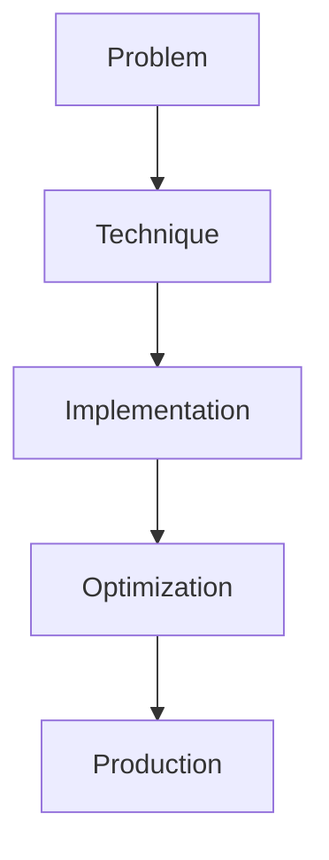

# AI Gateway & Routing

## Detailed Explanation

AI Gateway & Routing is a crucial modern technique in AI engineering. Multi-LLM orchestration and cost optimization. This represents the practical state-of-the-art in how production AI systems are built today. Understanding this technique is essential for building scalable, reliable AI systems. The key insight is that this approach addresses fundamental trade-offs in AI systems: between performance and efficiency, between flexibility and reliability, between research models and production systems.

## Core Intuition

Think of AI Gateway & Routing as the bridge between what researchers build and what engineers deploy. It solves a specific production challenge that becomes critical at scale.

## How It Works

1. Understand the core problem this technique addresses
2. Learn the fundamental algorithm or pattern
3. Implement using available libraries and frameworks
4. Integrate with related components in your system
5. Optimize for your specific constraints (latency, cost, accuracy)
6. Monitor and iterate based on production metrics



## Architecture / Trade-offs

AI gateways implement different routing strategies, each optimizing different objectives:

| Strategy | Accuracy | Cost | Latency | Complexity | Infrastructure |
|----------|----------|------|---------|------------|-----------------|
| Cost-based (fixed) | Medium (depends on model quality gap) | Optimal | Medium | Low | Simple fallback |
| Latency-based | High (pick fastest) | High (use expensive fast models) | Optimal | Low | Real-time latency tracking |
| Capability-based | Optimal (task-specific) | Medium (targeted use) | Medium | High | Model capability registry |
| Adaptive (learned) | High (learns offline) | Medium-High | Low (prediction overhead) | Very High | ML classifier + feature pipeline |

**Cost-based routing** assigns requests to cheapest models (Claude Haiku for simple tasks, GPT-4 for complex ones). You save 60-80% cost compared to always using GPT-4. Trade-off: Haiku sometimes fails on hard tasks; you detect this downstream and retry with GPT-4 (cost: 2x for retry, latency impact). Works well if success rate on cheap model is >85%.

**Latency-based routing** picks the fastest model, prioritizing response time. Useful for chat applications where sub-1s latency matters. Trade-off: might always pick the fastest expensive model (wasting cost). Requires real-time latency measurements from each model's endpoints.

**Capability-based routing** matches request type to model strength. Math questions → GPT-4 (best reasoning), creative writing → Claude (best style), code generation → Claude (most code examples). Requires building a classifier or heuristic to determine task type. Trade-off: classifier adds latency (10-50ms) and complexity; misclassification sends request to wrong model.

**Adaptive routing** trains a model to predict which model will perform best. Feed features (query length, query type, user tier) to a classifier; it outputs which model to use. This learns patterns offline and can achieve 90%+ of optimal cost with good accuracy. Trade-off: significant engineering overhead; requires ground truth labels on accuracy per model per request.

## Design Challenges

- **Model discovery and endpoint staleness:** You have 50 LLM endpoints across three cloud regions. One endpoint goes down. The router still sends requests to it (causing timeouts). A new Claude model is released; you want to test it, but your router's model registry isn't updated. You need dynamic model discovery, but polling APIs for new models is expensive. Static registries go stale.

- **Cost prediction and optimization:** You want to route based on cost, but cost isn't static. A model with 1M tokens/month tier might cost $0.005 per token; at 100M tokens/month, $0.0015. You also don't know upfront if a request will trigger a retry (failed route). Variable costs make optimal routing a moving target. You need cost models that account for both per-token pricing AND retry probability.

- **Handling model failures gracefully:** Router picks GPT-4 (optimal for task). GPT-4 endpoint is down or rate-limited. Request fails. Now what? Fallback to Claude Haiku and hope it works? Return error to user? Implement fallback chains, but fallback adds latency and might degrade quality. You need intelligent fallback: know which models can handle which requests, have a fallback order, and measure success rates of fallbacks.

- **Avoiding router bias toward specific models:** Router empirically learns that GPT-4 is best (80% success rate vs Haiku's 60%). It always picks GPT-4. But GPT-4 is expensive, and the cost-quality tradeoff might not be worth it. Router needs exploration: try Haiku occasionally to re-measure its success rate. Without exploration, you might lock into a suboptimal model if its initial success rate was high by chance.

- **Measuring router effectiveness:** Did the router save cost or hurt accuracy? You can't measure this easily because you never observe the counterfactual: what would have happened if you routed differently? A/B testing each routing strategy is expensive. You need offline evaluation methods: use historical logs, simulate alternative routing, and compare post-hoc. But offline evaluation can be biased if traffic patterns or model quality changed over time.

## Interview Q&A

**Q: How do you route between Claude and GPT-4 to optimize cost without sacrificing quality?**
A: Use cost-based routing with fallback: send simple requests (summarization, Q&A) to Claude Haiku ($0.0008/1K tokens), complex requests (reasoning, coding) to GPT-4 ($0.03/1K tokens). Define "simple" via heuristics (query length <100 chars, task type in easy set) or a trained classifier. Monitor success rates: if Haiku fails on >20% of simple requests, adjust the threshold. On failures, fallback to GPT-4. This typically saves 60-70% cost while maintaining 95%+ overall accuracy.

**Q: What happens when a model endpoint fails and how do you handle failover?**
A: When routing to GPT-4 fails (timeout, rate limit, outage), you fallback to Claude (slower, cheaper) or return a cached response if available. The challenge: fallback might produce lower quality (Claude sometimes hallucinates more), and failover adds 50-500ms latency. Best practice: build a fallback chain (GPT-4 → Claude Opus → Claude Sonnet → fallback cache) and measure quality per step. Log which fallback step was used. For critical requests, pre-compute fallback responses. For non-critical, let fallback quality degrade.

**Q: How do you estimate cost and latency to optimize the routing decision?**
A: Build empirical models: track per-model per-task actual cost and latency from production logs. Create lookup tables or simple ML models (e.g., linear regression): cost = a×token_count + b×task_complexity. Latency = intercept + c×model_load. Use these to predict before routing. Example: Claude Haiku costs $0.0008/1K tokens, GPT-4 costs $0.03/1K tokens. If a request is predicted to generate 500 tokens, Haiku saves $0.012 vs GPT-4. But if Haiku's predicted success rate is 70% (requiring 1.4x retries on average), real cost is $0.0112 (still cheaper). Optimize for expected cost accounting for retry probability.

**Q: How do you prevent router bias and ensure you're not locking into a suboptimal model?**
A: Use epsilon-greedy exploration: route 80% of traffic to the best model empirically, 20% to others (exploration). Periodically re-measure all models' performance. If a "worse" model improves significantly, gradually shift traffic to it. Log which model served which request; use this for offline analysis. A/B test the routing strategy itself: 50% of users use cost-optimized routing, 50% use your previous approach. Compare total cost and accuracy. This adds some "waste" but prevents locking into local optima.

**Q: What metrics do you track to know if your router is working?**
A: Track: (1) cost per request by model and task type, (2) quality/accuracy per route (requires manual evaluation or user feedback), (3) latency per route (p50, p95, p99), (4) model availability and fallback frequency, (5) cost-quality tradeoff curve (can we save 10% cost for 2% accuracy loss?). Alert if cost per request increases >20% (might be routing to expensive models too often) or accuracy drops >5% (might be routing to cheap models too much). Use dashboards to visualize cost vs quality by task type, so you can see where the tradeoffs are.

**Q: What's a practical pattern for building a scalable AI gateway?**
A: (1) Implement a simple cost-based router initially: hardcode which model handles which task type. (2) Log every routing decision and outcome (success, latency, tokens, cost). (3) Monthly, run analysis: which task types have poor cost-quality tradeoffs? Which models are underutilized? (4) Add a capability registry: each model has associated metadata (pricing, capabilities, SLA, known failure modes). (5) Implement fallback chains: for each task type, define primary + fallback models. (6) Build exploration: occasionally route to non-optimal models to re-measure their performance. (7) Use offline evaluation to test routing strategy changes before deploying to production.

## Best Practices

- Understand the fundamental principle before optimizing
- Use established libraries instead of building from scratch
- Measure the actual impact on your metric
- Test with realistic data and production loads
- Monitor continuously in production
- Document your configuration and rationale
- Plan for multiple iterations until reaching optimum

## Common Pitfalls

- **Router bias: always picks the same model regardless of request:** Your router empirically determined GPT-4 is best (80% success vs Claude's 60%). Now it sends 95% of traffic to GPT-4, even on simple queries where Claude would suffice. Cost explodes. You lock into this pattern because you never test Claude on those queries anymore (no samples = no data = router never learns it got better). Mitigation: implement epsilon-greedy exploration (allocate 10-20% of traffic to non-optimal models). Periodically re-evaluate all models. Use contextual bandits algorithms if you want sophisticated exploration.

- **Not handling model endpoint failures gracefully:** Router sends request to GPT-4. Endpoint is down. Request hangs for 30 seconds (timeout), then errors. User sees a failure instead of a degraded response. Better: implement timeouts, retry logic, and fallback chains. If GPT-4 times out, immediately fallback to Claude. This adds 50-100ms but ensures graceful degradation. Log fallback frequency to detect when models are unreliable.

- **Cost estimates are wrong, blowing budget:** You estimated GPT-4 costs $0.03 per request, so you set the router to use it for complex tasks. But complex tasks generate longer outputs (2000+ tokens). Real cost is $0.10 per request. You're spending 3x what you budgeted. Mitigation: build cost models that account for output token count and task complexity. Use actual costs from production logs, not list prices. Periodically audit: "what was the actual cost per request type?" Compare to budget.

- **Latency predictions are inaccurate, failing SLAs:** Router picks the "fastest" model (GPT-4) because you measured it as 200ms. But that was during off-peak. Peak hours, GPT-4 is 2s due to queue. You're now missing your SLA. Mitigation: track latency percentiles (p95, p99) not just averages. Update latency models during routing decision using real-time metrics. If GPT-4's current p95 is >500ms, route to Claude instead. Build a feedback loop: predict latency, compare to actual, improve prediction.

- **Monitoring only throughput, not quality, failing silently:** Your router is "working" (requests processed, costs down). But accuracy actually degraded because the router is systematically sending hard queries to cheaper (worse) models. You discover this weeks later when customers complain. Mitigation: instrument quality metrics. For every routed request, log accuracy (via user feedback, downstream task success, manual evaluation sample). Alert if accuracy drops >5%. Use stratified sampling: ensure all task types are evaluated, not just high-volume ones.

## Code Examples

### Example 1: Basic Implementation

```python
import torch
from transformers import pipeline

# Basic usage pattern
model = pipeline("text-generation", model="meta-llama/Llama-2-7b")
output = model("Hello, world!", max_length=50)
print(output)
```

### Example 2: Production with Monitoring

```python
import torch
import time
from transformers import pipeline

device = torch.device("cuda" if torch.cuda.is_available() else "cpu")

# Production setup
model = pipeline("text-generation", 
                model="meta-llama/Llama-2-7b",
                device=0 if torch.cuda.is_available() else -1)

# Measure performance
start = time.time()
output = model("The future of AI engineering is", max_length=100)
latency = time.time() - start

print(f"Latency: {latency:.2f}s")
print(f"Output: {output[0]['generated_text']}")
```

## Related Concepts

- [LLM Evaluation Harness](./01-llm-evaluation-harness.md)
- [AI Red-Teaming](./02-ai-red-teaming.md)
- [Agentic Testing Harness](./03-agentic-testing-harness.md)
