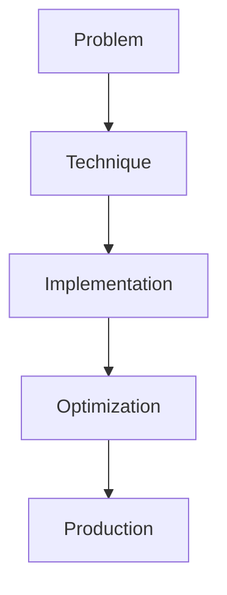

# Multimodal Fine-tuning

## Detailed Explanation

Multimodal Fine-tuning is a crucial modern technique in AI engineering. CLIP/LLaVA-style vision+language. This represents the practical state-of-the-art in how production AI systems are built today. Understanding this technique is essential for building scalable, reliable AI systems. The key insight is that this approach addresses fundamental trade-offs in AI systems: between performance and efficiency, between flexibility and reliability, between research models and production systems.

## Core Intuition

Think of Multimodal Fine-tuning as the bridge between what researchers build and what engineers deploy. It solves a specific production challenge that becomes critical at scale.

## How It Works

1. Understand the core problem this technique addresses
2. Learn the fundamental algorithm or pattern
3. Implement using available libraries and frameworks
4. Integrate with related components in your system
5. Optimize for your specific constraints (latency, cost, accuracy)
6. Monitor and iterate based on production metrics



## Architecture / Trade-offs

Multimodal fine-tuning approaches trade off between vision understanding, language understanding, training cost, and inference latency:

| Architecture | Vision Quality | Language Quality | Memory (inference) | Training Cost | Inference Speed |
|--------------|----------------|------------------|-------------------|---------------|-----------------|
| CLIP (contrastive) | Very High | High | Low (2-4x base) | Low (self-supervised) | Fast |
| LLaVA (vision+LLM) | High | Very High | High (10-20x base) | Medium (supervised) | Slow |
| Flamingo (multimodal fusion) | High | Very High | Very High (20-40x base) | High (large-scale) | Very Slow |
| Adapter-based (LoRA layers) | Medium (tunable) | High | Low (base + adapters) | Low (parameter-efficient) | Fast |

**CLIP** learns vision and language separately via contrastive learning (matching image-text pairs). It excels at semantic understanding (good for classification, retrieval) but struggles with fine-grained reasoning (hard to answer detailed questions about images). Training is cheap (self-supervised); inference is fast (encode image once, reuse).

**LLaVA** connects a vision encoder to an LLM with a projection layer. It inherits the LLM's reasoning ability, so it handles complex visual questions well. Trade-off: the full LLM must run at inference (10-20x memory and compute vs CLIP). Training requires fewer samples but more compute.

**Flamingo** is a multimodal transformer; vision and language are deeply fused. It excels at reasoning about multiple images and fine-grained details. Trade-off: very expensive to train; inference is slow (largest models). Reserve for research or when no alternatives work.

**Adapter-based** freezes the base multimodal model and trains small adapters. Cheapest training cost (only adapters are tuned), fast inference (adapters are tiny). Trade-off: less flexible (can't change core model behavior). Good when the base model is already strong.

## Design Challenges

- **Aligning vision and language modalities:** Images and text have different semantics. A dog image might be described as "golden retriever," "dog," "animal," or "furry creature." The model must learn which descriptions are valid and how to connect visual features to text tokens. Misalignment hurts: the model learns spurious connections (always saying "dog" regardless of actual breed). You need careful data curation and alignment loss functions.

- **Handling variable input resolutions:** Users send images of wildly different sizes (300x300 to 4000x4000). Vision encoders typically expect fixed input (224x224 for most models). Options: (1) Resize all to 224x224 (loses detail), (2) Patch-based encoding (encode 224x224 patches, more compute), (3) Interpolate position embeddings (complex, brittle). Each choice impacts quality and latency. Some images lose important details; others become incomprehensibly small.

- **Memory per model during training and inference:** A fused multimodal model (Flamingo-style) might be 100B parameters. Fine-tuning even with LoRA requires keeping the base model in memory. A single A100 (80GB) might not fit. Inference at scale requires multiple GPUs. Training cost: $100K+. Inference: expensive. You need to decide: can we afford this? Is adapter-based cheaper? Should we use CLIP instead?

- **Training data quality and distribution:** Multimodal models are sensitive to image-text alignment. If your training data has 1000 images of "dogs" but 50% are cat images mislabeled, the model learns bad associations. Unlike text datasets (easy to filter for quality), image datasets require careful curation. You need: (1) manual review of samples, (2) deduplication (same image shouldn't appear multiple times), (3) diversity (don't let one class dominate).

- **Inference latency and batch efficiency:** LLaVA requires running the vision encoder on each image, then feeding to the LLM. Total latency: vision encode (50-200ms) + LLM generation (500-2000ms) = 550-2200ms per request. CLIP is faster (50-100ms total). At scale, can you afford LLaVA's latency? Batching helps: process 32 images in parallel, divide by 32. But batch size is limited by memory. Trade-off: small batches = low latency per image but high per-batch overhead; large batches = efficient but high latency for individual requests.

## Interview Q&A

**Q: How do you align vision and language modalities during training?**
A: Use contrastive loss or supervised loss depending on your data. For contrastive (CLIP-style): pair each image with its correct text description, and push embeddings together; push incorrect pairs apart. For supervised (LLaVA-style): train the model to predict image captions or answer visual questions directly. The key insight: the model must learn shared representations. Monitor alignment via: (1) do embeddings of matching image-text pairs cluster together? (2) can you retrieve the correct image given a description (or vice versa)? If alignment is poor, the model won't generalize to new images/captions.

**Q: What's the difference between CLIP and LLaVA, and when would you use each?**
A: **CLIP** is two separate encoders (vision + text) connected by contrastive loss. It's great for image-text matching, classification, and retrieval (fast, memory-efficient). It struggles with reasoning about details or answering complex questions about images. **LLaVA** connects a vision encoder to an LLM. It inherits the LLM's reasoning ability, so it handles visual question-answering and detailed descriptions well. Trade-off: LLaVA is 10-20x slower and heavier in memory. Use CLIP for retrieval/classification; use LLaVA for reasoning. If you need both, consider a two-stage system: use CLIP to filter candidates, then LLaVA to reason about top-k.

**Q: How do you handle variable input resolutions without losing information?**
A: Option 1: Resize all to 224x224 (simple, fast, loses detail on high-res images). Option 2: Patch-based encoding (split 2000x2000 into overlapping 224x224 patches, encode each, fuse features). More compute but preserves detail. Option 3: Interpolate position embeddings (train on 224x224, extend to larger sizes via interpolation). This works but is brittle on very different aspect ratios. In practice, resize to 224x224 for a first pass. If you need to support high-res images, use patch-based encoding with careful feature fusion (don't just average patches; use spatial attention).

**Q: What's a realistic memory budget for training and inference?**
A: CLIP fine-tuning: 8-16GB (A100 or comparable GPU). LLaVA fine-tuning: 40-80GB (single A100). Flamingo fine-tuning: 320GB+ (8x A100). Inference memory depends on model size and batch size. LLaVA-7B: 14GB base, add batch_size*2GB for batching. At batch_size=32: 78GB (multiple GPUs). If your budget is limited (single GPU), use CLIP or adapter-based tuning. If you need LLaVA-scale reasoning, rent GPUs or use quantization (8-bit LLM reduces memory by 4x but adds latency).

**Q: How do you detect when image-text alignment is poor and what do you do?**
A: Measure alignment metrics: (1) for image-text pairs in your test set, compute cosine similarity of embeddings (should be high, >0.7). (2) Compute image->text and text->image retrieval accuracy (should be >80% for similar pairs). (3) Qualitatively inspect failures: find image-text pairs with low similarity; are they correctly paired in your training data? If alignment is poor, check: (1) are training samples actually paired correctly? (2) is the alignment loss weighted properly? (3) is the training data too diverse (e.g., images and captions from different sources, not naturally paired)? Fix by re-curating training data, using higher alignment loss weight, or collecting in-domain data.

**Q: What's a practical pattern for productionizing multimodal models?**
A: (1) Start with CLIP for classification/retrieval (fast, light). (2) Evaluate on your task: does CLIP's accuracy meet requirements? If yes, ship it. (3) If CLIP is insufficient, fine-tune it with your data (cheaper than LLaVA). (4) If you need reasoning beyond classification (e.g., detailed descriptions, complex Q&A), upgrade to LLaVA or adapter-based fine-tuning of a multimodal LLM. (5) Use quantization and batching to reduce inference latency and cost. (6) Implement fallback: if image resolution is too high for your model, preprocess to 224x224. (7) Monitor: track embedding quality, alignment metrics, end-task accuracy. Alert if these degrade (model drift, data shift).

## Best Practices

- Understand the fundamental principle before optimizing
- Use established libraries instead of building from scratch
- Measure the actual impact on your metric
- Test with realistic data and production loads
- Monitor continuously in production
- Document your configuration and rationale
- Plan for multiple iterations until reaching optimum

## Common Pitfalls

- **Modality mismatch from incompatible vision encoders:** You use a vision encoder trained on ImageNet (biased toward natural objects) with text data about medical images (X-rays, CT scans). The encoder doesn't recognize medical artifacts, so embeddings are useless. The model learns random associations. Mitigation: ensure vision encoder is pre-trained on data similar to your use case. For medical images, use medical-pretrained encoders. For documents, use document-specific encoders. If you must use a generic encoder, fine-tune it on your data (expensive) or use a domain-specific multimodal model if available.

- **Training on biased image-text pairs:** Your training data comes from web scraping. Captions are noisy: same image labeled as "dog," "animal," "furry creature," and "German Shepherd" interchangeably. The model learns that all these descriptions are equally valid (noise). At inference, it can't decide which description to use. Or worse: captions are biased (images of people labeled with stereotypes). The model learns and reproduces the bias. Mitigation: manually review and curate training data. Deduplicate images and captions. Remove biased or incorrect labels. Use crowdsourcing for quality assurance.

- **Memory overflow during training or inference:** You attempt to fine-tune a 13B parameter multimodal model on a single 80GB A100. Gradient checkpointing and LoRA help but you still run out of memory mid-training. Or at inference, batch_size=16 is fine, but with 100 concurrent requests, you need 6.4x the memory you budgeted. Mitigation: estimate memory upfront: (model_size + optimizer_state + gradients + batch_data). Use gradient checkpointing, LoRA, and quantization. Build a memory simulator: test on small model, extrapolate to full size. Deploy with autoscaling: if memory usage >80%, reject new requests and alert.

- **Inference latency makes production unpractical:** LLaVA fine-tuning completes; inference latency is 2-3 seconds per request. That's too slow for real-time chat. You regret the choice. Mitigation: measure latency before deep commitment. Compare: CLIP (100ms) vs LLaVA (2000ms). If latency is critical (<500ms), use CLIP or quantized/distilled LLaVA. Use profiling to find bottlenecks: is it vision encoding (200ms), text encoding (100ms), or LLM generation (1700ms)? Optimize the hottest path first.

- **Not validating alignment on diverse data:** You fine-tune on 1000 image-caption pairs from one source. Alignment looks great (0.8+ similarity). You deploy. Real-world images are different (different distributions, styles, content). Alignment breaks (0.3-0.4 similarity). Model performance degrades. Mitigation: validate on diverse held-out data: different image sources, different caption styles, different domains if applicable. Compute alignment metrics on all of them. If alignment degrades on some, either include those in training or use a more robust training approach (e.g., harder negatives, contrastive loss variants).

## Code Examples

### Example 1: Basic Implementation

```python
import torch
from transformers import pipeline

# Basic usage pattern
model = pipeline("text-generation", model="meta-llama/Llama-2-7b")
output = model("Hello, world!", max_length=50)
print(output)
```

### Example 2: Production with Monitoring

```python
import torch
import time
from transformers import pipeline

device = torch.device("cuda" if torch.cuda.is_available() else "cpu")

# Production setup
model = pipeline("text-generation", 
                model="meta-llama/Llama-2-7b",
                device=0 if torch.cuda.is_available() else -1)

# Measure performance
start = time.time()
output = model("The future of AI engineering is", max_length=100)
latency = time.time() - start

print(f"Latency: {latency:.2f}s")
print(f"Output: {output[0]['generated_text']}")
```

## Related Concepts

- [LLM Evaluation Harness](./01-llm-evaluation-harness.md)
- [AI Red-Teaming](./02-ai-red-teaming.md)
- [Agentic Testing Harness](./03-agentic-testing-harness.md)
