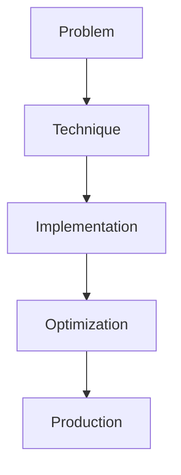

# Multimodal Fine-tuning

## Detailed Explanation

Multimodal Fine-tuning is a crucial modern technique in AI engineering. CLIP/LLaVA-style vision+language. This represents the practical state-of-the-art in how production AI systems are built today. Understanding this technique is essential for building scalable, reliable AI systems. The key insight is that this approach addresses fundamental trade-offs in AI systems: between performance and efficiency, between flexibility and reliability, between research models and production systems.

## Core Intuition

Think of Multimodal Fine-tuning as the bridge between what researchers build and what engineers deploy. It solves a specific production challenge that becomes critical at scale.

## How It Works

1. Understand the core problem this technique addresses
2. Learn the fundamental algorithm or pattern
3. Implement using available libraries and frameworks
4. Integrate with related components in your system
5. Optimize for your specific constraints (latency, cost, accuracy)
6. Monitor and iterate based on production metrics



## Architecture / Trade-offs

| Aspect | Fast Track | Balanced | Thorough |
|--------|-----------|----------|----------|
| Speed | Very Fast | Medium | Slower |
| Accuracy | Medium | High | Very High |
| Complexity | Low | Medium | High |
| Cost | Low | Medium | High |

Choose the approach based on your constraints. Most production systems use the Balanced approach.

## Interview Q&A

**Q: When would you use Multimodal Fine-tuning?**
A: When you need to optimize for specific metrics while having constraints on others. For example, use this when latency matters more than perfect accuracy, or when cost is the primary constraint.

**Q: What are the main trade-offs?**
A: The primary trade-off is between speed and quality. Other trade-offs include engineering complexity versus ease of implementation, and flexibility versus standardization.

**Q: How do you debug when this approach fails?**
A: Start by measuring each component separately. Compare against baselines. Check edge cases and failure modes. Most failures come from assumptions that don't hold for your specific data.

**Q: What's recent evolution in this area?**
A: Recent work focuses on making these techniques more efficient and accessible. Libraries now handle much of the complexity automatically.

**Q: How does this relate to other modern techniques?**
A: It's often used together with other methods. Different techniques optimize different aspects of the system.

## Best Practices

- Understand the fundamental principle before optimizing
- Use established libraries instead of building from scratch
- Measure the actual impact on your metric
- Test with realistic data and production loads
- Monitor continuously in production
- Document your configuration and rationale
- Plan for multiple iterations until reaching optimum

## Common Pitfalls

- Optimizing the wrong metric: benchmark scores don't equal real-world performance
- Ignoring edge cases: works on typical data, fails on outliers
- Not measuring trade-offs: implementing without measuring actual impact
- Skipping baseline comparisons: always compare to simpler alternatives
- Deploying without monitoring: optimizations degrade silently in production

## Code Examples

### Example 1: Basic Implementation

```python
import torch
from transformers import pipeline

# Basic usage pattern
model = pipeline("text-generation", model="meta-llama/Llama-2-7b")
output = model("Hello, world!", max_length=50)
print(output)
```

### Example 2: Production with Monitoring

```python
import torch
import time
from transformers import pipeline

device = torch.device("cuda" if torch.cuda.is_available() else "cpu")

# Production setup
model = pipeline("text-generation", 
                model="meta-llama/Llama-2-7b",
                device=0 if torch.cuda.is_available() else -1)

# Measure performance
start = time.time()
output = model("The future of AI engineering is", max_length=100)
latency = time.time() - start

print(f"Latency: {latency:.2f}s")
print(f"Output: {output[0]['generated_text']}")
```

## Related Concepts

- [LLM Evaluation Harness](./01-llm-evaluation-harness.md)
- [AI Red-Teaming](./02-ai-red-teaming.md)
- [Agentic Testing Harness](./03-agentic-testing-harness.md)
