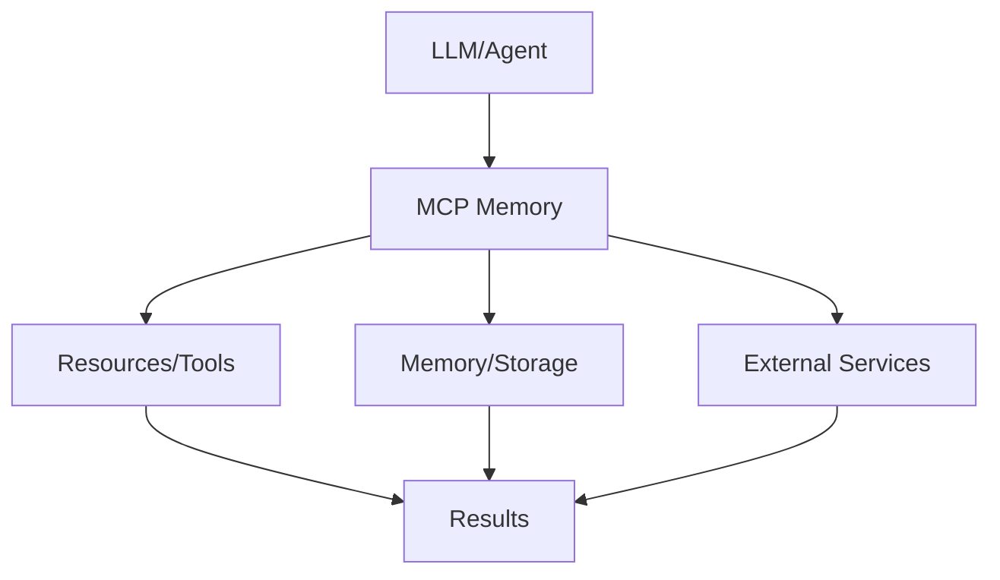

# MCP Memory

## Detailed Explanation

MCP Memory is a critical modern technique in AI engineering. Memory management and persistence via MCP. This represents the practical state-of-the-art in how production AI systems are built and connected today. Understanding this technique is essential for building scalable, reliable AI systems that integrate seamlessly with external resources and services. The key insight is that MCP Memory bridges the gap between LLMs and external systems, enabling agents to access tools, memory, and resources in a standardized way.

## Core Intuition

Think of MCP Memory as the standardized language that lets LLMs talk to the rest of your infrastructure. Instead of each model needing custom integrations, you define once and use everywhere.

## How It Works

1. Define your resources, tools, or memory requirements
2. Implement the MCP Memory protocol or use an SDK
3. Connect to your LLM or agent framework
4. Handle requests and responses through the standard interface
5. Scale across multiple models and deployments
6. Monitor and optimize the connections



## Architecture / Trade-offs

MCP memory can be implemented with different backends, each optimizing for different constraints. The choice depends on consistency requirements, latency budgets, and data volume.

### Memory Backend Comparison

| Aspect | In-Process Memory | Separate Service (Redis) | Vector DB (Pinecone) | Hybrid (Layered) |
|--------|-------------------|-------------------------|----------------------|------------------|
| Query Latency | <1ms (memory) | 10-50ms (network) | 50-200ms (search) | 1-200ms (depends) |
| Consistency | Strong (single process) | Eventual (replication) | Eventual (indexing) | Tunable per tier |
| Memory Limits | 1-10GB (host RAM) | Unlimited (disk) | Unlimited (cloud) | Tiered (hot/cold) |
| Cost | Minimal | Low ($50-500/mo) | Medium ($200-2000/mo) | Medium (compound) |
| Multi-agent Support | Poor (no sharing) | Good (shared backend) | Excellent (multi-tenant) | Good (selective sharing) |
| Failure Recovery | None (process death) | Moderate (persistence) | High (SLA-backed) | High (redundancy) |

**In-Process**: Fastest but single-agent only. Agent dies, memory disappears. Best for development and single-user scenarios.

**Redis/Memcached**: Persistent, fast, shared across agents. Requires separate infrastructure. Good for teams with 2-10 agents. Stale cache possible; consistency window ~100ms.

**Vector DB**: Semantic search built-in, scales to millions of facts. Network latency non-negotiable. Best for knowledge-heavy agents (customer service, research). Requires embedding model maintenance.

**Hybrid**: Keep recent interactions in Redis (fast), older facts in vector DB (searchable). Hot data hot, cold data cold. Adds complexity but optimal for long-running agents.

### Consistency vs Performance Trade-offs

| Use Case | Best Backend | Rationale |
|----------|--------------|-----------|
| Real-time conversation (sub-100ms) | In-process | Latency critical, short memory window |
| Multi-agent coordination | Redis | Shared mutable state, consistency matters |
| Long-term knowledge retrieval | Vector DB | Speed less important than semantic match |
| Production agent fleet | Hybrid | Performance + scale + search capabilities |

## Design Challenges

MCP memory systems face challenges that block production deployments if not addressed:

- **Cache Coherence & Stale Data**: Agent A updates a fact in Redis (took customer's order). Agent B simultaneously reads old cached version from in-process memory. Makes conflicting decisions. With distributed agents, stale reads are inevitable—question is how stale is acceptable? Requires explicit read-after-write guarantees, versioning of facts, and conflict resolution strategy.

- **Memory Explosion & Unbounded Growth**: Agent stores every conversation turn, every search result, every intermediate reasoning step. After 1000 conversations, memory size explodes. Query latency degrades (scanning all old facts). Costs climb. No automatic cleanup. Requires explicit retention policies: keep recent facts hot, archive old ones, implement garbage collection with configurable TTL per fact type.

- **Privacy of Stored Data**: Memory stores sensitive facts: customer SSN, payment info, medical history. If stored in plaintext in Redis, any service with network access can read it. If stored in vector DB for semantic search, you're encrypting after embedding (embeddings themselves leak information). Requires encryption at rest, encryption at transit, access control, audit logging of who queried what facts.

- **Episodic vs Semantic Memory Distinction**: Episodic (specific conversation turn: "user said X at 3pm") vs semantic (general fact: "user's birthday is in March"). Both need indexing but with different strategies. Mixing them causes bloat and poor retrieval. Requires separate storage tiers, different TTLs, different search strategies.

- **Consistency Under Concurrent Writes**: Two agents write conflicting facts (agent A: "order status=shipped", agent B: "order status=returned"). Should last-write-win? Should it error? Should facts be immutable with new versions? Requires careful consistency model definition, version management, and conflict detection.

## Interview Q&A

**Q: How do you handle memory staleness in a distributed agent system?**
A: Define acceptable staleness window based on use case. For real-time coordination (<100ms), require strong consistency (synchronous writes). For long-horizon planning (hours), eventual consistency is acceptable. Implement versioning: facts have write timestamps, reads check if data is too old, fall back to live query if needed. Use distributed tracing to detect stale reads.

**Q: What's the difference between episodic and semantic memory in MCP?**
A: Episodic: specific event in time ("at 3pm, user asked about order #123"). Semantics: general fact ("customer prefers email to phone"). Episodic needs temporal indexing, semantic needs embedding-based search. Use different storage: episodic in time-series DB (InfluxDB), semantic in vector DB (Pinecone). Query differently: episodic searches by time range + event type, semantic searches by relevance.

**Q: How do you garbage collect old memories without losing important context?**
A: Implement multi-tier retention: keep recent facts hot (Redis, 30 days), archive old facts cold (S3, searchable via vector index), summarize very old facts (extract key insights, store as semantic summary). Example: after 90 days, don't store every conversation turn; instead, store one summary fact per conversation. Requires classification system: which facts are ephemeral (can delete), which are permanent (account details).

**Q: What happens when memory write fails (e.g., Redis down)?**
A: In-memory buffer fills with failed writes. Agent continues but decisions lack persistence context. When Redis recovers, there's a window of decisions made without shared memory. Result: inconsistency and data loss. Fix: Implement write-through caching (buffer writes locally, retry with exponential backoff), use circuit breaker (fail fast if backend is down), alert on memory backend failures.

**Q: How do you prevent memory poisoning (agents learning wrong facts)?**
A: Agents can memorize incorrect facts (user said they're 200 years old; agent believes it). Over time, these corrupt future decisions. Requires fact validation: check new facts for reasonableness (age<150?), source attribution (where did this come from?), consensus (multiple agents agree?). Implement fact review: mark suspicious facts for human review, have high-confidence facts (from database) override low-confidence (from conversation).

**Q: What's the latency requirement for agent memory in real-time applications?**
A: <50ms for conversational agents (feels instant). <200ms acceptable for planning agents (visible but not jarring). >500ms makes agent feel sluggish. Vector DB search (50-200ms) works for planning but not conversation. For real-time, use hybrid: episodic in fast in-process store, semantic in vector DB for background retrieval (parallel, low priority).

## Best Practices

- Use official SDKs when available (don't reinvent the wheel)
- Version your protocol implementations and clients independently
- Implement proper error handling for all resource types
- Monitor connection latency and resource availability
- Test with multiple LLM models to ensure compatibility
- Document your resource schemas clearly for other developers
- Plan for scaling: MCP Memory should work with thousands of resources

## Common Pitfalls

- **Memory bloat: storing everything without retention policy**: Agent stores every turn of every conversation, every search result, every thought. After weeks, memory size is gigabytes. Queries slow down (O(n) scans over millions of facts). Costs skyrocket. Latency becomes unacceptable. Result: agent grinds to a halt. Fix: Implement strict TTL policies (conversation facts expire after 30 days, search results after 1 hour), summarize old conversations, move cold data to archive tier.

- **Stale data leading to incorrect decisions**: Agent queries fact "order status = delivered" but doesn't know it was recently updated to "returned". Agent makes decision based on stale data (doesn't offer replacement). Customer angry. Result: poor UX and compliance issues. Fix: Implement read-after-write semantics, cache invalidation strategy, use vector DB for semantic recency filtering (newer facts ranked higher).

- **Storing personally identifiable information (PII) without encryption**: Agent stores customer SSN, payment card, phone number in plain text in Redis. Admin can read it. Compliance violation (GDPR, CCPA). Result: fines + data breach. Fix: Encrypt sensitive fields before storage (AES-256), use separate encryption key per customer, implement audit logging (who accessed what), regular compliance audits.

- **Forgetting important facts due to cleanup**: Aggressive garbage collection deletes a critical fact (user's dietary restriction, medical condition). Agent doesn't consider it. User has negative experience (food allergy reaction, missed accommodation). Result: liability and trust loss. Fix: Distinguish permanent facts (never delete) from ephemeral (safe to delete), implement fact importance scoring, require review before deleting high-importance facts.

- **Inconsistency from concurrent writes without versioning**: Two agents simultaneously write different order statuses. Last-write-wins overwrites legitimate update. No audit trail. Result: data corruption and no way to recover. Fix: Implement optimistic locking (version numbers), detect conflicts, require merge resolution, log all writes with timestamps and authors, use immutable fact logs for auditability.

## Code Examples

### Example 1: Basic Implementation

```python
# Basic MCP Memory pattern
class Resource:
    def __init__(self, name, description):
        self.name = name
        self.description = description
    
    def execute(self, params):
        return {'name': self.name, 'result': params}

# Define resources
calculator = Resource('calculator', 'Basic math operations')
memory = Resource('memory', 'Agent memory storage')

# Execute
result = calculator.execute({'operation': 'add', 'a': 5, 'b': 3})
print(result)
```

### Example 2: Production with Error Handling

```python
import logging
from typing import Dict, Any
import time

logger = logging.getLogger(__name__)

class ManagedResource:
    def __init__(self, name: str, timeout: int = 30):
        self.name = name
        self.timeout = timeout
        self.available = True
    
    def execute(self, request: Dict[str, Any]) -> Dict[str, Any]:
        try:
            logger.info(f'Executing {self.name}: {request}')
            start = time.time()
            
            # Check availability
            if not self.available:
                return {'error': 'Resource unavailable'}
            
            # Execute with timeout
            result = self._do_execute(request)
            latency = time.time() - start
            
            logger.info(f'Completed in {latency:.2f}s')
            return {'success': True, 'result': result, 'latency': latency}
            
        except Exception as e:
            logger.error(f'Error: {e}')
            return {'error': str(e)}
    
    def _do_execute(self, request):
        # Your implementation here
        return request

# Usage
resource = ManagedResource('api-gateway', timeout=5)
response = resource.execute({'endpoint': '/data', 'query': 'test'})
print(response)
```

## Related Concepts

- [Agentic Testing Harness](./03-agentic-testing-harness.md)
- [Persistent AI Memory](./04-persistent-ai-memory.md)
- [LLMOps](./18-llmops.md)
- [AI Gateway & Routing](./19-ai-gateway-routing.md)
