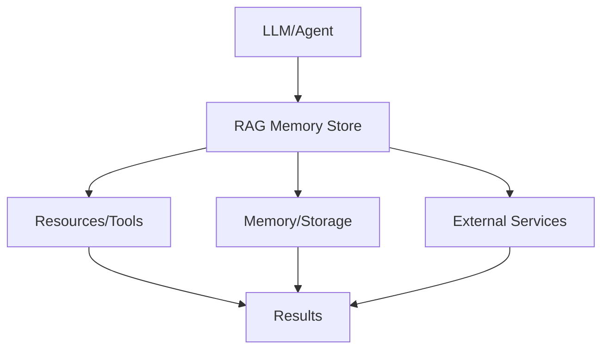

# RAG Memory Store

## Detailed Explanation

RAG Memory Store is a critical modern technique in AI engineering. Vector databases and retrieval for agent memory. This represents the practical state-of-the-art in how production AI systems are built and connected today. Understanding this technique is essential for building scalable, reliable AI systems that integrate seamlessly with external resources and services. The key insight is that RAG Memory Store bridges the gap between LLMs and external systems, enabling agents to access tools, memory, and resources in a standardized way.

## Core Intuition

Think of RAG Memory Store as the standardized language that lets LLMs talk to the rest of your infrastructure. Instead of each model needing custom integrations, you define once and use everywhere.

## How It Works

1. Define your resources, tools, or memory requirements
2. Implement the RAG Memory Store protocol or use an SDK
3. Connect to your LLM or agent framework
4. Handle requests and responses through the standard interface
5. Scale across multiple models and deployments
6. Monitor and optimize the connections



## Architecture / Trade-offs

Vector stores enable semantic search for agent memory but differ significantly in deployment model, query latency, and operational complexity. The choice depends on scale, consistency needs, and budget.

### Vector Store Comparison

| Store | Query Latency | Index Size | Scalability | Maintenance | Cost |
|-------|---------------|-----------|------------|-------------|------|
| FAISS (local) | <5ms | 100GB max | Single machine | Minimal | Free |
| Chroma (embedded) | 10-50ms | 10GB typical | Single machine | Low | Free |
| Milvus (self-hosted) | 20-100ms | Unlimited | Cluster capable | Medium (operations) | Host cost |
| Pinecone (managed) | 50-200ms | Unlimited | Auto-scaling | Minimal (SaaS) | $0.04-0.25/1M vectors |
| Weaviate (managed) | 50-200ms | Unlimited | Auto-scaling | Minimal (SaaS) | $25-500/month |

**FAISS**: Fastest, cheapest, but single-machine only. Good for development, small-to-medium deployments (<100M vectors). No replication, no high availability.

**Chroma**: Embeds in your application, moderate performance, simple API. Good for rapid prototyping. Limited to available RAM.

**Milvus**: Self-hosted, powerful clustering, but requires Kubernetes expertise. Good for teams with DevOps resources. Scales to billions of vectors.

**Pinecone**: Managed serverless, handles indexing automatically, scales infinitely. Network latency adds 50-200ms. Best for large-scale applications (1B+ vectors) where you don't want ops overhead.

**Weaviate**: Middle ground—managed SaaS with GraphQL API, semantic filtering, multi-modal search. Good for enterprises needing advanced querying beyond simple similarity.

### Trade-off Summary

| Scenario | Best Choice | Reasoning |
|----------|------------|-----------|
| Prototype (1-10M facts) | FAISS or Chroma | Speed + simplicity |
| Production startup (<100M) | Milvus or Pinecone | Scalability + managed |
| Large enterprise (>1B) | Pinecone | Avoid operational burden |
| Cost-sensitive | FAISS + periodic reload | Zero cloud costs |
| Need semantic filtering | Weaviate | Rich query capabilities |

## Design Challenges

Vector-based memory stores introduce challenges beyond traditional databases:

- **Semantic Search Quality & Embedding Drift**: Vector search depends entirely on embedding model quality. If you use a weak embedding model (fast, low-dimensional), semantic search is poor (retrieving irrelevant facts). If you switch embedding models (v1 → v2), old vectors become incompatible with queries encoded with new model. Result: irrelevant retrieval, agent makes decisions on wrong facts. Requires periodic re-indexing with new models, embedding version tracking, fallback to keyword search when semantic match is weak.

- **Index Staleness & Delayed Visibility**: Facts added to vector DB aren't immediately searchable. Some systems batch index updates (every 1 hour). New fact: "user's priority changed to VIP". Agent queries memory before index updates. Agent doesn't see new priority. Makes sub-optimal decision. Latency can be 1ms to hours depending on architecture. Requires near-real-time indexing (<100ms), SLA guarantees on freshness, or hybrid approach (fast memory + eventual vector index).

- **Schema Evolution & Field Compatibility**: Early system stores facts as "name, age, location". Later add "email". Vector store is unaware of schema. Old facts missing email field. Queries filtering by email miss old facts. Result: incomplete answers. Requires schema versioning, backward compatibility, automatic migration of old facts to new schema, or separate indexes per version.

- **Scaling to Millions of Documents**: Memory starts small. Over months, accumulates millions of facts. Vector index grows to gigabytes. Query latency increases (O(log n) → O(n) if not using proper indexing). Costs climb. What worked at 100K facts doesn't work at 100M. Requires load testing at scale, proper indexing strategy (HNSW, IVF), distributed search architecture, cost monitoring.

- **Deduplication & Redundancy**: Agent learns same fact twice: "user lives in NYC" stored as two separate facts. Search returns both (redundant results). Wastes storage and confuses downstream processing. Requires deduplication strategy (semantic dedup vs exact match), similarity threshold tuning, periodic cleanup of near-duplicate facts.

## Interview Q&A

**Q: When is vector search NOT the right approach for agent memory?**
A: When facts are exact (user ID 12345, not approximate). When consistency is critical (financial transactions must be exact-match, not semantic-match). When queries are highly structured (SQL-like filters: "show all orders from 2024-Q1"). When embedding model quality is unknown (garbage embeddings = garbage search). Vector search works for semantic/conversational queries, not structured analytics. Use traditional DB for structured, vector DB for semantic.

**Q: How do you prevent semantic drift in retrieval over time?**
A: Semantic drift occurs when embedding model changes or contexts shift. Fact "small laptop" retrieved for query "lightweight computer" (good). Same fact retrieved for query "portable office desk" (wrong—semantic drift). Fix: (1) Version embeddings per model, (2) Periodically audit retrievals (does result match query intent?), (3) Use multiple embedding models in ensemble, (4) Implement negative examples (this fact should NOT match this query), (5) Monitor retrieve quality metrics (precision, recall).

**Q: What's the latency requirement for agent memory in production?**
A: <100ms total latency for interactive agents (conversational feel). <500ms acceptable for planning agents. >1s feels broken. Vector search latency breakdown: embedding query (10-50ms) + index search (5-100ms) + post-processing (5-20ms) = ~50-200ms typical. Network overhead (cloud vector DB) adds latency. For <100ms, use local FAISS. For scalability, accept 50-200ms latency, optimize elsewhere (batching, caching).

**Q: How do you handle the fact that similar != relevant?**
A: Two vectors may have high cosine similarity but be completely irrelevant. Example: "I want to eat apples" (food) vs "Apple Inc." (company). Embeddings may be similar. Vector DB returns both. Agent gets confused. Requires post-retrieval filtering: (1) Semantic reranking (fine-grained relevance scorer), (2) Context awareness (is this doc about food or companies?), (3) Human-in-the-loop (mark irrelevant results, retrain embedding), (4) Fallback to keyword search if top-k results have low diversity.

**Q: What happens when your embedding model becomes outdated?**
A: You're using OpenAI embeddings v1. Later, v2 is released with better quality. Old vector indexes are incompatible with new model. Can't search new facts with old vectors. Result: inconsistency. Fix: (1) Schedule re-indexing (once per quarter), (2) Dual-index during transition (support both v1 and v2), (3) Implement embedding versioning, (4) Monitor embedding staleness, (5) Have runbook for emergency re-indexing if vector quality degrades.

**Q: How do you scale vector search beyond one machine?**
A: Single FAISS instance hits limits at 100-500M vectors (hundreds of GB). Beyond that, require distributed search: (1) Partition vectors by hash (vectors for Alice's facts → shard 1), (2) Search all shards in parallel, merge results, (3) Use managed solution (Pinecone handles sharding), (4) Implement caching layer (popular queries cached in memory). Trade-offs: latency increases (parallel query + merge overhead), operational complexity grows.

## Best Practices

- Use official SDKs when available (don't reinvent the wheel)
- Version your protocol implementations and clients independently
- Implement proper error handling for all resource types
- Monitor connection latency and resource availability
- Test with multiple LLM models to ensure compatibility
- Document your resource schemas clearly for other developers
- Plan for scaling: RAG Memory Store should work with thousands of resources

## Common Pitfalls

- **Poor chunking strategy splits information across vectors**: You chunk facts by sentence. Key context spans multiple sentences. Example: "User lives in NYC. They work remotely." Chunked separately, vector DB returns either sentence alone, losing context that worker is NYC-based. Agent retrieves incomplete information. Fix: Implement smart chunking (semantic boundaries, preserve related info), include context window (surrounding sentences), use overlapping chunks, validate that chunking preserves information integrity.

- **Stale index means recently added facts aren't searchable**: Batch indexing every hour means new facts invisible for up to 1 hour. Agent doesn't know about recent orders, conversations, or important updates. Makes decisions on outdated information. Result: poor responsiveness. Fix: Move to real-time or near-real-time indexing (<100ms latency), implement write-through for critical facts (bypass vector search, store in fast memory), use hybrid approach (fast store + eventual vector index).

- **Embedding model quality trash, semantic search worthless**: Using old, low-quality embeddings (e.g., simple word averages). Search is unreliable. Relevant facts not retrieved. Agent hallucinates. You don't notice because retrieval failures are silent (empty results feel like "no relevant facts exist"). Fix: Benchmark embedding quality (relevance@k metrics), test on real queries, use modern embeddings (e.g., sentence-transformers, BERT-based), evaluate switching models regularly.

- **No deduplication leads to redundant facts and bloated index**: Agent learns "user age = 30" multiple times. Index stores all copies. Storage balloons. Search returns all duplicates. Results are noisy. Costs multiply. Fix: Implement semantic deduplication (similar vectors merged), exact deduplication (same fact deduplicated), TTL-based cleanup, periodic index compaction, dedup threshold tuning (how similar is "duplicate"?).

- **Not handling schema evolution breaks queries on old data**: Schema v1: {name, age, city}. Schema v2: {name, age, city, email, phone}. Old facts missing new fields. Queries filtering by email miss old facts. Vector similarity changes with schema. Result: incomplete and inconsistent results. Fix: Implement schema versioning, maintain multiple indexes (one per version), automatic migration of old facts, backward-compatible queries (optional fields), or virtual fields (computed at retrieval time).

## Code Examples

### Example 1: Basic Implementation

```python
# Basic RAG Memory Store pattern
class Resource:
    def __init__(self, name, description):
        self.name = name
        self.description = description
    
    def execute(self, params):
        return {'name': self.name, 'result': params}

# Define resources
calculator = Resource('calculator', 'Basic math operations')
memory = Resource('memory', 'Agent memory storage')

# Execute
result = calculator.execute({'operation': 'add', 'a': 5, 'b': 3})
print(result)
```

### Example 2: Production with Error Handling

```python
import logging
from typing import Dict, Any
import time

logger = logging.getLogger(__name__)

class ManagedResource:
    def __init__(self, name: str, timeout: int = 30):
        self.name = name
        self.timeout = timeout
        self.available = True
    
    def execute(self, request: Dict[str, Any]) -> Dict[str, Any]:
        try:
            logger.info(f'Executing {self.name}: {request}')
            start = time.time()
            
            # Check availability
            if not self.available:
                return {'error': 'Resource unavailable'}
            
            # Execute with timeout
            result = self._do_execute(request)
            latency = time.time() - start
            
            logger.info(f'Completed in {latency:.2f}s')
            return {'success': True, 'result': result, 'latency': latency}
            
        except Exception as e:
            logger.error(f'Error: {e}')
            return {'error': str(e)}
    
    def _do_execute(self, request):
        # Your implementation here
        return request

# Usage
resource = ManagedResource('api-gateway', timeout=5)
response = resource.execute({'endpoint': '/data', 'query': 'test'})
print(response)
```

## Related Concepts

- [Agentic Testing Harness](./03-agentic-testing-harness.md)
- [Persistent AI Memory](./04-persistent-ai-memory.md)
- [LLMOps](./18-llmops.md)
- [AI Gateway & Routing](./19-ai-gateway-routing.md)
