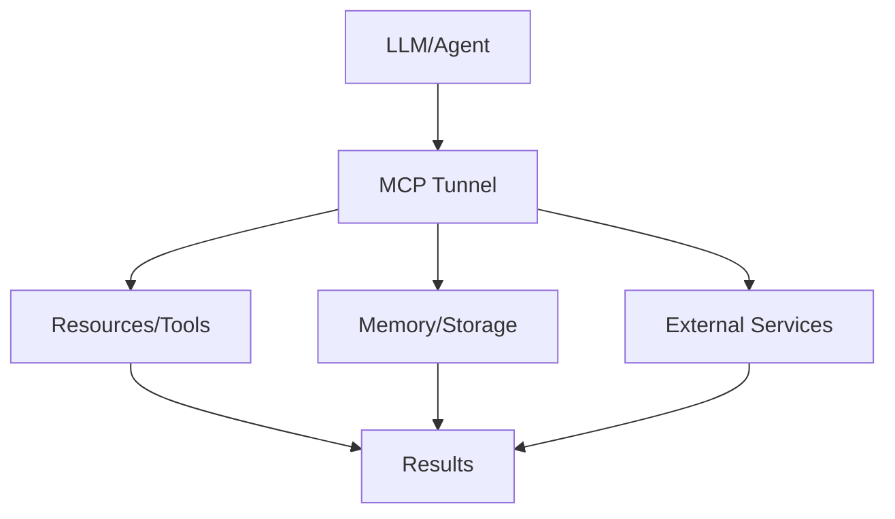

# MCP Tunnel

## Detailed Explanation

MCP Tunnel is a critical modern technique in AI engineering. Networking and tunneling for MCP connections. This represents the practical state-of-the-art in how production AI systems are built and connected today. Understanding this technique is essential for building scalable, reliable AI systems that integrate seamlessly with external resources and services. The key insight is that MCP Tunnel bridges the gap between LLMs and external systems, enabling agents to access tools, memory, and resources in a standardized way.

## Core Intuition

Think of MCP Tunnel as the standardized language that lets LLMs talk to the rest of your infrastructure. Instead of each model needing custom integrations, you define once and use everywhere.

## How It Works

1. Define your resources, tools, or memory requirements
2. Implement the MCP Tunnel protocol or use an SDK
3. Connect to your LLM or agent framework
4. Handle requests and responses through the standard interface
5. Scale across multiple models and deployments
6. Monitor and optimize the connections



## Architecture / Trade-offs

MCP tunneling enables secure communication between clients and servers across networks. Different approaches trade security, latency, and operational complexity.

### Tunneling Approach Comparison

| Approach | Security | Setup Time | Latency Overhead | Maintenance | Scalability |
|----------|----------|-----------|------------------|-------------|------------|
| Direct TLS (mTLS) | High (mutual auth) | 2-4 hours | <5ms (local) | Medium (cert rotation) | Limited (firewall) |
| SSH Tunnel (port forwarding) | High (SSH encryption) | 30 minutes | 5-50ms (encryption overhead) | Low (SSH key mgmt) | Limited (connection per tunnel) |
| VPN (site-to-site) | Very high (all traffic) | 4-8 hours | 10-100ms (VPN overhead) | Medium (VPN gateway mgmt) | Good (network-wide) |
| API Gateway / Proxy | Medium (gateway auth) | 1-2 hours | 10-50ms (additional hop) | Low (stateless) | Excellent (load-balanced) |
| Zero-Trust Tunnel (Cloudflare) | Very high (device auth) | 30 minutes | 20-100ms (cloud hop) | Very low (managed) | Excellent (global) |

**Direct TLS/mTLS**: Encrypted, authenticated connection. Requires certificate management. Best for point-to-point, stable infrastructure.

**SSH Tunnel**: Simple, secure, low overhead. Good for ops teams. Doesn't scale to many connections (one tunnel per client).

**VPN**: Network-wide encryption. Entire infrastructure talks through tunnel. High setup cost, strong security. For organizations with mature VPN infrastructure.

**API Gateway**: Transparent to client, easy load balancing, handles TLS termination. Trade-off: gateway is single point of failure/security.

**Zero-Trust (Cloudflare Tunnel, Tailscale)**: Cloud-managed, scales automatically, zero firewall config needed. Best for distributed teams and serverless.

### Decision Matrix

| Scenario | Best Approach | Why |
|----------|---------------|-----|
| Two fixed servers, high security | mTLS | Simple, fast, strong |
| Developers accessing internal API | SSH tunnel | Low friction, familiar |
| Entire company network | VPN | Network-wide, mature ops |
| Serverless agents (dynamic IPs) | Zero-Trust tunnel | Scales automatically |
| High-traffic API backend | API Gateway | Load balancing + caching |

## Design Challenges

MCP tunneling introduces security and operational challenges that can cause silent failures and security breaches:

- **TLS/mTLS Certificate Complexity**: Requires generating, storing, rotating certificates. If cert expires, connection silently drops. If cert is self-signed, new clients fail to connect. Mismatched cert names cause validation errors. Managing 100+ certs across services becomes operational nightmare. Requires automated cert generation (Let's Encrypt, cert-manager), monitoring of cert expiry, rollover procedures, testing rotation before it fails in production.

- **Certificate Rotation Without Service Interruption**: You can't just replace the cert—connections already open will drop. Require graceful rotation: deploy new cert, validate clients connect with both old and new, then decommission old. Window of inconsistency if done poorly. Requires zero-downtime deployment, connection draining, and DNS TTL planning.

- **Handling NAT, Firewalls, and IP Changes**: Tunnel endpoint is IP 10.0.1.5. Corporate firewall changes, IP becomes 10.0.1.200. Tunnel breaks. Agents fail. Result: distributed system resilience nightmare. Requires DNS names (not IPs), health checks, auto-discovery of endpoints, fallback routing.

- **Latency Overhead of Tunneling**: Direct API call: 5ms. Through SSH tunnel: 50ms (encryption/decryption overhead). Through cloud tunnel (Cloudflare): 100ms. At scale (thousands of agent calls per second), 95ms extra latency per call adds up. Can turn feasible to infeasible. Requires benchmarking tunnel overhead, choosing fastest available approach, possibly collocating agents near MCP servers.

- **Debugging Tunnel Failures**: Connection dropped. Was it cert? NAT? Firewall? TLS version mismatch? Agent logs show "connection refused" but root cause unclear. Requires detailed tunnel logging (TLS handshake steps, cert validation, cipher negotiation), per-tunnel metrics, ability to replicate failures locally.

## Interview Q&A

**Q: Why is tunneling needed for MCP instead of direct connections?**
A: Direct connections expose MCP servers to the internet (attack surface). Agents are often in untrusted environments (third-party cloud, customer sites). Tunneling encrypts communication and enforces identity verification (both sides prove who they are). Example: without tunnel, anyone on the network can call your payment tool. With tunnel, only authenticated agents can connect. Tunneling also helps with: network isolation (agent talks to private internal systems), access auditing (who called what), rate limiting (prevent abuse).

**Q: How do you handle certificate rotation without dropping active connections?**
A: Graceful rotation strategy: (1) Deploy new certificate alongside old one (both valid). (2) New connections use new cert. (3) Existing connections continue with old cert. (4) Monitor old cert usage. (5) After grace period (days), decommission old cert. Requires server support for multiple certs, health checks to verify rotation worked, rollback plan if new cert fails. Without graceful rotation, you're choosing between: drop all connections (service unavailable) or cert expiry (connections later fail).

**Q: What's the latency overhead of TLS/tunneling, and when does it matter?**
A: Overhead: <5ms for local TLS (encrypt/decrypt CPU cost). 5-50ms for remote tunnel (network RTT doubled—once to tunnel endpoint, once from there to server). At 1000 agent calls/sec, 50ms overhead = 50 seconds of cumulative latency per second. Matters if: response time SLA is <100ms (tunnel makes it <50ms, visible slowdown). Doesn't matter if: background tasks (agent planning can wait 50ms). Optimize by: collocating agents + tunnels, using fast TLS implementations (hardware acceleration), possibly caching responses.

**Q: How do you set up mTLS so both client and server authenticate each other?**
A: (1) Generate CA certificate (shared trust root). (2) Generate server certificate (signed by CA, server identity). (3) Generate client certificate (signed by CA, client identity). (4) Server requires client cert verification. Client requires server cert verification. Both check against CA. Result: mutual authentication. Issue: at scale, managing 100+ client certs is painful. Solution: use short-lived certs (minutes), automated renewal (cert-manager), or certificate-less auth (OAuth tokens through tunnel).

**Q: What happens if a certificate expires in production?**
A: New connections fail immediately (cert validation fails). Existing connections continue until they're recycled or broken. Agents report "connection refused" or "certificate expired" errors. No recovery without manual intervention (update cert, restart servers). Detection is late (after errors occur). Fix: Monitoring of cert expiry (alert 30 days before), automated renewal (Let's Encrypt), load testing of renewal process, runbook for emergency cert update.

**Q: How do you choose between mTLS vs API Gateway vs Zero-Trust tunnel?**
A: Use **mTLS** for stable, small-scale infrastructure (2-5 services, static IPs). Use **API Gateway** for standard REST APIs (public or internal), scales easily. Use **Zero-Trust** for distributed/mobile agents, SaaS-style multi-tenant. mTLS is fastest (no extra hop), needs no extra service. Gateway adds latency but handles load balancing. Zero-Trust easiest to operate (managed by Cloudflare/Tailscale) but slight latency penalty. Trade-off: speed (mTLS) vs operations (Zero-Trust) vs features (Gateway).

## Best Practices

- Use official SDKs when available (don't reinvent the wheel)
- Version your protocol implementations and clients independently
- Implement proper error handling for all resource types
- Monitor connection latency and resource availability
- Test with multiple LLM models to ensure compatibility
- Document your resource schemas clearly for other developers
- Plan for scaling: MCP Tunnel should work with thousands of resources

## Common Pitfalls

- **Certificate expiration silent failure**: Cert expires, agents can't connect, no alert fires until users complain. Debugging is hard (looks like network error, not cert issue). Result: sudden service outage. Fix: Monitor cert expiry (30-day warning), automate renewal, test renewal pipeline monthly, set calendar reminders as backup, implement automatic restart of agents when cert updates.

- **Network latency from tunneling makes agent unusable**: Agent responds in <100ms without tunnel. With tunnel, it's 200-500ms (encryption overhead + tunnel hop). Feels sluggish. Users abandon. Too late to fix after production deployment. Fix: Benchmark tunnel latency before deployment, collocate agents near tunnel endpoints, profile bottleneck (is it encryption or network?), consider caching responses.

- **Firewall rules block tunnel connection without clear error**: Tunnel endpoint is reachable from your laptop but not from production servers (firewall rule prevents 443/tcp from that subnet). Agents fail silently (timeout, no clear error). Takes days to diagnose. Result: stunted rollout. Fix: Test network connectivity before deploying (can agents reach tunnel endpoint?), implement explicit error (connection timeout should say "firewall blocked" not generic error), work with network team to pre-approve firewall holes.

- **TLS version mismatch between old and new clients**: Old client requires TLS 1.2. New server provides TLS 1.3. They can't negotiate. Connection fails. You're stuck: upgrade old clients everywhere or downgrade server. Result: forced coordinated deployment or breaking changes. Fix: Support multiple TLS versions (backward compatible), test version negotiation, version detection in client error messages, gradual migration plan.

- **Cascading certificate failures across dependent services**: Service A uses tunnel to call Service B, which uses tunnel to call Service C. When A's cert expires, it can't reach B. When B's cert expires, C becomes unreachable. Failure cascades. Result: domino effect of outages. Fix: Monitor all certs together (global view), stagger renewal (don't renew everything at once), independent cert schedules, implement circuit breakers (fail fast if tunnel unavailable).

## Code Examples

### Example 1: Basic Implementation

```python
# Basic MCP Tunnel pattern
class Resource:
    def __init__(self, name, description):
        self.name = name
        self.description = description
    
    def execute(self, params):
        return {'name': self.name, 'result': params}

# Define resources
calculator = Resource('calculator', 'Basic math operations')
memory = Resource('memory', 'Agent memory storage')

# Execute
result = calculator.execute({'operation': 'add', 'a': 5, 'b': 3})
print(result)
```

### Example 2: Production with Error Handling

```python
import logging
from typing import Dict, Any
import time

logger = logging.getLogger(__name__)

class ManagedResource:
    def __init__(self, name: str, timeout: int = 30):
        self.name = name
        self.timeout = timeout
        self.available = True
    
    def execute(self, request: Dict[str, Any]) -> Dict[str, Any]:
        try:
            logger.info(f'Executing {self.name}: {request}')
            start = time.time()
            
            # Check availability
            if not self.available:
                return {'error': 'Resource unavailable'}
            
            # Execute with timeout
            result = self._do_execute(request)
            latency = time.time() - start
            
            logger.info(f'Completed in {latency:.2f}s')
            return {'success': True, 'result': result, 'latency': latency}
            
        except Exception as e:
            logger.error(f'Error: {e}')
            return {'error': str(e)}
    
    def _do_execute(self, request):
        # Your implementation here
        return request

# Usage
resource = ManagedResource('api-gateway', timeout=5)
response = resource.execute({'endpoint': '/data', 'query': 'test'})
print(response)
```

## Related Concepts

- [Agentic Testing Harness](./03-agentic-testing-harness.md)
- [Persistent AI Memory](./04-persistent-ai-memory.md)
- [LLMOps](./18-llmops.md)
- [AI Gateway & Routing](./19-ai-gateway-routing.md)
