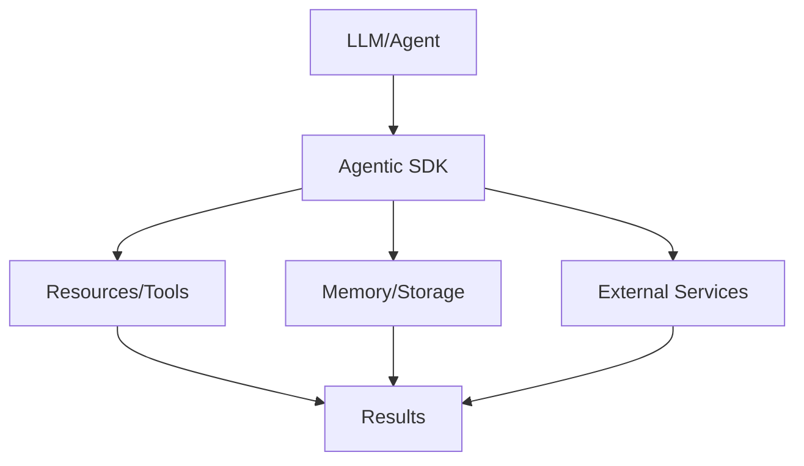

# Agentic SDK

## Detailed Explanation

Agentic SDK is a critical modern technique in AI engineering. Frameworks for building production agents. This represents the practical state-of-the-art in how production AI systems are built and connected today. Understanding this technique is essential for building scalable, reliable AI systems that integrate seamlessly with external resources and services. The key insight is that Agentic SDK bridges the gap between LLMs and external systems, enabling agents to access tools, memory, and resources in a standardized way.

## Core Intuition

Think of Agentic SDK as the standardized language that lets LLMs talk to the rest of your infrastructure. Instead of each model needing custom integrations, you define once and use everywhere.

## How It Works

1. Define your resources, tools, or memory requirements
2. Implement the Agentic SDK protocol or use an SDK
3. Connect to your LLM or agent framework
4. Handle requests and responses through the standard interface
5. Scale across multiple models and deployments
6. Monitor and optimize the connections



## Architecture / Trade-offs

| Aspect | Lightweight | Balanced | Enterprise |
|--------|------------|----------|-----------|
| Setup | Minutes | Hours | Days |
| Features | Core | Full | Custom |
| Scalability | Single | Multiple | Global |
| Cost | Low | Medium | Variable |

Choose based on your deployment complexity and team size.

## Interview Q&A

**Q: When would you use Agentic SDK?**
A: When you need to give LLMs/agents access to external resources, standardize integrations, or enable memory persistence. For example, use this when deploying agents across multiple models or organizations.

**Q: What are the main trade-offs?**
A: The trade-off is between standardization (everyone uses same protocol) and flexibility (custom integrations). Standardization wins at scale.

**Q: How does Agentic SDK differ from alternatives?**
A: Alternatives require model-specific implementations. Agentic SDK defines once, works everywhere. This is huge for production systems.

**Q: What's the learning curve?**
A: If you understand APIs and REST, you understand Agentic SDK. The protocol is straightforward; the complexity is usually in your implementations.

**Q: How do you debug Agentic SDK connections?**
A: Enable logging on both sides, check protocol compliance, test with simple examples first, then scale. Most issues are integration bugs, not protocol issues.

## Best Practices

- Use official SDKs when available (don't reinvent the wheel)
- Version your protocol implementations and clients independently
- Implement proper error handling for all resource types
- Monitor connection latency and resource availability
- Test with multiple LLM models to ensure compatibility
- Document your resource schemas clearly for other developers
- Plan for scaling: Agentic SDK should work with thousands of resources

## Common Pitfalls

- Tight coupling: embedding Agentic SDK logic in application code (use adapters/layers)
- Not versioning: breaking changes in implementations without version management
- Ignoring errors: assuming resources always work (implement retries + timeouts)
- Over-engineering: adding features you don't need yet
- Poor documentation: unclear schemas make integrations painful

## Code Examples

### Example 1: Basic Implementation

```python
# Basic Agentic SDK pattern
class Resource:
    def __init__(self, name, description):
        self.name = name
        self.description = description
    
    def execute(self, params):
        return {'name': self.name, 'result': params}

# Define resources
calculator = Resource('calculator', 'Basic math operations')
memory = Resource('memory', 'Agent memory storage')

# Execute
result = calculator.execute({'operation': 'add', 'a': 5, 'b': 3})
print(result)
```

### Example 2: Production with Error Handling

```python
import logging
from typing import Dict, Any
import time

logger = logging.getLogger(__name__)

class ManagedResource:
    def __init__(self, name: str, timeout: int = 30):
        self.name = name
        self.timeout = timeout
        self.available = True
    
    def execute(self, request: Dict[str, Any]) -> Dict[str, Any]:
        try:
            logger.info(f'Executing {self.name}: {request}')
            start = time.time()
            
            # Check availability
            if not self.available:
                return {'error': 'Resource unavailable'}
            
            # Execute with timeout
            result = self._do_execute(request)
            latency = time.time() - start
            
            logger.info(f'Completed in {latency:.2f}s')
            return {'success': True, 'result': result, 'latency': latency}
            
        except Exception as e:
            logger.error(f'Error: {e}')
            return {'error': str(e)}
    
    def _do_execute(self, request):
        # Your implementation here
        return request

# Usage
resource = ManagedResource('api-gateway', timeout=5)
response = resource.execute({'endpoint': '/data', 'query': 'test'})
print(response)
```

## Related Concepts

- [Agentic Testing Harness](./03-agentic-testing-harness.md)
- [Persistent AI Memory](./04-persistent-ai-memory.md)
- [LLMOps](./18-llmops.md)
- [AI Gateway & Routing](./19-ai-gateway-routing.md)
